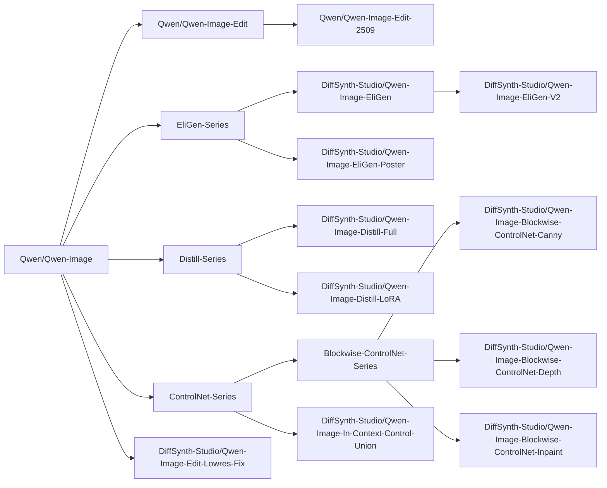
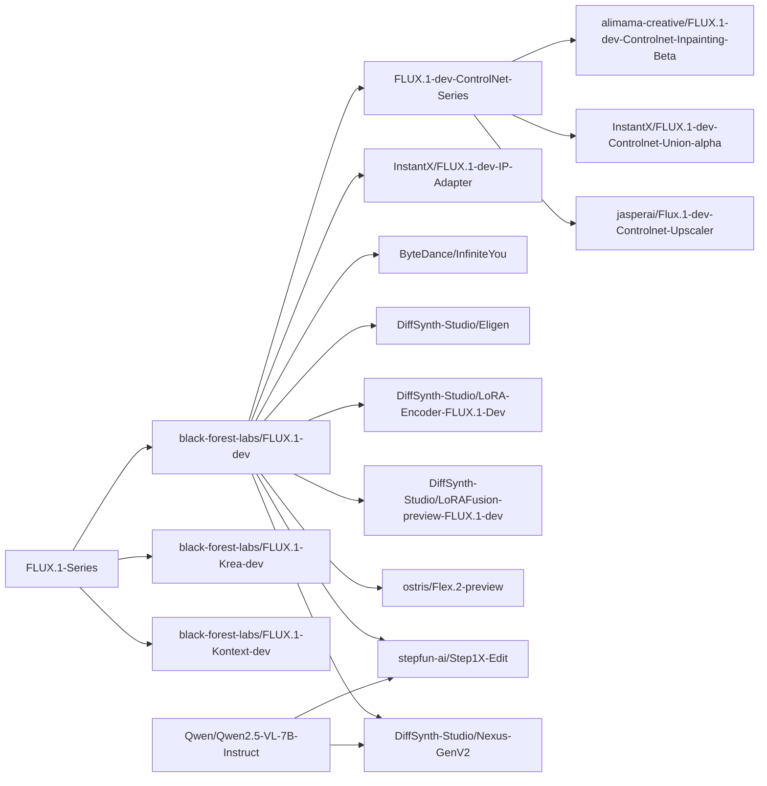
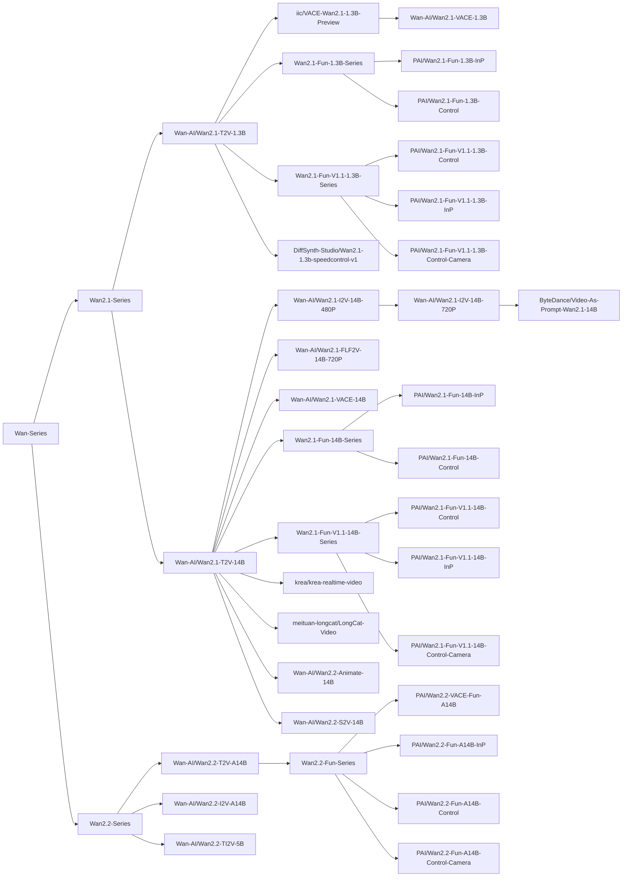

# DiffSynth-Studio

<a href="https://github.com/modelscope/DiffSynth-Studio"></a> <a href="https://trendshift.io/repositories/10946" target="_blank"></a></p>

[](https://pypi.org/project/DiffSynth/)
[](https://github.com/modelscope/DiffSynth-Studio/blob/master/LICENSE)
[](https://github.com/modelscope/DiffSynth-Studio/issues)
[](https://GitHub.com/modelscope/DiffSynth-Studio/pull/)
[](https://GitHub.com/modelscope/DiffSynth-Studio/commit/)

[切换到中文版](./README_zh.md)

## Introduction

Welcome to the magical world of Diffusion models! DiffSynth-Studio is an open-source Diffusion model engine developed and maintained by the [ModelScope Community](https://www.modelscope.cn/). We hope to foster technological innovation through framework construction, aggregate the power of the open-source community, and explore the boundaries of generative model technology!

DiffSynth currently includes two open-source projects:
* [DiffSynth-Studio](https://github.com/modelscope/DiffSynth-Studio): Focused on aggressive technical exploration, targeting academia, and providing cutting-edge model capability support.
* [DiffSynth-Engine](https://github.com/modelscope/DiffSynth-Engine): Focused on stable model deployment, targeting industry, and providing higher computational performance and more stable features.

[DiffSynth-Studio](https://github.com/modelscope/DiffSynth-Studio) and [DiffSynth-Engine](https://github.com/modelscope/DiffSynth-Engine) are the core engines of the ModelScope AIGC zone. Welcome to experience our carefully crafted productized features:

* ModelScope AIGC Zone (for Chinese users): https://modelscope.cn/aigc/home
* ModelScope Civision (for global users): https://modelscope.ai/civision/home

> DiffSynth-Studio Documentation: [中文版](/docs/zh/README.md)、[English version](/docs/en/README.md)

We believe that a well-developed open-source code framework can lower the threshold for technical exploration. We have achieved many [interesting technologies](#innovative-achievements) based on this codebase. Perhaps you also have many wild ideas, and with DiffSynth-Studio, you can quickly realize these ideas. For this reason, we have prepared detailed documentation for developers. We hope that through these documents, developers can understand the principles of Diffusion models, and we look forward to expanding the boundaries of technology together with you.

## Update History

> DiffSynth-Studio has undergone major version updates, and some old features are no longer maintained. If you need to use old features, please switch to the [last historical version](https://github.com/modelscope/DiffSynth-Studio/tree/afd101f3452c9ecae0c87b79adfa2e22d65ffdc3) before the major version update.

> Currently, the development personnel of this project are limited, with most of the work handled by [Artiprocher](https://github.com/Artiprocher). Therefore, the progress of new feature development will be relatively slow, and the speed of responding to and resolving issues is limited. We apologize for this and ask developers to understand.

- **February 2, 2026** The first document of the Research Tutorial series is now available, guiding you through training a small 0.1B text-to-image model from scratch. For details, see the [documentation](/docs/en/Research_Tutorial/train_from_scratch.md) and [model](https://modelscope.cn/models/DiffSynth-Studio/AAAMyModel). We hope DiffSynth-Studio can evolve into a more powerful training framework for Diffusion models.

- **January 27, 2026**: [Z-Image](https://modelscope.cn/models/Tongyi-MAI/Z-Image) is released, and our [Z-Image-i2L](https://www.modelscope.cn/models/DiffSynth-Studio/Z-Image-i2L) model is released concurrently. You can use it in [ModelScope Studios](https://modelscope.cn/studios/DiffSynth-Studio/Z-Image-i2L). For details, see the [documentation](/docs/zh/Model_Details/Z-Image.md).

- **January 19, 2026**: Added support for [FLUX.2-klein-4B](https://modelscope.cn/models/black-forest-labs/FLUX.2-klein-4B) and [FLUX.2-klein-9B](https://modelscope.cn/models/black-forest-labs/FLUX.2-klein-9B) models, including training and inference capabilities. [Documentation](/docs/en/Model_Details/FLUX2.md) and [example code](/examples/flux2/) are now available.

- **January 12, 2026**: We trained and open-sourced a text-guided image layer separation model ([Model Link](https://modelscope.cn/models/DiffSynth-Studio/Qwen-Image-Layered-Control)). Given an input image and a textual description, the model isolates the image layer corresponding to the described content. For more details, please refer to our blog post ([Chinese version](https://modelscope.cn/learn/4938), [English version](https://huggingface.co/blog/kelseye/qwen-image-layered-control)).

- **December 24, 2025**: Based on Qwen-Image-Edit-2511, we trained an In-Context Editing LoRA model ([Model Link](https://modelscope.cn/models/DiffSynth-Studio/Qwen-Image-Edit-2511-ICEdit-LoRA)). This model takes three images as input (Image A, Image B, and Image C), and automatically analyzes the transformation from Image A to Image B, then applies the same transformation to Image C to generate Image D. For more details, please refer to our blog post ([Chinese version](https://mp.weixin.qq.com/s/41aEiN3lXKGCJs1-we4Q2g), [English version](https://huggingface.co/blog/kelseye/qwen-image-edit-2511-icedit-lora)).

- **December 9, 2025** We release a wild model based on DiffSynth-Studio 2.0: [Qwen-Image-i2L](https://www.modelscope.cn/models/DiffSynth-Studio/Qwen-Image-i2L) (Image-to-LoRA). This model takes an image as input and outputs a LoRA. Although this version still has significant room for improvement in terms of generalization, detail preservation, and other aspects, we are open-sourcing these models to inspire more innovative research. For more details, please refer to our [blog](https://huggingface.co/blog/kelseye/qwen-image-i2l).

- **December 4, 2025** DiffSynth-Studio 2.0 released! Many new features online
  - [Documentation](/docs/en/README.md) online: Our documentation is still continuously being optimized and updated
  - [VRAM Management](/docs/en/Pipeline_Usage/VRAM_management.md) module upgraded, supporting layer-level disk offload, releasing both memory and VRAM simultaneously
  - New model support
    - Z-Image Turbo: [Model](https://www.modelscope.ai/models/Tongyi-MAI/Z-Image-Turbo), [Documentation](/docs/en/Model_Details/Z-Image.md), [Code](/examples/z_image/)
    - FLUX.2-dev: [Model](https://www.modelscope.cn/models/black-forest-labs/FLUX.2-dev), [Documentation](/docs/en/Model_Details/FLUX2.md), [Code](/examples/flux2/)
  - Training framework upgrade
    - [Split Training](/docs/zh/Training/Split_Training.md): Supports automatically splitting the training process into two stages: data processing and training (even for training ControlNet or any other model). Computations that do not require gradient backpropagation, such as text encoding and VAE encoding, are performed during the data processing stage, while other computations are handled during the training stage. Faster speed, less VRAM requirement.
    - [Differential LoRA Training](/docs/zh/Training/Differential_LoRA.md): This is a training technique we used in [ArtAug](https://www.modelscope.cn/models/DiffSynth-Studio/ArtAug-lora-FLUX.1dev-v1), now available for LoRA training of any model.
    - [FP8 Training](/docs/zh/Training/FP8_Precision.md): FP8 can be applied to any non-training model during training, i.e., models with gradients turned off or gradients that only affect LoRA weights.

<details>
<summary>More</summary>

- **November 4, 2025** Supported the [ByteDance/Video-As-Prompt-Wan2.1-14B](https://modelscope.cn/models/ByteDance/Video-As-Prompt-Wan2.1-14B) model, which is trained based on Wan 2.1 and supports generating corresponding actions based on reference videos.

- **October 30, 2025** Supported the [meituan-longcat/LongCat-Video](https://www.modelscope.cn/models/meituan-longcat/LongCat-Video) model, which supports text-to-video, image-to-video, and video continuation. This model uses the Wan framework for inference and training in this project.

- **October 27, 2025** Supported the [krea/krea-realtime-video](https://www.modelscope.cn/models/krea/krea-realtime-video) model, adding another member to the Wan model ecosystem.

- **September 23, 2025** [DiffSynth-Studio/Qwen-Image-EliGen-Poster](https://www.modelscope.cn/models/DiffSynth-Studio/Qwen-Image-EliGen-Poster) released! This model was jointly developed and open-sourced by us and Taobao Experience Design Team. Built upon Qwen-Image, the model is specifically designed for e-commerce poster scenarios, supporting precise partition layout control. Please refer to [our sample code](./examples/qwen_image/model_inference/Qwen-Image-EliGen-Poster.py).

- **September 9, 2025** Our training framework supports various training modes. Currently adapted for Qwen-Image, in addition to the standard SFT training mode, Direct Distill is now supported. Please refer to [our sample code](./examples/qwen_image/model_training/lora/Qwen-Image-Distill-LoRA.sh). This feature is experimental, and we will continue to improve it to support more comprehensive model training functions.

- **August 28, 2025** We support Wan2.2-S2V, an audio-driven cinematic video generation model. See [./examples/wanvideo/](./examples/wanvideo/).

- **August 21, 2025** [DiffSynth-Studio/Qwen-Image-EliGen-V2](https://www.modelscope.cn/models/DiffSynth-Studio/Qwen-Image-EliGen-V2) released! Compared to the V1 version, the training dataset has been changed to [Qwen-Image-Self-Generated-Dataset](https://www.modelscope.cn/datasets/DiffSynth-Studio/Qwen-Image-Self-Generated-Dataset), so the generated images better conform to Qwen-Image's own image distribution and style. Please refer to [our sample code](./examples/qwen_image/model_inference_low_vram/Qwen-Image-EliGen-V2.py).

- **August 21, 2025** We open-sourced the [DiffSynth-Studio/Qwen-Image-In-Context-Control-Union](https://www.modelscope.cn/models/DiffSynth-Studio/Qwen-Image-In-Context-Control-Union) structural control LoRA model, adopting the In Context technical route, supporting multiple categories of structural control conditions, including canny, depth, lineart, softedge, normal, and openpose. Please refer to [our sample code](./examples/qwen_image/model_inference/Qwen-Image-In-Context-Control-Union.py).

- **August 20, 2025** We open-sourced the [DiffSynth-Studio/Qwen-Image-Edit-Lowres-Fix](https://www.modelscope.cn/models/DiffSynth-Studio/Qwen-Image-Edit-Lowres-Fix) model, improving the editing effect of Qwen-Image-Edit on low-resolution image inputs. Please refer to [our sample code](./examples/qwen_image/model_inference/Qwen-Image-Edit-Lowres-Fix.py)

- **August 19, 2025** 🔥 Qwen-Image-Edit open-sourced, welcome a new member to the image editing model family!

- **August 18, 2025** We trained and open-sourced the Qwen-Image inpainting ControlNet model [DiffSynth-Studio/Qwen-Image-Blockwise-ControlNet-Inpaint](https://www.modelscope.cn/models/DiffSynth-Studio/Qwen-Image-Blockwise-ControlNet-Inpaint). The model structure adopts a lightweight design. Please refer to [our sample code](./examples/qwen_image/model_inference/Qwen-Image-Blockwise-ControlNet-Inpaint.py).

- **August 15, 2025** We open-sourced the [Qwen-Image-Self-Generated-Dataset](https://www.modelscope.cn/datasets/DiffSynth-Studio/Qwen-Image-Self-Generated-Dataset) dataset. This is an image dataset generated using the Qwen-Image model, containing 160,000 `1024 x 1024` images. It includes general, English text rendering, and Chinese text rendering subsets. We provide annotations for image descriptions, entities, and structural control images for each image. Developers can use this dataset to train Qwen-Image models' ControlNet and EliGen models. We aim to promote technological development through open-sourcing!

- **August 13, 2025** We trained and open-sourced the Qwen-Image ControlNet model [DiffSynth-Studio/Qwen-Image-Blockwise-ControlNet-Depth](https://modelscope.cn/models/DiffSynth-Studio/Qwen-Image-Blockwise-ControlNet-Depth). The model structure adopts a lightweight design. Please refer to [our sample code](./examples/qwen_image/model_inference/Qwen-Image-Blockwise-ControlNet-Depth.py).

- **August 12, 2025** We trained and open-sourced the Qwen-Image ControlNet model [DiffSynth-Studio/Qwen-Image-Blockwise-ControlNet-Canny](https://modelscope.cn/models/DiffSynth-Studio/Qwen-Image-Blockwise-ControlNet-Canny). The model structure adopts a lightweight design. Please refer to [our sample code](./examples/qwen_image/model_inference/Qwen-Image-Blockwise-ControlNet-Canny.py).

- **August 11, 2025** We open-sourced the distilled acceleration model [DiffSynth-Studio/Qwen-Image-Distill-LoRA](https://www.modelscope.cn/models/DiffSynth-Studio/Qwen-Image-Distill-LoRA) for Qwen-Image, following the same training process as [DiffSynth-Studio/Qwen-Image-Distill-Full](https://www.modelscope.cn/models/DiffSynth-Studio/Qwen-Image-Distill-Full), but the model structure has been modified to LoRA, thus being better compatible with other open-source ecosystem models.

- **August 7, 2025** We open-sourced the entity control LoRA model [DiffSynth-Studio/Qwen-Image-EliGen](https://www.modelscope.cn/models/DiffSynth-Studio/Qwen-Image-EliGen) for Qwen-Image. Qwen-Image-EliGen can achieve entity-level controlled text-to-image generation. Technical details can be found in [the paper](https://arxiv.org/abs/2501.01097). Training dataset: [EliGenTrainSet](https://www.modelscope.cn/datasets/DiffSynth-Studio/EliGenTrainSet).

- **August 5, 2025** We open-sourced the distilled acceleration model [DiffSynth-Studio/Qwen-Image-Distill-Full](https://www.modelscope.cn/models/DiffSynth-Studio/Qwen-Image-Distill-Full) for Qwen-Image, achieving approximately 5x acceleration.

- **August 4, 2025** 🔥 Qwen-Image open-sourced, welcome a new member to the image generation model family!

- **August 1, 2025** [FLUX.1-Krea-dev](https://www.modelscope.cn/models/black-forest-labs/FLUX.1-Krea-dev) open-sourced, a text-to-image model focused on aesthetic photography. We provided comprehensive support in a timely manner, including low VRAM layer-by-layer offload, LoRA training, and full training. For more details, please refer to [./examples/flux/](./examples/flux/).

- **July 28, 2025** Wan 2.2 open-sourced. We provided comprehensive support in a timely manner, including low VRAM layer-by-layer offload, FP8 quantization, sequence parallelism, LoRA training, and full training. For more details, please refer to [./examples/wanvideo/](./examples/wanvideo/).

- **July 11, 2025** We propose Nexus-Gen, a unified framework that combines the language reasoning capabilities of Large Language Models (LLMs) with the image generation capabilities of diffusion models. This framework supports seamless image understanding, generation, and editing tasks.
  - Paper: [Nexus-Gen: Unified Image Understanding, Generation, and Editing via Prefilled Autoregression in Shared Embedding Space](https://arxiv.org/pdf/2504.21356)
  - GitHub Repository: https://github.com/modelscope/Nexus-Gen
  - Model: [ModelScope](https://www.modelscope.cn/models/DiffSynth-Studio/Nexus-GenV2), [HuggingFace](https://huggingface.co/modelscope/Nexus-GenV2)
  - Training Dataset: [ModelScope Dataset](https://www.modelscope.cn/datasets/DiffSynth-Studio/Nexus-Gen-Training-Dataset)
  - Online Experience: [ModelScope Nexus-Gen Studio](https://www.modelscope.cn/studios/DiffSynth-Studio/Nexus-Gen)

- **June 15, 2025** ModelScope's official evaluation framework [EvalScope](https://github.com/modelscope/evalscope) now supports text-to-image generation evaluation. Please refer to the [best practices](https://evalscope.readthedocs.io/zh-cn/latest/best_practice/t2i_eval.html) guide to try it out.

- **March 25, 2025** Our new open-source project [DiffSynth-Engine](https://github.com/modelscope/DiffSynth-Engine) is now open-sourced! Focused on stable model deployment, targeting industry, providing better engineering support, higher computational performance, and more stable features.

- **March 31, 2025** We support InfiniteYou, a face feature preservation method for FLUX. More details can be found in [./examples/InfiniteYou/](./examples/InfiniteYou/).

- **March 13, 2025** We support HunyuanVideo-I2V, the image-to-video generation version of Tencent's open-source HunyuanVideo. More details can be found in [./examples/HunyuanVideo/](./examples/HunyuanVideo/).

- **February 25, 2025** We support Wan-Video, a series of state-of-the-art video synthesis models open-sourced by Alibaba. See [./examples/wanvideo/](./examples/wanvideo/).

- **February 17, 2025** We support [StepVideo](https://modelscope.cn/models/stepfun-ai/stepvideo-t2v/summary)! Advanced video synthesis model! See [./examples/stepvideo](./examples/stepvideo/).

- **December 31, 2024** We propose EliGen, a new framework for entity-level controlled text-to-image generation, supplemented with an inpainting fusion pipeline, extending its capabilities to image inpainting tasks. EliGen can seamlessly integrate existing community models such as IP-Adapter and In-Context LoRA, enhancing their versatility. For more details, see [./examples/EntityControl](./examples/EntityControl/).
  - Paper: [EliGen: Entity-Level Controlled Image Generation with Regional Attention](https://arxiv.org/abs/2501.01097)
  - Model: [ModelScope](https://www.modelscope.cn/models/DiffSynth-Studio/Eligen), [HuggingFace](https://huggingface.co/modelscope/EliGen)
  - Online Experience: [ModelScope EliGen Studio](https://www.modelscope.cn/studios/DiffSynth-Studio/EliGen)
  - Training Dataset: [EliGen Train Set](https://www.modelscope.cn/datasets/DiffSynth-Studio/EliGenTrainSet)

- **December 19, 2024** We implemented advanced VRAM management for HunyuanVideo, enabling video generation with resolutions of 129x720x1280 on 24GB VRAM or 129x512x384 on just 6GB VRAM. More details can be found in [./examples/HunyuanVideo/](./examples/HunyuanVideo/).

- **December 18, 2024** We propose ArtAug, a method to improve text-to-image models through synthesis-understanding interaction. We trained an ArtAug enhancement module for FLUX.1-dev in LoRA format. This model incorporates the aesthetic understanding of Qwen2-VL-72B into FLUX.1-dev, thereby improving the quality of generated images.
  - Paper: https://arxiv.org/abs/2412.12888
  - Example: https://github.com/modelscope/DiffSynth-Studio/tree/main/examples/ArtAug
  - Model: [ModelScope](https://www.modelscope.cn/models/DiffSynth-Studio/ArtAug-lora-FLUX.1dev-v1), [HuggingFace](https://huggingface.co/ECNU-CILab/ArtAug-lora-FLUX.1dev-v1)
  - Demo: [ModelScope](https://modelscope.cn/aigc/imageGeneration?tab=advanced&versionId=7228&modelType=LoRA&sdVersion=FLUX_1&modelUrl=modelscope%3A%2F%2FDiffSynth-Studio%2FArtAug-lora-FLUX.1dev-v1%3Frevision%3Dv1.0), HuggingFace (coming soon)

- **October 25, 2024** We provide extensive FLUX ControlNet support. This project supports many different ControlNet models and can be freely combined, even if their structures are different. Additionally, ControlNet models are compatible with high-resolution optimization and partition control technologies, enabling very powerful controllable image generation. See [`./examples/ControlNet/`](./examples/ControlNet/).

- **October 8, 2024** We released extended LoRAs based on CogVideoX-5B and ExVideo. You can download this model from [ModelScope](https://modelscope.cn/models/ECNU-CILab/ExVideo-CogVideoX-LoRA-129f-v1) or [HuggingFace](https://huggingface.co/ECNU-CILab/ExVideo-CogVideoX-LoRA-129f-v1).

- **August 22, 2024** This project now supports CogVideoX-5B. See [here](/examples/video_synthesis/). We provide several interesting features for this text-to-video model, including:
  - Text-to-video
  - Video editing
  - Self super-resolution
  - Video interpolation

- **August 22, 2024** We implemented an interesting brush feature that supports all text-to-image models. Now you can create stunning images with the assistance of AI using the brush!
  - Use it in our [WebUI](#usage-in-webui).

- **August 21, 2024** DiffSynth-Studio now supports FLUX.
  - Enable CFG and high-resolution inpainting to improve visual quality. See [here](/examples/image_synthesis/README.md)
  - LoRA, ControlNet, and other addon models will be released soon.

- **June 21, 2024** We propose ExVideo, a post-training fine-tuning technique aimed at enhancing the capabilities of video generation models. We extended Stable Video Diffusion to achieve long video generation of up to 128 frames.
  - [Project Page](https://ecnu-cilab.github.io/ExVideoProjectPage/)
  - Source code has been released in this repository. See [`examples/ExVideo`](./examples/ExVideo/).
  - Model has been released at [HuggingFace](https://huggingface.co/ECNU-CILab/ExVideo-SVD-128f-v1) and [ModelScope](https://modelscope.cn/models/ECNU-CILab/ExVideo-SVD-128f-v1).
  - Technical report has been released at [arXiv](https://arxiv.org/abs/2406.14130).
  - You can try ExVideo in this [demo](https://huggingface.co/spaces/modelscope/ExVideo-SVD-128f-v1)!

- **June 13, 2024** DiffSynth Studio has migrated to ModelScope. The development team has also transitioned from "me" to "us". Of course, I will still participate in subsequent development and maintenance work.

- **January 29, 2024** We propose Diffutoon, an excellent cartoon coloring solution.
  - [Project Page](https://ecnu-cilab.github.io/DiffutoonProjectPage/)
  - Source code has been released in this project.
  - Technical report (IJCAI 2024) has been released at [arXiv](https://arxiv.org/abs/2401.16224).

- **December 8, 2023** We decided to initiate a new project aimed at unleashing the potential of diffusion models, especially in video synthesis. The development work of this project officially began.

- **November 15, 2023** We propose FastBlend, a powerful video deflickering algorithm.
  - sd-webui extension has been released at [GitHub](https://github.com/Artiprocher/sd-webui-fastblend).
  - Demonstration videos have been showcased on Bilibili, including three tasks:
    - [Video Deflickering](https://www.bilibili.com/video/BV1d94y1W7PE)
    - [Video Interpolation](https://www.bilibili.com/video/BV1Lw411m71p)
    - [Image-Driven Video Rendering](https://www.bilibili.com/video/BV1RB4y1Z7LF)
  - Technical report has been released at [arXiv](https://arxiv.org/abs/2311.09265).
  - Unofficial ComfyUI extensions developed by other users have been released at [GitHub](https://github.com/AInseven/ComfyUI-fastblend).

- **October 1, 2023** We released an early version of the project named FastSDXL. This was an initial attempt to build a diffusion engine.
  - Source code has been released at [GitHub](https://github.com/Artiprocher/FastSDXL).
  - FastSDXL includes a trainable OLSS scheduler to improve efficiency.
    - The original repository of OLSS is located [here](https://github.com/alibaba/EasyNLP/tree/master/diffusion/olss_scheduler).
    - Technical report (CIKM 2023) has been released at [arXiv](https://arxiv.org/abs/2305.14677).
    - Demonstration video has been released at [Bilibili](https://www.bilibili.com/video/BV1w8411y7uj).
    - Since OLSS requires additional training, we did not implement it in this project.

- **August 29, 2023** We propose DiffSynth, a video synthesis framework.
  - [Project Page](https://ecnu-cilab.github.io/DiffSynth.github.io/).
  - Source code has been released at [EasyNLP](https://github.com/alibaba/EasyNLP/tree/master/diffusion/DiffSynth).
  - Technical report (ECML PKDD 2024) has been released at [arXiv](https://arxiv.org/abs/2308.03463).

</details>

## Installation

Install from source (recommended):

```
git clone https://github.com/modelscope/DiffSynth-Studio.git  
cd DiffSynth-Studio
pip install -e .
```

For more installation methods and instructions for non-NVIDIA GPUs, please refer to the [Installation Guide](/docs/en/Pipeline_Usage/Setup.md).

</details>

## Basic Framework

DiffSynth-Studio redesigns the inference and training pipelines for mainstream Diffusion models (including FLUX, Wan, etc.), enabling efficient memory management and flexible model training.

<details>
<summary>Environment Variable Configuration</summary>

> Before running model inference or training, you can configure settings such as the model download source via [environment variables](/docs/en/Pipeline_Usage/Environment_Variables.md).
>
> By default, this project downloads models from ModelScope. For users outside China, you can configure the system to download models from the ModelScope international site as follows:
>
> ```python
> import os
> os.environ["MODELSCOPE_DOMAIN"] = "www.modelscope.ai"
> ```
>
> To download models from other sources, please modify the environment variable [DIFFSYNTH_DOWNLOAD_SOURCE](/docs/en/Pipeline_Usage/Environment_Variables.md#diffsynth_download_source).

</details>

### Image Synthesis


#### Z-Image: [/docs/en/Model_Details/Z-Image.md](/docs/en/Model_Details/Z-Image.md)

<details>

<summary>Quick Start</summary>

Running the following code will quickly load the [Tongyi-MAI/Z-Image-Turbo](https://www.modelscope.cn/models/Tongyi-MAI/Z-Image-Turbo) model for inference. FP8 quantization significantly degrades image quality, so we do not recommend enabling any quantization for the Z-Image Turbo model. CPU offloading is recommended, and the model can run with as little as 8 GB of GPU memory.

```python
from diffsynth.pipelines.z_image import ZImagePipeline, ModelConfig
import torch

vram_config = {
    "offload_dtype": torch.bfloat16,
    "offload_device": "cpu",
    "onload_dtype": torch.bfloat16,
    "onload_device": "cpu",
    "preparing_dtype": torch.bfloat16,
    "preparing_device": "cuda",
    "computation_dtype": torch.bfloat16,
    "computation_device": "cuda",
}
pipe = ZImagePipeline.from_pretrained(
    torch_dtype=torch.bfloat16,
    device="cuda",
    model_configs=[
        ModelConfig(model_id="Tongyi-MAI/Z-Image-Turbo", origin_file_pattern="transformer/*.safetensors", **vram_config),
        ModelConfig(model_id="Tongyi-MAI/Z-Image-Turbo", origin_file_pattern="text_encoder/*.safetensors", **vram_config),
        ModelConfig(model_id="Tongyi-MAI/Z-Image-Turbo", origin_file_pattern="vae/diffusion_pytorch_model.safetensors", **vram_config),
    ],
    tokenizer_config=ModelConfig(model_id="Tongyi-MAI/Z-Image-Turbo", origin_file_pattern="tokenizer/"),
    vram_limit=torch.cuda.mem_get_info("cuda")[1] / (1024 ** 3) - 0.5,
)
prompt = "Young Chinese woman in red Hanfu, intricate embroidery. Impeccable makeup, red floral forehead pattern. Elaborate high bun, golden phoenix headdress, red flowers, beads. Holds round folding fan with lady, trees, bird. Neon lightning-bolt lamp (⚡️), bright yellow glow, above extended left palm. Soft-lit outdoor night background, silhouetted tiered pagoda (西安大雁塔), blurred colorful distant lights."
image = pipe(prompt=prompt, seed=42, rand_device="cuda")
image.save("image.jpg")
```

</details>

<details>

<summary>Examples</summary>

Example code for Z-Image is available at: [/examples/z_image/](/examples/z_image/)

|Model ID|Inference|Low VRAM Inference|Full Training|Validation After Full Training|LoRA Training|Validation After LoRA Training|
|-|-|-|-|-|-|-|
|[Tongyi-MAI/Z-Image](https://www.modelscope.cn/models/Tongyi-MAI/Z-Image)|[code](/examples/z_image/model_inference/Z-Image.py)|[code](/examples/z_image/model_inference_low_vram/Z-Image.py)|[code](/examples/z_image/model_training/full/Z-Image.sh)|[code](/examples/z_image/model_training/validate_full/Z-Image.py)|[code](/examples/z_image/model_training/lora/Z-Image.sh)|[code](/examples/z_image/model_training/validate_lora/Z-Image.py)|
|[DiffSynth-Studio/Z-Image-i2L](https://www.modelscope.cn/models/DiffSynth-Studio/Z-Image-i2L)|[code](/examples/z_image/model_inference/Z-Image-i2L.py)|[code](/examples/z_image/model_inference_low_vram/Z-Image-i2L.py)|-|-|-|-|
|[Tongyi-MAI/Z-Image-Turbo](https://www.modelscope.cn/models/Tongyi-MAI/Z-Image-Turbo)|[code](/examples/z_image/model_inference/Z-Image-Turbo.py)|[code](/examples/z_image/model_inference_low_vram/Z-Image-Turbo.py)|[code](/examples/z_image/model_training/full/Z-Image-Turbo.sh)|[code](/examples/z_image/model_training/validate_full/Z-Image-Turbo.py)|[code](/examples/z_image/model_training/lora/Z-Image-Turbo.sh)|[code](/examples/z_image/model_training/validate_lora/Z-Image-Turbo.py)|
|[PAI/Z-Image-Turbo-Fun-Controlnet-Union-2.1](https://www.modelscope.cn/models/PAI/Z-Image-Turbo-Fun-Controlnet-Union-2.1)|[code](/examples/z_image/model_inference/Z-Image-Turbo-Fun-Controlnet-Union-2.1.py)|[code](/examples/z_image/model_inference_low_vram/Z-Image-Turbo-Fun-Controlnet-Union-2.1.py)|[code](/examples/z_image/model_training/full/Z-Image-Turbo-Fun-Controlnet-Union-2.1.sh)|[code](/examples/z_image/model_training/validate_full/Z-Image-Turbo-Fun-Controlnet-Union-2.1.py)|[code](/examples/z_image/model_training/lora/Z-Image-Turbo-Fun-Controlnet-Union-2.1.sh)|[code](/examples/z_image/model_training/validate_lora/Z-Image-Turbo-Fun-Controlnet-Union-2.1.py)|
|[PAI/Z-Image-Turbo-Fun-Controlnet-Union-2.1-8steps](https://www.modelscope.cn/models/PAI/Z-Image-Turbo-Fun-Controlnet-Union-2.1)|[code](/examples/z_image/model_inference/Z-Image-Turbo-Fun-Controlnet-Union-2.1-8steps.py)|[code](/examples/z_image/model_inference_low_vram/Z-Image-Turbo-Fun-Controlnet-Union-2.1-8steps.py)|[code](/examples/z_image/model_training/full/Z-Image-Turbo-Fun-Controlnet-Union-2.1-8steps.sh)|[code](/examples/z_image/model_training/validate_full/Z-Image-Turbo-Fun-Controlnet-Union-2.1-8steps.py)|[code](/examples/z_image/model_training/lora/Z-Image-Turbo-Fun-Controlnet-Union-2.1-8steps.sh)|[code](/examples/z_image/model_training/validate_lora/Z-Image-Turbo-Fun-Controlnet-Union-2.1-8steps.py)|
|[PAI/Z-Image-Turbo-Fun-Controlnet-Tile-2.1-8steps](https://www.modelscope.cn/models/PAI/Z-Image-Turbo-Fun-Controlnet-Union-2.1)|[code](/examples/z_image/model_inference/Z-Image-Turbo-Fun-Controlnet-Tile-2.1-8steps.py)|[code](/examples/z_image/model_inference_low_vram/Z-Image-Turbo-Fun-Controlnet-Tile-2.1-8steps.py)|[code](/examples/z_image/model_training/full/Z-Image-Turbo-Fun-Controlnet-Tile-2.1-8steps.sh)|[code](/examples/z_image/model_training/validate_full/Z-Image-Turbo-Fun-Controlnet-Tile-2.1-8steps.py)|[code](/examples/z_image/model_training/lora/Z-Image-Turbo-Fun-Controlnet-Tile-2.1-8steps.sh)|[code](/examples/z_image/model_training/validate_lora/Z-Image-Turbo-Fun-Controlnet-Tile-2.1-8steps.py)|

</details>

#### FLUX.2: [/docs/en/Model_Details/FLUX2.md](/docs/en/Model_Details/FLUX2.md)

<details>

<summary>Quick Start</summary>

Running the following code will quickly load the [black-forest-labs/FLUX.2-dev](https://www.modelscope.cn/models/black-forest-labs/FLUX.2-dev) model for inference. VRAM management is enabled, and the framework automatically loads model parameters based on available GPU memory. The model can run with as little as 10 GB of VRAM.

```python
from diffsynth.pipelines.flux2_image import Flux2ImagePipeline, ModelConfig
import torch

vram_config = {
    "offload_dtype": "disk",
    "offload_device": "disk",
    "onload_dtype": torch.float8_e4m3fn,
    "onload_device": "cpu",
    "preparing_dtype": torch.float8_e4m3fn,
    "preparing_device": "cuda",
    "computation_dtype": torch.bfloat16,
    "computation_device": "cuda",
}
pipe = Flux2ImagePipeline.from_pretrained(
    torch_dtype=torch.bfloat16,
    device="cuda",
    model_configs=[
        ModelConfig(model_id="black-forest-labs/FLUX.2-dev", origin_file_pattern="text_encoder/*.safetensors", **vram_config),
        ModelConfig(model_id="black-forest-labs/FLUX.2-dev", origin_file_pattern="transformer/*.safetensors", **vram_config),
        ModelConfig(model_id="black-forest-labs/FLUX.2-dev", origin_file_pattern="vae/diffusion_pytorch_model.safetensors"),
    ],
    tokenizer_config=ModelConfig(model_id="black-forest-labs/FLUX.2-dev", origin_file_pattern="tokenizer/"),
    vram_limit=torch.cuda.mem_get_info("cuda")[1] / (1024 ** 3) - 0.5,
)
prompt = "High resolution. A dreamy underwater portrait of a serene young woman in a flowing blue dress. Her hair floats softly around her face, strands delicately suspended in the water. Clear, shimmering light filters through, casting gentle highlights, while tiny bubbles rise around her. Her expression is calm, her features finely detailed—creating a tranquil, ethereal scene."
image = pipe(prompt, seed=42, rand_device="cuda", num_inference_steps=50)
image.save("image.jpg")
```

</details>

<details>

<summary>Examples</summary>

Example code for FLUX.2 is available at: [/examples/flux2/](/examples/flux2/)

| Model ID | Inference | Low-VRAM Inference | Full Training | Full Training Validation | LoRA Training | LoRA Training Validation |
|-|-|-|-|-|-|-|
|[black-forest-labs/FLUX.2-dev](https://www.modelscope.cn/models/black-forest-labs/FLUX.2-dev)|[code](/examples/flux2/model_inference/FLUX.2-dev.py)|[code](/examples/flux2/model_inference_low_vram/FLUX.2-dev.py)|-|-|[code](/examples/flux2/model_training/lora/FLUX.2-dev.sh)|[code](/examples/flux2/model_training/validate_lora/FLUX.2-dev.py)|
|[black-forest-labs/FLUX.2-klein-4B](https://www.modelscope.cn/models/black-forest-labs/FLUX.2-klein-4B)|[code](/examples/flux2/model_inference/FLUX.2-klein-4B.py)|[code](/examples/flux2/model_inference_low_vram/FLUX.2-klein-4B.py)|[code](/examples/flux2/model_training/full/FLUX.2-klein-4B.sh)|[code](/examples/flux2/model_training/validate_full/FLUX.2-klein-4B.py)|[code](/examples/flux2/model_training/lora/FLUX.2-klein-4B.sh)|[code](/examples/flux2/model_training/validate_lora/FLUX.2-klein-4B.py)|
|[black-forest-labs/FLUX.2-klein-9B](https://www.modelscope.cn/models/black-forest-labs/FLUX.2-klein-9B)|[code](/examples/flux2/model_inference/FLUX.2-klein-9B.py)|[code](/examples/flux2/model_inference_low_vram/FLUX.2-klein-9B.py)|[code](/examples/flux2/model_training/full/FLUX.2-klein-9B.sh)|[code](/examples/flux2/model_training/validate_full/FLUX.2-klein-9B.py)|[code](/examples/flux2/model_training/lora/FLUX.2-klein-9B.sh)|[code](/examples/flux2/model_training/validate_lora/FLUX.2-klein-9B.py)|
|[black-forest-labs/FLUX.2-klein-base-4B](https://www.modelscope.cn/models/black-forest-labs/FLUX.2-klein-base-4B)|[code](/examples/flux2/model_inference/FLUX.2-klein-base-4B.py)|[code](/examples/flux2/model_inference_low_vram/FLUX.2-klein-base-4B.py)|[code](/examples/flux2/model_training/full/FLUX.2-klein-base-4B.sh)|[code](/examples/flux2/model_training/validate_full/FLUX.2-klein-base-4B.py)|[code](/examples/flux2/model_training/lora/FLUX.2-klein-base-4B.sh)|[code](/examples/flux2/model_training/validate_lora/FLUX.2-klein-base-4B.py)|
|[black-forest-labs/FLUX.2-klein-base-9B](https://www.modelscope.cn/models/black-forest-labs/FLUX.2-klein-base-9B)|[code](/examples/flux2/model_inference/FLUX.2-klein-base-9B.py)|[code](/examples/flux2/model_inference_low_vram/FLUX.2-klein-base-9B.py)|[code](/examples/flux2/model_training/full/FLUX.2-klein-base-9B.sh)|[code](/examples/flux2/model_training/validate_full/FLUX.2-klein-base-9B.py)|[code](/examples/flux2/model_training/lora/FLUX.2-klein-base-9B.sh)|[code](/examples/flux2/model_training/validate_lora/FLUX.2-klein-base-9B.py)|

</details>

#### Qwen-Image: [/docs/en/Model_Details/Qwen-Image.md](/docs/en/Model_Details/Qwen-Image.md)

<details>

<summary>Quick Start</summary>

Running the following code will quickly load the [Qwen/Qwen-Image](https://www.modelscope.cn/models/Qwen/Qwen-Image) model for inference. VRAM management is enabled, and the framework automatically adjusts model parameter loading based on available GPU memory. The model can run with as little as 8 GB of VRAM.

```python
from diffsynth.pipelines.qwen_image import QwenImagePipeline, ModelConfig
import torch

vram_config = {
    "offload_dtype": "disk",
    "offload_device": "disk",
    "onload_dtype": torch.float8_e4m3fn,
    "onload_device": "cpu",
    "preparing_dtype": torch.float8_e4m3fn,
    "preparing_device": "cuda",
    "computation_dtype": torch.bfloat16,
    "computation_device": "cuda",
}
pipe = QwenImagePipeline.from_pretrained(
    torch_dtype=torch.bfloat16,
    device="cuda",
    model_configs=[
        ModelConfig(model_id="Qwen/Qwen-Image", origin_file_pattern="transformer/diffusion_pytorch_model*.safetensors", **vram_config),
        ModelConfig(model_id="Qwen/Qwen-Image", origin_file_pattern="text_encoder/model*.safetensors", **vram_config),
        ModelConfig(model_id="Qwen/Qwen-Image", origin_file_pattern="vae/diffusion_pytorch_model.safetensors", **vram_config),
    ],
    tokenizer_config=ModelConfig(model_id="Qwen/Qwen-Image", origin_file_pattern="tokenizer/"),
    vram_limit=torch.cuda.mem_get_info("cuda")[1] / (1024 ** 3) - 0.5,
)
prompt = "精致肖像，水下少女，蓝裙飘逸，发丝轻扬，光影透澈，气泡环绕，面容恬静，细节精致，梦幻唯美。"
image = pipe(prompt, seed=0, num_inference_steps=40)
image.save("image.jpg")
```

</details>

<details>

<summary>Model Lineage</summary>



</details>

<details>

<summary>Examples</summary>

Example code for Qwen-Image is available at: [/examples/qwen_image/](/examples/qwen_image/)

| Model ID | Inference | Low-VRAM Inference | Full Training | Full Training Validation | LoRA Training | LoRA Training Validation |
|-|-|-|-|-|-|-|
|[Qwen/Qwen-Image](https://www.modelscope.cn/models/Qwen/Qwen-Image)|[code](/examples/qwen_image/model_inference/Qwen-Image.py)|[code](/examples/qwen_image/model_inference_low_vram/Qwen-Image.py)|[code](/examples/qwen_image/model_training/full/Qwen-Image.sh)|[code](/examples/qwen_image/model_training/validate_full/Qwen-Image.py)|[code](/examples/qwen_image/model_training/lora/Qwen-Image.sh)|[code](/examples/qwen_image/model_training/validate_lora/Qwen-Image.py)|
|[Qwen/Qwen-Image-2512](https://www.modelscope.cn/models/Qwen/Qwen-Image-2512)|[code](/examples/qwen_image/model_inference/Qwen-Image-2512.py)|[code](/examples/qwen_image/model_inference_low_vram/Qwen-Image-2512.py)|[code](/examples/qwen_image/model_training/full/Qwen-Image-2512.sh)|[code](/examples/qwen_image/model_training/validate_full/Qwen-Image-2512.py)|[code](/examples/qwen_image/model_training/lora/Qwen-Image-2512.sh)|[code](/examples/qwen_image/model_training/validate_lora/Qwen-Image-2512.py)|
|[Qwen/Qwen-Image-Edit](https://www.modelscope.cn/models/Qwen/Qwen-Image-Edit)|[code](/examples/qwen_image/model_inference/Qwen-Image-Edit.py)|[code](/examples/qwen_image/model_inference_low_vram/Qwen-Image-Edit.py)|[code](/examples/qwen_image/model_training/full/Qwen-Image-Edit.sh)|[code](/examples/qwen_image/model_training/validate_full/Qwen-Image-Edit.py)|[code](/examples/qwen_image/model_training/lora/Qwen-Image-Edit.sh)|[code](/examples/qwen_image/model_training/validate_lora/Qwen-Image-Edit.py)|
|[Qwen/Qwen-Image-Edit-2509](https://www.modelscope.cn/models/Qwen/Qwen-Image-Edit-2509)|[code](/examples/qwen_image/model_inference/Qwen-Image-Edit-2509.py)|[code](/examples/qwen_image/model_inference_low_vram/Qwen-Image-Edit-2509.py)|[code](/examples/qwen_image/model_training/full/Qwen-Image-Edit-2509.sh)|[code](/examples/qwen_image/model_training/validate_full/Qwen-Image-Edit-2509.py)|[code](/examples/qwen_image/model_training/lora/Qwen-Image-Edit-2509.sh)|[code](/examples/qwen_image/model_training/validate_lora/Qwen-Image-Edit-2509.py)|
|[Qwen/Qwen-Image-Edit-2511](https://www.modelscope.cn/models/Qwen/Qwen-Image-Edit-2511)|[code](/examples/qwen_image/model_inference/Qwen-Image-Edit-2511.py)|[code](/examples/qwen_image/model_inference_low_vram/Qwen-Image-Edit-2511.py)|[code](/examples/qwen_image/model_training/full/Qwen-Image-Edit-2511.sh)|[code](/examples/qwen_image/model_training/validate_full/Qwen-Image-Edit-2511.py)|[code](/examples/qwen_image/model_training/lora/Qwen-Image-Edit-2511.sh)|[code](/examples/qwen_image/model_training/validate_lora/Qwen-Image-Edit-2511.py)|
|[lightx2v/Qwen-Image-Edit-2511-Lightning](https://modelscope.cn/models/lightx2v/Qwen-Image-Edit-2511-Lightning)|[code](/examples/qwen_image/model_inference/Qwen-Image-Edit-2511-Lightning.py)|[code](/examples/qwen_image/model_inference_low_vram/Qwen-Image-Edit-2511-Lightning.py)|-|-|-|-|
|[Qwen/Qwen-Image-Layered](https://www.modelscope.cn/models/Qwen/Qwen-Image-Layered)|[code](/examples/qwen_image/model_inference/Qwen-Image-Layered.py)|[code](/examples/qwen_image/model_inference_low_vram/Qwen-Image-Layered.py)|[code](/examples/qwen_image/model_training/full/Qwen-Image-Layered.sh)|[code](/examples/qwen_image/model_training/validate_full/Qwen-Image-Layered.py)|[code](/examples/qwen_image/model_training/lora/Qwen-Image-Layered.sh)|[code](/examples/qwen_image/model_training/validate_lora/Qwen-Image-Layered.py)|
|[DiffSynth-Studio/Qwen-Image-Layered-Control](https://www.modelscope.cn/models/DiffSynth-Studio/Qwen-Image-Layered-Control)|[code](/examples/qwen_image/model_inference/Qwen-Image-Layered-Control.py)|[code](/examples/qwen_image/model_inference_low_vram/Qwen-Image-Layered-Control.py)|[code](/examples/qwen_image/model_training/full/Qwen-Image-Layered-Control.sh)|[code](/examples/qwen_image/model_training/validate_full/Qwen-Image-Layered-Control.py)|[code](/examples/qwen_image/model_training/lora/Qwen-Image-Layered-Control.sh)|[code](/examples/qwen_image/model_training/validate_lora/Qwen-Image-Layered-Control.py)|
|[DiffSynth-Studio/Qwen-Image-EliGen](https://www.modelscope.cn/models/DiffSynth-Studio/Qwen-Image-EliGen)|[code](/examples/qwen_image/model_inference/Qwen-Image-EliGen.py)|[code](/examples/qwen_image/model_inference_low_vram/Qwen-Image-EliGen.py)|-|-|[code](/examples/qwen_image/model_training/lora/Qwen-Image-EliGen.sh)|[code](/examples/qwen_image/model_training/validate_lora/Qwen-Image-EliGen.py)|
|[DiffSynth-Studio/Qwen-Image-EliGen-V2](https://www.modelscope.cn/models/DiffSynth-Studio/Qwen-Image-EliGen-V2)|[code](/examples/qwen_image/model_inference/Qwen-Image-EliGen-V2.py)|[code](/examples/qwen_image/model_inference_low_vram/Qwen-Image-EliGen-V2.py)|-|-|[code](/examples/qwen_image/model_training/lora/Qwen-Image-EliGen.sh)|[code](/examples/qwen_image/model_training/validate_lora/Qwen-Image-EliGen.py)|
|[DiffSynth-Studio/Qwen-Image-EliGen-Poster](https://www.modelscope.cn/models/DiffSynth-Studio/Qwen-Image-EliGen-Poster)|[code](/examples/qwen_image/model_inference/Qwen-Image-EliGen-Poster.py)|[code](/examples/qwen_image/model_inference_low_vram/Qwen-Image-EliGen-Poster.py)|-|-|[code](/examples/qwen_image/model_training/lora/Qwen-Image-EliGen-Poster.sh)|[code](/examples/qwen_image/model_training/validate_lora/Qwen-Image-EliGen-Poster.py)|
|[DiffSynth-Studio/Qwen-Image-Distill-Full](https://www.modelscope.cn/models/DiffSynth-Studio/Qwen-Image-Distill-Full)|[code](/examples/qwen_image/model_inference/Qwen-Image-Distill-Full.py)|[code](/examples/qwen_image/model_inference_low_vram/Qwen-Image-Distill-Full.py)|[code](/examples/qwen_image/model_training/full/Qwen-Image-Distill-Full.sh)|[code](/examples/qwen_image/model_training/validate_full/Qwen-Image-Distill-Full.py)|[code](/examples/qwen_image/model_training/lora/Qwen-Image-Distill-Full.sh)|[code](/examples/qwen_image/model_training/validate_lora/Qwen-Image-Distill-Full.py)|
|[DiffSynth-Studio/Qwen-Image-Distill-LoRA](https://www.modelscope.cn/models/DiffSynth-Studio/Qwen-Image-Distill-LoRA)|[code](/examples/qwen_image/model_inference/Qwen-Image-Distill-LoRA.py)|[code](/examples/qwen_image/model_inference_low_vram/Qwen-Image-Distill-LoRA.py)|-|-|[code](/examples/qwen_image/model_training/lora/Qwen-Image-Distill-LoRA.sh)|[code](/examples/qwen_image/model_training/validate_lora/Qwen-Image-Distill-LoRA.py)|
|[DiffSynth-Studio/Qwen-Image-Blockwise-ControlNet-Canny](https://modelscope.cn/models/DiffSynth-Studio/Qwen-Image-Blockwise-ControlNet-Canny)|[code](/examples/qwen_image/model_inference/Qwen-Image-Blockwise-ControlNet-Canny.py)|[code](/examples/qwen_image/model_inference_low_vram/Qwen-Image-Blockwise-ControlNet-Canny.py)|[code](/examples/qwen_image/model_training/full/Qwen-Image-Blockwise-ControlNet-Canny.sh)|[code](/examples/qwen_image/model_training/validate_full/Qwen-Image-Blockwise-ControlNet-Canny.py)|[code](/examples/qwen_image/model_training/lora/Qwen-Image-Blockwise-ControlNet-Canny.sh)|[code](/examples/qwen_image/model_training/validate_lora/Qwen-Image-Blockwise-ControlNet-Canny.py)|
|[DiffSynth-Studio/Qwen-Image-Blockwise-ControlNet-Depth](https://modelscope.cn/models/DiffSynth-Studio/Qwen-Image-Blockwise-ControlNet-Depth)|[code](/examples/qwen_image/model_inference/Qwen-Image-Blockwise-ControlNet-Depth.py)|[code](/examples/qwen_image/model_inference_low_vram/Qwen-Image-Blockwise-ControlNet-Depth.py)|[code](/examples/qwen_image/model_training/full/Qwen-Image-Blockwise-ControlNet-Depth.sh)|[code](/examples/qwen_image/model_training/validate_full/Qwen-Image-Blockwise-ControlNet-Depth.py)|[code](/examples/qwen_image/model_training/lora/Qwen-Image-Blockwise-ControlNet-Depth.sh)|[code](/examples/qwen_image/model_training/validate_lora/Qwen-Image-Blockwise-ControlNet-Depth.py)|
|[DiffSynth-Studio/Qwen-Image-Blockwise-ControlNet-Inpaint](https://modelscope.cn/models/DiffSynth-Studio/Qwen-Image-Blockwise-ControlNet-Inpaint)|[code](/examples/qwen_image/model_inference/Qwen-Image-Blockwise-ControlNet-Inpaint.py)|[code](/examples/qwen_image/model_inference_low_vram/Qwen-Image-Blockwise-ControlNet-Inpaint.py)|[code](/examples/qwen_image/model_training/full/Qwen-Image-Blockwise-ControlNet-Inpaint.sh)|[code](/examples/qwen_image/model_training/validate_full/Qwen-Image-Blockwise-ControlNet-Inpaint.py)|[code](/examples/qwen_image/model_training/lora/Qwen-Image-Blockwise-ControlNet-Inpaint.sh)|[code](/examples/qwen_image/model_training/validate_lora/Qwen-Image-Blockwise-ControlNet-Inpaint.py)|
|[DiffSynth-Studio/Qwen-Image-In-Context-Control-Union](https://www.modelscope.cn/models/DiffSynth-Studio/Qwen-Image-In-Context-Control-Union)|[code](/examples/qwen_image/model_inference/Qwen-Image-In-Context-Control-Union.py)|[code](/examples/qwen_image/model_inference_low_vram/Qwen-Image-In-Context-Control-Union.py)|-|-|[code](/examples/qwen_image/model_training/lora/Qwen-Image-In-Context-Control-Union.sh)|[code](/examples/qwen_image/model_training/validate_lora/Qwen-Image-In-Context-Control-Union.py)|
|[DiffSynth-Studio/Qwen-Image-Edit-Lowres-Fix](https://www.modelscope.cn/models/DiffSynth-Studio/Qwen-Image-Edit-Lowres-Fix)|[code](/examples/qwen_image/model_inference/Qwen-Image-Edit-Lowres-Fix.py)|[code](/examples/qwen_image/model_inference_low_vram/Qwen-Image-Edit-Lowres-Fix.py)|-|-|-|-|
|[DiffSynth-Studio/Qwen-Image-i2L](https://www.modelscope.cn/models/DiffSynth-Studio/Qwen-Image-i2L)|[code](/examples/qwen_image/model_inference/Qwen-Image-i2L.py)|[code](/examples/qwen_image/model_inference_low_vram/Qwen-Image-i2L.py)|-|-|-|-|

</details>

#### FLUX.1: [/docs/en/Model_Details/FLUX.md](/docs/en/Model_Details/FLUX.md)

<details>

<summary>Quick Start</summary>

Running the following code will quickly load the [black-forest-labs/FLUX.1-dev](https://www.modelscope.cn/models/black-forest-labs/FLUX.1-dev) model for inference. VRAM management is enabled, and the framework automatically adjusts model parameter loading based on available GPU memory. The model can run with as little as 8 GB of VRAM.

```python
import torch
from diffsynth.pipelines.flux_image import FluxImagePipeline, ModelConfig

vram_config = {
    "offload_dtype": torch.float8_e4m3fn,
    "offload_device": "cpu",
    "onload_dtype": torch.float8_e4m3fn,
    "onload_device": "cpu",
    "preparing_dtype": torch.float8_e4m3fn,
    "preparing_device": "cuda",
    "computation_dtype": torch.bfloat16,
    "computation_device": "cuda",
}
pipe = FluxImagePipeline.from_pretrained(
    torch_dtype=torch.bfloat16,
    device="cuda",
    model_configs=[
        ModelConfig(model_id="black-forest-labs/FLUX.1-dev", origin_file_pattern="flux1-dev.safetensors", **vram_config),
        ModelConfig(model_id="black-forest-labs/FLUX.1-dev", origin_file_pattern="text_encoder/model.safetensors", **vram_config),
        ModelConfig(model_id="black-forest-labs/FLUX.1-dev", origin_file_pattern="text_encoder_2/*.safetensors", **vram_config),
        ModelConfig(model_id="black-forest-labs/FLUX.1-dev", origin_file_pattern="ae.safetensors", **vram_config),
    ],
    vram_limit=torch.cuda.mem_get_info("cuda")[1] / (1024 ** 3) - 1,
)
prompt = "CG, masterpiece, best quality, solo, long hair, wavy hair, silver hair, blue eyes, blue dress, medium breasts, dress, underwater, air bubble, floating hair, refraction, portrait. The girl's flowing silver hair shimmers with every color of the rainbow and cascades down, merging with the floating flora around her."
image = pipe(prompt=prompt, seed=0)
image.save("image.jpg")
```

</details>

<details>

<summary>Model Lineage</summary>



</details>

<details>

<summary>Examples</summary>

Example code for FLUX.1 is available at: [/examples/flux/](/examples/flux/)

| Model ID | Extra Args | Inference | Low-VRAM Inference | Full Training | Full Training Validation | LoRA Training | LoRA Training Validation |
|-|-|-|-|-|-|-|-|
|[black-forest-labs/FLUX.1-dev](https://www.modelscope.cn/models/black-forest-labs/FLUX.1-dev)||[code](/examples/flux/model_inference/FLUX.1-dev.py)|[code](/examples/flux/model_inference_low_vram/FLUX.1-dev.py)|[code](/examples/flux/model_training/full/FLUX.1-dev.sh)|[code](/examples/flux/model_training/validate_full/FLUX.1-dev.py)|[code](/examples/flux/model_training/lora/FLUX.1-dev.sh)|[code](/examples/flux/model_training/validate_lora/FLUX.1-dev.py)|
|[black-forest-labs/FLUX.1-Krea-dev](https://www.modelscope.cn/models/black-forest-labs/FLUX.1-Krea-dev)||[code](/examples/flux/model_inference/FLUX.1-Krea-dev.py)|[code](/examples/flux/model_inference_low_vram/FLUX.1-Krea-dev.py)|[code](/examples/flux/model_training/full/FLUX.1-Krea-dev.sh)|[code](/examples/flux/model_training/validate_full/FLUX.1-Krea-dev.py)|[code](/examples/flux/model_training/lora/FLUX.1-Krea-dev.sh)|[code](/examples/flux/model_training/validate_lora/FLUX.1-Krea-dev.py)|
|[black-forest-labs/FLUX.1-Kontext-dev](https://www.modelscope.cn/models/black-forest-labs/FLUX.1-Kontext-dev)|`kontext_images`|[code](/examples/flux/model_inference/FLUX.1-Kontext-dev.py)|[code](/examples/flux/model_inference_low_vram/FLUX.1-Kontext-dev.py)|[code](/examples/flux/model_training/full/FLUX.1-Kontext-dev.sh)|[code](/examples/flux/model_training/validate_full/FLUX.1-Kontext-dev.py)|[code](/examples/flux/model_training/lora/FLUX.1-Kontext-dev.sh)|[code](/examples/flux/model_training/validate_lora/FLUX.1-Kontext-dev.py)|
|[alimama-creative/FLUX.1-dev-Controlnet-Inpainting-Beta](https://www.modelscope.cn/models/alimama-creative/FLUX.1-dev-Controlnet-Inpainting-Beta)|`controlnet_inputs`|[code](/examples/flux/model_inference/FLUX.1-dev-Controlnet-Inpainting-Beta.py)|[code](/examples/flux/model_inference_low_vram/FLUX.1-dev-Controlnet-Inpainting-Beta.py)|[code](/examples/flux/model_training/full/FLUX.1-dev-Controlnet-Inpainting-Beta.sh)|[code](/examples/flux/model_training/validate_full/FLUX.1-dev-Controlnet-Inpainting-Beta.py)|[code](/examples/flux/model_training/lora/FLUX.1-dev-Controlnet-Inpainting-Beta.sh)|[code](/examples/flux/model_training/validate_lora/FLUX.1-dev-Controlnet-Inpainting-Beta.py)|
|[InstantX/FLUX.1-dev-Controlnet-Union-alpha](https://www.modelscope.cn/models/InstantX/FLUX.1-dev-Controlnet-Union-alpha)|`controlnet_inputs`|[code](/examples/flux/model_inference/FLUX.1-dev-Controlnet-Union-alpha.py)|[code](/examples/flux/model_inference_low_vram/FLUX.1-dev-Controlnet-Union-alpha.py)|[code](/examples/flux/model_training/full/FLUX.1-dev-Controlnet-Union-alpha.sh)|[code](/examples/flux/model_training/validate_full/FLUX.1-dev-Controlnet-Union-alpha.py)|[code](/examples/flux/model_training/lora/FLUX.1-dev-Controlnet-Union-alpha.sh)|[code](/examples/flux/model_training/validate_lora/FLUX.1-dev-Controlnet-Union-alpha.py)|
|[jasperai/Flux.1-dev-Controlnet-Upscaler](https://www.modelscope.cn/models/jasperai/Flux.1-dev-Controlnet-Upscaler)|`controlnet_inputs`|[code](/examples/flux/model_inference/FLUX.1-dev-Controlnet-Upscaler.py)|[code](/examples/flux/model_inference_low_vram/FLUX.1-dev-Controlnet-Upscaler.py)|[code](/examples/flux/model_training/full/FLUX.1-dev-Controlnet-Upscaler.sh)|[code](/examples/flux/model_training/validate_full/FLUX.1-dev-Controlnet-Upscaler.py)|[code](/examples/flux/model_training/lora/FLUX.1-dev-Controlnet-Upscaler.sh)|[code](/examples/flux/model_training/validate_lora/FLUX.1-dev-Controlnet-Upscaler.py)|
|[InstantX/FLUX.1-dev-IP-Adapter](https://www.modelscope.cn/models/InstantX/FLUX.1-dev-IP-Adapter)|`ipadapter_images`, `ipadapter_scale`|[code](/examples/flux/model_inference/FLUX.1-dev-IP-Adapter.py)|[code](/examples/flux/model_inference_low_vram/FLUX.1-dev-IP-Adapter.py)|[code](/examples/flux/model_training/full/FLUX.1-dev-IP-Adapter.sh)|[code](/examples/flux/model_training/validate_full/FLUX.1-dev-IP-Adapter.py)|[code](/examples/flux/model_training/lora/FLUX.1-dev-IP-Adapter.sh)|[code](/examples/flux/model_training/validate_lora/FLUX.1-dev-IP-Adapter.py)|
|[ByteDance/InfiniteYou](https://www.modelscope.cn/models/ByteDance/InfiniteYou)|`infinityou_id_image`, `infinityou_guidance`, `controlnet_inputs`|[code](/examples/flux/model_inference/FLUX.1-dev-InfiniteYou.py)|[code](/examples/flux/model_inference_low_vram/FLUX.1-dev-InfiniteYou.py)|[code](/examples/flux/model_training/full/FLUX.1-dev-InfiniteYou.sh)|[code](/examples/flux/model_training/validate_full/FLUX.1-dev-InfiniteYou.py)|[code](/examples/flux/model_training/lora/FLUX.1-dev-InfiniteYou.sh)|[code](/examples/flux/model_training/validate_lora/FLUX.1-dev-InfiniteYou.py)|
|[DiffSynth-Studio/Eligen](https://www.modelscope.cn/models/DiffSynth-Studio/Eligen)|`eligen_entity_prompts`, `eligen_entity_masks`, `eligen_enable_on_negative`, `eligen_enable_inpaint`|[code](/examples/flux/model_inference/FLUX.1-dev-EliGen.py)|[code](/examples/flux/model_inference_low_vram/FLUX.1-dev-EliGen.py)|-|-|[code](/examples/flux/model_training/lora/FLUX.1-dev-EliGen.sh)|[code](/examples/flux/model_training/validate_lora/FLUX.1-dev-EliGen.py)|
|[DiffSynth-Studio/LoRA-Encoder-FLUX.1-Dev](https://www.modelscope.cn/models/DiffSynth-Studio/LoRA-Encoder-FLUX.1-Dev)|`lora_encoder_inputs`, `lora_encoder_scale`|[code](/examples/flux/model_inference/FLUX.1-dev-LoRA-Encoder.py)|[code](/examples/flux/model_inference_low_vram/FLUX.1-dev-LoRA-Encoder.py)|[code](/examples/flux/model_training/full/FLUX.1-dev-LoRA-Encoder.sh)|[code](/examples/flux/model_training/validate_full/FLUX.1-dev-LoRA-Encoder.py)|-|-|
|[DiffSynth-Studio/LoRAFusion-preview-FLUX.1-dev](https://modelscope.cn/models/DiffSynth-Studio/LoRAFusion-preview-FLUX.1-dev)||[code](/examples/flux/model_inference/FLUX.1-dev-LoRA-Fusion.py)|-|-|-|-|-|
|[stepfun-ai/Step1X-Edit](https://www.modelscope.cn/models/stepfun-ai/Step1X-Edit)|`step1x_reference_image`|[code](/examples/flux/model_inference/Step1X-Edit.py)|[code](/examples/flux/model_inference_low_vram/Step1X-Edit.py)|[code](/examples/flux/model_training/full/Step1X-Edit.sh)|[code](/examples/flux/model_training/validate_full/Step1X-Edit.py)|[code](/examples/flux/model_training/lora/Step1X-Edit.sh)|[code](/examples/flux/model_training/validate_lora/Step1X-Edit.py)|
|[ostris/Flex.2-preview](https://www.modelscope.cn/models/ostris/Flex.2-preview)|`flex_inpaint_image`, `flex_inpaint_mask`, `flex_control_image`, `flex_control_strength`, `flex_control_stop`|[code](/examples/flux/model_inference/FLEX.2-preview.py)|[code](/examples/flux/model_inference_low_vram/FLEX.2-preview.py)|[code](/examples/flux/model_training/full/FLEX.2-preview.sh)|[code](/examples/flux/model_training/validate_full/FLEX.2-preview.py)|[code](/examples/flux/model_training/lora/FLEX.2-preview.sh)|[code](/examples/flux/model_training/validate_lora/FLEX.2-preview.py)|
|[DiffSynth-Studio/Nexus-GenV2](https://www.modelscope.cn/models/DiffSynth-Studio/Nexus-GenV2)|`nexus_gen_reference_image`|[code](/examples/flux/model_inference/Nexus-Gen-Editing.py)|[code](/examples/flux/model_inference_low_vram/Nexus-Gen-Editing.py)|[code](/examples/flux/model_training/full/Nexus-Gen.sh)|[code](/examples/flux/model_training/validate_full/Nexus-Gen.py)|[code](/examples/flux/model_training/lora/Nexus-Gen.sh)|[code](/examples/flux/model_training/validate_lora/Nexus-Gen.py)|

</details>

### Video Synthesis

https://github.com/user-attachments/assets/1d66ae74-3b02-40a9-acc3-ea95fc039314

#### LTX-2: [/docs/en/Model_Details/LTX-2.md](/docs/en/Model_Details/LTX-2.md)

<details>

<summary>Quick Start</summary>

Running the following code will quickly load the [Lightricks/LTX-2](https://www.modelscope.cn/models/Lightricks/LTX-2) model for inference. VRAM management is enabled, and the framework automatically adjusts model parameter loading based on available GPU memory. The model can run with as little as 8GB of VRAM.

```python
import torch
from diffsynth.pipelines.ltx2_audio_video import LTX2AudioVideoPipeline, ModelConfig
from diffsynth.utils.data.media_io_ltx2 import write_video_audio_ltx2

vram_config = {
    "offload_dtype": torch.float8_e5m2,
    "offload_device": "cpu",
    "onload_dtype": torch.float8_e5m2,
    "onload_device": "cpu",
    "preparing_dtype": torch.float8_e5m2,
    "preparing_device": "cuda",
    "computation_dtype": torch.bfloat16,
    "computation_device": "cuda",
}
pipe = LTX2AudioVideoPipeline.from_pretrained(
    torch_dtype=torch.bfloat16,
    device="cuda",
    model_configs=[
        ModelConfig(model_id="google/gemma-3-12b-it-qat-q4_0-unquantized", origin_file_pattern="model-*.safetensors", **vram_config),
        ModelConfig(model_id="Lightricks/LTX-2", origin_file_pattern="ltx-2-19b-dev.safetensors", **vram_config),
        ModelConfig(model_id="Lightricks/LTX-2", origin_file_pattern="ltx-2-spatial-upscaler-x2-1.0.safetensors", **vram_config),
    ],
    tokenizer_config=ModelConfig(model_id="google/gemma-3-12b-it-qat-q4_0-unquantized"),
    stage2_lora_config=ModelConfig(model_id="Lightricks/LTX-2", origin_file_pattern="ltx-2-19b-distilled-lora-384.safetensors"),
    vram_limit=torch.cuda.mem_get_info("cuda")[1] / (1024 ** 3) - 0.5,
)

prompt = "A girl is very happy, she is speaking: \"I enjoy working with Diffsynth-Studio, it's a perfect framework.\""
negative_prompt = (
    "blurry, out of focus, overexposed, underexposed, low contrast, washed out colors, excessive noise, "
    "grainy texture, poor lighting, flickering, motion blur, distorted proportions, unnatural skin tones, "
    "deformed facial features, asymmetrical face, missing facial features, extra limbs, disfigured hands, "
    "wrong hand count, artifacts around text, inconsistent perspective, camera shake, incorrect depth of "
    "field, background too sharp, background clutter, distracting reflections, harsh shadows, inconsistent "
    "lighting direction, color banding, cartoonish rendering, 3D CGI look, unrealistic materials, uncanny "
    "valley effect, incorrect ethnicity, wrong gender, exaggerated expressions, wrong gaze direction, "
    "mismatched lip sync, silent or muted audio, distorted voice, robotic voice, echo, background noise, "
    "off-sync audio, incorrect dialogue, added dialogue, repetitive speech, jittery movement, awkward "
    "pauses, incorrect timing, unnatural transitions, inconsistent framing, tilted camera, flat lighting, "
    "inconsistent tone, cinematic oversaturation, stylized filters, or AI artifacts."
)
height, width, num_frames = 512 * 2, 768 * 2, 121
video, audio = pipe(
    prompt=prompt,
    negative_prompt=negative_prompt,
    seed=43,
    height=height,
    width=width,
    num_frames=num_frames,
    tiled=True,
    use_two_stage_pipeline=True,
)
write_video_audio_ltx2(
    video=video,
    audio=audio,
    output_path='ltx2_twostage.mp4',
    fps=24,
    audio_sample_rate=24000,
)
```

</details>

<details>

<summary>Examples</summary>

Example code for LTX-2 is available at: [/examples/ltx2/](/examples/ltx2/)

| Model ID | Extra Args | Inference | Low-VRAM Inference | Full Training | Full Training Validation | LoRA Training | LoRA Training Validation |
|-|-|-|-|-|-|-|-|
|[Lightricks/LTX-2: OneStagePipeline-T2AV](https://www.modelscope.cn/models/Lightricks/LTX-2)||[code](/examples/ltx2/model_inference/LTX-2-T2AV-OneStage.py)|[code](/examples/ltx2/model_inference_low_vram/LTX-2-T2AV-OneStage.py)|-|-|-|-|
|[Lightricks/LTX-2: TwoStagePipeline-T2AV](https://www.modelscope.cn/models/Lightricks/LTX-2)||[code](/examples/ltx2/model_inference/LTX-2-T2AV-TwoStage.py)|[code](/examples/ltx2/model_inference_low_vram/LTX-2-T2AV-TwoStage.py)|-|-|-|-|
|[Lightricks/LTX-2: DistilledPipeline-T2AV](https://www.modelscope.cn/models/Lightricks/LTX-2)||[code](/examples/ltx2/model_inference/LTX-2-T2AV-DistilledPipeline.py)|[code](/examples/ltx2/model_inference_low_vram/LTX-2-T2AV-DistilledPipeline.py)|-|-|-|-|
|[Lightricks/LTX-2: OneStagePipeline-I2AV](https://www.modelscope.cn/models/Lightricks/LTX-2)|`input_images`|[code](/examples/ltx2/model_inference/LTX-2-I2AV-OneStage.py)|[code](/examples/ltx2/model_inference_low_vram/LTX-2-I2AV-OneStage.py)|-|-|-|-|
|[Lightricks/LTX-2: TwoStagePipeline-I2AV](https://www.modelscope.cn/models/Lightricks/LTX-2)|`input_images`|[code](/examples/ltx2/model_inference/LTX-2-I2AV-TwoStage.py)|[code](/examples/ltx2/model_inference_low_vram/LTX-2-I2AV-TwoStage.py)|-|-|-|-|
|[Lightricks/LTX-2: DistilledPipeline-I2AV](https://www.modelscope.cn/models/Lightricks/LTX-2)|`input_images`|[code](/examples/ltx2/model_inference/LTX-2-I2AV-DistilledPipeline.py)|[code](/examples/ltx2/model_inference_low_vram/LTX-2-I2AV-DistilledPipeline.py)|-|-|-|-|

</details>

#### Wan: [/docs/en/Model_Details/Wan.md](/docs/en/Model_Details/Wan.md)

<details>

<summary>Quick Start</summary>

Running the following code will quickly load the [Wan-AI/Wan2.1-T2V-1.3B](https://modelscope.cn/models/Wan-AI/Wan2.1-T2V-1.3B) model for inference. VRAM management is enabled, and the framework automatically adjusts model parameter loading based on available GPU memory. The model can run with as little as 8 GB of VRAM.

```python
import torch
from diffsynth.utils.data import save_video, VideoData
from diffsynth.pipelines.wan_video import WanVideoPipeline, ModelConfig

vram_config = {
    "offload_dtype": "disk",
    "offload_device": "disk",
    "onload_dtype": torch.bfloat16,
    "onload_device": "cpu",
    "preparing_dtype": torch.bfloat16,
    "preparing_device": "cuda",
    "computation_dtype": torch.bfloat16,
    "computation_device": "cuda",
}
pipe = WanVideoPipeline.from_pretrained(
    torch_dtype=torch.bfloat16,
    device="cuda",
    model_configs=[
        ModelConfig(model_id="Wan-AI/Wan2.1-T2V-1.3B", origin_file_pattern="diffusion_pytorch_model*.safetensors", **vram_config),
        ModelConfig(model_id="Wan-AI/Wan2.1-T2V-1.3B", origin_file_pattern="models_t5_umt5-xxl-enc-bf16.pth", **vram_config),
        ModelConfig(model_id="Wan-AI/Wan2.1-T2V-1.3B", origin_file_pattern="Wan2.1_VAE.pth", **vram_config),
    ],
    tokenizer_config=ModelConfig(model_id="Wan-AI/Wan2.1-T2V-1.3B", origin_file_pattern="google/umt5-xxl/"),
    vram_limit=torch.cuda.mem_get_info("cuda")[1] / (1024 ** 3) - 2,
)

video = pipe(
    prompt="纪实摄影风格画面，一只活泼的小狗在绿茵茵的草地上迅速奔跑。小狗毛色棕黄，两只耳朵立起，神情专注而欢快。阳光洒在它身上，使得毛发看上去格外柔软而闪亮。背景是一片开阔的草地，偶尔点缀着几朵野花，远处隐约可见蓝天和几片白云。透视感鲜明，捕捉小狗奔跑时的动感和四周草地的生机。中景侧面移动视角。",
    negative_prompt="色调艳丽，过曝，静态，细节模糊不清，字幕，风格，作品，画作，画面，静止，整体发灰，最差质量，低质量，JPEG压缩残留，丑陋的，残缺的，多余的手指，画得不好的手部，画得不好的脸部，畸形的，毁容的，形态畸形的肢体，手指融合，静止不动的画面，杂乱的背景，三条腿，背景人很多，倒着走",
    seed=0, tiled=True,
)
save_video(video, "video.mp4", fps=15, quality=5)
```

</details>

<details>

<summary>Model Lineage</summary>



</details>

<details>

<summary>Examples</summary>

Example code for Wan is available at: [/examples/wanvideo/](/examples/wanvideo/)

| Model ID | Extra Args | Inference | Full Training | Full Training Validation | LoRA Training | LoRA Training Validation |
|-|-|-|-|-|-|-|
|[Wan-AI/Wan2.1-T2V-1.3B](https://modelscope.cn/models/Wan-AI/Wan2.1-T2V-1.3B)||[code](/examples/wanvideo/model_inference/Wan2.1-T2V-1.3B.py)|[code](/examples/wanvideo/model_training/full/Wan2.1-T2V-1.3B.sh)|[code](/examples/wanvideo/model_training/validate_full/Wan2.1-T2V-1.3B.py)|[code](/examples/wanvideo/model_training/lora/Wan2.1-T2V-1.3B.sh)|[code](/examples/wanvideo/model_training/validate_lora/Wan2.1-T2V-1.3B.py)|
|[Wan-AI/Wan2.1-T2V-14B](https://modelscope.cn/models/Wan-AI/Wan2.1-T2V-14B)||[code](/examples/wanvideo/model_inference/Wan2.1-T2V-14B.py)|[code](/examples/wanvideo/model_training/full/Wan2.1-T2V-14B.sh)|[code](/examples/wanvideo/model_training/validate_full/Wan2.1-T2V-14B.py)|[code](/examples/wanvideo/model_training/lora/Wan2.1-T2V-14B.sh)|[code](/examples/wanvideo/model_training/validate_lora/Wan2.1-T2V-14B.py)|
|[Wan-AI/Wan2.1-I2V-14B-480P](https://modelscope.cn/models/Wan-AI/Wan2.1-I2V-14B-480P)|`input_image`|[code](/examples/wanvideo/model_inference/Wan2.1-I2V-14B-480P.py)|[code](/examples/wanvideo/model_training/full/Wan2.1-I2V-14B-480P.sh)|[code](/examples/wanvideo/model_training/validate_full/Wan2.1-I2V-14B-480P.py)|[code](/examples/wanvideo/model_training/lora/Wan2.1-I2V-14B-480P.sh)|[code](/examples/wanvideo/model_training/validate_lora/Wan2.1-I2V-14B-480P.py)|
|[Wan-AI/Wan2.1-I2V-14B-720P](https://modelscope.cn/models/Wan-AI/Wan2.1-I2V-14B-720P)|`input_image`|[code](/examples/wanvideo/model_inference/Wan2.1-I2V-14B-720P.py)|[code](/examples/wanvideo/model_training/full/Wan2.1-I2V-14B-720P.sh)|[code](/examples/wanvideo/model_training/validate_full/Wan2.1-I2V-14B-720P.py)|[code](/examples/wanvideo/model_training/lora/Wan2.1-I2V-14B-720P.sh)|[code](/examples/wanvideo/model_training/validate_lora/Wan2.1-I2V-14B-720P.py)|
|[Wan-AI/Wan2.1-FLF2V-14B-720P](https://modelscope.cn/models/Wan-AI/Wan2.1-FLF2V-14B-720P)|`input_image`, `end_image`|[code](/examples/wanvideo/model_inference/Wan2.1-FLF2V-14B-720P.py)|[code](/examples/wanvideo/model_training/full/Wan2.1-FLF2V-14B-720P.sh)|[code](/examples/wanvideo/model_training/validate_full/Wan2.1-FLF2V-14B-720P.py)|[code](/examples/wanvideo/model_training/lora/Wan2.1-FLF2V-14B-720P.sh)|[code](/examples/wanvideo/model_training/validate_lora/Wan2.1-FLF2V-14B-720P.py)|
|[iic/VACE-Wan2.1-1.3B-Preview](https://modelscope.cn/models/iic/VACE-Wan2.1-1.3B-Preview)|`vace_control_video`, `vace_reference_image`|[code](/examples/wanvideo/model_inference/Wan2.1-VACE-1.3B-Preview.py)|[code](/examples/wanvideo/model_training/full/Wan2.1-VACE-1.3B-Preview.sh)|[code](/examples/wanvideo/model_training/validate_full/Wan2.1-VACE-1.3B-Preview.py)|[code](/examples/wanvideo/model_training/lora/Wan2.1-VACE-1.3B-Preview.sh)|[code](/examples/wanvideo/model_training/validate_lora/Wan2.1-VACE-1.3B-Preview.py)|
|[Wan-AI/Wan2.1-VACE-1.3B](https://modelscope.cn/models/Wan-AI/Wan2.1-VACE-1.3B)|`vace_control_video`, `vace_reference_image`|[code](/examples/wanvideo/model_inference/Wan2.1-VACE-1.3B.py)|[code](/examples/wanvideo/model_training/full/Wan2.1-VACE-1.3B.sh)|[code](/examples/wanvideo/model_training/validate_full/Wan2.1-VACE-1.3B.py)|[code](/examples/wanvideo/model_training/lora/Wan2.1-VACE-1.3B.sh)|[code](/examples/wanvideo/model_training/validate_lora/Wan2.1-VACE-1.3B.py)|
|[Wan-AI/Wan2.1-VACE-14B](https://modelscope.cn/models/Wan-AI/Wan2.1-VACE-14B)|`vace_control_video`, `vace_reference_image`|[code](/examples/wanvideo/model_inference/Wan2.1-VACE-14B.py)|[code](/examples/wanvideo/model_training/full/Wan2.1-VACE-14B.sh)|[code](/examples/wanvideo/model_training/validate_full/Wan2.1-VACE-14B.py)|[code](/examples/wanvideo/model_training/lora/Wan2.1-VACE-14B.sh)|[code](/examples/wanvideo/model_training/validate_lora/Wan2.1-VACE-14B.py)|
|[PAI/Wan2.1-Fun-1.3B-InP](https://modelscope.cn/models/PAI/Wan2.1-Fun-1.3B-InP)|`input_image`, `end_image`|[code](/examples/wanvideo/model_inference/Wan2.1-Fun-1.3B-InP.py)|[code](/examples/wanvideo/model_training/full/Wan2.1-Fun-1.3B-InP.sh)|[code](/examples/wanvideo/model_training/validate_full/Wan2.1-Fun-1.3B-InP.py)|[code](/examples/wanvideo/model_training/lora/Wan2.1-Fun-1.3B-InP.sh)|[code](/examples/wanvideo/model_training/validate_lora/Wan2.1-Fun-1.3B-InP.py)|
|[PAI/Wan2.1-Fun-1.3B-Control](https://modelscope.cn/models/PAI/Wan2.1-Fun-1.3B-Control)|`control_video`|[code](/examples/wanvideo/model_inference/Wan2.1-Fun-1.3B-Control.py)|[code](/examples/wanvideo/model_training/full/Wan2.1-Fun-1.3B-Control.sh)|[code](/examples/wanvideo/model_training/validate_full/Wan2.1-Fun-1.3B-Control.py)|[code](/examples/wanvideo/model_training/lora/Wan2.1-Fun-1.3B-Control.sh)|[code](/examples/wanvideo/model_training/validate_lora/Wan2.1-Fun-1.3B-Control.py)|
|[PAI/Wan2.1-Fun-14B-InP](https://modelscope.cn/models/PAI/Wan2.1-Fun-14B-InP)|`input_image`, `end_image`|[code](/examples/wanvideo/model_inference/Wan2.1-Fun-14B-InP.py)|[code](/examples/wanvideo/model_training/full/Wan2.1-Fun-14B-InP.sh)|[code](/examples/wanvideo/model_training/validate_full/Wan2.1-Fun-14B-InP.py)|[code](/examples/wanvideo/model_training/lora/Wan2.1-Fun-14B-InP.sh)|[code](/examples/wanvideo/model_training/validate_lora/Wan2.1-Fun-14B-InP.py)|
|[PAI/Wan2.1-Fun-14B-Control](https://modelscope.cn/models/PAI/Wan2.1-Fun-14B-Control)|`control_video`|[code](/examples/wanvideo/model_inference/Wan2.1-Fun-14B-Control.py)|[code](/examples/wanvideo/model_training/full/Wan2.1-Fun-14B-Control.sh)|[code](/examples/wanvideo/model_training/validate_full/Wan2.1-Fun-14B-Control.py)|[code](/examples/wanvideo/model_training/lora/Wan2.1-Fun-14B-Control.sh)|[code](/examples/wanvideo/model_training/validate_lora/Wan2.1-Fun-14B-Control.py)|
|[PAI/Wan2.1-Fun-V1.1-1.3B-Control](https://modelscope.cn/models/PAI/Wan2.1-Fun-V1.1-1.3B-Control)|`control_video`, `reference_image`|[code](/examples/wanvideo/model_inference/Wan2.1-Fun-V1.1-1.3B-Control.py)|[code](/examples/wanvideo/model_training/full/Wan2.1-Fun-V1.1-1.3B-Control.sh)|[code](/examples/wanvideo/model_training/validate_full/Wan2.1-Fun-V1.1-1.3B-Control.py)|[code](/examples/wanvideo/model_training/lora/Wan2.1-Fun-V1.1-1.3B-Control.sh)|[code](/examples/wanvideo/model_training/validate_lora/Wan2.1-Fun-V1.1-1.3B-Control.py)|
|[PAI/Wan2.1-Fun-V1.1-14B-Control](https://modelscope.cn/models/PAI/Wan2.1-Fun-V1.1-14B-Control)|`control_video`, `reference_image`|[code](/examples/wanvideo/model_inference/Wan2.1-Fun-V1.1-14B-Control.py)|[code](/examples/wanvideo/model_training/full/Wan2.1-Fun-V1.1-14B-Control.sh)|[code](/examples/wanvideo/model_training/validate_full/Wan2.1-Fun-V1.1-14B-Control.py)|[code](/examples/wanvideo/model_training/lora/Wan2.1-Fun-V1.1-14B-Control.sh)|[code](/examples/wanvideo/model_training/validate_lora/Wan2.1-Fun-V1.1-14B-Control.py)|
|[PAI/Wan2.1-Fun-V1.1-1.3B-InP](https://modelscope.cn/models/PAI/Wan2.1-Fun-V1.1-1.3B-InP)|`input_image`, `end_image`|[code](/examples/wanvideo/model_inference/Wan2.1-Fun-V1.1-1.3B-InP.py)|[code](/examples/wanvideo/model_training/full/Wan2.1-Fun-V1.1-1.3B-InP.sh)|[code](/examples/wanvideo/model_training/validate_full/Wan2.1-Fun-V1.1-1.3B-InP.py)|[code](/examples/wanvideo/model_training/lora/Wan2.1-Fun-V1.1-1.3B-InP.sh)|[code](/examples/wanvideo/model_training/validate_lora/Wan2.1-Fun-V1.1-1.3B-InP.py)|
|[PAI/Wan2.1-Fun-V1.1-14B-InP](https://modelscope.cn/models/PAI/Wan2.1-Fun-V1.1-14B-InP)|`input_image`, `end_image`|[code](/examples/wanvideo/model_inference/Wan2.1-Fun-V1.1-14B-InP.py)|[code](/examples/wanvideo/model_training/full/Wan2.1-Fun-V1.1-14B-InP.sh)|[code](/examples/wanvideo/model_training/validate_full/Wan2.1-Fun-V1.1-14B-InP.py)|[code](/examples/wanvideo/model_training/lora/Wan2.1-Fun-V1.1-14B-InP.sh)|[code](/examples/wanvideo/model_training/validate_lora/Wan2.1-Fun-V1.1-14B-InP.py)|
|[PAI/Wan2.1-Fun-V1.1-1.3B-Control-Camera](https://modelscope.cn/models/PAI/Wan2.1-Fun-V1.1-1.3B-Control-Camera)|`control_camera_video`, `input_image`|[code](/examples/wanvideo/model_inference/Wan2.1-Fun-V1.1-1.3B-Control-Camera.py)|[code](/examples/wanvideo/model_training/full/Wan2.1-Fun-V1.1-1.3B-Control-Camera.sh)|[code](/examples/wanvideo/model_training/validate_full/Wan2.1-Fun-V1.1-1.3B-Control-Camera.py)|[code](/examples/wanvideo/model_training/lora/Wan2.1-Fun-V1.1-1.3B-Control-Camera.sh)|[code](/examples/wanvideo/model_training/validate_lora/Wan2.1-Fun-V1.1-1.3B-Control-Camera.py)|
|[PAI/Wan2.1-Fun-V1.1-14B-Control-Camera](https://modelscope.cn/models/PAI/Wan2.1-Fun-V1.1-14B-Control-Camera)|`control_camera_video`, `input_image`|[code](/examples/wanvideo/model_inference/Wan2.1-Fun-V1.1-14B-Control-Camera.py)|[code](/examples/wanvideo/model_training/full/Wan2.1-Fun-V1.1-14B-Control-Camera.sh)|[code](/examples/wanvideo/model_training/validate_full/Wan2.1-Fun-V1.1-14B-Control-Camera.py)|[code](/examples/wanvideo/model_training/lora/Wan2.1-Fun-V1.1-14B-Control-Camera.sh)|[code](/examples/wanvideo/model_training/validate_lora/Wan2.1-Fun-V1.1-14B-Control-Camera.py)|
|[DiffSynth-Studio/Wan2.1-1.3b-speedcontrol-v1](https://modelscope.cn/models/DiffSynth-Studio/Wan2.1-1.3b-speedcontrol-v1)|`motion_bucket_id`|[code](/examples/wanvideo/model_inference/Wan2.1-1.3b-speedcontrol-v1.py)|[code](/examples/wanvideo/model_training/full/Wan2.1-1.3b-speedcontrol-v1.sh)|[code](/examples/wanvideo/model_training/validate_full/Wan2.1-1.3b-speedcontrol-v1.py)|[code](/examples/wanvideo/model_training/lora/Wan2.1-1.3b-speedcontrol-v1.sh)|[code](/examples/wanvideo/model_training/validate_lora/Wan2.1-1.3b-speedcontrol-v1.py)|
|[krea/krea-realtime-video](https://www.modelscope.cn/models/krea/krea-realtime-video)||[code](/examples/wanvideo/model_inference/krea-realtime-video.py)|[code](/examples/wanvideo/model_training/full/krea-realtime-video.sh)|[code](/examples/wanvideo/model_training/validate_full/krea-realtime-video.py)|[code](/examples/wanvideo/model_training/lora/krea-realtime-video.sh)|[code](/examples/wanvideo/model_training/validate_lora/krea-realtime-video.py)|
|[meituan-longcat/LongCat-Video](https://www.modelscope.cn/models/meituan-longcat/LongCat-Video)|`longcat_video`|[code](/examples/wanvideo/model_inference/LongCat-Video.py)|[code](/examples/wanvideo/model_training/full/LongCat-Video.sh)|[code](/examples/wanvideo/model_training/validate_full/LongCat-Video.py)|[code](/examples/wanvideo/model_training/lora/LongCat-Video.sh)|[code](/examples/wanvideo/model_training/validate_lora/LongCat-Video.py)|
|[ByteDance/Video-As-Prompt-Wan2.1-14B](https://modelscope.cn/models/ByteDance/Video-As-Prompt-Wan2.1-14B)|`vap_video`, `vap_prompt`|[code](/examples/wanvideo/model_inference/Video-As-Prompt-Wan2.1-14B.py)|[code](/examples/wanvideo/model_training/full/Video-As-Prompt-Wan2.1-14B.sh)|[code](/examples/wanvideo/model_training/validate_full/Video-As-Prompt-Wan2.1-14B.py)|[code](/examples/wanvideo/model_training/lora/Video-As-Prompt-Wan2.1-14B.sh)|[code](/examples/wanvideo/model_training/validate_lora/Video-As-Prompt-Wan2.1-14B.py)|
|[Wan-AI/Wan2.2-T2V-A14B](https://modelscope.cn/models/Wan-AI/Wan2.2-T2V-A14B)||[code](/examples/wanvideo/model_inference/Wan2.2-T2V-A14B.py)|[code](/examples/wanvideo/model_training/full/Wan2.2-T2V-A14B.sh)|[code](/examples/wanvideo/model_training/validate_full/Wan2.2-T2V-A14B.py)|[code](/examples/wanvideo/model_training/lora/Wan2.2-T2V-A14B.sh)|[code](/examples/wanvideo/model_training/validate_lora/Wan2.2-T2V-A14B.py)|
|[Wan-AI/Wan2.2-I2V-A14B](https://modelscope.cn/models/Wan-AI/Wan2.2-I2V-A14B)|`input_image`|[code](/examples/wanvideo/model_inference/Wan2.2-I2V-A14B.py)|[code](/examples/wanvideo/model_training/full/Wan2.2-I2V-A14B.sh)|[code](/examples/wanvideo/model_training/validate_full/Wan2.2-I2V-A14B.py)|[code](/examples/wanvideo/model_training/lora/Wan2.2-I2V-A14B.sh)|[code](/examples/wanvideo/model_training/validate_lora/Wan2.2-I2V-A14B.py)|
|[Wan-AI/Wan2.2-TI2V-5B](https://modelscope.cn/models/Wan-AI/Wan2.2-TI2V-5B)|`input_image`|[code](/examples/wanvideo/model_inference/Wan2.2-TI2V-5B.py)|[code](/examples/wanvideo/model_training/full/Wan2.2-TI2V-5B.sh)|[code](/examples/wanvideo/model_training/validate_full/Wan2.2-TI2V-5B.py)|[code](/examples/wanvideo/model_training/lora/Wan2.2-TI2V-5B.sh)|[code](/examples/wanvideo/model_training/validate_lora/Wan2.2-TI2V-5B.py)|
|[Wan-AI/Wan2.2-Animate-14B](https://www.modelscope.cn/models/Wan-AI/Wan2.2-Animate-14B)|`input_image`, `animate_pose_video`, `animate_face_video`, `animate_inpaint_video`, `animate_mask_video`|[code](/examples/wanvideo/model_inference/Wan2.2-Animate-14B.py)|[code](/examples/wanvideo/model_training/full/Wan2.2-Animate-14B.sh)|[code](/examples/wanvideo/model_training/validate_full/Wan2.2-Animate-14B.py)|[code](/examples/wanvideo/model_training/lora/Wan2.2-Animate-14B.sh)|[code](/examples/wanvideo/model_training/validate_lora/Wan2.2-Animate-14B.py)|
|[Wan-AI/Wan2.2-S2V-14B](https://www.modelscope.cn/models/Wan-AI/Wan2.2-S2V-14B)|`input_image`, `input_audio`, `audio_sample_rate`, `s2v_pose_video`|[code](/examples/wanvideo/model_inference/Wan2.2-S2V-14B_multi_clips.py)|[code](/examples/wanvideo/model_training/full/Wan2.2-S2V-14B.sh)|[code](/examples/wanvideo/model_training/validate_full/Wan2.2-S2V-14B.py)|[code](/examples/wanvideo/model_training/lora/Wan2.2-S2V-14B.sh)|[code](/examples/wanvideo/model_training/validate_lora/Wan2.2-S2V-14B.py)|
|[PAI/Wan2.2-VACE-Fun-A14B](https://www.modelscope.cn/models/PAI/Wan2.2-VACE-Fun-A14B)|`vace_control_video`, `vace_reference_image`|[code](/examples/wanvideo/model_inference/Wan2.2-VACE-Fun-A14B.py)|[code](/examples/wanvideo/model_training/full/Wan2.2-VACE-Fun-A14B.sh)|[code](/examples/wanvideo/model_training/validate_full/Wan2.2-VACE-Fun-A14B.py)|[code](/examples/wanvideo/model_training/lora/Wan2.2-VACE-Fun-A14B.sh)|[code](/examples/wanvideo/model_training/validate_lora/Wan2.2-VACE-Fun-A14B.py)|
|[PAI/Wan2.2-Fun-A14B-InP](https://modelscope.cn/models/PAI/Wan2.2-Fun-A14B-InP)|`input_image`, `end_image`|[code](/examples/wanvideo/model_inference/Wan2.2-Fun-A14B-InP.py)|[code](/examples/wanvideo/model_training/full/Wan2.2-Fun-A14B-InP.sh)|[code](/examples/wanvideo/model_training/validate_full/Wan2.2-Fun-A14B-InP.py)|[code](/examples/wanvideo/model_training/lora/Wan2.2-Fun-A14B-InP.sh)|[code](/examples/wanvideo/model_training/validate_lora/Wan2.2-Fun-A14B-InP.py)|
|[PAI/Wan2.2-Fun-A14B-Control](https://modelscope.cn/models/PAI/Wan2.2-Fun-A14B-Control)|`control_video`, `reference_image`|[code](/examples/wanvideo/model_inference/Wan2.2-Fun-A14B-Control.py)|[code](/examples/wanvideo/model_training/full/Wan2.2-Fun-A14B-Control.sh)|[code](/examples/wanvideo/model_training/validate_full/Wan2.2-Fun-A14B-Control.py)|[code](/examples/wanvideo/model_training/lora/Wan2.2-Fun-A14B-Control.sh)|[code](/examples/wanvideo/model_training/validate_lora/Wan2.2-Fun-A14B-Control.py)|
|[PAI/Wan2.2-Fun-A14B-Control-Camera](https://modelscope.cn/models/PAI/Wan2.2-Fun-A14B-Control-Camera)|`control_camera_video`, `input_image`|[code](/examples/wanvideo/model_inference/Wan2.2-Fun-A14B-Control-Camera.py)|[code](/examples/wanvideo/model_training/full/Wan2.2-Fun-A14B-Control-Camera.sh)|[code](/examples/wanvideo/model_training/validate_full/Wan2.2-Fun-A14B-Control-Camera.py)|[code](/examples/wanvideo/model_training/lora/Wan2.2-Fun-A14B-Control-Camera.sh)|[code](/examples/wanvideo/model_training/validate_lora/Wan2.2-Fun-A14B-Control-Camera.py)|

</details>

## Innovative Achievements

DiffSynth-Studio is not just an engineered model framework, but also an incubator for innovative achievements.

<details>

<summary>Spectral Evolution Search: Efficient Inference-Time Scaling for Reward-Aligned Image Generation</summary>

- Paper: [Spectral Evolution Search: Efficient Inference-Time Scaling for Reward-Aligned Image Generation
](https://arxiv.org/abs/2602.03208)
- Sample Code: coming soon

|FLUX.1-dev|FLUX.1-dev + SES|Qwen-Image|Qwen-Image + SES|
|-|-|-|-|
|||||

</details>


<details>

<summary>VIRAL: Visual In-Context Reasoning via Analogy in Diffusion Transformers</summary>

- Paper: [VIRAL: Visual In-Context Reasoning via Analogy in Diffusion Transformers
](https://arxiv.org/abs/2602.03210)
- Sample code: [/examples/qwen_image/model_inference/Qwen-Image-Edit-2511-ICEdit.py](/examples/qwen_image/model_inference/Qwen-Image-Edit-2511-ICEdit.py)
- Model: [ModelScope](https://www.modelscope.cn/models/DiffSynth-Studio/Qwen-Image-Edit-2511-ICEdit-LoRA)

|Example 1|Example 2|Query|Output|
|-|-|-|-|
|||||

</details>


<details>

<summary>AttriCtrl: Attribute Intensity Control for Image Generation Models</summary>

- Paper: [AttriCtrl: Fine-Grained Control of Aesthetic Attribute Intensity in Diffusion Models](https://arxiv.org/abs/2508.02151)
- Sample Code: [/examples/flux/model_inference/FLUX.1-dev-AttriCtrl.py](/examples/flux/model_inference/FLUX.1-dev-AttriCtrl.py)
- Model: [ModelScope](https://www.modelscope.cn/models/DiffSynth-Studio/AttriCtrl-FLUX.1-Dev)

|brightness scale = 0.1|brightness scale = 0.3|brightness scale = 0.5|brightness scale = 0.7|brightness scale = 0.9|
|-|-|-|-|-|
||||||

</details>


<details>

<summary>AutoLoRA: Automated LoRA Retrieval and Fusion</summary>

- Paper: [AutoLoRA: Automatic LoRA Retrieval and Fine-Grained Gated Fusion for Text-to-Image Generation](https://arxiv.org/abs/2508.02107)
- Sample Code: [/examples/flux/model_inference/FLUX.1-dev-LoRA-Fusion.py](/examples/flux/model_inference/FLUX.1-dev-LoRA-Fusion.py)
- Model: [ModelScope](https://www.modelscope.cn/models/DiffSynth-Studio/LoRAFusion-preview-FLUX.1-dev)

||[LoRA 1](https://modelscope.cn/models/cancel13/cxsk)|[LoRA 2](https://modelscope.cn/models/wy413928499/xuancai2)|[LoRA 3](https://modelscope.cn/models/DiffSynth-Studio/ArtAug-lora-FLUX.1dev-v1)|[LoRA 4](https://modelscope.cn/models/hongyanbujian/JPL)|
|-|-|-|-|-|
|[LoRA 1](https://modelscope.cn/models/cancel13/cxsk)                              |||||
|[LoRA 2](https://modelscope.cn/models/wy413928499/xuancai2)                       |||||
|[LoRA 3](https://modelscope.cn/models/DiffSynth-Studio/ArtAug-lora-FLUX.1dev-v1)  |||||
|[LoRA 4](https://modelscope.cn/models/hongyanbujian/JPL)                          |||||

</details>


<details>

<summary>Nexus-Gen: Unified Architecture for Image Understanding, Generation, and Editing</summary>

- Detailed Page: https://github.com/modelscope/Nexus-Gen
- Paper: [Nexus-Gen: Unified Image Understanding, Generation, and Editing via Prefilled Autoregression in Shared Embedding Space](https://arxiv.org/pdf/2504.21356)
- Model: [ModelScope](https://www.modelscope.cn/models/DiffSynth-Studio/Nexus-GenV2), [HuggingFace](https://huggingface.co/modelscope/Nexus-GenV2)
- Dataset: [ModelScope Dataset](https://www.modelscope.cn/datasets/DiffSynth-Studio/Nexus-Gen-Training-Dataset)
- Online Experience: [ModelScope Nexus-Gen Studio](https://www.modelscope.cn/studios/DiffSynth-Studio/Nexus-Gen)


</details>


<details>

<summary>ArtAug: Aesthetic Enhancement for Image Generation Models</summary>

- Detailed Page: [./examples/ArtAug/](./examples/ArtAug/)
- Paper: [ArtAug: Enhancing Text-to-Image Generation through Synthesis-Understanding Interaction](https://arxiv.org/abs/2412.12888)
- Model: [ModelScope](https://www.modelscope.cn/models/DiffSynth-Studio/ArtAug-lora-FLUX.1dev-v1), [HuggingFace](https://huggingface.co/ECNU-CILab/ArtAug-lora-FLUX.1dev-v1)
- Online Experience: [ModelScope AIGC Tab](https://www.modelscope.cn/aigc/imageGeneration?tab=advanced&versionId=7228&modelType=LoRA&sdVersion=FLUX_1&modelUrl=modelscope%3A%2F%2FDiffSynth-Studio%2FArtAug-lora-FLUX.1dev-v1%3Frevision%3Dv1.0)

|FLUX.1-dev|FLUX.1-dev + ArtAug LoRA|
|-|-|
|||

</details>


<details>

<summary>EliGen: Precise Image Partition Control</summary>

- Paper: [EliGen: Entity-Level Controlled Image Generation with Regional Attention](https://arxiv.org/abs/2501.01097)
- Sample Code: [/examples/flux/model_inference/FLUX.1-dev-EliGen.py](/examples/flux/model_inference/FLUX.1-dev-EliGen.py)
- Model: [ModelScope](https://www.modelscope.cn/models/DiffSynth-Studio/Eligen), [HuggingFace](https://huggingface.co/modelscope/EliGen)
- Online Experience: [ModelScope EliGen Studio](https://www.modelscope.cn/studios/DiffSynth-Studio/EliGen)
- Dataset: [EliGen Train Set](https://www.modelscope.cn/datasets/DiffSynth-Studio/EliGenTrainSet)

|Entity Control Region|Generated Image|
|-|-|
|||

</details>


<details>

<summary>ExVideo: Extended Training for Video Generation Models</summary>

- Project Page: [Project Page](https://ecnu-cilab.github.io/ExVideoProjectPage/)
- Paper: [ExVideo: Extending Video Diffusion Models via Parameter-Efficient Post-Tuning](https://arxiv.org/abs/2406.14130)
- Sample Code: Please refer to the [older version](https://github.com/modelscope/DiffSynth-Studio/tree/afd101f3452c9ecae0c87b79adfa2e22d65ffdc3/examples/ExVideo)
- Model: [ModelScope](https://modelscope.cn/models/ECNU-CILab/ExVideo-SVD-128f-v1), [HuggingFace](https://huggingface.co/ECNU-CILab/ExVideo-SVD-128f-v1)

https://github.com/modelscope/DiffSynth-Studio/assets/35051019/d97f6aa9-8064-4b5b-9d49-ed6001bb9acc

</details>


<details>

<summary>Diffutoon: High-Resolution Anime-Style Video Rendering</summary>

- Project Page: [Project Page](https://ecnu-cilab.github.io/DiffutoonProjectPage/)
- Paper: [Diffutoon: High-Resolution Editable Toon Shading via Diffusion Models](https://arxiv.org/abs/2401.16224)
- Sample Code: Please refer to the [older version](https://github.com/modelscope/DiffSynth-Studio/tree/afd101f3452c9ecae0c87b79adfa2e22d65ffdc3/examples/Diffutoon)

https://github.com/Artiprocher/DiffSynth-Studio/assets/35051019/b54c05c5-d747-4709-be5e-b39af82404dd

</details>


<details>

<summary>DiffSynth: The Original Version of This Project</summary>

- Project Page: [Project Page](https://ecnu-cilab.github.io/DiffSynth.github.io/)
- Paper: [DiffSynth: Latent In-Iteration Deflickering for Realistic Video Synthesis](https://arxiv.org/abs/2308.03463)
- Sample Code: Please refer to the [older version](https://github.com/modelscope/DiffSynth-Studio/tree/afd101f3452c9ecae0c87b79adfa2e22d65ffdc3/examples/diffsynth)

https://github.com/Artiprocher/DiffSynth-Studio/assets/35051019/59fb2f7b-8de0-4481-b79f-0c3a7361a1ea

</details>
