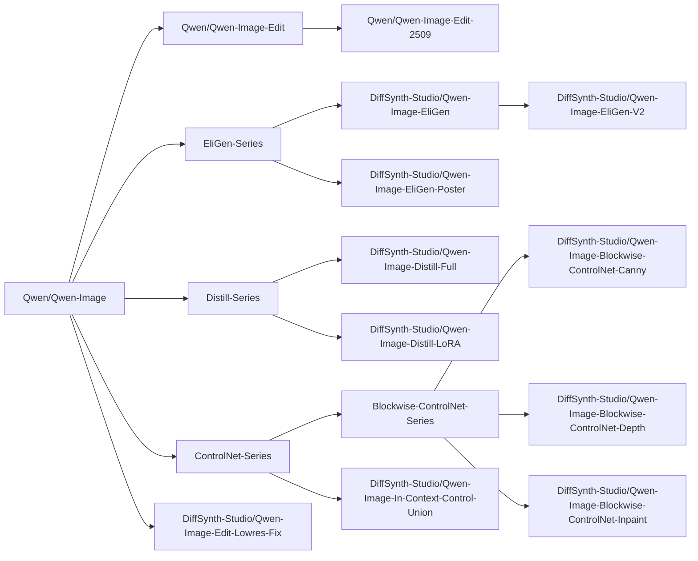
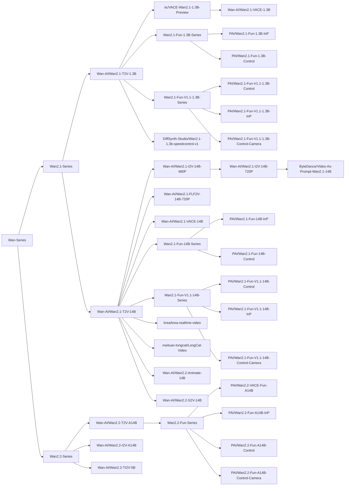

# DiffSynth-Studio

<a href="https://github.com/modelscope/DiffSynth-Studio"></a> <a href="https://trendshift.io/repositories/10946" target="_blank"></a></p>

[](https://pypi.org/project/DiffSynth/)
[](https://github.com/modelscope/DiffSynth-Studio/blob/master/LICENSE)
[](https://github.com/modelscope/DiffSynth-Studio/issues)
[](https://GitHub.com/modelscope/DiffSynth-Studio/pull/)
[](https://GitHub.com/modelscope/DiffSynth-Studio/commit/)

[Switch to English](./README.md)

## 简介

欢迎来到 Diffusion 模型的魔法世界！DiffSynth-Studio 是由[魔搭社区](https://www.modelscope.cn/)团队开发和维护的开源 Diffusion 模型引擎。我们期望以框架建设孵化技术创新，凝聚开源社区的力量，探索生成式模型技术的边界！

DiffSynth 目前包括两个开源项目：
* [DiffSynth-Studio](https://github.com/modelscope/DiffSynth-Studio): 聚焦于激进的技术探索，面向学术界，提供更前沿的模型能力支持。
* [DiffSynth-Engine](https://github.com/modelscope/DiffSynth-Engine): 聚焦于稳定的模型部署，面向工业界，提供更高的计算性能与更稳定的功能。

[DiffSynth-Studio](https://github.com/modelscope/DiffSynth-Studio) 与 [DiffSynth-Engine](https://github.com/modelscope/DiffSynth-Engine) 是魔搭社区 AIGC 专区的核心引擎，欢迎体验我们精心打造的产品化功能：

* 魔搭社区 AIGC 专区 (面向中国用户): https://modelscope.cn/aigc/home
* ModelScope Civision (for global users): https://modelscope.ai/civision/home

> DiffSynth-Studio 文档：[中文版](/docs/zh/README.md)、[English version](/docs/en/README.md)

我们相信，一个完善的开源代码框架能够降低技术探索的门槛，我们基于这个代码库搞出了不少[有意思的技术](#创新成果)。或许你也有许多天马行空的构想，借助 DiffSynth-Studio，你可以快速实现这些想法。为此，我们为开发者准备了详细的文档，我们希望通过这些文档，帮助开发者理解 Diffusion 模型的原理，更期待与你一同拓展技术的边界。

## 更新历史

> DiffSynth-Studio 经历了大版本更新，部分旧功能已停止维护，如需使用旧版功能，请切换到大版本更新前的[最后一个历史版本](https://github.com/modelscope/DiffSynth-Studio/tree/afd101f3452c9ecae0c87b79adfa2e22d65ffdc3)。

> 目前本项目的开发人员有限，大部分工作由 [Artiprocher](https://github.com/Artiprocher) 负责，因此新功能的开发进展会比较缓慢，issue 的回复和解决速度有限，我们对此感到非常抱歉，请各位开发者理解。

- **2026年2月2日** Research Tutorial 的第一篇文档上线，带你从零开始训练一个 0.1B 的小型文生图模型，详见[文档](/docs/zh/Research_Tutorial/train_from_scratch.md)、[模型](https://modelscope.cn/models/DiffSynth-Studio/AAAMyModel)，我们希望 DiffSynth-Studio 能够成为一个更强大的 Diffusion 模型训练框架。

- **2026年1月27日** [Z-Image](https://modelscope.cn/models/Tongyi-MAI/Z-Image) 发布，我们的 [Z-Image-i2L](https://www.modelscope.cn/models/DiffSynth-Studio/Z-Image-i2L) 模型同步发布，在[魔搭创空间](https://modelscope.cn/studios/DiffSynth-Studio/Z-Image-i2L)可直接体验，详见[文档](/docs/zh/Model_Details/Z-Image.md)。

- **2026年1月19日** 新增对 [FLUX.2-klein-4B](https://modelscope.cn/models/black-forest-labs/FLUX.2-klein-4B) 和 [FLUX.2-klein-9B](https://modelscope.cn/models/black-forest-labs/FLUX.2-klein-9B) 模型的支持，包括完整的训练和推理功能。[文档](/docs/zh/Model_Details/FLUX2.md)和[示例代码](/examples/flux2/)现已可用。

- **2026年1月12日** 我们训练并开源了一个文本引导的图层拆分模型（[模型链接](https://modelscope.cn/models/DiffSynth-Studio/Qwen-Image-Layered-Control)），这一模型输入一张图与一段文本描述，模型会将图像中与文本描述相关的图层拆分出来。更多细节请阅读我们的 blog（[中文版](https://modelscope.cn/learn/4938)、[英文版](https://huggingface.co/blog/kelseye/qwen-image-layered-control)）。

- **2025年12月24日** 我们基于 Qwen-Image-Edit-2511 训练了一个 In-Context Editing LoRA 模型（[模型链接](https://modelscope.cn/models/DiffSynth-Studio/Qwen-Image-Edit-2511-ICEdit-LoRA)），这个模型可以输入三张图：图A、图B、图C，模型会自行分析图A到图B的变化，并将这样的变化应用到图C，生成图D。更多细节请阅读我们的 blog（[中文版](https://mp.weixin.qq.com/s/41aEiN3lXKGCJs1-we4Q2g)、[英文版](https://huggingface.co/blog/kelseye/qwen-image-edit-2511-icedit-lora)）。

- **2025年12月9日** 我们基于 DiffSynth-Studio 2.0 训练了一个疯狂的模型：[Qwen-Image-i2L](https://www.modelscope.cn/models/DiffSynth-Studio/Qwen-Image-i2L)（Image to LoRA）。这一模型以图像为输入，以 LoRA 为输出。尽管这个版本的模型在泛化能力、细节保持能力等方面还有很大改进空间，我们将这些模型开源，以启发更多创新性的研究工作。更多细节，请参考我们的 [blog](https://huggingface.co/blog/kelseye/qwen-image-i2l)。

- **2025年12月4日** DiffSynth-Studio 2.0 发布！众多新功能上线
  - [文档](/docs/zh/README.md)上线：我们的文档还在持续优化更新中
  - [显存管理](/docs/zh/Pipeline_Usage/VRAM_management.md)模块升级，支持 Layer 级别的 Disk Offload，同时释放内存与显存
  - 新模型支持
    - Z-Image Turbo: [模型](https://www.modelscope.ai/models/Tongyi-MAI/Z-Image-Turbo)、[文档](/docs/zh/Model_Details/Z-Image.md)、[代码](/examples/z_image/)
    - FLUX.2-dev: [模型](https://www.modelscope.cn/models/black-forest-labs/FLUX.2-dev)、[文档](/docs/zh/Model_Details/FLUX2.md)、[代码](/examples/flux2/)
  - 训练框架升级
    - [拆分训练](/docs/zh/Training/Split_Training.md)：支持自动化地将训练过程拆分为数据处理和训练两阶段（即使训练的是 ControlNet 或其他任意模型），在数据处理阶段进行文本编码、VAE 编码等不需要梯度回传的计算，在训练阶段处理其他计算。速度更快，显存需求更少。
    - [差分 LoRA 训练](/docs/zh/Training/Differential_LoRA.md)：这是我们曾在 [ArtAug](https://www.modelscope.cn/models/DiffSynth-Studio/ArtAug-lora-FLUX.1dev-v1) 中使用的训练技术，目前已可用于任意模型的 LoRA 训练。
    - [FP8 训练](/docs/zh/Training/FP8_Precision.md)：FP8 在训练中支持应用到任意非训练模型，即梯度关闭或者梯度仅影响 LoRA 权重的模型。

<details>
<summary>更多</summary>

- **2025年11月4日** 支持了 [ByteDance/Video-As-Prompt-Wan2.1-14B](https://modelscope.cn/models/ByteDance/Video-As-Prompt-Wan2.1-14B) 模型，该模型基于 Wan 2.1 训练，支持根据参考视频生成相应的动作。

- **2025年10月30日** 支持了 [meituan-longcat/LongCat-Video](https://www.modelscope.cn/models/meituan-longcat/LongCat-Video) 模型，该模型支持文生视频、图生视频、视频续写。这个模型在本项目中沿用 Wan 的框架进行推理和训练。

- **2025年10月27日** 支持了 [krea/krea-realtime-video](https://www.modelscope.cn/models/krea/krea-realtime-video) 模型，Wan 模型生态再添一员。

- **2025年9月23日** [DiffSynth-Studio/Qwen-Image-EliGen-Poster](https://www.modelscope.cn/models/DiffSynth-Studio/Qwen-Image-EliGen-Poster) 发布！本模型由我们与淘天体验设计团队联合研发并开源。模型基于 Qwen-Image 构建，专为电商海报场景设计，支持精确的分区布局控制。 请参考[我们的示例代码](./examples/qwen_image/model_inference/Qwen-Image-EliGen-Poster.py)。

- **2025年9月9日** 我们的训练框架支持了多种训练模式，目前已适配 Qwen-Image，除标准 SFT 训练模式外，已支持 Direct Distill，请参考[我们的示例代码](./examples/qwen_image/model_training/lora/Qwen-Image-Distill-LoRA.sh)。这项功能是实验性的，我们将会继续完善已支持更全面的模型训练功能。

- **2025年8月28日** 我们支持了Wan2.2-S2V，一个音频驱动的电影级视频生成模型。请参见[./examples/wanvideo/](./examples/wanvideo/)。

- **2025年8月21日** [DiffSynth-Studio/Qwen-Image-EliGen-V2](https://www.modelscope.cn/models/DiffSynth-Studio/Qwen-Image-EliGen-V2) 发布！相比于 V1 版本，训练数据集变为 [Qwen-Image-Self-Generated-Dataset](https://www.modelscope.cn/datasets/DiffSynth-Studio/Qwen-Image-Self-Generated-Dataset)，因此，生成的图像更符合 Qwen-Image 本身的图像分布和风格。 请参考[我们的示例代码](./examples/qwen_image/model_inference_low_vram/Qwen-Image-EliGen-V2.py)。

- **2025年8月21日** 我们开源了 [DiffSynth-Studio/Qwen-Image-In-Context-Control-Union](https://www.modelscope.cn/models/DiffSynth-Studio/Qwen-Image-In-Context-Control-Union) 结构控制 LoRA 模型，采用 In Context 的技术路线，支持多种类别的结构控制条件，包括 canny, depth, lineart, softedge, normal, openpose。 请参考[我们的示例代码](./examples/qwen_image/model_inference/Qwen-Image-In-Context-Control-Union.py)。

- **2025年8月20日** 我们开源了 [DiffSynth-Studio/Qwen-Image-Edit-Lowres-Fix](https://www.modelscope.cn/models/DiffSynth-Studio/Qwen-Image-Edit-Lowres-Fix) 模型，提升了 Qwen-Image-Edit 对低分辨率图像输入的编辑效果。请参考[我们的示例代码](./examples/qwen_image/model_inference/Qwen-Image-Edit-Lowres-Fix.py)

- **2025年8月19日** 🔥 Qwen-Image-Edit 开源，欢迎图像编辑模型新成员！

- **2025年8月18日** 我们训练并开源了 Qwen-Image 的图像重绘 ControlNet 模型 [DiffSynth-Studio/Qwen-Image-Blockwise-ControlNet-Inpaint](https://www.modelscope.cn/models/DiffSynth-Studio/Qwen-Image-Blockwise-ControlNet-Inpaint)，模型结构采用了轻量化的设计，请参考[我们的示例代码](./examples/qwen_image/model_inference/Qwen-Image-Blockwise-ControlNet-Inpaint.py)。

- **2025年8月15日** 我们开源了 [Qwen-Image-Self-Generated-Dataset](https://www.modelscope.cn/datasets/DiffSynth-Studio/Qwen-Image-Self-Generated-Dataset) 数据集。这是一个使用 Qwen-Image 模型生成的图像数据集，共包含 160,000 张`1024 x 1024`图像。它包括通用、英文文本渲染和中文文本渲染子集。我们为每张图像提供了图像描述、实体和结构控制图像的标注。开发者可以使用这个数据集来训练 Qwen-Image 模型的 ControlNet 和 EliGen 等模型，我们旨在通过开源推动技术发展！

- **2025年8月13日** 我们训练并开源了 Qwen-Image 的 ControlNet 模型 [DiffSynth-Studio/Qwen-Image-Blockwise-ControlNet-Depth](https://modelscope.cn/models/DiffSynth-Studio/Qwen-Image-Blockwise-ControlNet-Depth)，模型结构采用了轻量化的设计，请参考[我们的示例代码](./examples/qwen_image/model_inference/Qwen-Image-Blockwise-ControlNet-Depth.py)。

- **2025年8月12日** 我们训练并开源了 Qwen-Image 的 ControlNet 模型 [DiffSynth-Studio/Qwen-Image-Blockwise-ControlNet-Canny](https://modelscope.cn/models/DiffSynth-Studio/Qwen-Image-Blockwise-ControlNet-Canny)，模型结构采用了轻量化的设计，请参考[我们的示例代码](./examples/qwen_image/model_inference/Qwen-Image-Blockwise-ControlNet-Canny.py)。

- **2025年8月11日** 我们开源了 Qwen-Image 的蒸馏加速模型 [DiffSynth-Studio/Qwen-Image-Distill-LoRA](https://www.modelscope.cn/models/DiffSynth-Studio/Qwen-Image-Distill-LoRA)，沿用了与 [DiffSynth-Studio/Qwen-Image-Distill-Full](https://www.modelscope.cn/models/DiffSynth-Studio/Qwen-Image-Distill-Full) 相同的训练流程，但模型结构修改为了 LoRA，因此能够更好地与其他开源生态模型兼容。

- **2025年8月7日** 我们开源了 Qwen-Image 的实体控制 LoRA 模型 [DiffSynth-Studio/Qwen-Image-EliGen](https://www.modelscope.cn/models/DiffSynth-Studio/Qwen-Image-EliGen)。Qwen-Image-EliGen 能够实现实体级可控的文生图。技术细节请参见[论文](https://arxiv.org/abs/2501.01097)。训练数据集：[EliGenTrainSet](https://www.modelscope.cn/datasets/DiffSynth-Studio/EliGenTrainSet)。

- **2025年8月5日** 我们开源了 Qwen-Image 的蒸馏加速模型 [DiffSynth-Studio/Qwen-Image-Distill-Full](https://www.modelscope.cn/models/DiffSynth-Studio/Qwen-Image-Distill-Full)，实现了约 5 倍加速。

- **2025年8月4日** 🔥 Qwen-Image 开源，欢迎图像生成模型家族新成员！

- **2025年8月1日** [FLUX.1-Krea-dev](https://www.modelscope.cn/models/black-forest-labs/FLUX.1-Krea-dev) 开源，这是一个专注于美学摄影的文生图模型。我们第一时间提供了全方位支持，包括低显存逐层 offload、LoRA 训练、全量训练。详细信息请参考 [./examples/flux/](./examples/flux/)。

- **2025年7月28日** Wan 2.2 开源，我们第一时间提供了全方位支持，包括低显存逐层 offload、FP8 量化、序列并行、LoRA 训练、全量训练。详细信息请参考 [./examples/wanvideo/](./examples/wanvideo/)。

- **2025年7月11日** 我们提出 Nexus-Gen，一个将大语言模型（LLM）的语言推理能力与扩散模型的图像生成能力相结合的统一框架。该框架支持无缝的图像理解、生成和编辑任务。
  - 论文: [Nexus-Gen: Unified Image Understanding, Generation, and Editing via Prefilled Autoregression in Shared Embedding Space](https://arxiv.org/pdf/2504.21356)
  - Github 仓库: https://github.com/modelscope/Nexus-Gen
  - 模型: [ModelScope](https://www.modelscope.cn/models/DiffSynth-Studio/Nexus-GenV2), [HuggingFace](https://huggingface.co/modelscope/Nexus-GenV2)
  - 训练数据集: [ModelScope Dataset](https://www.modelscope.cn/datasets/DiffSynth-Studio/Nexus-Gen-Training-Dataset)
  - 在线体验: [ModelScope Nexus-Gen Studio](https://www.modelscope.cn/studios/DiffSynth-Studio/Nexus-Gen)

- **2025年6月15日** ModelScope 官方评测框架 [EvalScope](https://github.com/modelscope/evalscope) 现已支持文生图生成评测。请参考[最佳实践](https://evalscope.readthedocs.io/zh-cn/latest/best_practice/t2i_eval.html)指南进行尝试。

- **2025年3月25日** 我们的新开源项目 [DiffSynth-Engine](https://github.com/modelscope/DiffSynth-Engine) 现已开源！专注于稳定的模型部署，面向工业界，提供更好的工程支持、更高的计算性能和更稳定的功能。

- **2025年3月31日** 我们支持 InfiniteYou，一种用于 FLUX 的人脸特征保留方法。更多细节请参考 [./examples/InfiniteYou/](./examples/InfiniteYou/)。

- **2025年3月13日** 我们支持 HunyuanVideo-I2V，即腾讯开源的 HunyuanVideo 的图像到视频生成版本。更多细节请参考 [./examples/HunyuanVideo/](./examples/HunyuanVideo/)。

- **2025年2月25日** 我们支持 Wan-Video，这是阿里巴巴开源的一系列最先进的视频合成模型。详见 [./examples/wanvideo/](./examples/wanvideo/)。

- **2025年2月17日** 我们支持 [StepVideo](https://modelscope.cn/models/stepfun-ai/stepvideo-t2v/summary)！先进的视频合成模型！详见 [./examples/stepvideo](./examples/stepvideo/)。

- **2024年12月31日** 我们提出 EliGen，一种用于精确实体级别控制的文本到图像生成的新框架，并辅以修复融合管道，将其能力扩展到图像修复任务。EliGen 可以无缝集成现有的社区模型，如 IP-Adapter 和 In-Context LoRA，提升其通用性。更多详情，请见 [./examples/EntityControl](./examples/EntityControl/)。
  - 论文: [EliGen: Entity-Level Controlled Image Generation with Regional Attention](https://arxiv.org/abs/2501.01097)
  - 模型: [ModelScope](https://www.modelscope.cn/models/DiffSynth-Studio/Eligen), [HuggingFace](https://huggingface.co/modelscope/EliGen)
  - 在线体验: [ModelScope EliGen Studio](https://www.modelscope.cn/studios/DiffSynth-Studio/EliGen)
  - 训练数据集: [EliGen Train Set](https://www.modelscope.cn/datasets/DiffSynth-Studio/EliGenTrainSet)

- **2024年12月19日** 我们为 HunyuanVideo 实现了高级显存管理，使得在 24GB 显存下可以生成分辨率为 129x720x1280 的视频，或在仅 6GB 显存下生成分辨率为 129x512x384 的视频。更多细节请参考 [./examples/HunyuanVideo/](./examples/HunyuanVideo/)。

- **2024年12月18日** 我们提出 ArtAug，一种通过合成-理解交互来改进文生图模型的方法。我们以 LoRA 格式为 FLUX.1-dev 训练了一个 ArtAug 增强模块。该模型将 Qwen2-VL-72B 的美学理解融入 FLUX.1-dev，从而提升了生成图像的质量。
  - 论文: https://arxiv.org/abs/2412.12888
  - 示例: https://github.com/modelscope/DiffSynth-Studio/tree/main/examples/ArtAug
  - 模型: [ModelScope](https://www.modelscope.cn/models/DiffSynth-Studio/ArtAug-lora-FLUX.1dev-v1), [HuggingFace](https://huggingface.co/ECNU-CILab/ArtAug-lora-FLUX.1dev-v1)
  - 演示: [ModelScope](https://modelscope.cn/aigc/imageGeneration?tab=advanced&versionId=7228&modelType=LoRA&sdVersion=FLUX_1&modelUrl=modelscope%3A%2F%2FDiffSynth-Studio%2FArtAug-lora-FLUX.1dev-v1%3Frevision%3Dv1.0), HuggingFace (即将上线)

- **2024年10月25日** 我们提供了广泛的 FLUX ControlNet 支持。该项目支持许多不同的 ControlNet 模型，并且可以自由组合，即使它们的结构不同。此外，ControlNet 模型兼容高分辨率优化和分区控制技术，能够实现非常强大的可控图像生成。详见 [`./examples/ControlNet/`](./examples/ControlNet/)。

- **2024年10月8日** 我们发布了基于 CogVideoX-5B 和 ExVideo 的扩展 LoRA。您可以从 [ModelScope](https://modelscope.cn/models/ECNU-CILab/ExVideo-CogVideoX-LoRA-129f-v1) 或 [HuggingFace](https://huggingface.co/ECNU-CILab/ExVideo-CogVideoX-LoRA-129f-v1) 下载此模型。

- **2024年8月22日** 本项目现已支持 CogVideoX-5B。详见 [此处](/examples/video_synthesis/)。我们为这个文生视频模型提供了几个有趣的功能，包括：
  - 文本到视频
  - 视频编辑
  - 自我超分
  - 视频插帧

- **2024年8月22日** 我们实现了一个有趣的画笔功能，支持所有文生图模型。现在，您可以在 AI 的辅助下使用画笔创作惊艳的图像了！
  - 在我们的 [WebUI](#usage-in-webui) 中使用它。

- **2024年8月21日** DiffSynth-Studio 现已支持 FLUX。
  - 启用 CFG 和高分辨率修复以提升视觉质量。详见 [此处](/examples/image_synthesis/README.md)
  - LoRA、ControlNet 和其他附加模型将很快推出。

- **2024年6月21日** 我们提出 ExVideo，一种旨在增强视频生成模型能力的后训练微调技术。我们将 Stable Video Diffusion 进行了扩展，实现了长达 128 帧的长视频生成。
  - [项目页面](https://ecnu-cilab.github.io/ExVideoProjectPage/)
  - 源代码已在此仓库中发布。详见 [`examples/ExVideo`](./examples/ExVideo/)。
  - 模型已发布于 [HuggingFace](https://huggingface.co/ECNU-CILab/ExVideo-SVD-128f-v1) 和 [ModelScope](https://modelscope.cn/models/ECNU-CILab/ExVideo-SVD-128f-v1)。
  - 技术报告已发布于 [arXiv](https://arxiv.org/abs/2406.14130)。
  - 您可以在此 [演示](https://huggingface.co/spaces/modelscope/ExVideo-SVD-128f-v1) 中试用 ExVideo！

- **2024年6月13日** DiffSynth Studio 已迁移至 ModelScope。开发团队也从“我”转变为“我们”。当然，我仍会参与后续的开发和维护工作。

- **2024年1月29日** 我们提出 Diffutoon，这是一个出色的卡通着色解决方案。
  - [项目页面](https://ecnu-cilab.github.io/DiffutoonProjectPage/)
  - 源代码已在此项目中发布。
  - 技术报告（IJCAI 2024）已发布于 [arXiv](https://arxiv.org/abs/2401.16224)。

- **2023年12月8日** 我们决定启动一个新项目，旨在释放扩散模型的潜力，尤其是在视频合成方面。该项目的开发工作正式开始。

- **2023年11月15日** 我们提出 FastBlend，一种强大的视频去闪烁算法。
  - sd-webui 扩展已发布于 [GitHub](https://github.com/Artiprocher/sd-webui-fastblend)。
  - 演示视频已在 Bilibili 上展示，包含三个任务：
    - [视频去闪烁](https://www.bilibili.com/video/BV1d94y1W7PE)
    - [视频插帧](https://www.bilibili.com/video/BV1Lw411m71p)
    - [图像驱动的视频渲染](https://www.bilibili.com/video/BV1RB4y1Z7LF)
  - 技术报告已发布于 [arXiv](https://arxiv.org/abs/2311.09265)。
  - 其他用户开发的非官方 ComfyUI 扩展已发布于 [GitHub](https://github.com/AInseven/ComfyUI-fastblend)。

- **2023年10月1日** 我们发布了该项目的早期版本，名为 FastSDXL。这是构建一个扩散引擎的初步尝试。
  - 源代码已发布于 [GitHub](https://github.com/Artiprocher/FastSDXL)。
  - FastSDXL 包含一个可训练的 OLSS 调度器，以提高效率。
    - OLSS 的原始仓库位于 [此处](https://github.com/alibaba/EasyNLP/tree/master/diffusion/olss_scheduler)。
    - 技术报告（CIKM 2023）已发布于 [arXiv](https://arxiv.org/abs/2305.14677)。
    - 演示视频已发布于 [Bilibili](https://www.bilibili.com/video/BV1w8411y7uj)。
    - 由于 OLSS 需要额外训练，我们未在本项目中实现它。

- **2023年8月29日** 我们提出 DiffSynth，一个视频合成框架。
  - [项目页面](https://ecnu-cilab.github.io/DiffSynth.github.io/)。
  - 源代码已发布在 [EasyNLP](https://github.com/alibaba/EasyNLP/tree/master/diffusion/DiffSynth)。
  - 技术报告（ECML PKDD 2024）已发布于 [arXiv](https://arxiv.org/abs/2308.03463)。

</details>

## 安装

从源码安装（推荐）：

```
git clone https://github.com/modelscope/DiffSynth-Studio.git
cd DiffSynth-Studio
pip install -e .
```

更多安装方式，以及非 NVIDIA GPU 的安装，请参考[安装文档](/docs/zh/Pipeline_Usage/Setup.md)。

</details>

## 基础框架

DiffSynth-Studio 为主流 Diffusion 模型（包括 FLUX、Wan 等）重新设计了推理和训练流水线，能够实现高效的显存管理、灵活的模型训练。

<details>
<summary>环境变量配置</summary>

> 在进行模型推理和训练前，可通过[环境变量](/docs/zh/Pipeline_Usage/Environment_Variables.md)配置模型下载源等。
> 
> 本项目默认从魔搭社区下载模型。对于非中国区域的用户，可以通过以下配置从魔搭社区的国际站下载模型：
> 
> ```python
> import os
> os.environ["MODELSCOPE_DOMAIN"] = "www.modelscope.ai"
> ```
> 
> 如需从其他站点下载，请修改[环境变量 DIFFSYNTH_DOWNLOAD_SOURCE](/docs/zh/Pipeline_Usage/Environment_Variables.md#diffsynth_download_source)。

</details>

### 图像生成模型


#### Z-Image：[/docs/zh/Model_Details/Z-Image.md](/docs/zh/Model_Details/Z-Image.md)

<details>

<summary>快速开始</summary>

运行以下代码可以快速加载 [Tongyi-MAI/Z-Image-Turbo](https://www.modelscope.cn/models/Tongyi-MAI/Z-Image-Turbo) 模型并进行推理。FP8 精度量化会导致明显的图像质量劣化，因此不建议在 Z-Image Turbo 模型上开启任何量化，仅建议开启 CPU Offload，最低 8G 显存即可运行。

```python
from diffsynth.pipelines.z_image import ZImagePipeline, ModelConfig
import torch

vram_config = {
    "offload_dtype": torch.bfloat16,
    "offload_device": "cpu",
    "onload_dtype": torch.bfloat16,
    "onload_device": "cpu",
    "preparing_dtype": torch.bfloat16,
    "preparing_device": "cuda",
    "computation_dtype": torch.bfloat16,
    "computation_device": "cuda",
}
pipe = ZImagePipeline.from_pretrained(
    torch_dtype=torch.bfloat16,
    device="cuda",
    model_configs=[
        ModelConfig(model_id="Tongyi-MAI/Z-Image-Turbo", origin_file_pattern="transformer/*.safetensors", **vram_config),
        ModelConfig(model_id="Tongyi-MAI/Z-Image-Turbo", origin_file_pattern="text_encoder/*.safetensors", **vram_config),
        ModelConfig(model_id="Tongyi-MAI/Z-Image-Turbo", origin_file_pattern="vae/diffusion_pytorch_model.safetensors", **vram_config),
    ],
    tokenizer_config=ModelConfig(model_id="Tongyi-MAI/Z-Image-Turbo", origin_file_pattern="tokenizer/"),
    vram_limit=torch.cuda.mem_get_info("cuda")[1] / (1024 ** 3) - 0.5,
)
prompt = "Young Chinese woman in red Hanfu, intricate embroidery. Impeccable makeup, red floral forehead pattern. Elaborate high bun, golden phoenix headdress, red flowers, beads. Holds round folding fan with lady, trees, bird. Neon lightning-bolt lamp (⚡️), bright yellow glow, above extended left palm. Soft-lit outdoor night background, silhouetted tiered pagoda (西安大雁塔), blurred colorful distant lights."
image = pipe(prompt=prompt, seed=42, rand_device="cuda")
image.save("image.jpg")
```

</details>

<details>

<summary>示例代码</summary>

Z-Image 的示例代码位于：[/examples/z_image/](/examples/z_image/)

|模型 ID|推理|低显存推理|全量训练|全量训练后验证|LoRA 训练|LoRA 训练后验证|
|-|-|-|-|-|-|-|
|[Tongyi-MAI/Z-Image](https://www.modelscope.cn/models/Tongyi-MAI/Z-Image)|[code](/examples/z_image/model_inference/Z-Image.py)|[code](/examples/z_image/model_inference_low_vram/Z-Image.py)|[code](/examples/z_image/model_training/full/Z-Image.sh)|[code](/examples/z_image/model_training/validate_full/Z-Image.py)|[code](/examples/z_image/model_training/lora/Z-Image.sh)|[code](/examples/z_image/model_training/validate_lora/Z-Image.py)|
|[DiffSynth-Studio/Z-Image-i2L](https://www.modelscope.cn/models/DiffSynth-Studio/Z-Image-i2L)|[code](/examples/z_image/model_inference/Z-Image-i2L.py)|[code](/examples/z_image/model_inference_low_vram/Z-Image-i2L.py)|-|-|-|-|
|[Tongyi-MAI/Z-Image-Turbo](https://www.modelscope.cn/models/Tongyi-MAI/Z-Image-Turbo)|[code](/examples/z_image/model_inference/Z-Image-Turbo.py)|[code](/examples/z_image/model_inference_low_vram/Z-Image-Turbo.py)|[code](/examples/z_image/model_training/full/Z-Image-Turbo.sh)|[code](/examples/z_image/model_training/validate_full/Z-Image-Turbo.py)|[code](/examples/z_image/model_training/lora/Z-Image-Turbo.sh)|[code](/examples/z_image/model_training/validate_lora/Z-Image-Turbo.py)|
|[PAI/Z-Image-Turbo-Fun-Controlnet-Union-2.1](https://www.modelscope.cn/models/PAI/Z-Image-Turbo-Fun-Controlnet-Union-2.1)|[code](/examples/z_image/model_inference/Z-Image-Turbo-Fun-Controlnet-Union-2.1.py)|[code](/examples/z_image/model_inference_low_vram/Z-Image-Turbo-Fun-Controlnet-Union-2.1.py)|[code](/examples/z_image/model_training/full/Z-Image-Turbo-Fun-Controlnet-Union-2.1.sh)|[code](/examples/z_image/model_training/validate_full/Z-Image-Turbo-Fun-Controlnet-Union-2.1.py)|[code](/examples/z_image/model_training/lora/Z-Image-Turbo-Fun-Controlnet-Union-2.1.sh)|[code](/examples/z_image/model_training/validate_lora/Z-Image-Turbo-Fun-Controlnet-Union-2.1.py)|
|[PAI/Z-Image-Turbo-Fun-Controlnet-Union-2.1-8steps](https://www.modelscope.cn/models/PAI/Z-Image-Turbo-Fun-Controlnet-Union-2.1)|[code](/examples/z_image/model_inference/Z-Image-Turbo-Fun-Controlnet-Union-2.1-8steps.py)|[code](/examples/z_image/model_inference_low_vram/Z-Image-Turbo-Fun-Controlnet-Union-2.1-8steps.py)|[code](/examples/z_image/model_training/full/Z-Image-Turbo-Fun-Controlnet-Union-2.1-8steps.sh)|[code](/examples/z_image/model_training/validate_full/Z-Image-Turbo-Fun-Controlnet-Union-2.1-8steps.py)|[code](/examples/z_image/model_training/lora/Z-Image-Turbo-Fun-Controlnet-Union-2.1-8steps.sh)|[code](/examples/z_image/model_training/validate_lora/Z-Image-Turbo-Fun-Controlnet-Union-2.1-8steps.py)|
|[PAI/Z-Image-Turbo-Fun-Controlnet-Tile-2.1-8steps](https://www.modelscope.cn/models/PAI/Z-Image-Turbo-Fun-Controlnet-Union-2.1)|[code](/examples/z_image/model_inference/Z-Image-Turbo-Fun-Controlnet-Tile-2.1-8steps.py)|[code](/examples/z_image/model_inference_low_vram/Z-Image-Turbo-Fun-Controlnet-Tile-2.1-8steps.py)|[code](/examples/z_image/model_training/full/Z-Image-Turbo-Fun-Controlnet-Tile-2.1-8steps.sh)|[code](/examples/z_image/model_training/validate_full/Z-Image-Turbo-Fun-Controlnet-Tile-2.1-8steps.py)|[code](/examples/z_image/model_training/lora/Z-Image-Turbo-Fun-Controlnet-Tile-2.1-8steps.sh)|[code](/examples/z_image/model_training/validate_lora/Z-Image-Turbo-Fun-Controlnet-Tile-2.1-8steps.py)|

</details>

#### FLUX.2: [/docs/zh/Model_Details/FLUX2.md](/docs/zh/Model_Details/FLUX2.md)

<details>

<summary>快速开始</summary>

运行以下代码可以快速加载 [black-forest-labs/FLUX.2-dev](https://www.modelscope.cn/models/black-forest-labs/FLUX.2-dev) 模型并进行推理。显存管理已启动，框架会自动根据剩余显存控制模型参数的加载，最低 10G 显存即可运行。

```python
from diffsynth.pipelines.flux2_image import Flux2ImagePipeline, ModelConfig
import torch

vram_config = {
    "offload_dtype": "disk",
    "offload_device": "disk",
    "onload_dtype": torch.float8_e4m3fn,
    "onload_device": "cpu",
    "preparing_dtype": torch.float8_e4m3fn,
    "preparing_device": "cuda",
    "computation_dtype": torch.bfloat16,
    "computation_device": "cuda",
}
pipe = Flux2ImagePipeline.from_pretrained(
    torch_dtype=torch.bfloat16,
    device="cuda",
    model_configs=[
        ModelConfig(model_id="black-forest-labs/FLUX.2-dev", origin_file_pattern="text_encoder/*.safetensors", **vram_config),
        ModelConfig(model_id="black-forest-labs/FLUX.2-dev", origin_file_pattern="transformer/*.safetensors", **vram_config),
        ModelConfig(model_id="black-forest-labs/FLUX.2-dev", origin_file_pattern="vae/diffusion_pytorch_model.safetensors"),
    ],
    tokenizer_config=ModelConfig(model_id="black-forest-labs/FLUX.2-dev", origin_file_pattern="tokenizer/"),
    vram_limit=torch.cuda.mem_get_info("cuda")[1] / (1024 ** 3) - 0.5,
)
prompt = "High resolution. A dreamy underwater portrait of a serene young woman in a flowing blue dress. Her hair floats softly around her face, strands delicately suspended in the water. Clear, shimmering light filters through, casting gentle highlights, while tiny bubbles rise around her. Her expression is calm, her features finely detailed—creating a tranquil, ethereal scene."
image = pipe(prompt, seed=42, rand_device="cuda", num_inference_steps=50)
image.save("image.jpg")
```

</details>

<details>

<summary>示例代码</summary>

FLUX.2 的示例代码位于：[/examples/flux2/](/examples/flux2/)

|模型 ID|推理|低显存推理|全量训练|全量训练后验证|LoRA 训练|LoRA 训练后验证|
|-|-|-|-|-|-|-|
|[black-forest-labs/FLUX.2-dev](https://www.modelscope.cn/models/black-forest-labs/FLUX.2-dev)|[code](/examples/flux2/model_inference/FLUX.2-dev.py)|[code](/examples/flux2/model_inference_low_vram/FLUX.2-dev.py)|-|-|[code](/examples/flux2/model_training/lora/FLUX.2-dev.sh)|[code](/examples/flux2/model_training/validate_lora/FLUX.2-dev.py)|
|[black-forest-labs/FLUX.2-klein-4B](https://www.modelscope.cn/models/black-forest-labs/FLUX.2-klein-4B)|[code](/examples/flux2/model_inference/FLUX.2-klein-4B.py)|[code](/examples/flux2/model_inference_low_vram/FLUX.2-klein-4B.py)|[code](/examples/flux2/model_training/full/FLUX.2-klein-4B.sh)|[code](/examples/flux2/model_training/validate_full/FLUX.2-klein-4B.py)|[code](/examples/flux2/model_training/lora/FLUX.2-klein-4B.sh)|[code](/examples/flux2/model_training/validate_lora/FLUX.2-klein-4B.py)|
|[black-forest-labs/FLUX.2-klein-9B](https://www.modelscope.cn/models/black-forest-labs/FLUX.2-klein-9B)|[code](/examples/flux2/model_inference/FLUX.2-klein-9B.py)|[code](/examples/flux2/model_inference_low_vram/FLUX.2-klein-9B.py)|[code](/examples/flux2/model_training/full/FLUX.2-klein-9B.sh)|[code](/examples/flux2/model_training/validate_full/FLUX.2-klein-9B.py)|[code](/examples/flux2/model_training/lora/FLUX.2-klein-9B.sh)|[code](/examples/flux2/model_training/validate_lora/FLUX.2-klein-9B.py)|
|[black-forest-labs/FLUX.2-klein-base-4B](https://www.modelscope.cn/models/black-forest-labs/FLUX.2-klein-base-4B)|[code](/examples/flux2/model_inference/FLUX.2-klein-base-4B.py)|[code](/examples/flux2/model_inference_low_vram/FLUX.2-klein-base-4B.py)|[code](/examples/flux2/model_training/full/FLUX.2-klein-base-4B.sh)|[code](/examples/flux2/model_training/validate_full/FLUX.2-klein-base-4B.py)|[code](/examples/flux2/model_training/lora/FLUX.2-klein-base-4B.sh)|[code](/examples/flux2/model_training/validate_lora/FLUX.2-klein-base-4B.py)|
|[black-forest-labs/FLUX.2-klein-base-9B](https://www.modelscope.cn/models/black-forest-labs/FLUX.2-klein-base-9B)|[code](/examples/flux2/model_inference/FLUX.2-klein-base-9B.py)|[code](/examples/flux2/model_inference_low_vram/FLUX.2-klein-base-9B.py)|[code](/examples/flux2/model_training/full/FLUX.2-klein-base-9B.sh)|[code](/examples/flux2/model_training/validate_full/FLUX.2-klein-base-9B.py)|[code](/examples/flux2/model_training/lora/FLUX.2-klein-base-9B.sh)|[code](/examples/flux2/model_training/validate_lora/FLUX.2-klein-base-9B.py)|

</details>

#### Qwen-Image: [/docs/zh/Model_Details/Qwen-Image.md](/docs/zh/Model_Details/Qwen-Image.md)

<details>

<summary>快速开始</summary>

运行以下代码可以快速加载 [Qwen/Qwen-Image](https://www.modelscope.cn/models/Qwen/Qwen-Image) 模型并进行推理。显存管理已启动，框架会自动根据剩余显存控制模型参数的加载，最低 8G 显存即可运行。

```python
from diffsynth.pipelines.qwen_image import QwenImagePipeline, ModelConfig
import torch

vram_config = {
    "offload_dtype": "disk",
    "offload_device": "disk",
    "onload_dtype": torch.float8_e4m3fn,
    "onload_device": "cpu",
    "preparing_dtype": torch.float8_e4m3fn,
    "preparing_device": "cuda",
    "computation_dtype": torch.bfloat16,
    "computation_device": "cuda",
}
pipe = QwenImagePipeline.from_pretrained(
    torch_dtype=torch.bfloat16,
    device="cuda",
    model_configs=[
        ModelConfig(model_id="Qwen/Qwen-Image", origin_file_pattern="transformer/diffusion_pytorch_model*.safetensors", **vram_config),
        ModelConfig(model_id="Qwen/Qwen-Image", origin_file_pattern="text_encoder/model*.safetensors", **vram_config),
        ModelConfig(model_id="Qwen/Qwen-Image", origin_file_pattern="vae/diffusion_pytorch_model.safetensors", **vram_config),
    ],
    tokenizer_config=ModelConfig(model_id="Qwen/Qwen-Image", origin_file_pattern="tokenizer/"),
    vram_limit=torch.cuda.mem_get_info("cuda")[1] / (1024 ** 3) - 0.5,
)
prompt = "精致肖像，水下少女，蓝裙飘逸，发丝轻扬，光影透澈，气泡环绕，面容恬静，细节精致，梦幻唯美。"
image = pipe(prompt, seed=0, num_inference_steps=40)
image.save("image.jpg")
```

</details>

<details>

<summary>模型血缘</summary>



</details>

<details>

<summary>示例代码</summary>

Qwen-Image 的示例代码位于：[/examples/qwen_image/](/examples/qwen_image/)

|模型 ID|推理|低显存推理|全量训练|全量训练后验证|LoRA 训练|LoRA 训练后验证|
|-|-|-|-|-|-|-|
|[Qwen/Qwen-Image](https://www.modelscope.cn/models/Qwen/Qwen-Image)|[code](/examples/qwen_image/model_inference/Qwen-Image.py)|[code](/examples/qwen_image/model_inference_low_vram/Qwen-Image.py)|[code](/examples/qwen_image/model_training/full/Qwen-Image.sh)|[code](/examples/qwen_image/model_training/validate_full/Qwen-Image.py)|[code](/examples/qwen_image/model_training/lora/Qwen-Image.sh)|[code](/examples/qwen_image/model_training/validate_lora/Qwen-Image.py)|
|[Qwen/Qwen-Image-2512](https://www.modelscope.cn/models/Qwen/Qwen-Image-2512)|[code](/examples/qwen_image/model_inference/Qwen-Image-2512.py)|[code](/examples/qwen_image/model_inference_low_vram/Qwen-Image-2512.py)|[code](/examples/qwen_image/model_training/full/Qwen-Image-2512.sh)|[code](/examples/qwen_image/model_training/validate_full/Qwen-Image-2512.py)|[code](/examples/qwen_image/model_training/lora/Qwen-Image-2512.sh)|[code](/examples/qwen_image/model_training/validate_lora/Qwen-Image-2512.py)|
|[Qwen/Qwen-Image-Edit](https://www.modelscope.cn/models/Qwen/Qwen-Image-Edit)|[code](/examples/qwen_image/model_inference/Qwen-Image-Edit.py)|[code](/examples/qwen_image/model_inference_low_vram/Qwen-Image-Edit.py)|[code](/examples/qwen_image/model_training/full/Qwen-Image-Edit.sh)|[code](/examples/qwen_image/model_training/validate_full/Qwen-Image-Edit.py)|[code](/examples/qwen_image/model_training/lora/Qwen-Image-Edit.sh)|[code](/examples/qwen_image/model_training/validate_lora/Qwen-Image-Edit.py)|
|[Qwen/Qwen-Image-Edit-2509](https://www.modelscope.cn/models/Qwen/Qwen-Image-Edit-2509)|[code](/examples/qwen_image/model_inference/Qwen-Image-Edit-2509.py)|[code](/examples/qwen_image/model_inference_low_vram/Qwen-Image-Edit-2509.py)|[code](/examples/qwen_image/model_training/full/Qwen-Image-Edit-2509.sh)|[code](/examples/qwen_image/model_training/validate_full/Qwen-Image-Edit-2509.py)|[code](/examples/qwen_image/model_training/lora/Qwen-Image-Edit-2509.sh)|[code](/examples/qwen_image/model_training/validate_lora/Qwen-Image-Edit-2509.py)|
|[Qwen/Qwen-Image-Edit-2511](https://www.modelscope.cn/models/Qwen/Qwen-Image-Edit-2511)|[code](/examples/qwen_image/model_inference/Qwen-Image-Edit-2511.py)|[code](/examples/qwen_image/model_inference_low_vram/Qwen-Image-Edit-2511.py)|[code](/examples/qwen_image/model_training/full/Qwen-Image-Edit-2511.sh)|[code](/examples/qwen_image/model_training/validate_full/Qwen-Image-Edit-2511.py)|[code](/examples/qwen_image/model_training/lora/Qwen-Image-Edit-2511.sh)|[code](/examples/qwen_image/model_training/validate_lora/Qwen-Image-Edit-2511.py)|
|[lightx2v/Qwen-Image-Edit-2511-Lightning](https://modelscope.cn/models/lightx2v/Qwen-Image-Edit-2511-Lightning)|[code](/examples/qwen_image/model_inference/Qwen-Image-Edit-2511-Lightning.py)|[code](/examples/qwen_image/model_inference_low_vram/Qwen-Image-Edit-2511-Lightning.py)|-|-|-|-|
|[Qwen/Qwen-Image-Layered](https://www.modelscope.cn/models/Qwen/Qwen-Image-Layered)|[code](/examples/qwen_image/model_inference/Qwen-Image-Layered.py)|[code](/examples/qwen_image/model_inference_low_vram/Qwen-Image-Layered.py)|[code](/examples/qwen_image/model_training/full/Qwen-Image-Layered.sh)|[code](/examples/qwen_image/model_training/validate_full/Qwen-Image-Layered.py)|[code](/examples/qwen_image/model_training/lora/Qwen-Image-Layered.sh)|[code](/examples/qwen_image/model_training/validate_lora/Qwen-Image-Layered.py)|
|[DiffSynth-Studio/Qwen-Image-Layered-Control](https://www.modelscope.cn/models/DiffSynth-Studio/Qwen-Image-Layered-Control)|[code](/examples/qwen_image/model_inference/Qwen-Image-Layered-Control.py)|[code](/examples/qwen_image/model_inference_low_vram/Qwen-Image-Layered-Control.py)|[code](/examples/qwen_image/model_training/full/Qwen-Image-Layered-Control.sh)|[code](/examples/qwen_image/model_training/validate_full/Qwen-Image-Layered-Control.py)|[code](/examples/qwen_image/model_training/lora/Qwen-Image-Layered-Control.sh)|[code](/examples/qwen_image/model_training/validate_lora/Qwen-Image-Layered-Control.py)|
|[DiffSynth-Studio/Qwen-Image-EliGen](https://www.modelscope.cn/models/DiffSynth-Studio/Qwen-Image-EliGen)|[code](/examples/qwen_image/model_inference/Qwen-Image-EliGen.py)|[code](/examples/qwen_image/model_inference_low_vram/Qwen-Image-EliGen.py)|-|-|[code](/examples/qwen_image/model_training/lora/Qwen-Image-EliGen.sh)|[code](/examples/qwen_image/model_training/validate_lora/Qwen-Image-EliGen.py)|
|[DiffSynth-Studio/Qwen-Image-EliGen-V2](https://www.modelscope.cn/models/DiffSynth-Studio/Qwen-Image-EliGen-V2)|[code](/examples/qwen_image/model_inference/Qwen-Image-EliGen-V2.py)|[code](/examples/qwen_image/model_inference_low_vram/Qwen-Image-EliGen-V2.py)|-|-|[code](/examples/qwen_image/model_training/lora/Qwen-Image-EliGen.sh)|[code](/examples/qwen_image/model_training/validate_lora/Qwen-Image-EliGen.py)|
|[DiffSynth-Studio/Qwen-Image-EliGen-Poster](https://www.modelscope.cn/models/DiffSynth-Studio/Qwen-Image-EliGen-Poster)|[code](/examples/qwen_image/model_inference/Qwen-Image-EliGen-Poster.py)|[code](/examples/qwen_image/model_inference_low_vram/Qwen-Image-EliGen-Poster.py)|-|-|[code](/examples/qwen_image/model_training/lora/Qwen-Image-EliGen-Poster.sh)|[code](/examples/qwen_image/model_training/validate_lora/Qwen-Image-EliGen-Poster.py)|
|[DiffSynth-Studio/Qwen-Image-Distill-Full](https://www.modelscope.cn/models/DiffSynth-Studio/Qwen-Image-Distill-Full)|[code](/examples/qwen_image/model_inference/Qwen-Image-Distill-Full.py)|[code](/examples/qwen_image/model_inference_low_vram/Qwen-Image-Distill-Full.py)|[code](/examples/qwen_image/model_training/full/Qwen-Image-Distill-Full.sh)|[code](/examples/qwen_image/model_training/validate_full/Qwen-Image-Distill-Full.py)|[code](/examples/qwen_image/model_training/lora/Qwen-Image-Distill-Full.sh)|[code](/examples/qwen_image/model_training/validate_lora/Qwen-Image-Distill-Full.py)|
|[DiffSynth-Studio/Qwen-Image-Distill-LoRA](https://www.modelscope.cn/models/DiffSynth-Studio/Qwen-Image-Distill-LoRA)|[code](/examples/qwen_image/model_inference/Qwen-Image-Distill-LoRA.py)|[code](/examples/qwen_image/model_inference_low_vram/Qwen-Image-Distill-LoRA.py)|-|-|[code](/examples/qwen_image/model_training/lora/Qwen-Image-Distill-LoRA.sh)|[code](/examples/qwen_image/model_training/validate_lora/Qwen-Image-Distill-LoRA.py)|
|[DiffSynth-Studio/Qwen-Image-Blockwise-ControlNet-Canny](https://modelscope.cn/models/DiffSynth-Studio/Qwen-Image-Blockwise-ControlNet-Canny)|[code](/examples/qwen_image/model_inference/Qwen-Image-Blockwise-ControlNet-Canny.py)|[code](/examples/qwen_image/model_inference_low_vram/Qwen-Image-Blockwise-ControlNet-Canny.py)|[code](/examples/qwen_image/model_training/full/Qwen-Image-Blockwise-ControlNet-Canny.sh)|[code](/examples/qwen_image/model_training/validate_full/Qwen-Image-Blockwise-ControlNet-Canny.py)|[code](/examples/qwen_image/model_training/lora/Qwen-Image-Blockwise-ControlNet-Canny.sh)|[code](/examples/qwen_image/model_training/validate_lora/Qwen-Image-Blockwise-ControlNet-Canny.py)|
|[DiffSynth-Studio/Qwen-Image-Blockwise-ControlNet-Depth](https://modelscope.cn/models/DiffSynth-Studio/Qwen-Image-Blockwise-ControlNet-Depth)|[code](/examples/qwen_image/model_inference/Qwen-Image-Blockwise-ControlNet-Depth.py)|[code](/examples/qwen_image/model_inference_low_vram/Qwen-Image-Blockwise-ControlNet-Depth.py)|[code](/examples/qwen_image/model_training/full/Qwen-Image-Blockwise-ControlNet-Depth.sh)|[code](/examples/qwen_image/model_training/validate_full/Qwen-Image-Blockwise-ControlNet-Depth.py)|[code](/examples/qwen_image/model_training/lora/Qwen-Image-Blockwise-ControlNet-Depth.sh)|[code](/examples/qwen_image/model_training/validate_lora/Qwen-Image-Blockwise-ControlNet-Depth.py)|
|[DiffSynth-Studio/Qwen-Image-Blockwise-ControlNet-Inpaint](https://modelscope.cn/models/DiffSynth-Studio/Qwen-Image-Blockwise-ControlNet-Inpaint)|[code](/examples/qwen_image/model_inference/Qwen-Image-Blockwise-ControlNet-Inpaint.py)|[code](/examples/qwen_image/model_inference_low_vram/Qwen-Image-Blockwise-ControlNet-Inpaint.py)|[code](/examples/qwen_image/model_training/full/Qwen-Image-Blockwise-ControlNet-Inpaint.sh)|[code](/examples/qwen_image/model_training/validate_full/Qwen-Image-Blockwise-ControlNet-Inpaint.py)|[code](/examples/qwen_image/model_training/lora/Qwen-Image-Blockwise-ControlNet-Inpaint.sh)|[code](/examples/qwen_image/model_training/validate_lora/Qwen-Image-Blockwise-ControlNet-Inpaint.py)|
|[DiffSynth-Studio/Qwen-Image-In-Context-Control-Union](https://www.modelscope.cn/models/DiffSynth-Studio/Qwen-Image-In-Context-Control-Union)|[code](/examples/qwen_image/model_inference/Qwen-Image-In-Context-Control-Union.py)|[code](/examples/qwen_image/model_inference_low_vram/Qwen-Image-In-Context-Control-Union.py)|-|-|[code](/examples/qwen_image/model_training/lora/Qwen-Image-In-Context-Control-Union.sh)|[code](/examples/qwen_image/model_training/validate_lora/Qwen-Image-In-Context-Control-Union.py)|
|[DiffSynth-Studio/Qwen-Image-Edit-Lowres-Fix](https://www.modelscope.cn/models/DiffSynth-Studio/Qwen-Image-Edit-Lowres-Fix)|[code](/examples/qwen_image/model_inference/Qwen-Image-Edit-Lowres-Fix.py)|[code](/examples/qwen_image/model_inference_low_vram/Qwen-Image-Edit-Lowres-Fix.py)|-|-|-|-|
|[DiffSynth-Studio/Qwen-Image-i2L](https://www.modelscope.cn/models/DiffSynth-Studio/Qwen-Image-i2L)|[code](/examples/qwen_image/model_inference/Qwen-Image-i2L.py)|[code](/examples/qwen_image/model_inference_low_vram/Qwen-Image-i2L.py)|-|-|-|-|

</details>

#### FLUX.1: [/docs/zh/Model_Details/FLUX.md](/docs/zh/Model_Details/FLUX.md)

<details>

<summary>快速开始</summary>

运行以下代码可以快速加载 [black-forest-labs/FLUX.1-dev](https://www.modelscope.cn/models/black-forest-labs/FLUX.1-dev) 模型并进行推理。显存管理已启动，框架会自动根据剩余显存控制模型参数的加载，最低 8G 显存即可运行。

```python
import torch
from diffsynth.pipelines.flux_image import FluxImagePipeline, ModelConfig

vram_config = {
    "offload_dtype": torch.float8_e4m3fn,
    "offload_device": "cpu",
    "onload_dtype": torch.float8_e4m3fn,
    "onload_device": "cpu",
    "preparing_dtype": torch.float8_e4m3fn,
    "preparing_device": "cuda",
    "computation_dtype": torch.bfloat16,
    "computation_device": "cuda",
}
pipe = FluxImagePipeline.from_pretrained(
    torch_dtype=torch.bfloat16,
    device="cuda",
    model_configs=[
        ModelConfig(model_id="black-forest-labs/FLUX.1-dev", origin_file_pattern="flux1-dev.safetensors", **vram_config),
        ModelConfig(model_id="black-forest-labs/FLUX.1-dev", origin_file_pattern="text_encoder/model.safetensors", **vram_config),
        ModelConfig(model_id="black-forest-labs/FLUX.1-dev", origin_file_pattern="text_encoder_2/*.safetensors", **vram_config),
        ModelConfig(model_id="black-forest-labs/FLUX.1-dev", origin_file_pattern="ae.safetensors", **vram_config),
    ],
    vram_limit=torch.cuda.mem_get_info("cuda")[1] / (1024 ** 3) - 1,
)
prompt = "CG, masterpiece, best quality, solo, long hair, wavy hair, silver hair, blue eyes, blue dress, medium breasts, dress, underwater, air bubble, floating hair, refraction, portrait. The girl's flowing silver hair shimmers with every color of the rainbow and cascades down, merging with the floating flora around her."
image = pipe(prompt=prompt, seed=0)
image.save("image.jpg")
```

</details>

<details>

<summary>模型血缘</summary>



</details>

<details>

<summary>示例代码</summary>

```mermaid
graph LR;
    FLUX.1-Series-->black-forest-labs/FLUX.1-dev;
    FLUX.1-Series-->black-forest-labs/FLUX.1-Krea-dev;
    FLUX.1-Series-->black-forest-labs/FLUX.1-Kontext-dev;
    black-forest-labs/FLUX.1-dev-->FLUX.1-dev-ControlNet-Series;
    FLUX.1-dev-ControlNet-Series-->alimama-creative/FLUX.1-dev-Controlnet-Inpainting-Beta;
    FLUX.1-dev-ControlNet-Series-->InstantX/FLUX.1-dev-Controlnet-Union-alpha;
    FLUX.1-dev-ControlNet-Series-->jasperai/Flux.1-dev-Controlnet-Upscaler;
    black-forest-labs/FLUX.1-dev-->InstantX/FLUX.1-dev-IP-Adapter;
    black-forest-labs/FLUX.1-dev-->ByteDance/InfiniteYou;
    black-forest-labs/FLUX.1-dev-->DiffSynth-Studio/Eligen;
    black-forest-labs/FLUX.1-dev-->DiffSynth-Studio/LoRA-Encoder-FLUX.1-Dev;
    black-forest-labs/FLUX.1-dev-->DiffSynth-Studio/LoRAFusion-preview-FLUX.1-dev;
    black-forest-labs/FLUX.1-dev-->ostris/Flex.2-preview;
    black-forest-labs/FLUX.1-dev-->stepfun-ai/Step1X-Edit;
    Qwen/Qwen2.5-VL-7B-Instruct-->stepfun-ai/Step1X-Edit;
    black-forest-labs/FLUX.1-dev-->DiffSynth-Studio/Nexus-GenV2;
    Qwen/Qwen2.5-VL-7B-Instruct-->DiffSynth-Studio/Nexus-GenV2;
```

FLUX.1 的示例代码位于：[/examples/flux/](/examples/flux/)

|模型 ID|额外参数|推理|低显存推理|全量训练|全量训练后验证|LoRA 训练|LoRA 训练后验证|
|-|-|-|-|-|-|-|-|
|[black-forest-labs/FLUX.1-dev](https://www.modelscope.cn/models/black-forest-labs/FLUX.1-dev)||[code](/examples/flux/model_inference/FLUX.1-dev.py)|[code](/examples/flux/model_inference_low_vram/FLUX.1-dev.py)|[code](/examples/flux/model_training/full/FLUX.1-dev.sh)|[code](/examples/flux/model_training/validate_full/FLUX.1-dev.py)|[code](/examples/flux/model_training/lora/FLUX.1-dev.sh)|[code](/examples/flux/model_training/validate_lora/FLUX.1-dev.py)|
|[black-forest-labs/FLUX.1-Krea-dev](https://www.modelscope.cn/models/black-forest-labs/FLUX.1-Krea-dev)||[code](/examples/flux/model_inference/FLUX.1-Krea-dev.py)|[code](/examples/flux/model_inference_low_vram/FLUX.1-Krea-dev.py)|[code](/examples/flux/model_training/full/FLUX.1-Krea-dev.sh)|[code](/examples/flux/model_training/validate_full/FLUX.1-Krea-dev.py)|[code](/examples/flux/model_training/lora/FLUX.1-Krea-dev.sh)|[code](/examples/flux/model_training/validate_lora/FLUX.1-Krea-dev.py)|
|[black-forest-labs/FLUX.1-Kontext-dev](https://www.modelscope.cn/models/black-forest-labs/FLUX.1-Kontext-dev)|`kontext_images`|[code](/examples/flux/model_inference/FLUX.1-Kontext-dev.py)|[code](/examples/flux/model_inference_low_vram/FLUX.1-Kontext-dev.py)|[code](/examples/flux/model_training/full/FLUX.1-Kontext-dev.sh)|[code](/examples/flux/model_training/validate_full/FLUX.1-Kontext-dev.py)|[code](/examples/flux/model_training/lora/FLUX.1-Kontext-dev.sh)|[code](/examples/flux/model_training/validate_lora/FLUX.1-Kontext-dev.py)|
|[alimama-creative/FLUX.1-dev-Controlnet-Inpainting-Beta](https://www.modelscope.cn/models/alimama-creative/FLUX.1-dev-Controlnet-Inpainting-Beta)|`controlnet_inputs`|[code](/examples/flux/model_inference/FLUX.1-dev-Controlnet-Inpainting-Beta.py)|[code](/examples/flux/model_inference_low_vram/FLUX.1-dev-Controlnet-Inpainting-Beta.py)|[code](/examples/flux/model_training/full/FLUX.1-dev-Controlnet-Inpainting-Beta.sh)|[code](/examples/flux/model_training/validate_full/FLUX.1-dev-Controlnet-Inpainting-Beta.py)|[code](/examples/flux/model_training/lora/FLUX.1-dev-Controlnet-Inpainting-Beta.sh)|[code](/examples/flux/model_training/validate_lora/FLUX.1-dev-Controlnet-Inpainting-Beta.py)|
|[InstantX/FLUX.1-dev-Controlnet-Union-alpha](https://www.modelscope.cn/models/InstantX/FLUX.1-dev-Controlnet-Union-alpha)|`controlnet_inputs`|[code](/examples/flux/model_inference/FLUX.1-dev-Controlnet-Union-alpha.py)|[code](/examples/flux/model_inference_low_vram/FLUX.1-dev-Controlnet-Union-alpha.py)|[code](/examples/flux/model_training/full/FLUX.1-dev-Controlnet-Union-alpha.sh)|[code](/examples/flux/model_training/validate_full/FLUX.1-dev-Controlnet-Union-alpha.py)|[code](/examples/flux/model_training/lora/FLUX.1-dev-Controlnet-Union-alpha.sh)|[code](/examples/flux/model_training/validate_lora/FLUX.1-dev-Controlnet-Union-alpha.py)|
|[jasperai/Flux.1-dev-Controlnet-Upscaler](https://www.modelscope.cn/models/jasperai/Flux.1-dev-Controlnet-Upscaler)|`controlnet_inputs`|[code](/examples/flux/model_inference/FLUX.1-dev-Controlnet-Upscaler.py)|[code](/examples/flux/model_inference_low_vram/FLUX.1-dev-Controlnet-Upscaler.py)|[code](/examples/flux/model_training/full/FLUX.1-dev-Controlnet-Upscaler.sh)|[code](/examples/flux/model_training/validate_full/FLUX.1-dev-Controlnet-Upscaler.py)|[code](/examples/flux/model_training/lora/FLUX.1-dev-Controlnet-Upscaler.sh)|[code](/examples/flux/model_training/validate_lora/FLUX.1-dev-Controlnet-Upscaler.py)|
|[InstantX/FLUX.1-dev-IP-Adapter](https://www.modelscope.cn/models/InstantX/FLUX.1-dev-IP-Adapter)|`ipadapter_images`, `ipadapter_scale`|[code](/examples/flux/model_inference/FLUX.1-dev-IP-Adapter.py)|[code](/examples/flux/model_inference_low_vram/FLUX.1-dev-IP-Adapter.py)|[code](/examples/flux/model_training/full/FLUX.1-dev-IP-Adapter.sh)|[code](/examples/flux/model_training/validate_full/FLUX.1-dev-IP-Adapter.py)|[code](/examples/flux/model_training/lora/FLUX.1-dev-IP-Adapter.sh)|[code](/examples/flux/model_training/validate_lora/FLUX.1-dev-IP-Adapter.py)|
|[ByteDance/InfiniteYou](https://www.modelscope.cn/models/ByteDance/InfiniteYou)|`infinityou_id_image`, `infinityou_guidance`, `controlnet_inputs`|[code](/examples/flux/model_inference/FLUX.1-dev-InfiniteYou.py)|[code](/examples/flux/model_inference_low_vram/FLUX.1-dev-InfiniteYou.py)|[code](/examples/flux/model_training/full/FLUX.1-dev-InfiniteYou.sh)|[code](/examples/flux/model_training/validate_full/FLUX.1-dev-InfiniteYou.py)|[code](/examples/flux/model_training/lora/FLUX.1-dev-InfiniteYou.sh)|[code](/examples/flux/model_training/validate_lora/FLUX.1-dev-InfiniteYou.py)|
|[DiffSynth-Studio/Eligen](https://www.modelscope.cn/models/DiffSynth-Studio/Eligen)|`eligen_entity_prompts`, `eligen_entity_masks`, `eligen_enable_on_negative`, `eligen_enable_inpaint`|[code](/examples/flux/model_inference/FLUX.1-dev-EliGen.py)|[code](/examples/flux/model_inference_low_vram/FLUX.1-dev-EliGen.py)|-|-|[code](/examples/flux/model_training/lora/FLUX.1-dev-EliGen.sh)|[code](/examples/flux/model_training/validate_lora/FLUX.1-dev-EliGen.py)|
|[DiffSynth-Studio/LoRA-Encoder-FLUX.1-Dev](https://www.modelscope.cn/models/DiffSynth-Studio/LoRA-Encoder-FLUX.1-Dev)|`lora_encoder_inputs`, `lora_encoder_scale`|[code](/examples/flux/model_inference/FLUX.1-dev-LoRA-Encoder.py)|[code](/examples/flux/model_inference_low_vram/FLUX.1-dev-LoRA-Encoder.py)|[code](/examples/flux/model_training/full/FLUX.1-dev-LoRA-Encoder.sh)|[code](/examples/flux/model_training/validate_full/FLUX.1-dev-LoRA-Encoder.py)|-|-|
|[DiffSynth-Studio/LoRAFusion-preview-FLUX.1-dev](https://modelscope.cn/models/DiffSynth-Studio/LoRAFusion-preview-FLUX.1-dev)||[code](/examples/flux/model_inference/FLUX.1-dev-LoRA-Fusion.py)|-|-|-|-|-|
|[stepfun-ai/Step1X-Edit](https://www.modelscope.cn/models/stepfun-ai/Step1X-Edit)|`step1x_reference_image`|[code](/examples/flux/model_inference/Step1X-Edit.py)|[code](/examples/flux/model_inference_low_vram/Step1X-Edit.py)|[code](/examples/flux/model_training/full/Step1X-Edit.sh)|[code](/examples/flux/model_training/validate_full/Step1X-Edit.py)|[code](/examples/flux/model_training/lora/Step1X-Edit.sh)|[code](/examples/flux/model_training/validate_lora/Step1X-Edit.py)|
|[ostris/Flex.2-preview](https://www.modelscope.cn/models/ostris/Flex.2-preview)|`flex_inpaint_image`, `flex_inpaint_mask`, `flex_control_image`, `flex_control_strength`, `flex_control_stop`|[code](/examples/flux/model_inference/FLEX.2-preview.py)|[code](/examples/flux/model_inference_low_vram/FLEX.2-preview.py)|[code](/examples/flux/model_training/full/FLEX.2-preview.sh)|[code](/examples/flux/model_training/validate_full/FLEX.2-preview.py)|[code](/examples/flux/model_training/lora/FLEX.2-preview.sh)|[code](/examples/flux/model_training/validate_lora/FLEX.2-preview.py)|
|[DiffSynth-Studio/Nexus-GenV2](https://www.modelscope.cn/models/DiffSynth-Studio/Nexus-GenV2)|`nexus_gen_reference_image`|[code](/examples/flux/model_inference/Nexus-Gen-Editing.py)|[code](/examples/flux/model_inference_low_vram/Nexus-Gen-Editing.py)|[code](/examples/flux/model_training/full/Nexus-Gen.sh)|[code](/examples/flux/model_training/validate_full/Nexus-Gen.py)|[code](/examples/flux/model_training/lora/Nexus-Gen.sh)|[code](/examples/flux/model_training/validate_lora/Nexus-Gen.py)|

</details>

### 视频生成模型

https://github.com/user-attachments/assets/1d66ae74-3b02-40a9-acc3-ea95fc039314

#### LTX-2: [/docs/zh/Model_Details/LTX-2.md](/docs/zh/Model_Details/LTX-2.md)

<details>

<summary>快速开始</summary>

运行以下代码可以快速加载 [Lightricks/LTX-2](https://www.modelscope.cn/models/Lightricks/LTX-2) 模型并进行推理。显存管理已启动，框架会自动根据剩余显存控制模型参数的加载，最低 8GB 显存即可运行。

```python
import torch
from diffsynth.pipelines.ltx2_audio_video import LTX2AudioVideoPipeline, ModelConfig
from diffsynth.utils.data.media_io_ltx2 import write_video_audio_ltx2

vram_config = {
    "offload_dtype": torch.float8_e5m2,
    "offload_device": "cpu",
    "onload_dtype": torch.float8_e5m2,
    "onload_device": "cpu",
    "preparing_dtype": torch.float8_e5m2,
    "preparing_device": "cuda",
    "computation_dtype": torch.bfloat16,
    "computation_device": "cuda",
}
pipe = LTX2AudioVideoPipeline.from_pretrained(
    torch_dtype=torch.bfloat16,
    device="cuda",
    model_configs=[
        ModelConfig(model_id="google/gemma-3-12b-it-qat-q4_0-unquantized", origin_file_pattern="model-*.safetensors", **vram_config),
        ModelConfig(model_id="Lightricks/LTX-2", origin_file_pattern="ltx-2-19b-dev.safetensors", **vram_config),
        ModelConfig(model_id="Lightricks/LTX-2", origin_file_pattern="ltx-2-spatial-upscaler-x2-1.0.safetensors", **vram_config),
    ],
    tokenizer_config=ModelConfig(model_id="google/gemma-3-12b-it-qat-q4_0-unquantized"),
    stage2_lora_config=ModelConfig(model_id="Lightricks/LTX-2", origin_file_pattern="ltx-2-19b-distilled-lora-384.safetensors"),
    vram_limit=torch.cuda.mem_get_info("cuda")[1] / (1024 ** 3) - 0.5,
)

prompt = "A girl is very happy, she is speaking: \"I enjoy working with Diffsynth-Studio, it's a perfect framework.\""
negative_prompt = (
    "blurry, out of focus, overexposed, underexposed, low contrast, washed out colors, excessive noise, "
    "grainy texture, poor lighting, flickering, motion blur, distorted proportions, unnatural skin tones, "
    "deformed facial features, asymmetrical face, missing facial features, extra limbs, disfigured hands, "
    "wrong hand count, artifacts around text, inconsistent perspective, camera shake, incorrect depth of "
    "field, background too sharp, background clutter, distracting reflections, harsh shadows, inconsistent "
    "lighting direction, color banding, cartoonish rendering, 3D CGI look, unrealistic materials, uncanny "
    "valley effect, incorrect ethnicity, wrong gender, exaggerated expressions, wrong gaze direction, "
    "mismatched lip sync, silent or muted audio, distorted voice, robotic voice, echo, background noise, "
    "off-sync audio, incorrect dialogue, added dialogue, repetitive speech, jittery movement, awkward "
    "pauses, incorrect timing, unnatural transitions, inconsistent framing, tilted camera, flat lighting, "
    "inconsistent tone, cinematic oversaturation, stylized filters, or AI artifacts."
)
height, width, num_frames = 512 * 2, 768 * 2, 121
video, audio = pipe(
    prompt=prompt,
    negative_prompt=negative_prompt,
    seed=43,
    height=height,
    width=width,
    num_frames=num_frames,
    tiled=True,
    use_two_stage_pipeline=True,
)
write_video_audio_ltx2(
    video=video,
    audio=audio,
    output_path='ltx2_twostage.mp4',
    fps=24,
    audio_sample_rate=24000,
)
```

</details>

<details>

<summary>示例代码</summary>

LTX-2 的示例代码位于：[/examples/ltx2/](/examples/ltx2/)

|模型 ID|额外参数|推理|低显存推理|全量训练|全量训练后验证|LoRA 训练|LoRA 训练后验证|
|-|-|-|-|-|-|-|-|
|[Lightricks/LTX-2: OneStagePipeline-T2AV](https://www.modelscope.cn/models/Lightricks/LTX-2)||[code](/examples/ltx2/model_inference/LTX-2-T2AV-OneStage.py)|[code](/examples/ltx2/model_inference_low_vram/LTX-2-T2AV-OneStage.py)|-|-|-|-|
|[Lightricks/LTX-2: TwoStagePipeline-T2AV](https://www.modelscope.cn/models/Lightricks/LTX-2)||[code](/examples/ltx2/model_inference/LTX-2-T2AV-TwoStage.py)|[code](/examples/ltx2/model_inference_low_vram/LTX-2-T2AV-TwoStage.py)|-|-|-|-|
|[Lightricks/LTX-2: DistilledPipeline-T2AV](https://www.modelscope.cn/models/Lightricks/LTX-2)||[code](/examples/ltx2/model_inference/LTX-2-T2AV-DistilledPipeline.py)|[code](/examples/ltx2/model_inference_low_vram/LTX-2-T2AV-DistilledPipeline.py)|-|-|-|-|
|[Lightricks/LTX-2: OneStagePipeline-I2AV](https://www.modelscope.cn/models/Lightricks/LTX-2)|`input_images`|[code](/examples/ltx2/model_inference/LTX-2-I2AV-OneStage.py)|[code](/examples/ltx2/model_inference_low_vram/LTX-2-I2AV-OneStage.py)|-|-|-|-|
|[Lightricks/LTX-2: TwoStagePipeline-I2AV](https://www.modelscope.cn/models/Lightricks/LTX-2)|`input_images`|[code](/examples/ltx2/model_inference/LTX-2-I2AV-TwoStage.py)|[code](/examples/ltx2/model_inference_low_vram/LTX-2-I2AV-TwoStage.py)|-|-|-|-|
|[Lightricks/LTX-2: DistilledPipeline-I2AV](https://www.modelscope.cn/models/Lightricks/LTX-2)|`input_images`|[code](/examples/ltx2/model_inference/LTX-2-I2AV-DistilledPipeline.py)|[code](/examples/ltx2/model_inference_low_vram/LTX-2-I2AV-DistilledPipeline.py)|-|-|-|-|

</details>

#### Wan: [/docs/zh/Model_Details/Wan.md](/docs/zh/Model_Details/Wan.md)

<details>

<summary>快速开始</summary>

运行以下代码可以快速加载 [Wan-AI/Wan2.1-T2V-1.3B](https://modelscope.cn/models/Wan-AI/Wan2.1-T2V-1.3B) 模型并进行推理。显存管理已启动，框架会自动根据剩余显存控制模型参数的加载，最低 8G 显存即可运行。

```python
import torch
from diffsynth.utils.data import save_video, VideoData
from diffsynth.pipelines.wan_video import WanVideoPipeline, ModelConfig

vram_config = {
    "offload_dtype": "disk",
    "offload_device": "disk",
    "onload_dtype": torch.bfloat16,
    "onload_device": "cpu",
    "preparing_dtype": torch.bfloat16,
    "preparing_device": "cuda",
    "computation_dtype": torch.bfloat16,
    "computation_device": "cuda",
}
pipe = WanVideoPipeline.from_pretrained(
    torch_dtype=torch.bfloat16,
    device="cuda",
    model_configs=[
        ModelConfig(model_id="Wan-AI/Wan2.1-T2V-1.3B", origin_file_pattern="diffusion_pytorch_model*.safetensors", **vram_config),
        ModelConfig(model_id="Wan-AI/Wan2.1-T2V-1.3B", origin_file_pattern="models_t5_umt5-xxl-enc-bf16.pth", **vram_config),
        ModelConfig(model_id="Wan-AI/Wan2.1-T2V-1.3B", origin_file_pattern="Wan2.1_VAE.pth", **vram_config),
    ],
    tokenizer_config=ModelConfig(model_id="Wan-AI/Wan2.1-T2V-1.3B", origin_file_pattern="google/umt5-xxl/"),
    vram_limit=torch.cuda.mem_get_info("cuda")[1] / (1024 ** 3) - 2,
)

video = pipe(
    prompt="纪实摄影风格画面，一只活泼的小狗在绿茵茵的草地上迅速奔跑。小狗毛色棕黄，两只耳朵立起，神情专注而欢快。阳光洒在它身上，使得毛发看上去格外柔软而闪亮。背景是一片开阔的草地，偶尔点缀着几朵野花，远处隐约可见蓝天和几片白云。透视感鲜明，捕捉小狗奔跑时的动感和四周草地的生机。中景侧面移动视角。",
    negative_prompt="色调艳丽，过曝，静态，细节模糊不清，字幕，风格，作品，画作，画面，静止，整体发灰，最差质量，低质量，JPEG压缩残留，丑陋的，残缺的，多余的手指，画得不好的手部，画得不好的脸部，畸形的，毁容的，形态畸形的肢体，手指融合，静止不动的画面，杂乱的背景，三条腿，背景人很多，倒着走",
    seed=0, tiled=True,
)
save_video(video, "video.mp4", fps=15, quality=5)
```

</details>

<details>

<summary>模型血缘</summary>



</details>

<details>

<summary>示例代码</summary>

Wan 的示例代码位于：[/examples/wanvideo/](/examples/wanvideo/)

|模型 ID|额外参数|推理|全量训练|全量训练后验证|LoRA 训练|LoRA 训练后验证|
|-|-|-|-|-|-|-|
|[Wan-AI/Wan2.1-T2V-1.3B](https://modelscope.cn/models/Wan-AI/Wan2.1-T2V-1.3B)||[code](/examples/wanvideo/model_inference/Wan2.1-T2V-1.3B.py)|[code](/examples/wanvideo/model_training/full/Wan2.1-T2V-1.3B.sh)|[code](/examples/wanvideo/model_training/validate_full/Wan2.1-T2V-1.3B.py)|[code](/examples/wanvideo/model_training/lora/Wan2.1-T2V-1.3B.sh)|[code](/examples/wanvideo/model_training/validate_lora/Wan2.1-T2V-1.3B.py)|
|[Wan-AI/Wan2.1-T2V-14B](https://modelscope.cn/models/Wan-AI/Wan2.1-T2V-14B)||[code](/examples/wanvideo/model_inference/Wan2.1-T2V-14B.py)|[code](/examples/wanvideo/model_training/full/Wan2.1-T2V-14B.sh)|[code](/examples/wanvideo/model_training/validate_full/Wan2.1-T2V-14B.py)|[code](/examples/wanvideo/model_training/lora/Wan2.1-T2V-14B.sh)|[code](/examples/wanvideo/model_training/validate_lora/Wan2.1-T2V-14B.py)|
|[Wan-AI/Wan2.1-I2V-14B-480P](https://modelscope.cn/models/Wan-AI/Wan2.1-I2V-14B-480P)|`input_image`|[code](/examples/wanvideo/model_inference/Wan2.1-I2V-14B-480P.py)|[code](/examples/wanvideo/model_training/full/Wan2.1-I2V-14B-480P.sh)|[code](/examples/wanvideo/model_training/validate_full/Wan2.1-I2V-14B-480P.py)|[code](/examples/wanvideo/model_training/lora/Wan2.1-I2V-14B-480P.sh)|[code](/examples/wanvideo/model_training/validate_lora/Wan2.1-I2V-14B-480P.py)|
|[Wan-AI/Wan2.1-I2V-14B-720P](https://modelscope.cn/models/Wan-AI/Wan2.1-I2V-14B-720P)|`input_image`|[code](/examples/wanvideo/model_inference/Wan2.1-I2V-14B-720P.py)|[code](/examples/wanvideo/model_training/full/Wan2.1-I2V-14B-720P.sh)|[code](/examples/wanvideo/model_training/validate_full/Wan2.1-I2V-14B-720P.py)|[code](/examples/wanvideo/model_training/lora/Wan2.1-I2V-14B-720P.sh)|[code](/examples/wanvideo/model_training/validate_lora/Wan2.1-I2V-14B-720P.py)|
|[Wan-AI/Wan2.1-FLF2V-14B-720P](https://modelscope.cn/models/Wan-AI/Wan2.1-FLF2V-14B-720P)|`input_image`, `end_image`|[code](/examples/wanvideo/model_inference/Wan2.1-FLF2V-14B-720P.py)|[code](/examples/wanvideo/model_training/full/Wan2.1-FLF2V-14B-720P.sh)|[code](/examples/wanvideo/model_training/validate_full/Wan2.1-FLF2V-14B-720P.py)|[code](/examples/wanvideo/model_training/lora/Wan2.1-FLF2V-14B-720P.sh)|[code](/examples/wanvideo/model_training/validate_lora/Wan2.1-FLF2V-14B-720P.py)|
|[iic/VACE-Wan2.1-1.3B-Preview](https://modelscope.cn/models/iic/VACE-Wan2.1-1.3B-Preview)|`vace_control_video`, `vace_reference_image`|[code](/examples/wanvideo/model_inference/Wan2.1-VACE-1.3B-Preview.py)|[code](/examples/wanvideo/model_training/full/Wan2.1-VACE-1.3B-Preview.sh)|[code](/examples/wanvideo/model_training/validate_full/Wan2.1-VACE-1.3B-Preview.py)|[code](/examples/wanvideo/model_training/lora/Wan2.1-VACE-1.3B-Preview.sh)|[code](/examples/wanvideo/model_training/validate_lora/Wan2.1-VACE-1.3B-Preview.py)|
|[Wan-AI/Wan2.1-VACE-1.3B](https://modelscope.cn/models/Wan-AI/Wan2.1-VACE-1.3B)|`vace_control_video`, `vace_reference_image`|[code](/examples/wanvideo/model_inference/Wan2.1-VACE-1.3B.py)|[code](/examples/wanvideo/model_training/full/Wan2.1-VACE-1.3B.sh)|[code](/examples/wanvideo/model_training/validate_full/Wan2.1-VACE-1.3B.py)|[code](/examples/wanvideo/model_training/lora/Wan2.1-VACE-1.3B.sh)|[code](/examples/wanvideo/model_training/validate_lora/Wan2.1-VACE-1.3B.py)|
|[Wan-AI/Wan2.1-VACE-14B](https://modelscope.cn/models/Wan-AI/Wan2.1-VACE-14B)|`vace_control_video`, `vace_reference_image`|[code](/examples/wanvideo/model_inference/Wan2.1-VACE-14B.py)|[code](/examples/wanvideo/model_training/full/Wan2.1-VACE-14B.sh)|[code](/examples/wanvideo/model_training/validate_full/Wan2.1-VACE-14B.py)|[code](/examples/wanvideo/model_training/lora/Wan2.1-VACE-14B.sh)|[code](/examples/wanvideo/model_training/validate_lora/Wan2.1-VACE-14B.py)|
|[PAI/Wan2.1-Fun-1.3B-InP](https://modelscope.cn/models/PAI/Wan2.1-Fun-1.3B-InP)|`input_image`, `end_image`|[code](/examples/wanvideo/model_inference/Wan2.1-Fun-1.3B-InP.py)|[code](/examples/wanvideo/model_training/full/Wan2.1-Fun-1.3B-InP.sh)|[code](/examples/wanvideo/model_training/validate_full/Wan2.1-Fun-1.3B-InP.py)|[code](/examples/wanvideo/model_training/lora/Wan2.1-Fun-1.3B-InP.sh)|[code](/examples/wanvideo/model_training/validate_lora/Wan2.1-Fun-1.3B-InP.py)|
|[PAI/Wan2.1-Fun-1.3B-Control](https://modelscope.cn/models/PAI/Wan2.1-Fun-1.3B-Control)|`control_video`|[code](/examples/wanvideo/model_inference/Wan2.1-Fun-1.3B-Control.py)|[code](/examples/wanvideo/model_training/full/Wan2.1-Fun-1.3B-Control.sh)|[code](/examples/wanvideo/model_training/validate_full/Wan2.1-Fun-1.3B-Control.py)|[code](/examples/wanvideo/model_training/lora/Wan2.1-Fun-1.3B-Control.sh)|[code](/examples/wanvideo/model_training/validate_lora/Wan2.1-Fun-1.3B-Control.py)|
|[PAI/Wan2.1-Fun-14B-InP](https://modelscope.cn/models/PAI/Wan2.1-Fun-14B-InP)|`input_image`, `end_image`|[code](/examples/wanvideo/model_inference/Wan2.1-Fun-14B-InP.py)|[code](/examples/wanvideo/model_training/full/Wan2.1-Fun-14B-InP.sh)|[code](/examples/wanvideo/model_training/validate_full/Wan2.1-Fun-14B-InP.py)|[code](/examples/wanvideo/model_training/lora/Wan2.1-Fun-14B-InP.sh)|[code](/examples/wanvideo/model_training/validate_lora/Wan2.1-Fun-14B-InP.py)|
|[PAI/Wan2.1-Fun-14B-Control](https://modelscope.cn/models/PAI/Wan2.1-Fun-14B-Control)|`control_video`|[code](/examples/wanvideo/model_inference/Wan2.1-Fun-14B-Control.py)|[code](/examples/wanvideo/model_training/full/Wan2.1-Fun-14B-Control.sh)|[code](/examples/wanvideo/model_training/validate_full/Wan2.1-Fun-14B-Control.py)|[code](/examples/wanvideo/model_training/lora/Wan2.1-Fun-14B-Control.sh)|[code](/examples/wanvideo/model_training/validate_lora/Wan2.1-Fun-14B-Control.py)|
|[PAI/Wan2.1-Fun-V1.1-1.3B-Control](https://modelscope.cn/models/PAI/Wan2.1-Fun-V1.1-1.3B-Control)|`control_video`, `reference_image`|[code](/examples/wanvideo/model_inference/Wan2.1-Fun-V1.1-1.3B-Control.py)|[code](/examples/wanvideo/model_training/full/Wan2.1-Fun-V1.1-1.3B-Control.sh)|[code](/examples/wanvideo/model_training/validate_full/Wan2.1-Fun-V1.1-1.3B-Control.py)|[code](/examples/wanvideo/model_training/lora/Wan2.1-Fun-V1.1-1.3B-Control.sh)|[code](/examples/wanvideo/model_training/validate_lora/Wan2.1-Fun-V1.1-1.3B-Control.py)|
|[PAI/Wan2.1-Fun-V1.1-14B-Control](https://modelscope.cn/models/PAI/Wan2.1-Fun-V1.1-14B-Control)|`control_video`, `reference_image`|[code](/examples/wanvideo/model_inference/Wan2.1-Fun-V1.1-14B-Control.py)|[code](/examples/wanvideo/model_training/full/Wan2.1-Fun-V1.1-14B-Control.sh)|[code](/examples/wanvideo/model_training/validate_full/Wan2.1-Fun-V1.1-14B-Control.py)|[code](/examples/wanvideo/model_training/lora/Wan2.1-Fun-V1.1-14B-Control.sh)|[code](/examples/wanvideo/model_training/validate_lora/Wan2.1-Fun-V1.1-14B-Control.py)|
|[PAI/Wan2.1-Fun-V1.1-1.3B-InP](https://modelscope.cn/models/PAI/Wan2.1-Fun-V1.1-1.3B-InP)|`input_image`, `end_image`|[code](/examples/wanvideo/model_inference/Wan2.1-Fun-V1.1-1.3B-InP.py)|[code](/examples/wanvideo/model_training/full/Wan2.1-Fun-V1.1-1.3B-InP.sh)|[code](/examples/wanvideo/model_training/validate_full/Wan2.1-Fun-V1.1-1.3B-InP.py)|[code](/examples/wanvideo/model_training/lora/Wan2.1-Fun-V1.1-1.3B-InP.sh)|[code](/examples/wanvideo/model_training/validate_lora/Wan2.1-Fun-V1.1-1.3B-InP.py)|
|[PAI/Wan2.1-Fun-V1.1-14B-InP](https://modelscope.cn/models/PAI/Wan2.1-Fun-V1.1-14B-InP)|`input_image`, `end_image`|[code](/examples/wanvideo/model_inference/Wan2.1-Fun-V1.1-14B-InP.py)|[code](/examples/wanvideo/model_training/full/Wan2.1-Fun-V1.1-14B-InP.sh)|[code](/examples/wanvideo/model_training/validate_full/Wan2.1-Fun-V1.1-14B-InP.py)|[code](/examples/wanvideo/model_training/lora/Wan2.1-Fun-V1.1-14B-InP.sh)|[code](/examples/wanvideo/model_training/validate_lora/Wan2.1-Fun-V1.1-14B-InP.py)|
|[PAI/Wan2.1-Fun-V1.1-1.3B-Control-Camera](https://modelscope.cn/models/PAI/Wan2.1-Fun-V1.1-1.3B-Control-Camera)|`control_camera_video`, `input_image`|[code](/examples/wanvideo/model_inference/Wan2.1-Fun-V1.1-1.3B-Control-Camera.py)|[code](/examples/wanvideo/model_training/full/Wan2.1-Fun-V1.1-1.3B-Control-Camera.sh)|[code](/examples/wanvideo/model_training/validate_full/Wan2.1-Fun-V1.1-1.3B-Control-Camera.py)|[code](/examples/wanvideo/model_training/lora/Wan2.1-Fun-V1.1-1.3B-Control-Camera.sh)|[code](/examples/wanvideo/model_training/validate_lora/Wan2.1-Fun-V1.1-1.3B-Control-Camera.py)|
|[PAI/Wan2.1-Fun-V1.1-14B-Control-Camera](https://modelscope.cn/models/PAI/Wan2.1-Fun-V1.1-14B-Control-Camera)|`control_camera_video`, `input_image`|[code](/examples/wanvideo/model_inference/Wan2.1-Fun-V1.1-14B-Control-Camera.py)|[code](/examples/wanvideo/model_training/full/Wan2.1-Fun-V1.1-14B-Control-Camera.sh)|[code](/examples/wanvideo/model_training/validate_full/Wan2.1-Fun-V1.1-14B-Control-Camera.py)|[code](/examples/wanvideo/model_training/lora/Wan2.1-Fun-V1.1-14B-Control-Camera.sh)|[code](/examples/wanvideo/model_training/validate_lora/Wan2.1-Fun-V1.1-14B-Control-Camera.py)|
|[DiffSynth-Studio/Wan2.1-1.3b-speedcontrol-v1](https://modelscope.cn/models/DiffSynth-Studio/Wan2.1-1.3b-speedcontrol-v1)|`motion_bucket_id`|[code](/examples/wanvideo/model_inference/Wan2.1-1.3b-speedcontrol-v1.py)|[code](/examples/wanvideo/model_training/full/Wan2.1-1.3b-speedcontrol-v1.sh)|[code](/examples/wanvideo/model_training/validate_full/Wan2.1-1.3b-speedcontrol-v1.py)|[code](/examples/wanvideo/model_training/lora/Wan2.1-1.3b-speedcontrol-v1.sh)|[code](/examples/wanvideo/model_training/validate_lora/Wan2.1-1.3b-speedcontrol-v1.py)|
|[krea/krea-realtime-video](https://www.modelscope.cn/models/krea/krea-realtime-video)||[code](/examples/wanvideo/model_inference/krea-realtime-video.py)|[code](/examples/wanvideo/model_training/full/krea-realtime-video.sh)|[code](/examples/wanvideo/model_training/validate_full/krea-realtime-video.py)|[code](/examples/wanvideo/model_training/lora/krea-realtime-video.sh)|[code](/examples/wanvideo/model_training/validate_lora/krea-realtime-video.py)|
|[meituan-longcat/LongCat-Video](https://www.modelscope.cn/models/meituan-longcat/LongCat-Video)|`longcat_video`|[code](/examples/wanvideo/model_inference/LongCat-Video.py)|[code](/examples/wanvideo/model_training/full/LongCat-Video.sh)|[code](/examples/wanvideo/model_training/validate_full/LongCat-Video.py)|[code](/examples/wanvideo/model_training/lora/LongCat-Video.sh)|[code](/examples/wanvideo/model_training/validate_lora/LongCat-Video.py)|
|[ByteDance/Video-As-Prompt-Wan2.1-14B](https://modelscope.cn/models/ByteDance/Video-As-Prompt-Wan2.1-14B)|`vap_video`, `vap_prompt`|[code](/examples/wanvideo/model_inference/Video-As-Prompt-Wan2.1-14B.py)|[code](/examples/wanvideo/model_training/full/Video-As-Prompt-Wan2.1-14B.sh)|[code](/examples/wanvideo/model_training/validate_full/Video-As-Prompt-Wan2.1-14B.py)|[code](/examples/wanvideo/model_training/lora/Video-As-Prompt-Wan2.1-14B.sh)|[code](/examples/wanvideo/model_training/validate_lora/Video-As-Prompt-Wan2.1-14B.py)|
|[Wan-AI/Wan2.2-T2V-A14B](https://modelscope.cn/models/Wan-AI/Wan2.2-T2V-A14B)||[code](/examples/wanvideo/model_inference/Wan2.2-T2V-A14B.py)|[code](/examples/wanvideo/model_training/full/Wan2.2-T2V-A14B.sh)|[code](/examples/wanvideo/model_training/validate_full/Wan2.2-T2V-A14B.py)|[code](/examples/wanvideo/model_training/lora/Wan2.2-T2V-A14B.sh)|[code](/examples/wanvideo/model_training/validate_lora/Wan2.2-T2V-A14B.py)|
|[Wan-AI/Wan2.2-I2V-A14B](https://modelscope.cn/models/Wan-AI/Wan2.2-I2V-A14B)|`input_image`|[code](/examples/wanvideo/model_inference/Wan2.2-I2V-A14B.py)|[code](/examples/wanvideo/model_training/full/Wan2.2-I2V-A14B.sh)|[code](/examples/wanvideo/model_training/validate_full/Wan2.2-I2V-A14B.py)|[code](/examples/wanvideo/model_training/lora/Wan2.2-I2V-A14B.sh)|[code](/examples/wanvideo/model_training/validate_lora/Wan2.2-I2V-A14B.py)|
|[Wan-AI/Wan2.2-TI2V-5B](https://modelscope.cn/models/Wan-AI/Wan2.2-TI2V-5B)|`input_image`|[code](/examples/wanvideo/model_inference/Wan2.2-TI2V-5B.py)|[code](/examples/wanvideo/model_training/full/Wan2.2-TI2V-5B.sh)|[code](/examples/wanvideo/model_training/validate_full/Wan2.2-TI2V-5B.py)|[code](/examples/wanvideo/model_training/lora/Wan2.2-TI2V-5B.sh)|[code](/examples/wanvideo/model_training/validate_lora/Wan2.2-TI2V-5B.py)|
|[Wan-AI/Wan2.2-Animate-14B](https://www.modelscope.cn/models/Wan-AI/Wan2.2-Animate-14B)|`input_image`, `animate_pose_video`, `animate_face_video`, `animate_inpaint_video`, `animate_mask_video`|[code](/examples/wanvideo/model_inference/Wan2.2-Animate-14B.py)|[code](/examples/wanvideo/model_training/full/Wan2.2-Animate-14B.sh)|[code](/examples/wanvideo/model_training/validate_full/Wan2.2-Animate-14B.py)|[code](/examples/wanvideo/model_training/lora/Wan2.2-Animate-14B.sh)|[code](/examples/wanvideo/model_training/validate_lora/Wan2.2-Animate-14B.py)|
|[Wan-AI/Wan2.2-S2V-14B](https://www.modelscope.cn/models/Wan-AI/Wan2.2-S2V-14B)|`input_image`, `input_audio`, `audio_sample_rate`, `s2v_pose_video`|[code](/examples/wanvideo/model_inference/Wan2.2-S2V-14B_multi_clips.py)|[code](/examples/wanvideo/model_training/full/Wan2.2-S2V-14B.sh)|[code](/examples/wanvideo/model_training/validate_full/Wan2.2-S2V-14B.py)|[code](/examples/wanvideo/model_training/lora/Wan2.2-S2V-14B.sh)|[code](/examples/wanvideo/model_training/validate_lora/Wan2.2-S2V-14B.py)|
|[PAI/Wan2.2-VACE-Fun-A14B](https://www.modelscope.cn/models/PAI/Wan2.2-VACE-Fun-A14B)|`vace_control_video`, `vace_reference_image`|[code](/examples/wanvideo/model_inference/Wan2.2-VACE-Fun-A14B.py)|[code](/examples/wanvideo/model_training/full/Wan2.2-VACE-Fun-A14B.sh)|[code](/examples/wanvideo/model_training/validate_full/Wan2.2-VACE-Fun-A14B.py)|[code](/examples/wanvideo/model_training/lora/Wan2.2-VACE-Fun-A14B.sh)|[code](/examples/wanvideo/model_training/validate_lora/Wan2.2-VACE-Fun-A14B.py)|
|[PAI/Wan2.2-Fun-A14B-InP](https://modelscope.cn/models/PAI/Wan2.2-Fun-A14B-InP)|`input_image`, `end_image`|[code](/examples/wanvideo/model_inference/Wan2.2-Fun-A14B-InP.py)|[code](/examples/wanvideo/model_training/full/Wan2.2-Fun-A14B-InP.sh)|[code](/examples/wanvideo/model_training/validate_full/Wan2.2-Fun-A14B-InP.py)|[code](/examples/wanvideo/model_training/lora/Wan2.2-Fun-A14B-InP.sh)|[code](/examples/wanvideo/model_training/validate_lora/Wan2.2-Fun-A14B-InP.py)|
|[PAI/Wan2.2-Fun-A14B-Control](https://modelscope.cn/models/PAI/Wan2.2-Fun-A14B-Control)|`control_video`, `reference_image`|[code](/examples/wanvideo/model_inference/Wan2.2-Fun-A14B-Control.py)|[code](/examples/wanvideo/model_training/full/Wan2.2-Fun-A14B-Control.sh)|[code](/examples/wanvideo/model_training/validate_full/Wan2.2-Fun-A14B-Control.py)|[code](/examples/wanvideo/model_training/lora/Wan2.2-Fun-A14B-Control.sh)|[code](/examples/wanvideo/model_training/validate_lora/Wan2.2-Fun-A14B-Control.py)|
|[PAI/Wan2.2-Fun-A14B-Control-Camera](https://modelscope.cn/models/PAI/Wan2.2-Fun-A14B-Control-Camera)|`control_camera_video`, `input_image`|[code](/examples/wanvideo/model_inference/Wan2.2-Fun-A14B-Control-Camera.py)|[code](/examples/wanvideo/model_training/full/Wan2.2-Fun-A14B-Control-Camera.sh)|[code](/examples/wanvideo/model_training/validate_full/Wan2.2-Fun-A14B-Control-Camera.py)|[code](/examples/wanvideo/model_training/lora/Wan2.2-Fun-A14B-Control-Camera.sh)|[code](/examples/wanvideo/model_training/validate_lora/Wan2.2-Fun-A14B-Control-Camera.py)|

</details>

## 创新成果

DiffSynth-Studio 不仅仅是一个工程化的模型框架，更是创新成果的孵化器。

<details>

<summary>Spectral Evolution Search: 用于奖励对齐图像生成的高效推理阶段缩放</summary>

- 论文：[Spectral Evolution Search: Efficient Inference-Time Scaling for Reward-Aligned Image Generation
](https://arxiv.org/abs/2602.03208)
- 代码样例：coming soon

|FLUX.1-dev|FLUX.1-dev + SES|Qwen-Image|Qwen-Image + SES|
|-|-|-|-|
|||||

</details>


<details>

<summary>VIRAL：基于DiT模型的类比视觉上下文推理</summary>

- 论文：[VIRAL: Visual In-Context Reasoning via Analogy in Diffusion Transformers
](https://arxiv.org/abs/2602.03210)
- 代码样例：[/examples/qwen_image/model_inference/Qwen-Image-Edit-2511-ICEdit.py](/examples/qwen_image/model_inference/Qwen-Image-Edit-2511-ICEdit.py)
- 模型：[ModelScope](https://www.modelscope.cn/models/DiffSynth-Studio/Qwen-Image-Edit-2511-ICEdit-LoRA)

|Example 1|Example 2|Query|Output|
|-|-|-|-|
|||||

</details>


<details>

<summary>AttriCtrl: 图像生成模型的属性强度控制</summary>

- 论文：[AttriCtrl: Fine-Grained Control of Aesthetic Attribute Intensity in Diffusion Models
](https://arxiv.org/abs/2508.02151)
- 代码样例：[/examples/flux/model_inference/FLUX.1-dev-AttriCtrl.py](/examples/flux/model_inference/FLUX.1-dev-AttriCtrl.py)
- 模型：[ModelScope](https://www.modelscope.cn/models/DiffSynth-Studio/AttriCtrl-FLUX.1-Dev)

|brightness scale = 0.1|brightness scale = 0.3|brightness scale = 0.5|brightness scale = 0.7|brightness scale = 0.9|
|-|-|-|-|-|
||||||

</details>


<details>

<summary>AutoLoRA: 自动化的 LoRA 检索和融合</summary>

- 论文：[AutoLoRA: Automatic LoRA Retrieval and Fine-Grained Gated Fusion for Text-to-Image Generation
](https://arxiv.org/abs/2508.02107)
- 代码样例：[/examples/flux/model_inference/FLUX.1-dev-LoRA-Fusion.py](/examples/flux/model_inference/FLUX.1-dev-LoRA-Fusion.py)
- 模型：[ModelScope](https://www.modelscope.cn/models/DiffSynth-Studio/LoRAFusion-preview-FLUX.1-dev)

||[LoRA 1](https://modelscope.cn/models/cancel13/cxsk)|[LoRA 2](https://modelscope.cn/models/wy413928499/xuancai2)|[LoRA 3](https://modelscope.cn/models/DiffSynth-Studio/ArtAug-lora-FLUX.1dev-v1)|[LoRA 4](https://modelscope.cn/models/hongyanbujian/JPL)|
|-|-|-|-|-|
|[LoRA 1](https://modelscope.cn/models/cancel13/cxsk)                              |||||
|[LoRA 2](https://modelscope.cn/models/wy413928499/xuancai2)                       |||||
|[LoRA 3](https://modelscope.cn/models/DiffSynth-Studio/ArtAug-lora-FLUX.1dev-v1)  |||||
|[LoRA 4](https://modelscope.cn/models/hongyanbujian/JPL)                          |||||

</details>


<details>

<summary>Nexus-Gen: 统一架构的图像理解、生成、编辑</summary>

- 详细页面：https://github.com/modelscope/Nexus-Gen
- 论文：[Nexus-Gen: Unified Image Understanding, Generation, and Editing via Prefilled Autoregression in Shared Embedding Space](https://arxiv.org/pdf/2504.21356)
- 模型：[ModelScope](https://www.modelscope.cn/models/DiffSynth-Studio/Nexus-GenV2), [HuggingFace](https://huggingface.co/modelscope/Nexus-GenV2)
- 数据集：[ModelScope Dataset](https://www.modelscope.cn/datasets/DiffSynth-Studio/Nexus-Gen-Training-Dataset)
- 在线体验：[ModelScope Nexus-Gen Studio](https://www.modelscope.cn/studios/DiffSynth-Studio/Nexus-Gen)


</details>


<details>

<summary>ArtAug: 图像生成模型的美学提升</summary>

- 详细页面：[./examples/ArtAug/](./examples/ArtAug/)
- 论文：[ArtAug: Enhancing Text-to-Image Generation through Synthesis-Understanding Interaction](https://arxiv.org/abs/2412.12888)
- 模型：[ModelScope](https://www.modelscope.cn/models/DiffSynth-Studio/ArtAug-lora-FLUX.1dev-v1), [HuggingFace](https://huggingface.co/ECNU-CILab/ArtAug-lora-FLUX.1dev-v1)
- 在线体验：[ModelScope AIGC Tab](https://www.modelscope.cn/aigc/imageGeneration?tab=advanced&versionId=7228&modelType=LoRA&sdVersion=FLUX_1&modelUrl=modelscope%3A%2F%2FDiffSynth-Studio%2FArtAug-lora-FLUX.1dev-v1%3Frevision%3Dv1.0)

|FLUX.1-dev|FLUX.1-dev + ArtAug LoRA|
|-|-|
|||

</details>


<details>

<summary>EliGen: 精准的图像分区控制</summary>

- 论文：[EliGen: Entity-Level Controlled Image Generation with Regional Attention](https://arxiv.org/abs/2501.01097)
- 代码样例：[/examples/flux/model_inference/FLUX.1-dev-EliGen.py](/examples/flux/model_inference/FLUX.1-dev-EliGen.py)
- 模型：[ModelScope](https://www.modelscope.cn/models/DiffSynth-Studio/Eligen), [HuggingFace](https://huggingface.co/modelscope/EliGen)
- 在线体验：[ModelScope EliGen Studio](https://www.modelscope.cn/studios/DiffSynth-Studio/EliGen)
- 数据集：[EliGen Train Set](https://www.modelscope.cn/datasets/DiffSynth-Studio/EliGenTrainSet)

|实体控制区域|生成图像|
|-|-|
|||

</details>


<details>

<summary>ExVideo: 视频生成模型的扩展训练</summary>

- 项目页面：[Project Page](https://ecnu-cilab.github.io/ExVideoProjectPage/)
- 论文：[ExVideo: Extending Video Diffusion Models via Parameter-Efficient Post-Tuning](https://arxiv.org/abs/2406.14130)
- 代码样例：请前往[旧版本](https://github.com/modelscope/DiffSynth-Studio/tree/afd101f3452c9ecae0c87b79adfa2e22d65ffdc3/examples/ExVideo)查看
- 模型：[ModelScope](https://modelscope.cn/models/ECNU-CILab/ExVideo-SVD-128f-v1), [HuggingFace](https://huggingface.co/ECNU-CILab/ExVideo-SVD-128f-v1)

https://github.com/modelscope/DiffSynth-Studio/assets/35051019/d97f6aa9-8064-4b5b-9d49-ed6001bb9acc

</details>


<details>

<summary>Diffutoon: 高分辨率动漫风格视频渲染</summary>

- 项目页面：[Project Page](https://ecnu-cilab.github.io/DiffutoonProjectPage/)
- 论文：[Diffutoon: High-Resolution Editable Toon Shading via Diffusion Models](https://arxiv.org/abs/2401.16224)
- 代码样例：请前往[旧版本](https://github.com/modelscope/DiffSynth-Studio/tree/afd101f3452c9ecae0c87b79adfa2e22d65ffdc3/examples/Diffutoon)查看

https://github.com/Artiprocher/DiffSynth-Studio/assets/35051019/b54c05c5-d747-4709-be5e-b39af82404dd

</details>


<details>

<summary>DiffSynth: 本项目的初代版本</summary>

- 项目页面：[Project Page](https://ecnu-cilab.github.io/DiffSynth.github.io/)
- 论文：[DiffSynth: Latent In-Iteration Deflickering for Realistic Video Synthesis](https://arxiv.org/abs/2308.03463)
- 代码样例：请前往[旧版本](https://github.com/modelscope/DiffSynth-Studio/tree/afd101f3452c9ecae0c87b79adfa2e22d65ffdc3/examples/diffsynth)查看

https://github.com/Artiprocher/DiffSynth-Studio/assets/35051019/59fb2f7b-8de0-4481-b79f-0c3a7361a1ea

</details>
