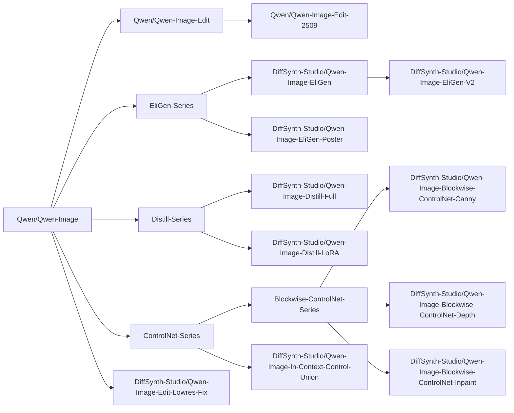

# Qwen-Image


Qwen-Image 是由阿里巴巴通义实验室开源的图像生成模型。

<details>

<summary>模型血缘</summary>



</details>

## 快速开始

通过运行以下代码可以快速加载 [Qwen/Qwen-Image](https://www.modelscope.cn/models/Qwen/Qwen-Image) 模型并进行推理

```python
from diffsynth.pipelines.qwen_image import QwenImagePipeline, ModelConfig
from PIL import Image
import torch

pipe = QwenImagePipeline.from_pretrained(
    torch_dtype=torch.bfloat16,
    device="cuda",
    model_configs=[
        ModelConfig(model_id="Qwen/Qwen-Image", origin_file_pattern="transformer/diffusion_pytorch_model*.safetensors"),
        ModelConfig(model_id="Qwen/Qwen-Image", origin_file_pattern="text_encoder/model*.safetensors"),
        ModelConfig(model_id="Qwen/Qwen-Image", origin_file_pattern="vae/diffusion_pytorch_model.safetensors"),
    ],
    tokenizer_config=ModelConfig(model_id="Qwen/Qwen-Image", origin_file_pattern="tokenizer/"),
)
prompt = "精致肖像，水下少女，蓝裙飘逸，发丝轻扬，光影透澈，气泡环绕，面容恬静，细节精致，梦幻唯美。"
image = pipe(
    prompt, seed=0, num_inference_steps=40,
    # edit_image=Image.open("xxx.jpg").resize((1328, 1328)) # For Qwen-Image-Edit
)
image.save("image.jpg")
```

## 模型总览

|模型 ID|推理|低显存推理|全量训练|全量训练后验证|LoRA 训练|LoRA 训练后验证|
|-|-|-|-|-|-|-|
|[Qwen/Qwen-Image](https://www.modelscope.cn/models/Qwen/Qwen-Image)|[code](/examples/qwen_image/model_inference/Qwen-Image.py)|[code](/examples/qwen_image/model_inference_low_vram/Qwen-Image.py)|[code](/examples/qwen_image/model_training/full/Qwen-Image.sh)|[code](/examples/qwen_image/model_training/validate_full/Qwen-Image.py)|[code](/examples/qwen_image/model_training/lora/Qwen-Image.sh)|[code](/examples/qwen_image/model_training/validate_lora/Qwen-Image.py)|
|[Qwen/Qwen-Image-Edit](https://www.modelscope.cn/models/Qwen/Qwen-Image-Edit)|[code](/examples/qwen_image/model_inference/Qwen-Image-Edit.py)|[code](/examples/qwen_image/model_inference_low_vram/Qwen-Image-Edit.py)|[code](/examples/qwen_image/model_training/full/Qwen-Image-Edit.sh)|[code](/examples/qwen_image/model_training/validate_full/Qwen-Image-Edit.py)|[code](/examples/qwen_image/model_training/lora/Qwen-Image-Edit.sh)|[code](/examples/qwen_image/model_training/validate_lora/Qwen-Image-Edit.py)|
|[Qwen/Qwen-Image-Edit-2509](https://www.modelscope.cn/models/Qwen/Qwen-Image-Edit-2509)|[code](/examples/qwen_image/model_inference/Qwen-Image-Edit-2509.py)|[code](/examples/qwen_image/model_inference_low_vram/Qwen-Image-Edit-2509.py)|[code](/examples/qwen_image/model_training/full/Qwen-Image-Edit-2509.sh)|[code](/examples/qwen_image/model_training/validate_full/Qwen-Image-Edit-2509.py)|[code](/examples/qwen_image/model_training/lora/Qwen-Image-Edit-2509.sh)|[code](/examples/qwen_image/model_training/validate_lora/Qwen-Image-Edit-2509.py)|
|[DiffSynth-Studio/Qwen-Image-EliGen](https://www.modelscope.cn/models/DiffSynth-Studio/Qwen-Image-EliGen)|[code](/examples/qwen_image/model_inference/Qwen-Image-EliGen.py)|[code](/examples/qwen_image/model_inference_low_vram/Qwen-Image-EliGen.py)|-|-|[code](/examples/qwen_image/model_training/lora/Qwen-Image-EliGen.sh)|[code](/examples/qwen_image/model_training/validate_lora/Qwen-Image-EliGen.py)|
|[DiffSynth-Studio/Qwen-Image-EliGen-V2](https://www.modelscope.cn/models/DiffSynth-Studio/Qwen-Image-EliGen-V2)|[code](/examples/qwen_image/model_inference/Qwen-Image-EliGen-V2.py)|[code](/examples/qwen_image/model_inference_low_vram/Qwen-Image-EliGen-V2.py)|-|-|[code](/examples/qwen_image/model_training/lora/Qwen-Image-EliGen.sh)|[code](/examples/qwen_image/model_training/validate_lora/Qwen-Image-EliGen.py)|
|[DiffSynth-Studio/Qwen-Image-EliGen-Poster](https://www.modelscope.cn/models/DiffSynth-Studio/Qwen-Image-EliGen-Poster)|[code](/examples/qwen_image/model_inference/Qwen-Image-EliGen-Poster.py)|[code](/examples/qwen_image/model_inference_low_vram/Qwen-Image-EliGen-Poster.py)|-|-|[code](/examples/qwen_image/model_training/lora/Qwen-Image-EliGen-Poster.sh)|[code](/examples/qwen_image/model_training/validate_lora/Qwen-Image-EliGen-Poster.py)|
|[DiffSynth-Studio/Qwen-Image-Distill-Full](https://www.modelscope.cn/models/DiffSynth-Studio/Qwen-Image-Distill-Full)|[code](/examples/qwen_image/model_inference/Qwen-Image-Distill-Full.py)|[code](/examples/qwen_image/model_inference_low_vram/Qwen-Image-Distill-Full.py)|[code](/examples/qwen_image/model_training/full/Qwen-Image-Distill-Full.sh)|[code](/examples/qwen_image/model_training/validate_full/Qwen-Image-Distill-Full.py)|[code](/examples/qwen_image/model_training/lora/Qwen-Image-Distill-Full.sh)|[code](/examples/qwen_image/model_training/validate_lora/Qwen-Image-Distill-Full.py)|
|[DiffSynth-Studio/Qwen-Image-Distill-LoRA](https://www.modelscope.cn/models/DiffSynth-Studio/Qwen-Image-Distill-LoRA)|[code](/examples/qwen_image/model_inference/Qwen-Image-Distill-LoRA.py)|[code](/examples/qwen_image/model_inference_low_vram/Qwen-Image-Distill-LoRA.py)|-|-|[code](/examples/qwen_image/model_training/lora/Qwen-Image-Distill-LoRA.sh)|[code](/examples/qwen_image/model_training/validate_lora/Qwen-Image-Distill-LoRA.py)|
|[DiffSynth-Studio/Qwen-Image-Blockwise-ControlNet-Canny](https://modelscope.cn/models/DiffSynth-Studio/Qwen-Image-Blockwise-ControlNet-Canny)|[code](/examples/qwen_image/model_inference/Qwen-Image-Blockwise-ControlNet-Canny.py)|[code](/examples/qwen_image/model_inference_low_vram/Qwen-Image-Blockwise-ControlNet-Canny.py)|[code](/examples/qwen_image/model_training/full/Qwen-Image-Blockwise-ControlNet-Canny.sh)|[code](/examples/qwen_image/model_training/validate_full/Qwen-Image-Blockwise-ControlNet-Canny.py)|[code](/examples/qwen_image/model_training/lora/Qwen-Image-Blockwise-ControlNet-Canny.sh)|[code](/examples/qwen_image/model_training/validate_lora/Qwen-Image-Blockwise-ControlNet-Canny.py)|
|[DiffSynth-Studio/Qwen-Image-Blockwise-ControlNet-Depth](https://modelscope.cn/models/DiffSynth-Studio/Qwen-Image-Blockwise-ControlNet-Depth)|[code](/examples/qwen_image/model_inference/Qwen-Image-Blockwise-ControlNet-Depth.py)|[code](/examples/qwen_image/model_inference_low_vram/Qwen-Image-Blockwise-ControlNet-Depth.py)|[code](/examples/qwen_image/model_training/full/Qwen-Image-Blockwise-ControlNet-Depth.sh)|[code](/examples/qwen_image/model_training/validate_full/Qwen-Image-Blockwise-ControlNet-Depth.py)|[code](/examples/qwen_image/model_training/lora/Qwen-Image-Blockwise-ControlNet-Depth.sh)|[code](/examples/qwen_image/model_training/validate_lora/Qwen-Image-Blockwise-ControlNet-Depth.py)|
|[DiffSynth-Studio/Qwen-Image-Blockwise-ControlNet-Inpaint](https://modelscope.cn/models/DiffSynth-Studio/Qwen-Image-Blockwise-ControlNet-Inpaint)|[code](/examples/qwen_image/model_inference/Qwen-Image-Blockwise-ControlNet-Inpaint.py)|[code](/examples/qwen_image/model_inference_low_vram/Qwen-Image-Blockwise-ControlNet-Inpaint.py)|[code](/examples/qwen_image/model_training/full/Qwen-Image-Blockwise-ControlNet-Inpaint.sh)|[code](/examples/qwen_image/model_training/validate_full/Qwen-Image-Blockwise-ControlNet-Inpaint.py)|[code](/examples/qwen_image/model_training/lora/Qwen-Image-Blockwise-ControlNet-Inpaint.sh)|[code](/examples/qwen_image/model_training/validate_lora/Qwen-Image-Blockwise-ControlNet-Inpaint.py)|
|[DiffSynth-Studio/Qwen-Image-In-Context-Control-Union](https://www.modelscope.cn/models/DiffSynth-Studio/Qwen-Image-In-Context-Control-Union)|[code](/examples/qwen_image/model_inference/Qwen-Image-In-Context-Control-Union.py)|[code](/examples/qwen_image/model_inference_low_vram/Qwen-Image-In-Context-Control-Union.py)|-|-|[code](/examples/qwen_image/model_training/lora/Qwen-Image-In-Context-Control-Union.sh)|[code](/examples/qwen_image/model_training/validate_lora/Qwen-Image-In-Context-Control-Union.py)|
|[DiffSynth-Studio/Qwen-Image-Edit-Lowres-Fix](https://www.modelscope.cn/models/DiffSynth-Studio/Qwen-Image-Edit-Lowres-Fix)|[code](/examples/qwen_image/model_inference/Qwen-Image-Edit-Lowres-Fix.py)|[code](/examples/qwen_image/model_inference_low_vram/Qwen-Image-Edit-Lowres-Fix.py)|-|-|-|-|

## 模型推理

模型通过 `QwenImagePipeline.from_pretrained` 加载，详见[加载模型](/docs/Pipeline_Usage/Model_Inference.md#加载模型)。

`QwenImagePipeline` 推理的输入参数包括：

* `prompt`: 提示词，描述画面中出现的内容。
* `negative_prompt`: 负向提示词，描述画面中不应该出现的内容，默认值为 `""`。
* `cfg_scale`: Classifier-free guidance 的参数，默认值为 4，当设置为 1 时不再生效。
* `input_image`: 输入图像，用于图生图，该参数与 `denoising_strength` 配合使用。
* `denoising_strength`: 去噪强度，范围是 0～1，默认值为 1，当数值接近 0 时，生成图像与输入图像相似；当数值接近 1 时，生成图像与输入图像相差更大。在不输入 `input_image` 参数时，请不要将其设置为非 1 的数值。
* `inpaint_mask`: 图像局部重绘的遮罩图像。
* `inpaint_blur_size`: 图像局部重绘的边缘柔化宽度。
* `inpaint_blur_sigma`: 图像局部重绘的边缘柔化强度。
* `height`: 图像高度，需保证高度为 16 的倍数。
* `width`: 图像宽度，需保证宽度为 16 的倍数。
* `seed`: 随机种子。默认为 `None`，即完全随机。
* `rand_device`: 生成随机高斯噪声矩阵的计算设备，默认为 `"cpu"`。当设置为 `cuda` 时，在不同 GPU 上会导致不同的生成结果。
* `num_inference_steps`: 推理次数，默认值为 30。
* `exponential_shift_mu`: 在采样时间步时采用的固定参数，留空则根据图像宽高进行采样。
* `blockwise_controlnet_inputs`: Blockwise ControlNet 模型的输入。
* `eligen_entity_prompts`: EliGen 分区控制的提示词。
* `eligen_entity_masks`: EliGen 分区控制的区域遮罩图像。
* `eligen_enable_on_negative`: 是否在 CFG 的负向一侧启用 EliGen 分区控制。
* `edit_image`: 编辑模型的待编辑图像，支持多张图像。
* `edit_image_auto_resize`: 是否自动缩放待编辑图像。
* `edit_rope_interpolation`: 是否在低分辨率编辑图像上启用 ROPE 插值。
* `context_image`: In-Context Control 的输入图像。
* `tiled`: 是否启用 VAE 分块推理，默认为 `False`。设置为 `True` 时可显著减少 VAE 编解码阶段的显存占用，会产生少许误差，以及少量推理时间延长。
* `tile_size`: VAE 编解码阶段的分块大小，默认为 128，仅在 `tiled=True` 时生效。
* `tile_stride`: VAE 编解码阶段的分块步长，默认为 64，仅在 `tiled=True` 时生效，需保证其数值小于或等于 `tile_size`。
* `progress_bar_cmd`: 进度条，默认为 `tqdm.tqdm`。可通过设置为 `lambda x:x` 来屏蔽进度条。

如果显存不足，请开启[显存管理](/docs/Pipeline_Usage/VRAM_management.md)。

## 模型训练

模型训练脚本位于 `examples/qwen_image/model_training/train.py`，脚本的输入参数包括[基础脚本参数](/docs/Pipeline_Usage/Model_Training.md#脚本参数)以及以下额外参数：

* `--tokenizer_path`: tokenizer 的路径，适用于文生图模型，留空则自动从远程下载。
* `--processor_path`: processor 的路径，适用于图像编辑模型，留空则自动从远程下载。

`--task` 参数支持 `sft`（[标准监督训练](/docs/Training/Supervised_Fine_Tuning.md)）与 `direct_distill`（[直接蒸馏](/docs/Training/Direct_Distill.md)），两者都支持[两阶段拆分训练](/docs/Training/Split_Training.md)和[FP8 精度](/docs/Training/FP8_Precision.md)。

使用命令 `modelscope download --dataset DiffSynth-Studio/example_image_dataset --local_dir ./data/example_image_dataset` 可下载样例数据集。我们为每个模型编写了推荐的训练命令，详见[模型总览](#模型总览)中的表格。详细的训练流程，请参考[模型训练](/docs/Pipeline_Usage/Model_Training.md)。
