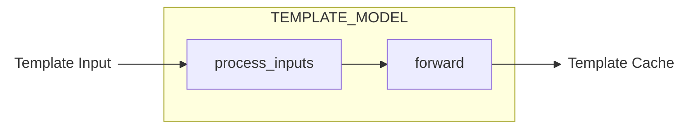
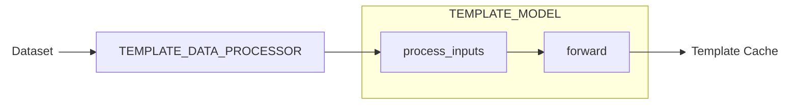

# Template Model Training

DiffSynth-Studio currently provides comprehensive Template training support for [black-forest-labs/FLUX.2-klein-base-4B](https://www.modelscope.cn/models/black-forest-labs/FLUX.2-klein-base-4B), with more model adaptations coming soon.

## Continuing Training from Pretrained Models

To continue training from our pretrained models, refer to the table in [FLUX.2](../Model_Details/FLUX2.md#model-overview) to find the corresponding training script.

## Building New Template Models

### Template Model Component Format

A Template model binds to a model repository (or local folder) containing a code file `model.py` as the entry point. Here's the template for `model.py`:

```python
import torch

class CustomizedTemplateModel(torch.nn.Module):
    def __init__(self):
        super().__init__()

    @torch.no_grad()
    def process_inputs(self, xxx, **kwargs):
        yyy = xxx
        return {"yyy": yyy}

    def forward(self, yyy, **kwargs):
        zzz = yyy
        return {"zzz": zzz}

class DataProcessor:
    def __call__(self, www, **kwargs):
        xxx = www
        return {"xxx": xxx}

TEMPLATE_MODEL = CustomizedTemplateModel
TEMPLATE_MODEL_PATH = "model.safetensors"
TEMPLATE_DATA_PROCESSOR = DataProcessor
```

During Template model inference, Template Input passes through `TEMPLATE_MODEL`'s `process_inputs` and `forward` to generate Template Cache.



During Template model training, Template Input comes from the dataset through `TEMPLATE_DATA_PROCESSOR`.



#### `TEMPLATE_MODEL`

`TEMPLATE_MODEL` implements the Template model logic, inheriting from `torch.nn.Module` with required `process_inputs` and `forward` methods. These two methods form the complete Template model inference process, split into two stages to better support [two-stage split training](https://diffsynth-studio-doc.readthedocs.io/en/latest/Training/Split_Training.html).

* `process_inputs` must use `@torch.no_grad()` for gradient-free computation
* `forward` must contain all gradient computations required for training

Both methods should accept `**kwargs` for compatibility. Reserved parameters include:

* To interact with the base model Pipeline (e.g., call text encoder), add `pipe` parameter to method inputs
* To enable Gradient Checkpointing, add `use_gradient_checkpointing` and `use_gradient_checkpointing_offload` to `forward` inputs
* Multiple Template models use `model_id` to distinguish Template Inputs - do not use this field in method parameters

#### `TEMPLATE_MODEL_PATH` (Optional)

`TEMPLATE_MODEL_PATH` specifies the relative path to pretrained weights. For example:

```python
TEMPLATE_MODEL_PATH = "model.safetensors"
```

For multi-file models:

```python
TEMPLATE_MODEL_PATH = [
    "model-00001-of-00003.safetensors",
    "model-00002-of-00003.safetensors",
    "model-00003-of-00003.safetensors",
]
```

Set to `None` for random initialization:

```python
TEMPLATE_MODEL_PATH = None
```

#### `TEMPLATE_DATA_PROCESSOR` (Optional)

To train Template models with DiffSynth-Studio, datasets should contain `template_inputs` fields in `metadata.json`. These fields pass through `TEMPLATE_DATA_PROCESSOR` to generate inputs for Template model methods.

For example, the brightness control model [DiffSynth-Studio/F2KB4B-Template-Brightness](https://modelscope.cn/models/DiffSynth-Studio/F2KB4B-Template-Brightness) takes `scale` as input:

```json
[
    {
        "image": "images/image_1.jpg",
        "prompt": "a cat",
        "template_inputs": {"scale": 0.2}
    },
    {
        "image": "images/image_2.jpg",
        "prompt": "a dog",
        "template_inputs": {"scale": 0.6}
    }
]
```

```python
class DataProcessor:
    def __call__(self, scale, **kwargs):
        return {"scale": scale}

TEMPLATE_DATA_PROCESSOR = DataProcessor
```

Or calculate scale from image paths:

```json
[
    {
        "image": "images/image_1.jpg",
        "prompt": "a cat",
        "template_inputs": {"image": "/path/to/your/dataset/images/image_1.jpg"}
    }
]
```

```python
class DataProcessor:
    def __call__(self, image, **kwargs):
        image = Image.open(image)
        image = np.array(image)
        return {"scale": image.astype(np.float32).mean() / 255}

TEMPLATE_DATA_PROCESSOR = DataProcessor
```

### Training Template Models

A Template model is "trainable" if its Template Cache variables are fully decoupled from the base model Pipeline - these variables should reach `model_fn` without participating in any Pipeline Unit calculations.

For training with [black-forest-labs/FLUX.2-klein-base-4B](https://www.modelscope.cn/models/black-forest-labs/FLUX.2-klein-base-4B), use these training script parameters:

* `--extra_inputs`: Additional inputs. Use `template_inputs` for text-to-image models, `edit_image,template_inputs` for image editing models
* `--template_model_id_or_path`: Template model ID or local path (use `:` suffix for ModelScope IDs, e.g., `"DiffSynth-Studio/Template-KleinBase4B-Brightness:"`)
* `--remove_prefix_in_ckpt`: State dict prefix to remove when saving models (use `"pipe.template_model."`)
* `--trainable_models`: Trainable components (use `"template_model"` for full model, or `"template_model.xxx,template_model.yyy"` for specific components)

Example training script:

```shell
accelerate launch examples/flux2/model_training/train.py \
  --dataset_base_path data/diffsynth_example_dataset/flux2/Template-KleinBase4B-Brightness \
  --dataset_metadata_path data/diffsynth_example_dataset/flux2/Template-KleinBase4B-Brightness/metadata.jsonl \
  --extra_inputs "template_inputs" \
  --max_pixels 1048576 \
  --dataset_repeat 50 \
  --model_id_with_origin_paths "black-forest-labs/FLUX.2-klein-4B:text_encoder/*.safetensors,black-forest-labs/FLUX.2-klein-base-4B:transformer/*.safetensors,black-forest-labs/FLUX.2-klein-4B:vae/diffusion_pytorch_model.safetensors" \
  --template_model_id_or_path "examples/flux2/model_training/scripts/brightness" \
  --tokenizer_path "black-forest-labs/FLUX.2-klein-4B:tokenizer/" \
  --learning_rate 1e-4 \
  --num_epochs 2 \
  --remove_prefix_in_ckpt "pipe.template_model." \
  --output_path "./models/train/Template-KleinBase4B-Brightness_example" \
  --trainable_models "template_model" \
  --use_gradient_checkpointing \
  --find_unused_parameters
```

### Interacting with Base Model Pipeline Components

Template models can interact with base model Pipelines. For example, using the text encoder:

```python
class CustomizedTemplateModel(torch.nn.Module):
    def __init__(self):
        super().__init__()
        self.xxx = xxx()

    @torch.no_grad()
    def process_inputs(self, text, pipe, **kwargs):
        input_ids = pipe.tokenizer(text)
        text_emb = pipe.text_encoder(input_ids)
        return {"text_emb": text_emb}

    def forward(self, text_emb, pipe, **kwargs):
        kv_cache = self.xxx(text_emb)
        return {"kv_cache": kv_cache}

TEMPLATE_MODEL = CustomizedTemplateModel
```

### Using Non-Trainable Components

For models with pretrained components:

```python
class CustomizedTemplateModel(torch.nn.Module):
    def __init__(self):
        super().__init__()
        self.image_encoder = XXXEncoder.from_pretrained(xxx)
        self.mlp = MLP()

    @torch.no_grad()
    def process_inputs(self, image, **kwargs):
        emb = self.image_encoder(image)
        return {"emb": emb}

    def forward(self, emb, **kwargs):
        kv_cache = self.mlp(emb)
        return {"kv_cache": kv_cache}

TEMPLATE_MODEL = CustomizedTemplateModel
```

Set `--trainable_models template_model.mlp` to train only the MLP component.

### Training on Low VRAM Devices

The framework supports splitting Template model training into two stages: the first stage performs gradient-free computation, and the second stage performs gradient updates. For more information, refer to the documentation: [Two-stage Split Training](https://diffsynth-studio-doc.readthedocs.io/en/latest/Training/Split_Training.html). Here's a sample script:

```shell
modelscope download --dataset DiffSynth-Studio/diffsynth_example_dataset --include "flux2/Template-KleinBase4B-Brightness/*" --local_dir ./data/diffsynth_example_dataset

accelerate launch examples/flux2/model_training/train.py \
  --dataset_base_path data/diffsynth_example_dataset/flux2/Template-KleinBase4B-Brightness \
  --dataset_metadata_path data/diffsynth_example_dataset/flux2/Template-KleinBase4B-Brightness/metadata.jsonl \
  --extra_inputs "template_inputs" \
  --max_pixels 1048576 \
  --dataset_repeat 1 \
  --model_id_with_origin_paths "black-forest-labs/FLUX.2-klein-4B:text_encoder/*.safetensors,black-forest-labs/FLUX.2-klein-4B:vae/diffusion_pytorch_model.safetensors" \
  --template_model_id_or_path "DiffSynth-Studio/Template-KleinBase4B-Brightness:" \
  --tokenizer_path "black-forest-labs/FLUX.2-klein-4B:tokenizer/" \
  --learning_rate 1e-4 \
  --num_epochs 2 \
  --remove_prefix_in_ckpt "pipe.template_model." \
  --output_path "./models/train/Template-KleinBase4B-Brightness_full_cache" \
  --trainable_models "template_model" \
  --use_gradient_checkpointing \
  --find_unused_parameters \
  --task "sft:data_process"

accelerate launch examples/flux2/model_training/train.py \
  --dataset_base_path "./models/train/Template-KleinBase4B-Brightness_full_cache" \
  --extra_inputs "template_inputs" \
  --max_pixels 1048576 \
  --dataset_repeat 50 \
  --model_id_with_origin_paths "black-forest-labs/FLUX.2-klein-base-4B:transformer/*.safetensors" \
  --template_model_id_or_path "DiffSynth-Studio/Template-KleinBase4B-Brightness:" \
  --tokenizer_path "black-forest-labs/FLUX.2-klein-4B:tokenizer/" \
  --learning_rate 1e-4 \
  --num_epochs 2 \
  --remove_prefix_in_ckpt "pipe.template_model." \
  --output_path "./models/train/Template-KleinBase4B-Brightness_full" \
  --trainable_models "template_model" \
  --use_gradient_checkpointing \
  --find_unused_parameters \
  --task "sft:train"
```

Two-stage split training can reduce VRAM requirements and improve training speed. The training process is lossless in precision, but requires significant disk space for storing cache files.

To further reduce VRAM requirements, you can enable fp8 precision by adding the parameters `--fp8_models "black-forest-labs/FLUX.2-klein-4B:text_encoder/*.safetensors,black-forest-labs/FLUX.2-klein-4B:vae/diffusion_pytorch_model.safetensors"` and `--fp8_models "black-forest-labs/FLUX.2-klein-base-4B:transformer/*.safetensors"` to the two-stage training. Note that fp8 precision can only be enabled on non-trainable model components and introduces minor errors.

### Uploading Template Models

After training, follow these steps to upload Template models to ModelScope for wider distribution.

1. Set model path in `model.py`:
```python
TEMPLATE_MODEL_PATH = "model.safetensors"
```

2. Upload using ModelScope CLI:
```shell
modelscope upload user_name/your_model_id /path/to/your/model.py model.py --token ms-xxx
```

3. Package model files:
```python
from diffsynth.diffusion.template import load_template_model, load_state_dict
from safetensors.torch import save_file
import torch

model = load_template_model("path/to/your/template/model", torch_dtype=torch.bfloat16, device="cpu")
state_dict = load_state_dict("path/to/your/ckpt/epoch-1.safetensors", torch_dtype=torch.bfloat16, device="cpu")
state_dict.update(model.state_dict())
save_file(state_dict, "model.safetensors")
```

4. Upload model file:
```shell
modelscope upload user_name/your_model_id /path/to/your/model/epoch-1.safetensors model.safetensors --token ms-xxx
```

5. Verify inference:
```python
from diffsynth.diffusion.template import TemplatePipeline
from diffsynth.pipelines.flux2_image import Flux2ImagePipeline, ModelConfig
import torch

# Load base model
pipe = Flux2ImagePipeline.from_pretrained(
    torch_dtype=torch.bfloat16,
    device="cuda",
    model_configs=[
        ModelConfig(model_id="black-forest-labs/FLUX.2-klein-4B", origin_file_pattern="text_encoder/*.safetensors"),
        ModelConfig(model_id="black-forest-labs/FLUX.2-klein-base-4B", origin_file_pattern="transformer/*.safetensors"),
        ModelConfig(model_id="black-forest-labs/FLUX.2-klein-4B", origin_file_pattern="vae/diffusion_pytorch_model.safetensors"),
    ],
    tokenizer_config=ModelConfig(model_id="black-forest-labs/FLUX.2-klein-4B", origin_file_pattern="tokenizer/"),
)

# Load Template model
template_pipeline = TemplatePipeline.from_pretrained(
    torch_dtype=torch.bfloat16,
    device="cuda",
    model_configs=[
        ModelConfig(model_id="user_name/your_model_id")
    ],
)

# Generate image
image = template_pipeline(
    pipe,
    prompt="a cat",
    seed=0, cfg_scale=4,
    height=1024, width=1024,
    template_inputs=[{xxx}],
)
image.save("image.png")