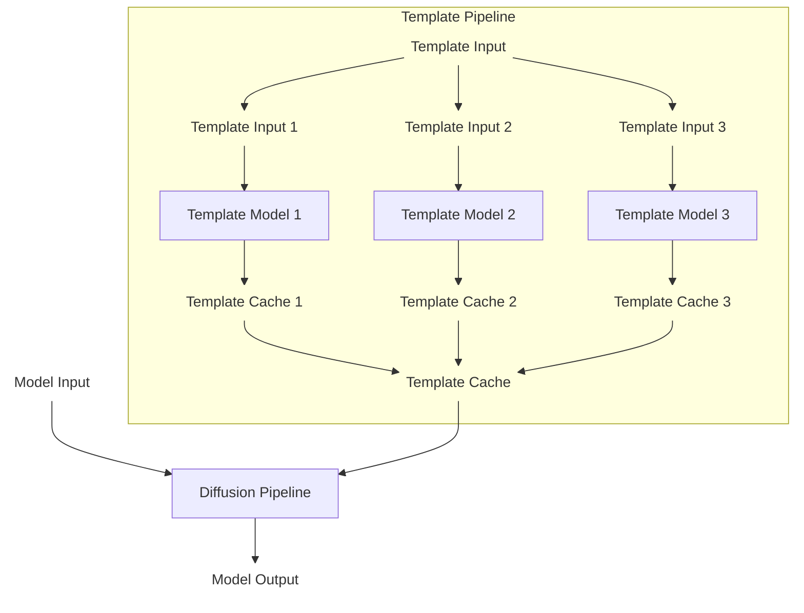

# Understanding Diffusion Templates

The Diffusion Templates framework is a controllable generation plugin framework in DiffSynth-Studio that provides additional controllable generation capabilities for Diffusion models.

## Framework Structure

The Diffusion Templates framework structure is shown below:



The framework contains these module designs:

* **Template Input**: Template model input. Format: Python dictionary with fields determined by each Template model (e.g., `{"scale": 0.8}`)
* **Template Model**: Template model, loadable from ModelScope (`ModelConfig(model_id="xxx/xxx")`) or local path (`ModelConfig(path="xxx")`)
* **Template Cache**: Template model output. Format: Python dictionary with fields matching base model Pipeline input parameters
* **Template Pipeline**: Module for managing multiple Template models. Handles model loading and cache integration

When the Diffusion Templates framework is disabled, base model components (Text Encoder, DiT, VAE) are loaded into the Diffusion Pipeline. Model Input (prompt, height, width) produces Model Output (e.g., images).

When enabled, Template models are loaded into the Template Pipeline. The Template Pipeline outputs Template Cache (a subset of Diffusion Pipeline input parameters) for subsequent processing in the Diffusion Pipeline. This enables controllable generation by intercepting part of the Diffusion Pipeline's input parameters.

## Model Capability Medium

Template Cache is defined as a subset of Diffusion Pipeline input parameters, ensuring framework generality. We restrict Template model inputs to only be Diffusion Pipeline parameters. The KV-Cache is particularly suitable as a Diffusion medium:

* Proven effective in LLM Skills (prompts are converted to KV-Cache)
* Has "high permission" in Diffusion models - can directly control image generation
* Supports sequence-level concatenation for multiple Template models
* Requires minimal development (add pipeline parameter and integrate to model)

Other potential Template mediums:
* **Residual**: Used in ControlNet for point-to-point control, but has resolution limitations and potential conflicts when merging
* **LoRA**: Treated as input parameters rather than model components

**Currently, we only support KV-Cache and LoRA as Template Cache mediums in FLUX.2 Pipeline, with plans to support more models and mediums in the future.**

## Template Model Format

A Template model has this structure:

```
Template_Model
├── model.py
└── model.safetensors
```

Where `model.py` is the entry point and `model.safetensors` contains model weights. For implementation details, see [Template Model Training](Template_Model_Training.md) or [existing Template models](https://modelscope.cn/models/DiffSynth-Studio/Template-KleinBase4B-Brightness).