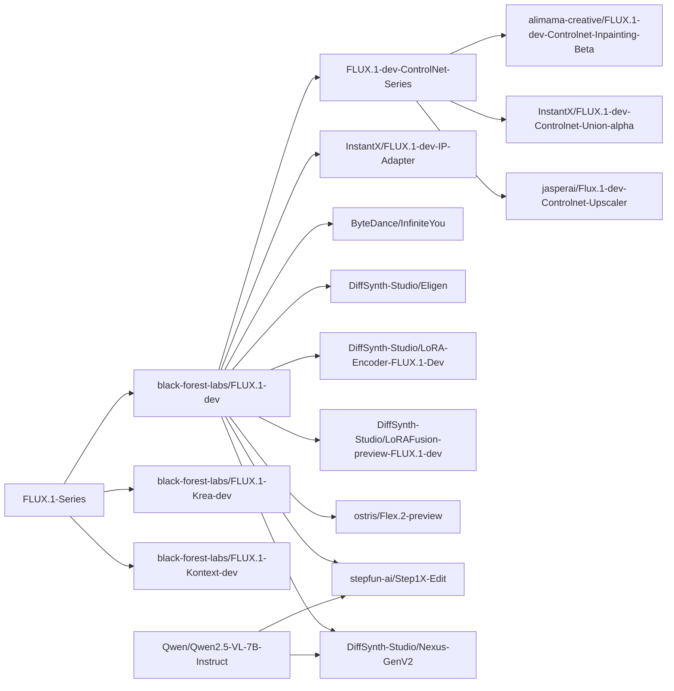

# FLUX


FLUX is an image generation model series developed and open-sourced by Black Forest Labs.

## Installation

Before using this project for model inference and training, please install DiffSynth-Studio first.

```shell
git clone https://github.com/modelscope/DiffSynth-Studio.git
cd DiffSynth-Studio
pip install -e .
```

For more information about installation, please refer to [Install Dependencies](/docs/en/Pipeline_Usage/Setup.md).

## Quick Start

Run the following code to quickly load the [black-forest-labs/FLUX.1-dev](https://www.modelscope.cn/models/black-forest-labs/FLUX.1-dev) model and perform inference. VRAM management is enabled, and the framework will automatically control model parameter loading based on remaining VRAM. Minimum 8GB VRAM is required to run.

```python
import torch
from diffsynth.pipelines.flux_image import FluxImagePipeline, ModelConfig

vram_config = {
    "offload_dtype": torch.float8_e4m3fn,
    "offload_device": "cpu",
    "onload_dtype": torch.float8_e4m3fn,
    "onload_device": "cpu",
    "preparing_dtype": torch.float8_e4m3fn,
    "preparing_device": "cuda",
    "computation_dtype": torch.bfloat16,
    "computation_device": "cuda",
}
pipe = FluxImagePipeline.from_pretrained(
    torch_dtype=torch.bfloat16,
    device="cuda",
    model_configs=[
        ModelConfig(model_id="black-forest-labs/FLUX.1-dev", origin_file_pattern="flux1-dev.safetensors", **vram_config),
        ModelConfig(model_id="black-forest-labs/FLUX.1-dev", origin_file_pattern="text_encoder/model.safetensors", **vram_config),
        ModelConfig(model_id="black-forest-labs/FLUX.1-dev", origin_file_pattern="text_encoder_2/*.safetensors", **vram_config),
        ModelConfig(model_id="black-forest-labs/FLUX.1-dev", origin_file_pattern="ae.safetensors", **vram_config),
    ],
    vram_limit=torch.cuda.mem_get_info("cuda")[1] / (1024 ** 3) - 1,
)
prompt = "CG, masterpiece, best quality, solo, long hair, wavy hair, silver hair, blue eyes, blue dress, medium breasts, dress, underwater, air bubble, floating hair, refraction, portrait. The girl's flowing silver hair shimmers with every color of the rainbow and cascades down, merging with the floating flora around her."
image = pipe(prompt=prompt, seed=0)
image.save("image.jpg")
```

## Model Overview

<details>

<summary>Model Lineage</summary>



</details>

| Model ID | Extra Parameters | Inference | Low VRAM Inference | Full Training | Validation After Full Training | LoRA Training | Validation After LoRA Training |
| - | - | - | - | - | - | - | - |
| [black-forest-labs/FLUX.1-dev](https://www.modelscope.cn/models/black-forest-labs/FLUX.1-dev) | | [code](/examples/flux/model_inference/FLUX.1-dev.py) | [code](/examples/flux/model_inference_low_vram/FLUX.1-dev.py) | [code](/examples/flux/model_training/full/FLUX.1-dev.sh) | [code](/examples/flux/model_training/validate_full/FLUX.1-dev.py) | [code](/examples/flux/model_training/lora/FLUX.1-dev.sh) | [code](/examples/flux/model_training/validate_lora/FLUX.1-dev.py) |
| [black-forest-labs/FLUX.1-Krea-dev](https://www.modelscope.cn/models/black-forest-labs/FLUX.1-Krea-dev) | | [code](/examples/flux/model_inference/FLUX.1-Krea-dev.py) | [code](/examples/flux/model_inference_low_vram/FLUX.1-Krea-dev.py) | [code](/examples/flux/model_training/full/FLUX.1-Krea-dev.sh) | [code](/examples/flux/model_training/validate_full/FLUX.1-Krea-dev.py) | [code](/examples/flux/model_training/lora/FLUX.1-Krea-dev.sh) | [code](/examples/flux/model_training/validate_lora/FLUX.1-Krea-dev.py) |
| [black-forest-labs/FLUX.1-Kontext-dev](https://www.modelscope.cn/models/black-forest-labs/FLUX.1-Kontext-dev) | `kontext_images` | [code](/examples/flux/model_inference/FLUX.1-Kontext-dev.py) | [code](/examples/flux/model_inference_low_vram/FLUX.1-Kontext-dev.py) | [code](/examples/flux/model_training/full/FLUX.1-Kontext-dev.sh) | [code](/examples/flux/model_training/validate_full/FLUX.1-Kontext-dev.py) | [code](/examples/flux/model_training/lora/FLUX.1-Kontext-dev.sh) | [code](/examples/flux/model_training/validate_lora/FLUX.1-Kontext-dev.py) |
| [alimama-creative/FLUX.1-dev-Controlnet-Inpainting-Beta](https://www.modelscope.cn/models/alimama-creative/FLUX.1-dev-Controlnet-Inpainting-Beta) | `controlnet_inputs` | [code](/examples/flux/model_inference/FLUX.1-dev-Controlnet-Inpainting-Beta.py) | [code](/examples/flux/model_inference_low_vram/FLUX.1-dev-Controlnet-Inpainting-Beta.py) | [code](/examples/flux/model_training/full/FLUX.1-dev-Controlnet-Inpainting-Beta.sh) | [code](/examples/flux/model_training/validate_full/FLUX.1-dev-Controlnet-Inpainting-Beta.py) | [code](/examples/flux/model_training/lora/FLUX.1-dev-Controlnet-Inpainting-Beta.sh) | [code](/examples/flux/model_training/validate_lora/FLUX.1-dev-Controlnet-Inpainting-Beta.py) |
| [InstantX/FLUX.1-dev-Controlnet-Union-alpha](https://www.modelscope.cn/models/InstantX/FLUX.1-dev-Controlnet-Union-alpha) | `controlnet_inputs` | [code](/examples/flux/model_inference/FLUX.1-dev-Controlnet-Union-alpha.py) | [code](/examples/flux/model_inference_low_vram/FLUX.1-dev-Controlnet-Union-alpha.py) | [code](/examples/flux/model_training/full/FLUX.1-dev-Controlnet-Union-alpha.sh) | [code](/examples/flux/model_training/validate_full/FLUX.1-dev-Controlnet-Union-alpha.py) | [code](/examples/flux/model_training/lora/FLUX.1-dev-Controlnet-Union-alpha.sh) | [code](/examples/flux/model_training/validate_lora/FLUX.1-dev-Controlnet-Union-alpha.py) |
| [jasperai/Flux.1-dev-Controlnet-Upscaler](https://www.modelscope.cn/models/jasperai/Flux.1-dev-Controlnet-Upscaler) | `controlnet_inputs` | [code](/examples/flux/model_inference/FLUX.1-dev-Controlnet-Upscaler.py) | [code](/examples/flux/model_inference_low_vram/FLUX.1-dev-Controlnet-Upscaler.py) | [code](/examples/flux/model_training/full/FLUX.1-dev-Controlnet-Upscaler.sh) | [code](/examples/flux/model_training/validate_full/FLUX.1-dev-Controlnet-Upscaler.py) | [code](/examples/flux/model_training/lora/FLUX.1-dev-Controlnet-Upscaler.sh) | [code](/examples/flux/model_training/validate_lora/FLUX.1-dev-Controlnet-Upscaler.py) |
| [InstantX/FLUX.1-dev-IP-Adapter](https://www.modelscope.cn/models/InstantX/FLUX.1-dev-IP-Adapter) | `ipadapter_images`, `ipadapter_scale` | [code](/examples/flux/model_inference/FLUX.1-dev-IP-Adapter.py) | [code](/examples/flux/model_inference_low_vram/FLUX.1-dev-IP-Adapter.py) | [code](/examples/flux/model_training/full/FLUX.1-dev-IP-Adapter.sh) | [code](/examples/flux/model_training/validate_full/FLUX.1-dev-IP-Adapter.py) | [code](/examples/flux/model_training/lora/FLUX.1-dev-IP-Adapter.sh) | [code](/examples/flux/model_training/validate_lora/FLUX.1-dev-IP-Adapter.py) |
| [ByteDance/InfiniteYou](https://www.modelscope.cn/models/ByteDance/InfiniteYou) | `infinityou_id_image`, `infinityou_guidance`, `controlnet_inputs` | [code](/examples/flux/model_inference/FLUX.1-dev-InfiniteYou.py) | [code](/examples/flux/model_inference_low_vram/FLUX.1-dev-InfiniteYou.py) | [code](/examples/flux/model_training/full/FLUX.1-dev-InfiniteYou.sh) | [code](/examples/flux/model_training/validate_full/FLUX.1-dev-InfiniteYou.py) | [code](/examples/flux/model_training/lora/FLUX.1-dev-InfiniteYou.sh) | [code](/examples/flux/model_training/validate_lora/FLUX.1-dev-InfiniteYou.py) |
| [DiffSynth-Studio/Eligen](https://www.modelscope.cn/models/DiffSynth-Studio/Eligen) | `eligen_entity_prompts`, `eligen_entity_masks`, `eligen_enable_on_negative`, `eligen_enable_inpaint` | [code](/examples/flux/model_inference/FLUX.1-dev-EliGen.py) | [code](/examples/flux/model_inference_low_vram/FLUX.1-dev-EliGen.py) | - | - | [code](/examples/flux/model_training/lora/FLUX.1-dev-EliGen.sh) | [code](/examples/flux/model_training/validate_lora/FLUX.1-dev-EliGen.py) |
| [DiffSynth-Studio/LoRA-Encoder-FLUX.1-Dev](https://www.modelscope.cn/models/DiffSynth-Studio/LoRA-Encoder-FLUX.1-Dev) | `lora_encoder_inputs`, `lora_encoder_scale` | [code](/examples/flux/model_inference/FLUX.1-dev-LoRA-Encoder.py) | [code](/examples/flux/model_inference_low_vram/FLUX.1-dev-LoRA-Encoder.py) | [code](/examples/flux/model_training/full/FLUX.1-dev-LoRA-Encoder.sh) | [code](/examples/flux/model_training/validate_full/FLUX.1-dev-LoRA-Encoder.py) | - | - |
| [DiffSynth-Studio/LoRAFusion-preview-FLUX.1-dev](https://modelscope.cn/models/DiffSynth-Studio/LoRAFusion-preview-FLUX.1-dev) | | [code](/examples/flux/model_inference/FLUX.1-dev-LoRA-Fusion.py) | - | - | - | - | - |
| [stepfun-ai/Step1X-Edit](https://www.modelscope.cn/models/stepfun-ai/Step1X-Edit) | `step1x_reference_image` | [code](/examples/flux/model_inference/Step1X-Edit.py) | [code](/examples/flux/model_inference_low_vram/Step1X-Edit.py) | [code](/examples/flux/model_training/full/Step1X-Edit.sh) | [code](/examples/flux/model_training/validate_full/Step1X-Edit.py) | [code](/examples/flux/model_training/lora/Step1X-Edit.sh) | [code](/examples/flux/model_training/validate_lora/Step1X-Edit.py) |
| [ostris/Flex.2-preview](https://www.modelscope.cn/models/ostris/Flex.2-preview) | `flex_inpaint_image`, `flex_inpaint_mask`, `flex_control_image`, `flex_control_strength`, `flex_control_stop` | [code](/examples/flux/model_inference/FLEX.2-preview.py) | [code](/examples/flux/model_inference_low_vram/FLEX.2-preview.py) | [code](/examples/flux/model_training/full/FLEX.2-preview.sh) | [code](/examples/flux/model_training/validate_full/FLEX.2-preview.py) | [code](/examples/flux/model_training/lora/FLEX.2-preview.sh) | [code](/examples/flux/model_training/validate_lora/FLEX.2-preview.py) |
| [DiffSynth-Studio/Nexus-GenV2](https://www.modelscope.cn/models/DiffSynth-Studio/Nexus-GenV2) | `nexus_gen_reference_image` | [code](/examples/flux/model_inference/Nexus-Gen-Editing.py) | [code](/examples/flux/model_inference_low_vram/Nexus-Gen-Editing.py) | [code](/examples/flux/model_training/full/Nexus-Gen.sh) | [code](/examples/flux/model_training/validate_full/Nexus-Gen.py) | [code](/examples/flux/model_training/lora/Nexus-Gen.sh) | [code](/examples/flux/model_training/validate_lora/Nexus-Gen.py) |

Special Training Scripts:

* Differential LoRA Training: [doc](/docs/en/Training/Differential_LoRA.md), [code](/examples/flux/model_training/special/differential_training/)
* FP8 Precision Training: [doc](/docs/en/Training/FP8_Precision.md), [code](/examples/flux/model_training/special/fp8_training/)
* Two-stage Split Training: [doc](/docs/en/Training/Split_Training.md), [code](/examples/flux/model_training/special/split_training/)
* End-to-end Direct Distillation: [doc](/docs/en/Training/Direct_Distill.md), [code](/examples/flux/model_training/lora/FLUX.1-dev-Distill-LoRA.sh)

## Model Inference

Models are loaded via `FluxImagePipeline.from_pretrained`, see [Loading Models](/docs/en/Pipeline_Usage/Model_Inference.md#loading-models).

Input parameters for `FluxImagePipeline` inference include:

* `prompt`: Prompt describing the content appearing in the image.
* `negative_prompt`: Negative prompt describing content that should not appear in the image, default value is `""`.
* `cfg_scale`: Classifier-free guidance parameter, default value is 1. When set to a value greater than 1, CFG is enabled.
* `height`: Image height, must be a multiple of 16.
* `width`: Image width, must be a multiple of 16.
* `seed`: Random seed. Default is `None`, meaning completely random.
* `rand_device`: Computing device for generating random Gaussian noise matrix, default is `"cpu"`. When set to `cuda`, different GPUs will produce different generation results.
* `num_inference_steps`: Number of inference steps, default value is 30.
* `embedded_guidance`: Embedded guidance parameter, default value is 3.5.
* `t5_sequence_length`: Sequence length of the T5 text encoder, default is 512.
* `tiled`: Whether to enable VAE tiling inference, default is `False`. Setting to `True` can significantly reduce VRAM usage during VAE encoding/decoding stages, producing slight errors and slightly longer inference time.
* `tile_size`: Tile size during VAE encoding/decoding stages, default is 128, only effective when `tiled=True`.
* `tile_stride`: Tile stride during VAE encoding/decoding stages, default is 64, only effective when `tiled=True`, must be less than or equal to `tile_size`.
* `progress_bar_cmd`: Progress bar, default is `tqdm.tqdm`. Can be disabled by setting to `lambda x:x`.
* `controlnet_inputs`: ControlNet model inputs, type is `ControlNetInput` list.
* `ipadapter_images`: IP-Adapter model input image list.
* `ipadapter_scale`: Guidance strength of the IP-Adapter model.
* `infinityou_id_image`: InfiniteYou model input image.
* `infinityou_guidance`: Guidance strength of the InfiniteYou model.
* `kontext_images`: Kontext model input images.
* `eligen_entity_prompts`: EliGen partition control prompt list.
* `eligen_entity_masks`: EliGen partition control region mask image list.
* `eligen_enable_on_negative`: Whether to enable EliGen partition control on the negative side of CFG.
* `eligen_enable_inpaint`: Whether to enable EliGen partition control inpainting function.
* `lora_encoder_inputs`: LoRA encoder input image list.
* `lora_encoder_scale`: Guidance strength of the LoRA encoder.
* `step1x_reference_image`: Step1X model reference image.
* `flex_inpaint_image`: Flex model image to be inpainted.
* `flex_inpaint_mask`: Flex model inpainting mask.
* `flex_control_image`: Flex model control image.
* `flex_control_strength`: Flex model control strength.
* `flex_control_stop`: Flex model control stop timestep.
* `nexus_gen_reference_image`: Nexus-Gen model reference image.

If VRAM is insufficient, please enable [VRAM Management](/docs/en/Pipeline_Usage/VRAM_management.md). We provide recommended low VRAM configurations for each model in the example code, see the table in the "Model Overview" section above.

## Model Training

FLUX series models are uniformly trained through [`examples/flux/model_training/train.py`](/examples/flux/model_training/train.py), and the script parameters include:

* General Training Parameters
    * Dataset Basic Configuration
        * `--dataset_base_path`: Root directory of the dataset.
        * `--dataset_metadata_path`: Metadata file path of the dataset.
        * `--dataset_repeat`: Number of times the dataset is repeated in each epoch.
        * `--dataset_num_workers`: Number of processes for each DataLoader.
        * `--data_file_keys`: Field names to be loaded from metadata, usually image or video file paths, separated by `,`.
    * Model Loading Configuration
        * `--model_paths`: Paths of models to be loaded. JSON format.
        * `--model_id_with_origin_paths`: Model IDs with original paths, e.g., `"black-forest-labs/FLUX.1-dev:flux1-dev.safetensors"`. Separated by commas.
        * `--extra_inputs`: Extra input parameters required by the model Pipeline, e.g., `controlnet_inputs` when training ControlNet models, separated by `,`.
        * `--fp8_models`: Models loaded in FP8 format, consistent with `--model_paths` or `--model_id_with_origin_paths` format. Currently only supports models whose parameters are not updated by gradients (no gradient backpropagation, or gradients only update their LoRA).
    * Training Basic Configuration
        * `--learning_rate`: Learning rate.
        * `--num_epochs`: Number of epochs.
        * `--trainable_models`: Trainable models, e.g., `dit`, `vae`, `text_encoder`.
        * `--find_unused_parameters`: Whether there are unused parameters in DDP training. Some models contain redundant parameters that do not participate in gradient calculation, and this setting needs to be enabled to avoid errors in multi-GPU training.
        * `--weight_decay`: Weight decay size, see [torch.optim.AdamW](https://docs.pytorch.org/docs/stable/generated/torch.optim.AdamW.html).
        * `--task`: Training task, default is `sft`. Some models support more training modes, please refer to the documentation of each specific model.
    * Output Configuration
        * `--output_path`: Model saving path.
        * `--remove_prefix_in_ckpt`: Remove prefix in the state dict of the model file.
        * `--save_steps`: Interval of training steps to save the model. If this parameter is left blank, the model is saved once per epoch.
    * LoRA Configuration
        * `--lora_base_model`: Which model to add LoRA to.
        * `--lora_target_modules`: Which layers to add LoRA to.
        * `--lora_rank`: Rank of LoRA.
        * `--lora_checkpoint`: Path of the LoRA checkpoint. If this path is provided, LoRA will be loaded from this checkpoint.
        * `--preset_lora_path`: Preset LoRA checkpoint path. If this path is provided, this LoRA will be loaded in the form of being merged into the base model. This parameter is used for LoRA differential training.
        * `--preset_lora_model`: Model that the preset LoRA is merged into, e.g., `dit`.
    * Gradient Configuration
        * `--use_gradient_checkpointing`: Whether to enable gradient checkpointing.
        * `--use_gradient_checkpointing_offload`: Whether to offload gradient checkpointing to memory.
        * `--gradient_accumulation_steps`: Number of gradient accumulation steps.
    * Image Width/Height Configuration (Applicable to Image Generation and Video Generation Models)
        * `--height`: Height of image or video. Leave `height` and `width` blank to enable dynamic resolution.
        * `--width`: Width of image or video. Leave `height` and `width` blank to enable dynamic resolution.
        * `--max_pixels`: Maximum pixel area of image or video frames. When dynamic resolution is enabled, images with resolution larger than this value will be downscaled, and images with resolution smaller than this value will remain unchanged.
* FLUX Specific Parameters
    * `--tokenizer_1_path`: Path of the CLIP tokenizer, leave blank to automatically download from remote.
    * `--tokenizer_2_path`: Path of the T5 tokenizer, leave blank to automatically download from remote.
    * `--align_to_opensource_format`: Whether to align LoRA format to open-source format, only applicable to DiT's LoRA.

We have built a sample image dataset for your testing. You can download this dataset with the following command:

```shell
modelscope download --dataset DiffSynth-Studio/example_image_dataset --local_dir ./data/example_image_dataset
```

We have written recommended training scripts for each model, please refer to the table in the "Model Overview" section above. For how to write model training scripts, please refer to [Model Training](/docs/en/Pipeline_Usage/Model_Training.md); for more advanced training algorithms, please refer to [Training Framework Detailed Explanation](/docs/Training/).