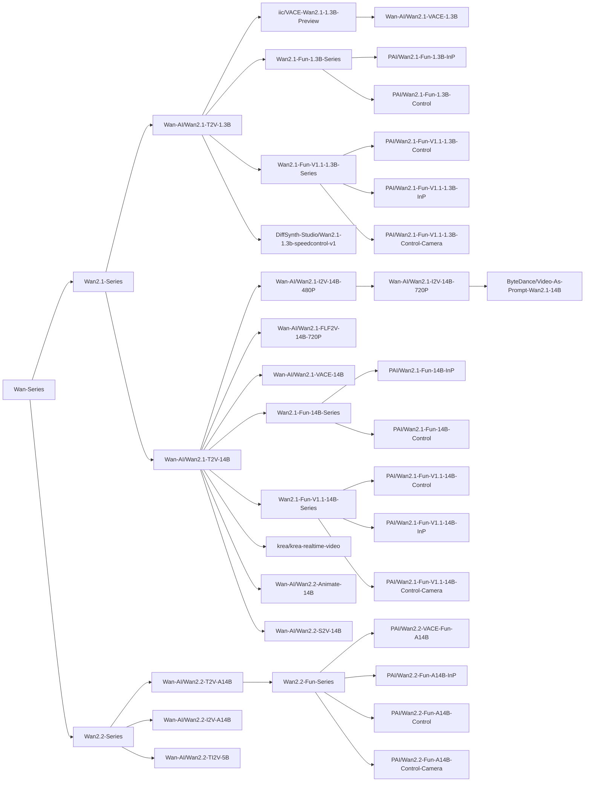

# Wan

https://github.com/user-attachments/assets/1d66ae74-3b02-40a9-acc3-ea95fc039314

Wan is a video generation model series developed by the Tongyi Wanxiang Team of Alibaba Tongyi Lab.

## Installation

Before using this project for model inference and training, please install DiffSynth-Studio first.

```shell
git clone https://github.com/modelscope/DiffSynth-Studio.git
cd DiffSynth-Studio
pip install -e .
```

For more information about installation, please refer to [Install Dependencies](/docs/en/Pipeline_Usage/Setup.md).

## Quick Start

Run the following code to quickly load the [Wan-AI/Wan2.1-T2V-1.3B](https://modelscope.cn/models/Wan-AI/Wan2.1-T2V-1.3B) model and perform inference. VRAM management is enabled, and the framework will automatically control model parameter loading based on remaining VRAM. Minimum 8GB VRAM is required to run.

```python
import torch
from diffsynth.utils.data import save_video, VideoData
from diffsynth.pipelines.wan_video import WanVideoPipeline, ModelConfig

vram_config = {
    "offload_dtype": "disk",
    "offload_device": "disk",
    "onload_dtype": torch.bfloat16,
    "onload_device": "cpu",
    "preparing_dtype": torch.bfloat16,
    "preparing_device": "cuda",
    "computation_dtype": torch.bfloat16,
    "computation_device": "cuda",
}
pipe = WanVideoPipeline.from_pretrained(
    torch_dtype=torch.bfloat16,
    device="cuda",
    model_configs=[
        ModelConfig(model_id="Wan-AI/Wan2.1-T2V-1.3B", origin_file_pattern="diffusion_pytorch_model*.safetensors", **vram_config),
        ModelConfig(model_id="Wan-AI/Wan2.1-T2V-1.3B", origin_file_pattern="models_t5_umt5-xxl-enc-bf16.pth", **vram_config),
        ModelConfig(model_id="Wan-AI/Wan2.1-T2V-1.3B", origin_file_pattern="Wan2.1_VAE.pth", **vram_config),
    ],
    tokenizer_config=ModelConfig(model_id="Wan-AI/Wan2.1-T2V-1.3B", origin_file_pattern="google/umt5-xxl/"),
    vram_limit=torch.cuda.mem_get_info("cuda")[1] / (1024 ** 3) - 2,
)

video = pipe(
    prompt="纪实摄影风格画面，一只活泼的小狗在绿茵茵的草地上迅速奔跑。小狗毛色棕黄，两只耳朵立起，神情专注而欢快。阳光洒在它身上，使得毛发看上去格外柔软而闪亮。背景是一片开阔的草地，偶尔点缀着几朵野花，远处隐约可见蓝天和几片白云。透视感鲜明，捕捉小狗奔跑时的动感和四周草地的生机。中景侧面移动视角。",
    negative_prompt="色调艳丽，过曝，静态，细节模糊不清，字幕，风格，作品，画作，画面，静止，整体发灰，最差质量，低质量，JPEG压缩残留，丑陋的，残缺的，多余的手指，画得不好的手部，画得不好的脸部，畸形的，毁容的，形态畸形的肢体，手指融合，静止不动的画面，杂乱的背景，三条腿，背景人很多，倒着走",
    seed=0, tiled=True,
)
save_video(video, "video.mp4", fps=15, quality=5)
```

## Model Overview

<details>

<summary>Model Lineage</summary>



</details>

| Model ID | Extra Parameters | Inference | Full Training | Validation After Full Training | LoRA Training | Validation After LoRA Training |
| - | - | - | - | - | - | - |
| [Wan-AI/Wan2.1-T2V-1.3B](https://modelscope.cn/models/Wan-AI/Wan2.1-T2V-1.3B) | | [code](/examples/wanvideo/model_inference/Wan2.1-T2V-1.3B.py) | [code](/examples/wanvideo/model_training/full/Wan2.1-T2V-1.3B.sh) | [code](/examples/wanvideo/model_training/validate_full/Wan2.1-T2V-1.3B.py) | [code](/examples/wanvideo/model_training/lora/Wan2.1-T2V-1.3B.sh) | [code](/examples/wanvideo/model_training/validate_lora/Wan2.1-T2V-1.3B.py) |
| [Wan-AI/Wan2.1-T2V-14B](https://modelscope.cn/models/Wan-AI/Wan2.1-T2V-14B) | | [code](/examples/wanvideo/model_inference/Wan2.1-T2V-14B.py) | [code](/examples/wanvideo/model_training/full/Wan2.1-T2V-14B.sh) | [code](/examples/wanvideo/model_training/validate_full/Wan2.1-T2V-14B.py) | [code](/examples/wanvideo/model_training/lora/Wan2.1-T2V-14B.sh) | [code](/examples/wanvideo/model_training/validate_lora/Wan2.1-T2V-14B.py) |
| [Wan-AI/Wan2.1-I2V-14B-480P](https://modelscope.cn/models/Wan-AI/Wan2.1-I2V-14B-480P) | `input_image` | [code](/examples/wanvideo/model_inference/Wan2.1-I2V-14B-480P.py) | [code](/examples/wanvideo/model_training/full/Wan2.1-I2V-14B-480P.sh) | [code](/examples/wanvideo/model_training/validate_full/Wan2.1-I2V-14B-480P.py) | [code](/examples/wanvideo/model_training/lora/Wan2.1-I2V-14B-480P.sh) | [code](/examples/wanvideo/model_training/validate_lora/Wan2.1-I2V-14B-480P.py) |
| [Wan-AI/Wan2.1-I2V-14B-720P](https://modelscope.cn/models/Wan-AI/Wan2.1-I2V-14B-720P) | `input_image` | [code](/examples/wanvideo/model_inference/Wan2.1-I2V-14B-720P.py) | [code](/examples/wanvideo/model_training/full/Wan2.1-I2V-14B-720P.sh) | [code](/examples/wanvideo/model_training/validate_full/Wan2.1-I2V-14B-720P.py) | [code](/examples/wanvideo/model_training/lora/Wan2.1-I2V-14B-720P.sh) | [code](/examples/wanvideo/model_training/validate_lora/Wan2.1-I2V-14B-720P.py) |
| [Wan-AI/Wan2.1-FLF2V-14B-720P](https://modelscope.cn/models/Wan-AI/Wan2.1-FLF2V-14B-720P) | `input_image`, `end_image` | [code](/examples/wanvideo/model_inference/Wan2.1-FLF2V-14B-720P.py) | [code](/examples/wanvideo/model_training/full/Wan2.1-FLF2V-14B-720P.sh) | [code](/examples/wanvideo/model_training/validate_full/Wan2.1-FLF2V-14B-720P.py) | [code](/examples/wanvideo/model_training/lora/Wan2.1-FLF2V-14B-720P.sh) | [code](/examples/wanvideo/model_training/validate_lora/Wan2.1-FLF2V-14B-720P.py) |
| [iic/VACE-Wan2.1-1.3B-Preview](https://modelscope.cn/models/iic/VACE-Wan2.1-1.3B-Preview) | `vace_control_video`, `vace_reference_image` | [code](/examples/wanvideo/model_inference/Wan2.1-VACE-1.3B-Preview.py) | [code](/examples/wanvideo/model_training/full/Wan2.1-VACE-1.3B-Preview.sh) | [code](/examples/wanvideo/model_training/validate_full/Wan2.1-VACE-1.3B-Preview.py) | [code](/examples/wanvideo/model_training/lora/Wan2.1-VACE-1.3B-Preview.sh) | [code](/examples/wanvideo/model_training/validate_lora/Wan2.1-VACE-1.3B-Preview.py) |
| [Wan-AI/Wan2.1-VACE-1.3B](https://modelscope.cn/models/Wan-AI/Wan2.1-VACE-1.3B) | `vace_control_video`, `vace_reference_image` | [code](/examples/wanvideo/model_inference/Wan2.1-VACE-1.3B.py) | [code](/examples/wanvideo/model_training/full/Wan2.1-VACE-1.3B.sh) | [code](/examples/wanvideo/model_training/validate_full/Wan2.1-VACE-1.3B.py) | [code](/examples/wanvideo/model_training/lora/Wan2.1-VACE-1.3B.sh) | [code](/examples/wanvideo/model_training/validate_lora/Wan2.1-VACE-1.3B.py) |
| [Wan-AI/Wan2.1-VACE-14B](https://modelscope.cn/models/Wan-AI/Wan2.1-VACE-14B) | `vace_control_video`, `vace_reference_image` | [code](/examples/wanvideo/model_inference/Wan2.1-VACE-14B.py) | [code](/examples/wanvideo/model_training/full/Wan2.1-VACE-14B.sh) | [code](/examples/wanvideo/model_training/validate_full/Wan2.1-VACE-14B.py) | [code](/examples/wanvideo/model_training/lora/Wan2.1-VACE-14B.sh) | [code](/examples/wanvideo/model_training/validate_lora/Wan2.1-VACE-14B.py) |
| [PAI/Wan2.1-Fun-1.3B-InP](https://modelscope.cn/models/PAI/Wan2.1-Fun-1.3B-InP) | `input_image`, `end_image` | [code](/examples/wanvideo/model_inference/Wan2.1-Fun-1.3B-InP.py) | [code](/examples/wanvideo/model_training/full/Wan2.1-Fun-1.3B-InP.sh) | [code](/examples/wanvideo/model_training/validate_full/Wan2.1-Fun-1.3B-InP.py) | [code](/examples/wanvideo/model_training/lora/Wan2.1-Fun-1.3B-InP.sh) | [code](/examples/wanvideo/model_training/validate_lora/Wan2.1-Fun-1.3B-InP.py) |
| [PAI/Wan2.1-Fun-1.3B-Control](https://modelscope.cn/models/PAI/Wan2.1-Fun-1.3B-Control) | `control_video` | [code](/examples/wanvideo/model_inference/Wan2.1-Fun-1.3B-Control.py) | [code](/examples/wanvideo/model_training/full/Wan2.1-Fun-1.3B-Control.sh) | [code](/examples/wanvideo/model_training/validate_full/Wan2.1-Fun-1.3B-Control.py) | [code](/examples/wanvideo/model_training/lora/Wan2.1-Fun-1.3B-Control.sh) | [code](/examples/wanvideo/model_training/validate_lora/Wan2.1-Fun-1.3B-Control.py) |
| [PAI/Wan2.1-Fun-14B-InP](https://modelscope.cn/models/PAI/Wan2.1-Fun-14B-InP) | `input_image`, `end_image` | [code](/examples/wanvideo/model_inference/Wan2.1-Fun-14B-InP.py) | [code](/examples/wanvideo/model_training/full/Wan2.1-Fun-14B-InP.sh) | [code](/examples/wanvideo/model_training/validate_full/Wan2.1-Fun-14B-InP.py) | [code](/examples/wanvideo/model_training/lora/Wan2.1-Fun-14B-InP.sh) | [code](/examples/wanvideo/model_training/validate_lora/Wan2.1-Fun-14B-InP.py) |
| [PAI/Wan2.1-Fun-14B-Control](https://modelscope.cn/models/PAI/Wan2.1-Fun-14B-Control) | `control_video` | [code](/examples/wanvideo/model_inference/Wan2.1-Fun-14B-Control.py) | [code](/examples/wanvideo/model_training/full/Wan2.1-Fun-14B-Control.sh) | [code](/examples/wanvideo/model_training/validate_full/Wan2.1-Fun-14B-Control.py) | [code](/examples/wanvideo/model_training/lora/Wan2.1-Fun-14B-Control.sh) | [code](/examples/wanvideo/model_training/validate_lora/Wan2.1-Fun-14B-Control.py) |
| [PAI/Wan2.1-Fun-V1.1-1.3B-Control](https://modelscope.cn/models/PAI/Wan2.1-Fun-V1.1-1.3B-Control) | `control_video`, `reference_image` | [code](/examples/wanvideo/model_inference/Wan2.1-Fun-V1.1-1.3B-Control.py) | [code](/examples/wanvideo/model_training/full/Wan2.1-Fun-V1.1-1.3B-Control.sh) | [code](/examples/wanvideo/model_training/validate_full/Wan2.1-Fun-V1.1-1.3B-Control.py) | [code](/examples/wanvideo/model_training/lora/Wan2.1-Fun-V1.1-1.3B-Control.sh) | [code](/examples/wanvideo/model_training/validate_lora/Wan2.1-Fun-V1.1-1.3B-Control.py) |
| [PAI/Wan2.1-Fun-V1.1-14B-Control](https://modelscope.cn/models/PAI/Wan2.1-Fun-V1.1-14B-Control) | `control_video`, `reference_image` | [code](/examples/wanvideo/model_inference/Wan2.1-Fun-V1.1-14B-Control.py) | [code](/examples/wanvideo/model_training/full/Wan2.1-Fun-V1.1-14B-Control.sh) | [code](/examples/wanvideo/model_training/validate_full/Wan2.1-Fun-V1.1-14B-Control.py) | [code](/examples/wanvideo/model_training/lora/Wan2.1-Fun-V1.1-14B-Control.sh) | [code](/examples/wanvideo/model_training/validate_lora/Wan2.1-Fun-V1.1-14B-Control.py) |
| [PAI/Wan2.1-Fun-V1.1-1.3B-InP](https://modelscope.cn/models/PAI/Wan2.1-Fun-V1.1-1.3B-InP) | `input_image`, `end_image` | [code](/examples/wanvideo/model_inference/Wan2.1-Fun-V1.1-1.3B-InP.py) | [code](/examples/wanvideo/model_training/full/Wan2.1-Fun-V1.1-1.3B-InP.sh) | [code](/examples/wanvideo/model_training/validate_full/Wan2.1-Fun-V1.1-1.3B-InP.py) | [code](/examples/wanvideo/model_training/lora/Wan2.1-Fun-V1.1-1.3B-InP.sh) | [code](/examples/wanvideo/model_training/validate_lora/Wan2.1-Fun-V1.1-1.3B-InP.py) |
| [PAI/Wan2.1-Fun-V1.1-14B-InP](https://modelscope.cn/models/PAI/Wan2.1-Fun-V1.1-14B-InP) | `input_image`, `end_image` | [code](/examples/wanvideo/model_inference/Wan2.1-Fun-V1.1-14B-InP.py) | [code](/examples/wanvideo/model_training/full/Wan2.1-Fun-V1.1-14B-InP.sh) | [code](/examples/wanvideo/model_training/validate_full/Wan2.1-Fun-V1.1-14B-InP.py) | [code](/examples/wanvideo/model_training/lora/Wan2.1-Fun-V1.1-14B-InP.sh) | [code](/examples/wanvideo/model_training/validate_lora/Wan2.1-Fun-V1.1-14B-InP.py) |
| [PAI/Wan2.1-Fun-V1.1-1.3B-Control-Camera](https://modelscope.cn/models/PAI/Wan2.1-Fun-V1.1-1.3B-Control-Camera) | `control_camera_video`, `input_image` | [code](/examples/wanvideo/model_inference/Wan2.1-Fun-V1.1-1.3B-Control-Camera.py) | [code](/examples/wanvideo/model_training/full/Wan2.1-Fun-V1.1-1.3B-Control-Camera.sh) | [code](/examples/wanvideo/model_training/validate_full/Wan2.1-Fun-V1.1-1.3B-Control-Camera.py) | [code](/examples/wanvideo/model_training/lora/Wan2.1-Fun-V1.1-1.3B-Control-Camera.sh) | [code](/examples/wanvideo/model_training/validate_lora/Wan2.1-Fun-V1.1-1.3B-Control-Camera.py) |
| [PAI/Wan2.1-Fun-V1.1-14B-Control-Camera](https://modelscope.cn/models/PAI/Wan2.1-Fun-V1.1-14B-Control-Camera) | `control_camera_video`, `input_image` | [code](/examples/wanvideo/model_inference/Wan2.1-Fun-V1.1-14B-Control-Camera.py) | [code](/examples/wanvideo/model_training/full/Wan2.1-Fun-V1.1-14B-Control-Camera.sh) | [code](/examples/wanvideo/model_training/validate_full/Wan2.1-Fun-V1.1-14B-Control-Camera.py) | [code](/examples/wanvideo/model_training/lora/Wan2.1-Fun-V1.1-14B-Control-Camera.sh) | [code](/examples/wanvideo/model_training/validate_lora/Wan2.1-Fun-V1.1-14B-Control-Camera.py) |
| [DiffSynth-Studio/Wan2.1-1.3b-speedcontrol-v1](https://modelscope.cn/models/DiffSynth-Studio/Wan2.1-1.3b-speedcontrol-v1) | `motion_bucket_id` | [code](/examples/wanvideo/model_inference/Wan2.1-1.3b-speedcontrol-v1.py) | [code](/examples/wanvideo/model_training/full/Wan2.1-1.3b-speedcontrol-v1.sh) | [code](/examples/wanvideo/model_training/validate_full/Wan2.1-1.3b-speedcontrol-v1.py) | [code](/examples/wanvideo/model_training/lora/Wan2.1-1.3b-speedcontrol-v1.sh) | [code](/examples/wanvideo/model_training/validate_lora/Wan2.1-1.3b-speedcontrol-v1.py) |
| [krea/krea-realtime-video](https://www.modelscope.cn/models/krea/krea-realtime-video) | | [code](/examples/wanvideo/model_inference/krea-realtime-video.py) | [code](/examples/wanvideo/model_training/full/krea-realtime-video.sh) | [code](/examples/wanvideo/model_training/validate_full/krea-realtime-video.py) | [code](/examples/wanvideo/model_training/lora/krea-realtime-video.sh) | [code](/examples/wanvideo/model_training/validate_lora/krea-realtime-video.py) |
| [meituan-longcat/LongCat-Video](https://www.modelscope.cn/models/meituan-longcat/LongCat-Video) | `longcat_video` | [code](/examples/wanvideo/model_inference/LongCat-Video.py) | [code](/examples/wanvideo/model_training/full/LongCat-Video.sh) | [code](/examples/wanvideo/model_training/validate_full/LongCat-Video.py) | [code](/examples/wanvideo/model_training/lora/LongCat-Video.sh) | [code](/examples/wanvideo/model_training/validate_lora/LongCat-Video.py) |
| [ByteDance/Video-As-Prompt-Wan2.1-14B](https://modelscope.cn/models/ByteDance/Video-As-Prompt-Wan2.1-14B) | `vap_video`, `vap_prompt` | [code](/examples/wanvideo/model_inference/Video-As-Prompt-Wan2.1-14B.py) | [code](/examples/wanvideo/model_training/full/Video-As-Prompt-Wan2.1-14B.sh) | [code](/examples/wanvideo/model_training/validate_full/Video-As-Prompt-Wan2.1-14B.py) | [code](/examples/wanvideo/model_training/lora/Video-As-Prompt-Wan2.1-14B.sh) | [code](/examples/wanvideo/model_training/validate_lora/Video-As-Prompt-Wan2.1-14B.py) |
| [Wan-AI/Wan2.2-T2V-A14B](https://modelscope.cn/models/Wan-AI/Wan2.2-T2V-A14B) | | [code](/examples/wanvideo/model_inference/Wan2.2-T2V-A14B.py) | [code](/examples/wanvideo/model_training/full/Wan2.2-T2V-A14B.sh) | [code](/examples/wanvideo/model_training/validate_full/Wan2.2-T2V-A14B.py) | [code](/examples/wanvideo/model_training/lora/Wan2.2-T2V-A14B.sh) | [code](/examples/wanvideo/model_training/validate_lora/Wan2.2-T2V-A14B.py) |
| [Wan-AI/Wan2.2-I2V-A14B](https://modelscope.cn/models/Wan-AI/Wan2.2-I2V-A14B) | `input_image` | [code](/examples/wanvideo/model_inference/Wan2.2-I2V-A14B.py) | [code](/examples/wanvideo/model_training/full/Wan2.2-I2V-A14B.sh) | [code](/examples/wanvideo/model_training/validate_full/Wan2.2-I2V-A14B.py) | [code](/examples/wanvideo/model_training/lora/Wan2.2-I2V-A14B.sh) | [code](/examples/wanvideo/model_training/validate_lora/Wan2.2-I2V-A14B.py) |
| [Wan-AI/Wan2.2-TI2V-5B](https://modelscope.cn/models/Wan-AI/Wan2.2-TI2V-5B) | `input_image` | [code](/examples/wanvideo/model_inference/Wan2.2-TI2V-5B.py) | [code](/examples/wanvideo/model_training/full/Wan2.2-TI2V-5B.sh) | [code](/examples/wanvideo/model_training/validate_full/Wan2.2-TI2V-5B.py) | [code](/examples/wanvideo/model_training/lora/Wan2.2-TI2V-5B.sh) | [code](/examples/wanvideo/model_training/validate_lora/Wan2.2-TI2V-5B.py) |
| [Wan-AI/Wan2.2-Animate-14B](https://www.modelscope.cn/models/Wan-AI/Wan2.2-Animate-14B) | `input_image`, `animate_pose_video`, `animate_face_video`, `animate_inpaint_video`, `animate_mask_video` | [code](/examples/wanvideo/model_inference/Wan2.2-Animate-14B.py) | [code](/examples/wanvideo/model_training/full/Wan2.2-Animate-14B.sh) | [code](/examples/wanvideo/model_training/validate_full/Wan2.2-Animate-14B.py) | [code](/examples/wanvideo/model_training/lora/Wan2.2-Animate-14B.sh) | [code](/examples/wanvideo/model_training/validate_lora/Wan2.2-Animate-14B.py) |
| [Wan-AI/Wan2.2-S2V-14B](https://www.modelscope.cn/models/Wan-AI/Wan2.2-S2V-14B) | `input_image`, `input_audio`, `audio_sample_rate`, `s2v_pose_video` | [code](/examples/wanvideo/model_inference/Wan2.2-S2V-14B_multi_clips.py) | [code](/examples/wanvideo/model_training/full/Wan2.2-S2V-14B.sh) | [code](/examples/wanvideo/model_training/validate_full/Wan2.2-S2V-14B.py) | [code](/examples/wanvideo/model_training/lora/Wan2.2-S2V-14B.sh) | [code](/examples/wanvideo/model_training/validate_lora/Wan2.2-S2V-14B.py) |
| [PAI/Wan2.2-VACE-Fun-A14B](https://www.modelscope.cn/models/PAI/Wan2.2-VACE-Fun-A14B) | `vace_control_video`, `vace_reference_image` | [code](/examples/wanvideo/model_inference/Wan2.2-VACE-Fun-A14B.py) | [code](/examples/wanvideo/model_training/full/Wan2.2-VACE-Fun-A14B.sh) | [code](/examples/wanvideo/model_training/validate_full/Wan2.2-VACE-Fun-A14B.py) | [code](/examples/wanvideo/model_training/lora/Wan2.2-VACE-Fun-A14B.sh) | [code](/examples/wanvideo/model_training/validate_lora/Wan2.2-VACE-Fun-A14B.py) |
| [PAI/Wan2.2-Fun-A14B-InP](https://modelscope.cn/models/PAI/Wan2.2-Fun-A14B-InP) | `input_image`, `end_image` | [code](/examples/wanvideo/model_inference/Wan2.2-Fun-A14B-InP.py) | [code](/examples/wanvideo/model_training/full/Wan2.2-Fun-A14B-InP.sh) | [code](/examples/wanvideo/model_training/validate_full/Wan2.2-Fun-A14B-InP.py) | [code](/examples/wanvideo/model_training/lora/Wan2.2-Fun-A14B-InP.sh) | [code](/examples/wanvideo/model_training/validate_lora/Wan2.2-Fun-A14B-InP.py) |
| [PAI/Wan2.2-Fun-A14B-Control](https://modelscope.cn/models/PAI/Wan2.2-Fun-A14B-Control) | `control_video`, `reference_image` | [code](/examples/wanvideo/model_inference/Wan2.2-Fun-A14B-Control.py) | [code](/examples/wanvideo/model_training/full/Wan2.2-Fun-A14B-Control.sh) | [code](/examples/wanvideo/model_training/validate_full/Wan2.2-Fun-A14B-Control.py) | [code](/examples/wanvideo/model_training/lora/Wan2.2-Fun-A14B-Control.sh) | [code](/examples/wanvideo/model_training/validate_lora/Wan2.2-Fun-A14B-Control.py) |
| [PAI/Wan2.2-Fun-A14B-Control-Camera](https://modelscope.cn/models/PAI/Wan2.2-Fun-A14B-Control-Camera) | `control_camera_video`, `input_image` | [code](/examples/wanvideo/model_inference/Wan2.2-Fun-A14B-Control-Camera.py) | [code](/examples/wanvideo/model_training/full/Wan2.2-Fun-A14B-Control-Camera.sh) | [code](/examples/wanvideo/model_training/validate_full/Wan2.2-Fun-A14B-Control-Camera.py) | [code](/examples/wanvideo/model_training/lora/Wan2.2-Fun-A14B-Control-Camera.sh) | [code](/examples/wanvideo/model_training/validate_lora/Wan2.2-Fun-A14B-Control-Camera.py) |

* FP8 Precision Training: [doc](/docs/en/Training/FP8_Precision.md), [code](/examples/wanvideo/model_training/special/fp8_training/)
* Two-stage Split Training: [doc](/docs/en/Training/Split_Training.md), [code](/examples/wanvideo/model_training/special/split_training/)
* End-to-end Direct Distillation: [doc](/docs/en/Training/Direct_Distill.md), [code](/examples/wanvideo/model_training/special/direct_distill/)

DeepSpeed ZeRO Stage 3 Training: The Wan series models support DeepSpeed ZeRO Stage 3 training, which partitions the model across multiple GPUs. Taking full parameter training of the Wan2.1-T2V-14B model as an example, the following modifications are required:

* `--config_file examples/wanvideo/model_training/full/accelerate_config_zero3.yaml`
* `--initialize_model_on_cpu`

## Model Inference

Models are loaded via `WanVideoPipeline.from_pretrained`, see [Loading Models](/docs/en/Pipeline_Usage/Model_Inference.md#loading-models).

Input parameters for `WanVideoPipeline` inference include:

* `prompt`: Prompt describing the content appearing in the video.
* `negative_prompt`: Negative prompt describing content that should not appear in the video, default value is `""`.
* `cfg_scale`: Classifier-free guidance parameter, default value is 5. When set to 1, it no longer takes effect.
* `input_image`: Input image for image-to-video generation, used in conjunction with `denoising_strength`.
* `end_image`: End image for first-and-last frame video generation.
* `input_video`: Input video for video-to-video generation, used in conjunction with `denoising_strength`.
* `denoising_strength`: Denoising strength, range is 0~1, default value is 1. When the value approaches 0, the generated video is similar to the input video; when the value approaches 1, the generated video differs more from the input video.
* `control_video`: Control video for controlling the video generation process.
* `reference_image`: Reference image for maintaining consistency of certain features in the generated video.
* `camera_control_direction`: Camera control direction, optional values are `"Left"`, `"Right"`, `"Up"`, `"Down"`, `"LeftUp"`, `"LeftDown"`, `"RightUp"`, `"RightDown"`.
* `camera_control_speed`: Camera control speed, default value is 1/54.
* `vace_video`: VACE control video.
* `vace_video_mask`: VACE control video mask.
* `vace_reference_image`: VACE reference image.
* `vace_scale`: VACE control strength, default value is 1.0.
* `animate_pose_video`: `animate` model pose video.
* `animate_face_video`: `animate` model face video.
* `animate_inpaint_video`: `animate` model local editing video.
* `animate_mask_video`: `animate` model mask video.
* `vap_video`: `video-as-prompt` input video.
* `vap_prompt`: `video-as-prompt` text description.
* `negative_vap_prompt`: `video-as-prompt` negative text description.
* `input_audio`: Input audio for speech-to-video generation.
* `audio_embeds`: Audio embedding vectors.
* `audio_sample_rate`: Audio sampling rate, default value is 16000.
* `s2v_pose_video`: S2V model pose video.
* `motion_video`: S2V model motion video.
* `height`: Video height, must be a multiple of 16.
* `width`: Video width, must be a multiple of 16.
* `num_frames`: Number of video frames, default value is 81, must be a multiple of 4 + 1.
* `seed`: Random seed. Default is `None`, meaning completely random.
* `rand_device`: Computing device for generating random Gaussian noise matrix, default is `"cpu"`. When set to `cuda`, different GPUs will produce different generation results.
* `num_inference_steps`: Number of inference steps, default value is 50.
* `motion_bucket_id`: Motion control parameter, the larger the value, the greater the motion amplitude.
* `longcat_video`: LongCat input video.
* `tiled`: Whether to enable VAE tiling inference, default is `True`. Setting to `True` can significantly reduce VRAM usage during VAE encoding/decoding stages, producing slight errors and slightly longer inference time.
* `tile_size`: Tile size during VAE encoding/decoding stages, default is `(30, 52)`, only effective when `tiled=True`.
* `tile_stride`: Tile stride during VAE encoding/decoding stages, default is `(15, 26)`, only effective when `tiled=True`, must be less than or equal to `tile_size`.
* `switch_DiT_boundary`: Time boundary for switching DiT models, default value is 0.875.
* `sigma_shift`: Timestep offset parameter, default value is 5.0.
* `sliding_window_size`: Sliding window size.
* `sliding_window_stride`: Sliding window stride.
* `tea_cache_l1_thresh`: L1 threshold for TeaCache.
* `tea_cache_model_id`: Model ID used by TeaCache.
* `progress_bar_cmd`: Progress bar, default is `tqdm.tqdm`. Can be disabled by setting to `lambda x:x`.

If VRAM is insufficient, please enable [VRAM Management](/docs/en/Pipeline_Usage/VRAM_management.md). We provide recommended low VRAM configurations for each model in the example code, see the table in the "Model Overview" section above.

## Model Training

Wan series models are uniformly trained through [`examples/wanvideo/model_training/train.py`](/examples/wanvideo/model_training/train.py), and the script parameters include:

* General Training Parameters
    * Dataset Basic Configuration
        * `--dataset_base_path`: Root directory of the dataset.
        * `--dataset_metadata_path`: Metadata file path of the dataset.
        * `--dataset_repeat`: Number of times the dataset is repeated in each epoch.
        * `--dataset_num_workers`: Number of processes for each DataLoader.
        * `--data_file_keys`: Field names to be loaded from metadata, usually image or video file paths, separated by `,`.
    * Model Loading Configuration
        * `--model_paths`: Paths of models to be loaded. JSON format.
        * `--model_id_with_origin_paths`: Model IDs with original paths, e.g., `"Wan-AI/Wan2.1-T2V-1.3B:diffusion_pytorch_model*.safetensors"`. Separated by commas.
        * `--extra_inputs`: Extra input parameters required by the model Pipeline, e.g., extra parameters when training image editing models, separated by `,`.
        * `--fp8_models`: Models loaded in FP8 format, consistent with `--model_paths` or `--model_id_with_origin_paths` format. Currently only supports models whose parameters are not updated by gradients (no gradient backpropagation, or gradients only update their LoRA).
    * Training Basic Configuration
        * `--learning_rate`: Learning rate.
        * `--num_epochs`: Number of epochs.
        * `--trainable_models`: Trainable models, e.g., `dit`, `vae`, `text_encoder`.
        * `--find_unused_parameters`: Whether there are unused parameters in DDP training. Some models contain redundant parameters that do not participate in gradient calculation, and this setting needs to be enabled to avoid errors in multi-GPU training.
        * `--weight_decay`: Weight decay size, see [torch.optim.AdamW](https://docs.pytorch.org/docs/stable/generated/torch.optim.AdamW.html).
        * `--task`: Training task, default is `sft`. Some models support more training modes, please refer to the documentation of each specific model.
    * Output Configuration
        * `--output_path`: Model saving path.
        * `--remove_prefix_in_ckpt`: Remove prefix in the state dict of the model file.
        * `--save_steps`: Interval of training steps to save the model. If this parameter is left blank, the model is saved once per epoch.
    * LoRA Configuration
        * `--lora_base_model`: Which model to add LoRA to.
        * `--lora_target_modules`: Which layers to add LoRA to.
        * `--lora_rank`: Rank of LoRA.
        * `--lora_checkpoint`: Path of the LoRA checkpoint. If this path is provided, LoRA will be loaded from this checkpoint.
        * `--preset_lora_path`: Preset LoRA checkpoint path. If this path is provided, this LoRA will be loaded in the form of being merged into the base model. This parameter is used for LoRA differential training.
        * `--preset_lora_model`: Model that the preset LoRA is merged into, e.g., `dit`.
    * Gradient Configuration
        * `--use_gradient_checkpointing`: Whether to enable gradient checkpointing.
        * `--use_gradient_checkpointing_offload`: Whether to offload gradient checkpointing to memory.
        * `--gradient_accumulation_steps`: Number of gradient accumulation steps.
    * Video Width/Height Configuration
        * `--height`: Height of the video. Leave `height` and `width` blank to enable dynamic resolution.
        * `--width`: Width of the video. Leave `height` and `width` blank to enable dynamic resolution.
        * `--max_pixels`: Maximum pixel area of video frames. When dynamic resolution is enabled, video frames with resolution larger than this value will be downscaled, and video frames with resolution smaller than this value will remain unchanged.
        * `--num_frames`: Number of frames in the video.
* Wan Series Specific Parameters
    * `--tokenizer_path`: Path of the tokenizer, applicable to text-to-video models, leave blank to automatically download from remote.
    * `--audio_processor_path`: Path of the audio processor, applicable to speech-to-video models, leave blank to automatically download from remote.

We have built a sample video dataset for your testing. You can download this dataset with the following command:

```shell
modelscope download --dataset DiffSynth-Studio/example_video_dataset --local_dir ./data/example_video_dataset
```

We have written recommended training scripts for each model, please refer to the table in the "Model Overview" section above. For how to write model training scripts, please refer to [Model Training](/docs/en/Pipeline_Usage/Model_Training.md); for more advanced training algorithms, please refer to [Training Framework Detailed Explanation](/docs/Training/).