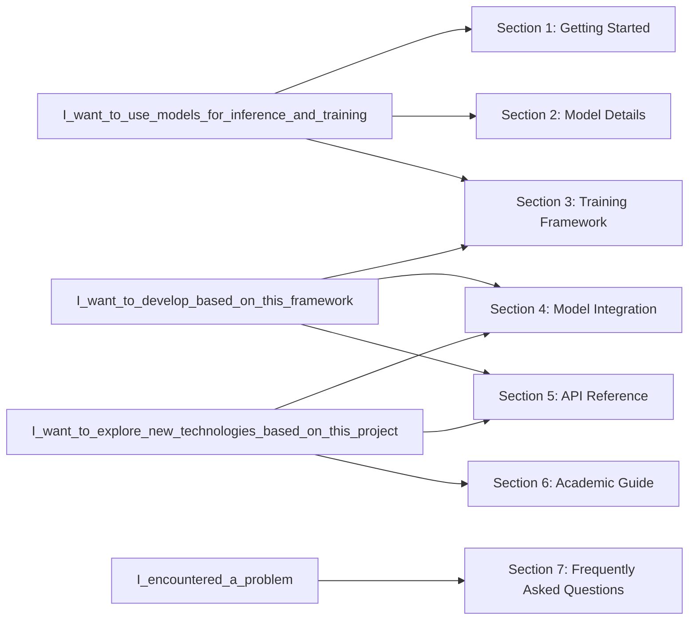

# DiffSynth-Studio Documentation

Welcome to the magical world of Diffusion models! `DiffSynth-Studio` is an open-source Diffusion model engine developed and maintained by the [ModelScope Community](https://www.modelscope.cn/). We aim to build a universal Diffusion model framework that fosters technological innovation through framework construction, aggregates the power of the open-source community, and explores the boundaries of generative model technology!

Documentation Reading Guide

## Section 1: Getting Started

This section introduces the basic usage of `DiffSynth-Studio`, including how to enable VRAM management for inference on GPUs with extremely low VRAM, and how to train various base models, LoRAs, ControlNets, and other models.

* [Installation Dependencies](/docs/en/Pipeline_Usage/Setup.md)
* [Model Inference](/docs/en/Pipeline_Usage/Model_Inference.md)
* [VRAM Management](/docs/en/Pipeline_Usage/VRAM_management.md)
* [Model Training](/docs/en/Pipeline_Usage/Model_Training.md)
* [Environment Variables](/docs/en/Pipeline_Usage/Environment_Variables.md)
* [GPU/NPU Support](/docs/en/Pipeline_Usage/GPU_support.md)

## Section 2: Model Details

This section introduces the Diffusion models supported by `DiffSynth-Studio`. Some model pipelines feature special functionalities such as controllable generation and parallel acceleration.

* [FLUX.1](/docs/en/Model_Details/FLUX.md)
* [Wan](/docs/en/Model_Details/Wan.md)
* [Qwen-Image](/docs/en/Model_Details/Qwen-Image.md)
* [FLUX.2](/docs/en/Model_Details/FLUX2.md)
* [Z-Image](/docs/en/Model_Details/Z-Image.md)

## Section 3: Training Framework

This section introduces the design philosophy of the training framework in `DiffSynth-Studio`, helping developers understand the principles of Diffusion model training algorithms.

* [Basic Principles of Diffusion Models](/docs/en/Training/Understanding_Diffusion_models.md)
* [Standard Supervised Training](/docs/en/Training/Supervised_Fine_Tuning.md)
* [Enabling FP8 Precision in Training](/docs/en/Training/FP8_Precision.md)
* [End-to-End Distillation Accelerated Training](/docs/en/Training/Direct_Distill.md)
* [Two-Stage Split Training](/docs/en/Training/Split_Training.md)
* [Differential LoRA Training](/docs/en/Training/Differential_LoRA.md)

## Section 4: Model Integration

This section introduces how to integrate models into `DiffSynth-Studio` to utilize the framework's basic functions, helping developers provide support for new models in this project or perform inference and training of private models.

* [Integrating Model Architecture](/docs/en/Developer_Guide/Integrating_Your_Model.md)
* [Building a Pipeline](/docs/en/Developer_Guide/Building_a_Pipeline.md)
* [Enabling Fine-Grained VRAM Management](/docs/en/Developer_Guide/Enabling_VRAM_management.md)
* [Model Training Integration](/docs/en/Developer_Guide/Training_Diffusion_Models.md)

## Section 5: API Reference

This section introduces the independent core module `diffsynth.core` in `DiffSynth-Studio`, explaining how internal functions are designed and operate. Developers can use these functional modules in other codebase developments if needed.

* [`diffsynth.core.attention`](/docs/en/API_Reference/core/attention.md): Attention mechanism implementation
* [`diffsynth.core.data`](/docs/en/API_Reference/core/data.md): Data processing operators and general datasets
* [`diffsynth.core.gradient`](/docs/en/API_Reference/core/gradient.md): Gradient checkpointing
* [`diffsynth.core.loader`](/docs/en/API_Reference/core/loader.md): Model download and loading
* [`diffsynth.core.vram`](/docs/en/API_Reference/core/vram.md): VRAM management

## Section 6: Academic Guide

This section introduces how to use `DiffSynth-Studio` to train new models, helping researchers explore new model technologies.

* [Training models from scratch](/docs/en/Research_Tutorial/train_from_scratch.md)
* Inference improvement techniques 【coming soon】
* Designing controllable generation models 【coming soon】
* Creating new training paradigms 【coming soon】

## Section 7: Frequently Asked Questions

This section summarizes common developer questions. If you encounter issues during usage or development, please refer to this section. If you still cannot resolve the problem, please submit an issue on GitHub.

* [Frequently Asked Questions](/docs/en/QA.md)