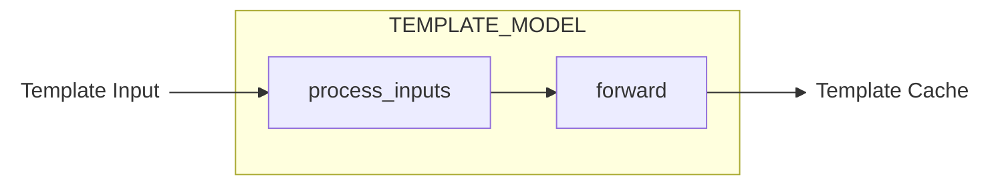
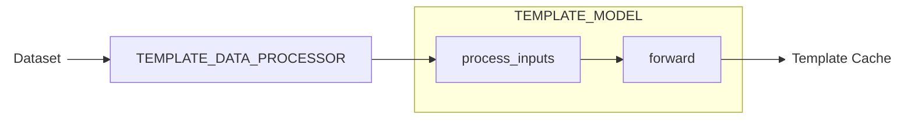

# Template 模型训练

DiffSynth-Studio 目前已为 [black-forest-labs/FLUX.2-klein-base-4B](https://www.modelscope.cn/models/black-forest-labs/FLUX.2-klein-base-4B) 提供了全面的 Templates 训练支持，更多模型的适配敬请期待。

## 基于预训练 Template 模型继续训练

如需基于我们预训练好的模型进行继续训练，请参考[FLUX.2](../Model_Details/FLUX2.md#模型总览) 中的表格，找到对应的训练脚本。

## 构建新的 Template 模型

### Template 模型组件格式

一个 Template 模型与一个模型库（或一个本地文件夹）绑定，模型库中有代码文件 `model.py` 作为唯一入口。`model.py` 的模板如下：

```python
import torch

class CustomizedTemplateModel(torch.nn.Module):
    def __init__(self):
        super().__init__()

    @torch.no_grad()
    def process_inputs(self, xxx, **kwargs):
        yyy = xxx
        return {"yyy": yyy}

    def forward(self, yyy, **kwargs):
        zzz = yyy
        return {"zzz": zzz}

class DataProcessor:
    def __call__(self, www, **kwargs):
        xxx = www
        return {"xxx": xxx}

TEMPLATE_MODEL = CustomizedTemplateModel
TEMPLATE_MODEL_PATH = "model.safetensors"
TEMPLATE_DATA_PROCESSOR = DataProcessor
```

在 Template 模型推理时，Template Input 先后经过 `TEMPLATE_MODEL` 的 `process_inputs` 和 `forward` 得到 Template Cache。



在 Template 模型训练时，Template Input 不再是用户的输入，而是从数据集中获取，由 `TEMPLATE_DATA_PROCESSOR` 进行计算得到。



#### `TEMPLATE_MODEL`

`TEMPLATE_MODEL` 是 Template 模型的代码实现，需继承 `torch.nn.Module`，并编写 `process_inputs` 与 `forward` 两个函数。`process_inputs` 与 `forward` 构成完整的 Template 模型推理过程，我们将其拆分为两部分，是为了在训练中更容易适配[两阶段拆分训练](https://diffsynth-studio-doc.readthedocs.io/zh-cn/latest/Training/Split_Training.html)。

* `process_inputs` 需带有装饰器 `@torch.no_grad()`，进行不包含梯度的计算
* `forward` 需包含训练模型所需的全部梯度计算过程，其输入与 `process_inputs` 的输出相同

`process_inputs` 与 `forward` 需包含 `**kwargs`，保证兼容性，此外，我们提供了以下预留的参数

* 如需在 `process_inputs` 与 `forward` 中和基础模型 Pipeline 进行交互，例如调用基础模型 Pipeline 中的文本编码器进行计算，可在 `process_inputs` 与 `forward` 的输入参数中增加字段 `pipe`
* 如需在训练中启用 Gradient Checkpointing，可在 `forward` 的输入参数中增加字段 `use_gradient_checkpointing` 与 `use_gradient_checkpointing_offload`
* 多个 Template 模型需通过 `model_id` 区分 Template Inputs，请不要在 `process_inputs` 与 `forward` 的输入参数中使用这个字段

#### `TEMPLATE_MODEL_PATH`（可选项）

`TEMPLATE_MODEL_PATH` 是模型预训练权重文件的相对路径，例如

```python
TEMPLATE_MODEL_PATH = "model.safetensors"
```

如需从多个模型文件中加载，可使用列表

```python
TEMPLATE_MODEL_PATH = [
    "model-00001-of-00003.safetensors",
    "model-00002-of-00003.safetensors",
    "model-00003-of-00003.safetensors",
]
```

如果需要随机初始化模型参数（模型还未训练），或不需要初始化模型参数，可将其设置为 `None`，或不设置

```python
TEMPLATE_MODEL_PATH = None
```

#### `TEMPLATE_DATA_PROCESSOR`（可选项）

如需使用 DiffSynth-Studio 训练 Template 模型，则需构建训练数据集，数据集中的 `metadata.json` 包含 `template_inputs` 字段。`metadata.json` 中的 `template_inputs` 并不是直接输入给 Template 模型 `process_inputs` 的参数，而是提供给 `TEMPLATE_DATA_PROCESSOR` 的输入参数，由 `TEMPLATE_DATA_PROCESSOR` 计算出输入给 Template 模型 `process_inputs` 的参数。

例如，[DiffSynth-Studio/Template-KleinBase4B-Brightness](https://modelscope.cn/models/DiffSynth-Studio/Template-KleinBase4B-Brightness) 这一亮度控制模型的输入参数是 `scale`，即图像的亮度数值。`scale` 可以直接写在 `metadata.json` 中，此时 `TEMPLATE_DATA_PROCESSOR` 只需要传递参数：

```json
[
    {
        "image": "images/image_1.jpg",
        "prompt": "a cat",
        "template_inputs": {"scale": 0.2}
    },
    {
        "image": "images/image_2.jpg",
        "prompt": "a dog",
        "template_inputs": {"scale": 0.6}
    }
]
```

```python
class DataProcessor:
    def __call__(self, scale, **kwargs):
        return {"scale": scale}

TEMPLATE_DATA_PROCESSOR = DataProcessor
```

也可在 `metadata.json` 中填写图像路径，直接在训练过程中计算 `scale`。

```json
[
    {
        "image": "images/image_1.jpg",
        "prompt": "a cat",
        "template_inputs": {"image": "/path/to/your/dataset/images/image_1.jpg"}
    },
    {
        "image": "images/image_2.jpg",
        "prompt": "a dog",
        "template_inputs": {"image": "/path/to/your/dataset/images/image_1.jpg"}
    }
]
```

```python
class DataProcessor:
    def __call__(self, image, **kwargs):
        image = Image.open(image)
        image = np.array(image)
        return {"scale": image.astype(np.float32).mean() / 255}

TEMPLATE_DATA_PROCESSOR = DataProcessor
```

### 训练 Template 模型

Template 模型“可训练”的充分条件是：Template Cache 中的变量计算与基础模型 Pipeline 完全解耦，这些变量在推理过程中输入给基础模型 Pipeline 后，不会参与任何 Pipeline Unit 的计算，直达 `model_fn`。

如果 Template 模型是“可训练”的，那么可以使用 DiffSynth-Studio 进行训练，以基础模型 [black-forest-labs/FLUX.2-klein-base-4B](https://www.modelscope.cn/models/black-forest-labs/FLUX.2-klein-base-4B) 为例，在训练脚本中，填写字段：

* `--extra_inputs`：额外输入，训练文生图模型的 Template 模型时只需填 `template_inputs`，训练图像编辑模型的 Template 模型时需填 `edit_image,template_inputs`
* `--template_model_id_or_path`：Template 模型的魔搭模型 ID 或本地路径，框架会优先匹配本地路径，若本地路径不存在则从魔搭模型库中下载该模型，填写模型 ID 时，以“:”结尾，例如 `"DiffSynth-Studio/Template-KleinBase4B-Brightness:"`
* `--remove_prefix_in_ckpt`：保存模型文件时，移除的 state dict 变量名前缀，填 `"pipe.template_model."` 即可
* `--trainable_models`：可训练模型，填写 `template_model` 即可，若只需训练其中的某个组件，则需填写 `template_model.xxx,template_model.yyy`，以逗号分隔

以下是一个样例训练脚本，它会自动下载一个样例数据集，随机初始化模型权重后开始训练亮度控制模型：

```shell
modelscope download --dataset DiffSynth-Studio/diffsynth_example_dataset --include "flux2/Template-KleinBase4B-Brightness/*" --local_dir ./data/diffsynth_example_dataset

accelerate launch examples/flux2/model_training/train.py \
  --dataset_base_path data/diffsynth_example_dataset/flux2/Template-KleinBase4B-Brightness \
  --dataset_metadata_path data/diffsynth_example_dataset/flux2/Template-KleinBase4B-Brightness/metadata.jsonl \
  --extra_inputs "template_inputs" \
  --max_pixels 1048576 \
  --dataset_repeat 50 \
  --model_id_with_origin_paths "black-forest-labs/FLUX.2-klein-4B:text_encoder/*.safetensors,black-forest-labs/FLUX.2-klein-base-4B:transformer/*.safetensors,black-forest-labs/FLUX.2-klein-4B:vae/diffusion_pytorch_model.safetensors" \
  --template_model_id_or_path "examples/flux2/model_training/scripts/brightness" \
  --tokenizer_path "black-forest-labs/FLUX.2-klein-4B:tokenizer/" \
  --learning_rate 1e-4 \
  --num_epochs 2 \
  --remove_prefix_in_ckpt "pipe.template_model." \
  --output_path "./models/train/Template-KleinBase4B-Brightness_example" \
  --trainable_models "template_model" \
  --use_gradient_checkpointing \
  --find_unused_parameters
```

### 与基础模型 Pipeline 组件交互

Diffusion Template 框架允许 Template 模型与基础模型 Pipeline 进行交互。例如，你可能需要使用基础模型 Pipeline 中的 text encoder 对文本进行编码，此时在 `process_inputs` 和 `forward` 中使用预留字段 `pipe` 即可。

```python
import torch

class CustomizedTemplateModel(torch.nn.Module):
    def __init__(self):
        super().__init__()
        self.xxx = xxx()

    @torch.no_grad()
    def process_inputs(self, text, pipe, **kwargs):
        input_ids = pipe.tokenizer(text)
        text_emb = pipe.text_encoder(text_emb)
        return {"text_emb": text_emb}

    def forward(self, text_emb, pipe, **kwargs):
        kv_cache = self.xxx(text_emb)
        return {"kv_cache": kv_cache}

TEMPLATE_MODEL = CustomizedTemplateModel
```

### 使用非训练的模型组件

在设计 Template 模型时，如果需要使用预训练的模型且不希望在训练过程中更新这部分参数，例如

```python
import torch

class CustomizedTemplateModel(torch.nn.Module):
    def __init__(self):
        super().__init__()
        self.image_encoder = XXXEncoder.from_pretrained(xxx)
        self.mlp = MLP()

    @torch.no_grad()
    def process_inputs(self, image, **kwargs):
        emb = self.image_encoder(image)
        return {"emb": emb}

    def forward(self, emb, **kwargs):
        kv_cache = self.mlp(emb)
        return {"kv_cache": kv_cache}

TEMPLATE_MODEL = CustomizedTemplateModel
```

此时需在训练命令中通过参数 `--trainable_models template_model.mlp` 设置为仅训练 `mlp` 部分。

### 在低显存的设备上训练

框架支持将 Template 模型的训练拆分为两阶段，第一阶段进行无梯度计算，第二阶段进行梯度更新，更多信息请参考文档：[两阶段拆分训练](https://diffsynth-studio-doc.readthedocs.io/zh-cn/latest/Training/Split_Training.html)，以下是样例脚本：

```shell
modelscope download --dataset DiffSynth-Studio/diffsynth_example_dataset --include "flux2/Template-KleinBase4B-Brightness/*" --local_dir ./data/diffsynth_example_dataset

accelerate launch examples/flux2/model_training/train.py \
  --dataset_base_path data/diffsynth_example_dataset/flux2/Template-KleinBase4B-Brightness \
  --dataset_metadata_path data/diffsynth_example_dataset/flux2/Template-KleinBase4B-Brightness/metadata.jsonl \
  --extra_inputs "template_inputs" \
  --max_pixels 1048576 \
  --dataset_repeat 1 \
  --model_id_with_origin_paths "black-forest-labs/FLUX.2-klein-4B:text_encoder/*.safetensors,black-forest-labs/FLUX.2-klein-4B:vae/diffusion_pytorch_model.safetensors" \
  --template_model_id_or_path "DiffSynth-Studio/Template-KleinBase4B-Brightness:" \
  --tokenizer_path "black-forest-labs/FLUX.2-klein-4B:tokenizer/" \
  --learning_rate 1e-4 \
  --num_epochs 2 \
  --remove_prefix_in_ckpt "pipe.template_model." \
  --output_path "./models/train/Template-KleinBase4B-Brightness_full_cache" \
  --trainable_models "template_model" \
  --use_gradient_checkpointing \
  --find_unused_parameters \
  --task "sft:data_process"

accelerate launch examples/flux2/model_training/train.py \
  --dataset_base_path "./models/train/Template-KleinBase4B-Brightness_full_cache" \
  --extra_inputs "template_inputs" \
  --max_pixels 1048576 \
  --dataset_repeat 50 \
  --model_id_with_origin_paths "black-forest-labs/FLUX.2-klein-base-4B:transformer/*.safetensors" \
  --template_model_id_or_path "DiffSynth-Studio/Template-KleinBase4B-Brightness:" \
  --tokenizer_path "black-forest-labs/FLUX.2-klein-4B:tokenizer/" \
  --learning_rate 1e-4 \
  --num_epochs 2 \
  --remove_prefix_in_ckpt "pipe.template_model." \
  --output_path "./models/train/Template-KleinBase4B-Brightness_full" \
  --trainable_models "template_model" \
  --use_gradient_checkpointing \
  --find_unused_parameters \
  --task "sft:train"
```

两阶段拆分训练可以降低显存需求，提高训练速度，训练过程是无损精度的，但需要较大硬盘空间用于存储 Cache 文件。

如需进一步减少显存需求，可开启 fp8 精度，在两阶段训练中添加参数 `--fp8_models "black-forest-labs/FLUX.2-klein-4B:text_encoder/*.safetensors,black-forest-labs/FLUX.2-klein-4B:vae/diffusion_pytorch_model.safetensors"` 和 `--fp8_models "black-forest-labs/FLUX.2-klein-base-4B:transformer/*.safetensors"` 即可，fp8 精度只能在非训练模型组件上启用，且存在少量误差。

### 上传 Template 模型

完成训练后，按照以下步骤可上传 Template 模型到魔搭社区，供更多人下载使用。

Step 1：在 `model.py` 中填入训练好的模型文件名，例如

```python
TEMPLATE_MODEL_PATH = "model.safetensors"
```

Step 2：使用以下命令上传 `model.py`，其中 `--token ms-xxx` 在 https://modelscope.cn/my/access/token 获取

```shell
modelscope upload user_name/your_model_id /path/to/your/model.py model.py --token ms-xxx
```

Step 3：确认模型文件

确认要上传的模型文件，例如 `epoch-1.safetensors`、`step-2000.safetensors`。

注意，DiffSynth-Studio 保存的模型文件中只包含可训练的参数，如果模型中包括非训练参数，则需要重新将非训练的模型参数打包才能进行推理，你可以通过以下代码进行打包：

```python
from diffsynth.diffusion.template import load_template_model, load_state_dict
from safetensors.torch import save_file
import torch

model = load_template_model("path/to/your/template/model", torch_dtype=torch.bfloat16, device="cpu")
state_dict = load_state_dict("path/to/your/ckpt/epoch-1.safetensors", torch_dtype=torch.bfloat16, device="cpu")
state_dict.update(model.state_dict())
save_file(state_dict, "model.safetensors")
```

Step 4：上传模型文件

```shell
modelscope upload user_name/your_model_id /path/to/your/model/epoch-1.safetensors model.safetensors --token ms-xxx
```

Step 5：验证模型推理效果

```python
from diffsynth.diffusion.template import TemplatePipeline
from diffsynth.pipelines.flux2_image import Flux2ImagePipeline, ModelConfig
import torch

# Load base model
pipe = Flux2ImagePipeline.from_pretrained(
    torch_dtype=torch.bfloat16,
    device="cuda",
    model_configs=[
        ModelConfig(model_id="black-forest-labs/FLUX.2-klein-4B", origin_file_pattern="text_encoder/*.safetensors"),
        ModelConfig(model_id="black-forest-labs/FLUX.2-klein-base-4B", origin_file_pattern="transformer/*.safetensors"),
        ModelConfig(model_id="black-forest-labs/FLUX.2-klein-4B", origin_file_pattern="vae/diffusion_pytorch_model.safetensors"),
    ],
    tokenizer_config=ModelConfig(model_id="black-forest-labs/FLUX.2-klein-4B", origin_file_pattern="tokenizer/"),
)
# Load Template model
template_pipeline = TemplatePipeline.from_pretrained(
    torch_dtype=torch.bfloat16,
    device="cuda",
    model_configs=[
        ModelConfig(model_id="user_name/your_model_id")
    ],
)
# Generate an image
image = template_pipeline(
    pipe,
    prompt="a cat",
    seed=0, cfg_scale=4,
    height=1024, width=1024,
    template_inputs=[{xxx}],
)
image.save("image.png")
```

