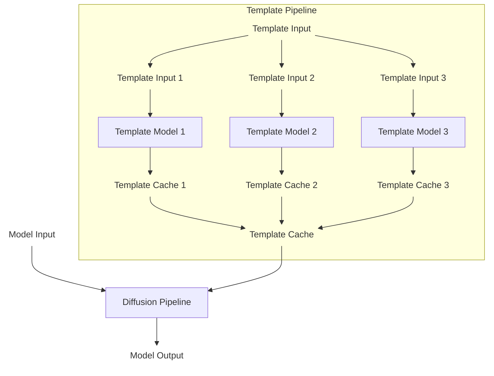

# Diffusion Templates 架构详解

## 框架结构

Diffusion Templates 框架的结构如下图所示：



框架包含以下模块设计：

* Template Input: Template 模型的输入。其格式为 Python 字典，其中的字段由每个 Template 模型自身决定，例如 `{"scale": 0.8}`
* Template Model: Template 模型，可从魔搭模型库加载（`ModelConfig(model_id="xxx/xxx")`）或从本地路径加载（`ModelConfig(path="xxx")`）
* Template Cache: Template 模型的输出。其格式为 Python 字典，其中的字段仅支持对应基础模型 Pipeline 中的输入参数字段。
* Template Pipeline: 用于调度多个 Template 模型的模块。该模块负责加载 Template 模型、整合多个 Template 模型的输出

当 Diffusion Templates 框架未启用时，基础模型组件（包括 Text Encoder、DiT、VAE 等）被加载到 Diffusion Pipeline 中，输入 Model Input（包括 prompt、height、width 等），输出 Model Output（例如图像）。

当 Diffusion Templates 框架启用后，若干个 Template 模型被加载到 Template Pipeline 中，Template Pipeline 输出 Template Cache（Diffusion Pipeline 输入参数的子集），并交由 Diffusion Pipeline 进行后续的进一步处理。Template Pipeline 通过接管一部分 Diffusion Pipeline 的输入参数来实现可控生成。

## 模型能力媒介

注意到，Template Cache 的格式被定义为 Diffusion Pipeline 输入参数的子集，这是框架通用性设计的基本保证，我们限制 Template 模型的输入只能是 Diffusion Pipeline 的输入参数。因此，我们需要为 Diffusion Pipeline 设计额外的输入参数作为模型能力媒介。其中，KV-Cache 是非常适合 Diffusion 的模型能力媒介

* 技术路线已经在 LLM Skills 上得到了验证，LLM 中输入的提示词也会被潜在地转化为 KV-Cache
* KV-Cache 具有 Diffusion 模型的“高权限”，在生图模型上能够直接影响甚至完全控制生图结果，这保证 Diffusion Template 模型具备足够高的能力上限
* KV-Cache 可以直接在序列层面拼接，让多个 Template 模型同时生效
* KV-Cache 在框架层面的开发量少，增加一个 Pipeline 的输入参数并穿透到模型内部即可，可以快速适配新的 Diffusion 基础模型

另外，还有以下媒介也可以用于 Template：

* Residual：残差，在 ControlNet 中使用较多，适合做点对点的控制，和 KVCache 相比缺点是不能支持任意分辨率以及多个 Residual 融合时可能冲突
* LoRA：不要把它当成模型的一部分，而是把它当成模型的输入参数，LoRA 本质上是一系列张量，也可以作为模型能力的媒介

**目前，我们仅在 FLUX.2 的 Pipeline 上提供了 KV-Cache 和 LoRA 作为 Template Cache 的支持，后续会考虑支持更多模型和更多模型能力媒介。**

## Template 模型格式

一个 Template 模型的格式为：

```
Template_Model
├── model.py
└── model.safetensors
```

其中，`model.py` 是模型的入口，`model.safetensors` 是 Template 模型的权重文件。关于如何构建 Template 模型，请参考文档 [Template 模型训练](Template_Model_Training.md)，或参考[现有的 Template 模型](https://modelscope.cn/models/DiffSynth-Studio/Template-KleinBase4B-Brightness)。
