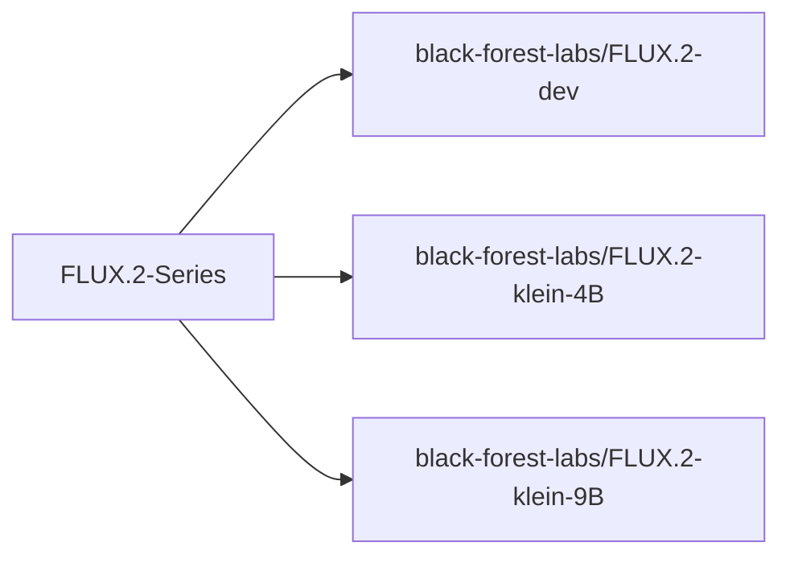

# FLUX.2

FLUX.2 是由 Black Forest Labs 训练并开源的图像生成模型。

## 模型血缘



## 安装

在使用本项目进行模型推理和训练前，请先安装 DiffSynth-Studio。

```shell
git clone https://github.com/modelscope/DiffSynth-Studio.git
cd DiffSynth-Studio
pip install -e .
```

更多关于安装的信息，请参考[安装依赖](/docs/zh/Pipeline_Usage/Setup.md)。

## 快速开始

运行以下代码可以快速加载 [black-forest-labs/FLUX.2-dev](https://www.modelscope.cn/models/black-forest-labs/FLUX.2-dev) 模型并进行推理。显存管理已启动，框架会自动根据剩余显存控制模型参数的加载，最低 10G 显存即可运行。

```python
from diffsynth.pipelines.flux2_image import Flux2ImagePipeline, ModelConfig
import torch

vram_config = {
    "offload_dtype": "disk",
    "offload_device": "disk",
    "onload_dtype": torch.float8_e4m3fn,
    "onload_device": "cpu",
    "preparing_dtype": torch.float8_e4m3fn,
    "preparing_device": "cuda",
    "computation_dtype": torch.bfloat16,
    "computation_device": "cuda",
}
pipe = Flux2ImagePipeline.from_pretrained(
    torch_dtype=torch.bfloat16,
    device="cuda",
    model_configs=[
        ModelConfig(model_id="black-forest-labs/FLUX.2-dev", origin_file_pattern="text_encoder/*.safetensors", **vram_config),
        ModelConfig(model_id="black-forest-labs/FLUX.2-dev", origin_file_pattern="transformer/*.safetensors", **vram_config),
        ModelConfig(model_id="black-forest-labs/FLUX.2-dev", origin_file_pattern="vae/diffusion_pytorch_model.safetensors"),
    ],
    tokenizer_config=ModelConfig(model_id="black-forest-labs/FLUX.2-dev", origin_file_pattern="tokenizer/"),
    vram_limit=torch.cuda.mem_get_info("cuda")[1] / (1024 ** 3) - 0.5,
)
prompt = "High resolution. A dreamy underwater portrait of a serene young woman in a flowing blue dress. Her hair floats softly around her face, strands delicately suspended in the water. Clear, shimmering light filters through, casting gentle highlights, while tiny bubbles rise around her. Her expression is calm, her features finely detailed—creating a tranquil, ethereal scene."
image = pipe(prompt, seed=42, rand_device="cuda", num_inference_steps=50)
image.save("image.jpg")
```

## 模型总览

|模型 ID|推理|低显存推理|全量训练|全量训练后验证|LoRA 训练|LoRA 训练后验证|
|-|-|-|-|-|-|-|
|[black-forest-labs/FLUX.2-dev](https://www.modelscope.cn/models/black-forest-labs/FLUX.2-dev)|[code](/examples/flux2/model_inference/FLUX.2-dev.py)|[code](/examples/flux2/model_inference_low_vram/FLUX.2-dev.py)|-|-|[code](/examples/flux2/model_training/lora/FLUX.2-dev.sh)|[code](/examples/flux2/model_training/validate_lora/FLUX.2-dev.py)|
|[black-forest-labs/FLUX.2-klein-4B](https://www.modelscope.cn/models/black-forest-labs/FLUX.2-klein-4B)|[code](/examples/flux2/model_inference/FLUX.2-klein-4B.py)|[code](/examples/flux2/model_inference_low_vram/FLUX.2-klein-4B.py)|[code](/examples/flux2/model_training/full/FLUX.2-klein-4B.sh)|[code](/examples/flux2/model_training/validate_full/FLUX.2-klein-4B.py)|[code](/examples/flux2/model_training/lora/FLUX.2-klein-4B.sh)|[code](/examples/flux2/model_training/validate_lora/FLUX.2-klein-4B.py)|
|[black-forest-labs/FLUX.2-klein-9B](https://www.modelscope.cn/models/black-forest-labs/FLUX.2-klein-9B)|[code](/examples/flux2/model_inference/FLUX.2-klein-9B.py)|[code](/examples/flux2/model_inference_low_vram/FLUX.2-klein-9B.py)|[code](/examples/flux2/model_training/full/FLUX.2-klein-9B.sh)|[code](/examples/flux2/model_training/validate_full/FLUX.2-klein-9B.py)|[code](/examples/flux2/model_training/lora/FLUX.2-klein-9B.sh)|[code](/examples/flux2/model_training/validate_lora/FLUX.2-klein-9B.py)|
|[black-forest-labs/FLUX.2-klein-base-4B](https://www.modelscope.cn/models/black-forest-labs/FLUX.2-klein-base-4B)|[code](/examples/flux2/model_inference/FLUX.2-klein-base-4B.py)|[code](/examples/flux2/model_inference_low_vram/FLUX.2-klein-base-4B.py)|[code](/examples/flux2/model_training/full/FLUX.2-klein-base-4B.sh)|[code](/examples/flux2/model_training/validate_full/FLUX.2-klein-base-4B.py)|[code](/examples/flux2/model_training/lora/FLUX.2-klein-base-4B.sh)|[code](/examples/flux2/model_training/validate_lora/FLUX.2-klein-base-4B.py)|
|[black-forest-labs/FLUX.2-klein-base-9B](https://www.modelscope.cn/models/black-forest-labs/FLUX.2-klein-base-9B)|[code](/examples/flux2/model_inference/FLUX.2-klein-base-9B.py)|[code](/examples/flux2/model_inference_low_vram/FLUX.2-klein-base-9B.py)|[code](/examples/flux2/model_training/full/FLUX.2-klein-base-9B.sh)|[code](/examples/flux2/model_training/validate_full/FLUX.2-klein-base-9B.py)|[code](/examples/flux2/model_training/lora/FLUX.2-klein-base-9B.sh)|[code](/examples/flux2/model_training/validate_lora/FLUX.2-klein-base-9B.py)|

特殊训练脚本：

* 差分 LoRA 训练：[doc](/docs/zh/Training/Differential_LoRA.md)
* FP8 精度训练：[doc](/docs/zh/Training/FP8_Precision.md)
* 两阶段拆分训练：[doc](/docs/zh/Training/Split_Training.md)
* 端到端直接蒸馏：[doc](/docs/zh/Training/Direct_Distill.md)

## 模型推理

模型通过 `Flux2ImagePipeline.from_pretrained` 加载，详见[加载模型](/docs/zh/Pipeline_Usage/Model_Inference.md#加载模型)。

`Flux2ImagePipeline` 推理的输入参数包括：

* `prompt`: 提示词，描述画面中出现的内容。
* `negative_prompt`: 负向提示词，描述画面中不应该出现的内容，默认值为 `""`。
* `cfg_scale`: Classifier-free guidance 的参数，默认值为 1，当设置为大于 1 的值时启用 CFG。
* `height`: 图像高度，需保证高度为 16 的倍数。
* `width`: 图像宽度，需保证宽度为 16 的倍数。
* `seed`: 随机种子。默认为 `None`，即完全随机。
* `rand_device`: 生成随机高斯噪声矩阵的计算设备，默认为 `"cpu"`。当设置为 `cuda` 时，在不同 GPU 上会导致不同的生成结果。
* `num_inference_steps`: 推理次数，默认值为 30。
* `embedded_guidance`: 嵌入式引导参数，默认值为 3.5。
* `t5_sequence_length`: T5 文本编码器的序列长度，默认为 512。
* `tiled`: 是否启用 VAE 分块推理，默认为 `False`。设置为 `True` 时可显著减少 VAE 编解码阶段的显存占用，会产生少许误差，以及少量推理时间延长。
* `tile_size`: VAE 编解码阶段的分块大小，默认为 128，仅在 `tiled=True` 时生效。
* `tile_stride`: VAE 编解码阶段的分块步长，默认为 64，仅在 `tiled=True` 时生效，需保证其数值小于或等于 `tile_size`。
* `progress_bar_cmd`: 进度条，默认为 `tqdm.tqdm`。可通过设置为 `lambda x:x` 来屏蔽进度条。

如果显存不足，请开启[显存管理](/docs/zh/Pipeline_Usage/VRAM_management.md)，我们在示例代码中提供了每个模型推荐的低显存配置，详见前文"模型总览"中的表格。

## 模型训练

FLUX.2 系列模型统一通过 [`examples/flux2/model_training/train.py`](/examples/flux2/model_training/train.py) 进行训练，脚本的参数包括：

* 通用训练参数
    * 数据集基础配置
        * `--dataset_base_path`: 数据集的根目录。
        * `--dataset_metadata_path`: 数据集的元数据文件路径。
        * `--dataset_repeat`: 每个 epoch 中数据集重复的次数。
        * `--dataset_num_workers`: 每个 Dataloder 的进程数量。
        * `--data_file_keys`: 元数据中需要加载的字段名称，通常是图像或视频文件的路径，以 `,` 分隔。
    * 模型加载配置
        * `--model_paths`: 要加载的模型路径。JSON 格式。
        * `--model_id_with_origin_paths`: 带原始路径的模型 ID，例如 `"black-forest-labs/FLUX.2-dev:text_encoder/*.safetensors"`。用逗号分隔。
        * `--extra_inputs`: 模型 Pipeline 所需的额外输入参数，例如训练 ControlNet 模型时需要额外参数 `controlnet_inputs`，以 `,` 分隔。
        * `--fp8_models`：以 FP8 格式加载的模型，格式与 `--model_paths` 或 `--model_id_with_origin_paths` 一致，目前仅支持参数不被梯度更新的模型（不需要梯度回传，或梯度仅更新其 LoRA）。
    * 训练基础配置
        * `--learning_rate`: 学习率。
        * `--num_epochs`: 轮数（Epoch）。
        * `--trainable_models`: 可训练的模型，例如 `dit`、`vae`、`text_encoder`。
        * `--find_unused_parameters`: DDP 训练中是否存在未使用的参数，少数模型包含不参与梯度计算的冗余参数，需开启这一设置避免在多 GPU 训练中报错。
        * `--weight_decay`：权重衰减大小，详见 [torch.optim.AdamW](https://docs.pytorch.org/docs/stable/generated/torch.optim.AdamW.html)。
        * `--task`: 训练任务，默认为 `sft`，部分模型支持更多训练模式，请参考每个特定模型的文档。
    * 输出配置
        * `--output_path`: 模型保存路径。
        * `--remove_prefix_in_ckpt`: 在模型文件的 state dict 中移除前缀。
        * `--save_steps`: 保存模型的训练步数间隔，若此参数留空，则每个 epoch 保存一次。
    * LoRA 配置
        * `--lora_base_model`: LoRA 添加到哪个模型上。
        * `--lora_target_modules`: LoRA 添加到哪些层上。
        * `--lora_rank`: LoRA 的秩（Rank）。
        * `--lora_checkpoint`: LoRA 检查点的路径。如果提供此路径，LoRA 将从此检查点加载。
        * `--preset_lora_path`: 预置 LoRA 检查点路径，如果提供此路径，这一 LoRA 将会以融入基础模型的形式加载。此参数用于 LoRA 差分训练。
        * `--preset_lora_model`: 预置 LoRA 融入的模型，例如 `dit`。
    * 梯度配置
        * `--use_gradient_checkpointing`: 是否启用 gradient checkpointing。
        * `--use_gradient_checkpointing_offload`: 是否将 gradient checkpointing 卸载到内存中。
        * `--gradient_accumulation_steps`: 梯度累积步数。
    * 图像宽高配置（适用于图像生成模型和视频生成模型）
        * `--height`: 图像或视频的高度。将 `height` 和 `width` 留空以启用动态分辨率。
        * `--width`: 图像或视频的宽度。将 `height` 和 `width` 留空以启用动态分辨率。
        * `--max_pixels`: 图像或视频帧的最大像素面积，当启用动态分辨率时，分辨率大于这个数值的图片都会被缩小，分辨率小于这个数值的图片保持不变。
* FLUX.2 专有参数
    * `--tokenizer_path`: tokenizer 的路径，适用于文生图模型，留空则自动从远程下载。

我们构建了一个样例图像数据集，以方便您进行测试，通过以下命令可以下载这个数据集：

```shell
modelscope download --dataset DiffSynth-Studio/example_image_dataset --local_dir ./data/example_image_dataset
```

我们为每个模型编写了推荐的训练脚本，请参考前文"模型总览"中的表格。关于如何编写模型训练脚本，请参考[模型训练](/docs/zh/Pipeline_Usage/Model_Training.md)；更多高阶训练算法，请参考[训练框架详解](/docs/Training/)。
