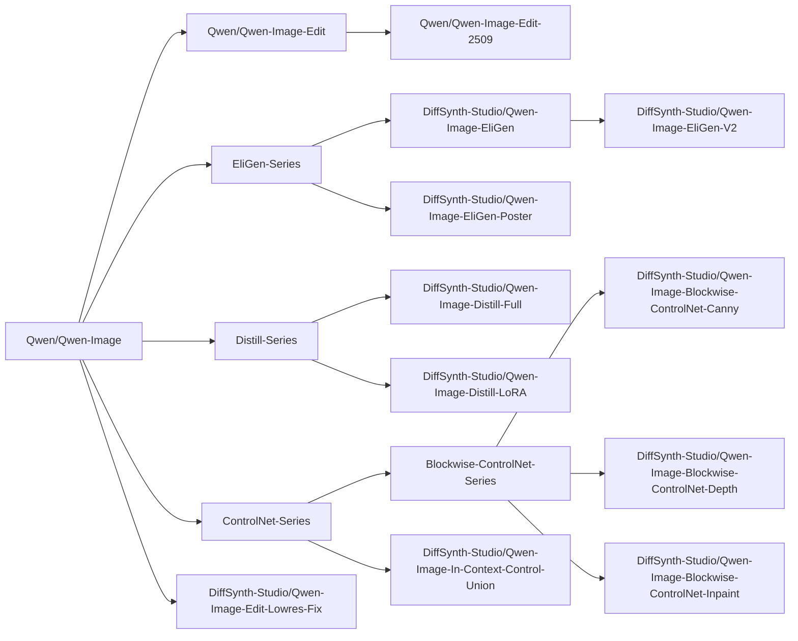
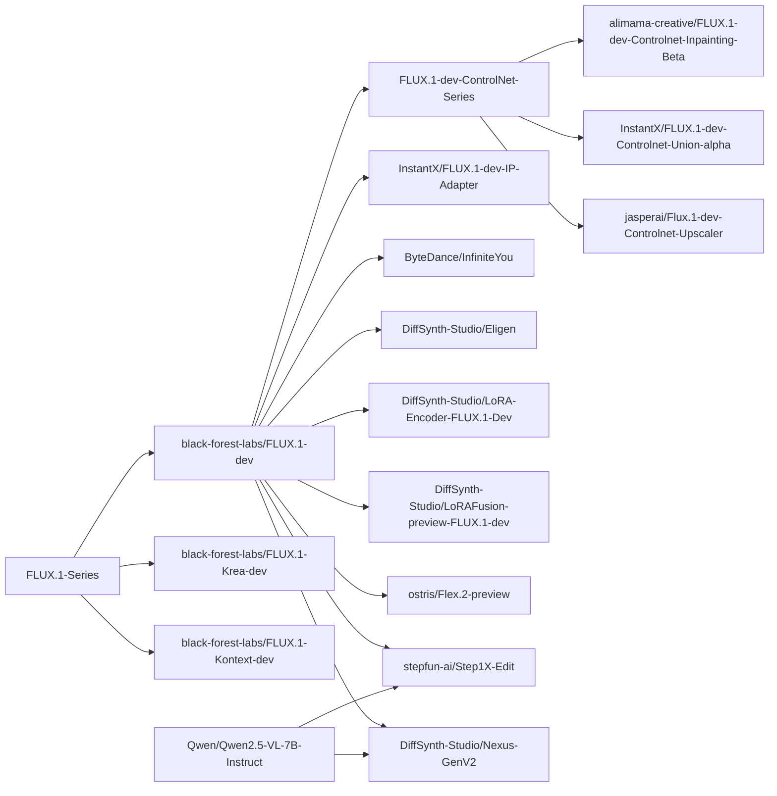
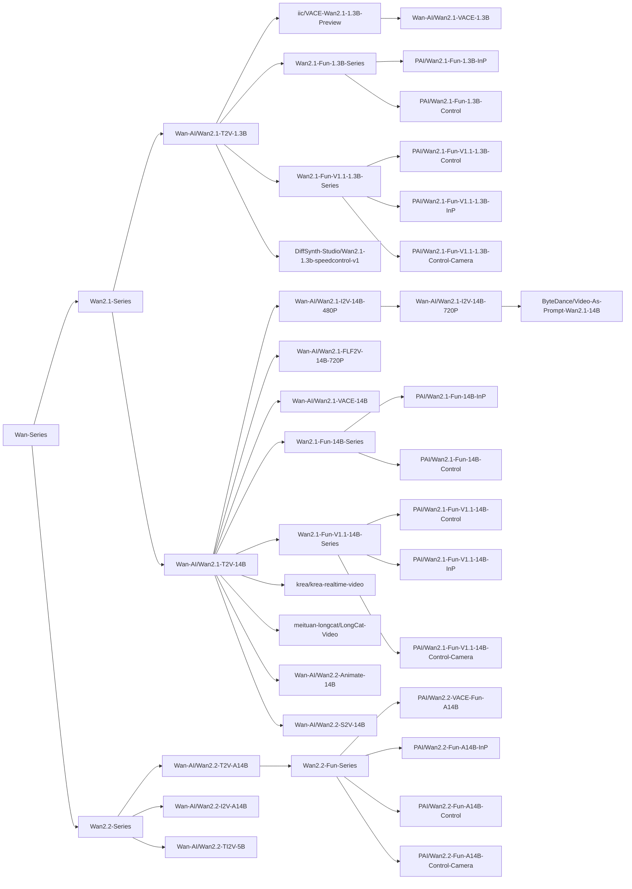

# 模型目录

## Qwen-Image

文档：[./Qwen-Image.md](/docs/zh/Model_Details/Qwen-Image.md)

<details>

<summary>效果一览</summary>


</details>

<details>

<summary>快速开始</summary>

```python
from diffsynth.pipelines.qwen_image import QwenImagePipeline, ModelConfig
from PIL import Image
import torch

pipe = QwenImagePipeline.from_pretrained(
    torch_dtype=torch.bfloat16,
    device="cuda",
    model_configs=[
        ModelConfig(model_id="Qwen/Qwen-Image", origin_file_pattern="transformer/diffusion_pytorch_model*.safetensors"),
        ModelConfig(model_id="Qwen/Qwen-Image", origin_file_pattern="text_encoder/model*.safetensors"),
        ModelConfig(model_id="Qwen/Qwen-Image", origin_file_pattern="vae/diffusion_pytorch_model.safetensors"),
    ],
    tokenizer_config=ModelConfig(model_id="Qwen/Qwen-Image", origin_file_pattern="tokenizer/"),
)
prompt = "精致肖像，水下少女，蓝裙飘逸，发丝轻扬，光影透澈，气泡环绕，面容恬静，细节精致，梦幻唯美。"
image = pipe(
    prompt, seed=0, num_inference_steps=40,
    # edit_image=Image.open("xxx.jpg").resize((1328, 1328)) # For Qwen-Image-Edit
)
image.save("image.jpg")
```

</details>

<details>

<summary>模型血缘</summary>



</details>

|模型 ID|推理|低显存推理|全量训练|全量训练后验证|LoRA 训练|LoRA 训练后验证|
|-|-|-|-|-|-|-|
|[Qwen/Qwen-Image](https://www.modelscope.cn/models/Qwen/Qwen-Image)|[code](/examples/qwen_image/model_inference/Qwen-Image.py)|[code](/examples/qwen_image/model_inference_low_vram/Qwen-Image.py)|[code](/examples/qwen_image/model_training/full/Qwen-Image.sh)|[code](/examples/qwen_image/model_training/validate_full/Qwen-Image.py)|[code](/examples/qwen_image/model_training/lora/Qwen-Image.sh)|[code](/examples/qwen_image/model_training/validate_lora/Qwen-Image.py)|
|[Qwen/Qwen-Image-Edit](https://www.modelscope.cn/models/Qwen/Qwen-Image-Edit)|[code](/examples/qwen_image/model_inference/Qwen-Image-Edit.py)|[code](/examples/qwen_image/model_inference_low_vram/Qwen-Image-Edit.py)|[code](/examples/qwen_image/model_training/full/Qwen-Image-Edit.sh)|[code](/examples/qwen_image/model_training/validate_full/Qwen-Image-Edit.py)|[code](/examples/qwen_image/model_training/lora/Qwen-Image-Edit.sh)|[code](/examples/qwen_image/model_training/validate_lora/Qwen-Image-Edit.py)|
|[Qwen/Qwen-Image-Edit-2509](https://www.modelscope.cn/models/Qwen/Qwen-Image-Edit-2509)|[code](/examples/qwen_image/model_inference/Qwen-Image-Edit-2509.py)|[code](/examples/qwen_image/model_inference_low_vram/Qwen-Image-Edit-2509.py)|[code](/examples/qwen_image/model_training/full/Qwen-Image-Edit-2509.sh)|[code](/examples/qwen_image/model_training/validate_full/Qwen-Image-Edit-2509.py)|[code](/examples/qwen_image/model_training/lora/Qwen-Image-Edit-2509.sh)|[code](/examples/qwen_image/model_training/validate_lora/Qwen-Image-Edit-2509.py)|
|[DiffSynth-Studio/Qwen-Image-EliGen](https://www.modelscope.cn/models/DiffSynth-Studio/Qwen-Image-EliGen)|[code](/examples/qwen_image/model_inference/Qwen-Image-EliGen.py)|[code](/examples/qwen_image/model_inference_low_vram/Qwen-Image-EliGen.py)|-|-|[code](/examples/qwen_image/model_training/lora/Qwen-Image-EliGen.sh)|[code](/examples/qwen_image/model_training/validate_lora/Qwen-Image-EliGen.py)|
|[DiffSynth-Studio/Qwen-Image-EliGen-V2](https://www.modelscope.cn/models/DiffSynth-Studio/Qwen-Image-EliGen-V2)|[code](/examples/qwen_image/model_inference/Qwen-Image-EliGen-V2.py)|[code](/examples/qwen_image/model_inference_low_vram/Qwen-Image-EliGen-V2.py)|-|-|[code](/examples/qwen_image/model_training/lora/Qwen-Image-EliGen.sh)|[code](/examples/qwen_image/model_training/validate_lora/Qwen-Image-EliGen.py)|
|[DiffSynth-Studio/Qwen-Image-EliGen-Poster](https://www.modelscope.cn/models/DiffSynth-Studio/Qwen-Image-EliGen-Poster)|[code](/examples/qwen_image/model_inference/Qwen-Image-EliGen-Poster.py)|[code](/examples/qwen_image/model_inference_low_vram/Qwen-Image-EliGen-Poster.py)|-|-|[code](/examples/qwen_image/model_training/lora/Qwen-Image-EliGen-Poster.sh)|[code](/examples/qwen_image/model_training/validate_lora/Qwen-Image-EliGen-Poster.py)|
|[DiffSynth-Studio/Qwen-Image-Distill-Full](https://www.modelscope.cn/models/DiffSynth-Studio/Qwen-Image-Distill-Full)|[code](/examples/qwen_image/model_inference/Qwen-Image-Distill-Full.py)|[code](/examples/qwen_image/model_inference_low_vram/Qwen-Image-Distill-Full.py)|[code](/examples/qwen_image/model_training/full/Qwen-Image-Distill-Full.sh)|[code](/examples/qwen_image/model_training/validate_full/Qwen-Image-Distill-Full.py)|[code](/examples/qwen_image/model_training/lora/Qwen-Image-Distill-Full.sh)|[code](/examples/qwen_image/model_training/validate_lora/Qwen-Image-Distill-Full.py)|
|[DiffSynth-Studio/Qwen-Image-Distill-LoRA](https://www.modelscope.cn/models/DiffSynth-Studio/Qwen-Image-Distill-LoRA)|[code](/examples/qwen_image/model_inference/Qwen-Image-Distill-LoRA.py)|[code](/examples/qwen_image/model_inference_low_vram/Qwen-Image-Distill-LoRA.py)|-|-|[code](/examples/qwen_image/model_training/lora/Qwen-Image-Distill-LoRA.sh)|[code](/examples/qwen_image/model_training/validate_lora/Qwen-Image-Distill-LoRA.py)|
|[DiffSynth-Studio/Qwen-Image-Blockwise-ControlNet-Canny](https://modelscope.cn/models/DiffSynth-Studio/Qwen-Image-Blockwise-ControlNet-Canny)|[code](/examples/qwen_image/model_inference/Qwen-Image-Blockwise-ControlNet-Canny.py)|[code](/examples/qwen_image/model_inference_low_vram/Qwen-Image-Blockwise-ControlNet-Canny.py)|[code](/examples/qwen_image/model_training/full/Qwen-Image-Blockwise-ControlNet-Canny.sh)|[code](/examples/qwen_image/model_training/validate_full/Qwen-Image-Blockwise-ControlNet-Canny.py)|[code](/examples/qwen_image/model_training/lora/Qwen-Image-Blockwise-ControlNet-Canny.sh)|[code](/examples/qwen_image/model_training/validate_lora/Qwen-Image-Blockwise-ControlNet-Canny.py)|
|[DiffSynth-Studio/Qwen-Image-Blockwise-ControlNet-Depth](https://modelscope.cn/models/DiffSynth-Studio/Qwen-Image-Blockwise-ControlNet-Depth)|[code](/examples/qwen_image/model_inference/Qwen-Image-Blockwise-ControlNet-Depth.py)|[code](/examples/qwen_image/model_inference_low_vram/Qwen-Image-Blockwise-ControlNet-Depth.py)|[code](/examples/qwen_image/model_training/full/Qwen-Image-Blockwise-ControlNet-Depth.sh)|[code](/examples/qwen_image/model_training/validate_full/Qwen-Image-Blockwise-ControlNet-Depth.py)|[code](/examples/qwen_image/model_training/lora/Qwen-Image-Blockwise-ControlNet-Depth.sh)|[code](/examples/qwen_image/model_training/validate_lora/Qwen-Image-Blockwise-ControlNet-Depth.py)|
|[DiffSynth-Studio/Qwen-Image-Blockwise-ControlNet-Inpaint](https://modelscope.cn/models/DiffSynth-Studio/Qwen-Image-Blockwise-ControlNet-Inpaint)|[code](/examples/qwen_image/model_inference/Qwen-Image-Blockwise-ControlNet-Inpaint.py)|[code](/examples/qwen_image/model_inference_low_vram/Qwen-Image-Blockwise-ControlNet-Inpaint.py)|[code](/examples/qwen_image/model_training/full/Qwen-Image-Blockwise-ControlNet-Inpaint.sh)|[code](/examples/qwen_image/model_training/validate_full/Qwen-Image-Blockwise-ControlNet-Inpaint.py)|[code](/examples/qwen_image/model_training/lora/Qwen-Image-Blockwise-ControlNet-Inpaint.sh)|[code](/examples/qwen_image/model_training/validate_lora/Qwen-Image-Blockwise-ControlNet-Inpaint.py)|
|[DiffSynth-Studio/Qwen-Image-In-Context-Control-Union](https://www.modelscope.cn/models/DiffSynth-Studio/Qwen-Image-In-Context-Control-Union)|[code](/examples/qwen_image/model_inference/Qwen-Image-In-Context-Control-Union.py)|[code](/examples/qwen_image/model_inference_low_vram/Qwen-Image-In-Context-Control-Union.py)|-|-|[code](/examples/qwen_image/model_training/lora/Qwen-Image-In-Context-Control-Union.sh)|[code](/examples/qwen_image/model_training/validate_lora/Qwen-Image-In-Context-Control-Union.py)|
|[DiffSynth-Studio/Qwen-Image-Edit-Lowres-Fix](https://www.modelscope.cn/models/DiffSynth-Studio/Qwen-Image-Edit-Lowres-Fix)|[code](/examples/qwen_image/model_inference/Qwen-Image-Edit-Lowres-Fix.py)|[code](/examples/qwen_image/model_inference_low_vram/Qwen-Image-Edit-Lowres-Fix.py)|-|-|-|-|

## FLUX 系列

文档：[./FLUX.md](/docs/zh/Model_Details/FLUX.md)

<details>

<summary>效果一览</summary>


</details>

<details>

<summary>快速开始</summary>

```python
import torch
from diffsynth.pipelines.flux_image import FluxImagePipeline, ModelConfig

pipe = FluxImagePipeline.from_pretrained(
    torch_dtype=torch.bfloat16,
    device="cuda",
    model_configs=[
        ModelConfig(model_id="black-forest-labs/FLUX.1-dev", origin_file_pattern="flux1-dev.safetensors"),
        ModelConfig(model_id="black-forest-labs/FLUX.1-dev", origin_file_pattern="text_encoder/model.safetensors"),
        ModelConfig(model_id="black-forest-labs/FLUX.1-dev", origin_file_pattern="text_encoder_2/*.safetensors"),
        ModelConfig(model_id="black-forest-labs/FLUX.1-dev", origin_file_pattern="ae.safetensors"),
    ],
)

image = pipe(prompt="a cat", seed=0)
image.save("image.jpg")
```

</details>

<details>

<summary>模型血缘</summary>



</details>

|模型 ID|额外参数|推理|低显存推理|全量训练|全量训练后验证|LoRA 训练|LoRA 训练后验证|
|-|-|-|-|-|-|-|-|
|[black-forest-labs/FLUX.1-dev](https://www.modelscope.cn/models/black-forest-labs/FLUX.1-dev)||[code](/examples/flux/model_inference/FLUX.1-dev.py)|[code](/examples/flux/model_inference_low_vram/FLUX.1-dev.py)|[code](/examples/flux/model_training/full/FLUX.1-dev.sh)|[code](/examples/flux/model_training/validate_full/FLUX.1-dev.py)|[code](/examples/flux/model_training/lora/FLUX.1-dev.sh)|[code](/examples/flux/model_training/validate_lora/FLUX.1-dev.py)|
|[black-forest-labs/FLUX.1-Krea-dev](https://www.modelscope.cn/models/black-forest-labs/FLUX.1-Krea-dev)||[code](/examples/flux/model_inference/FLUX.1-Krea-dev.py)|[code](/examples/flux/model_inference_low_vram/FLUX.1-Krea-dev.py)|[code](/examples/flux/model_training/full/FLUX.1-Krea-dev.sh)|[code](/examples/flux/model_training/validate_full/FLUX.1-Krea-dev.py)|[code](/examples/flux/model_training/lora/FLUX.1-Krea-dev.sh)|[code](/examples/flux/model_training/validate_lora/FLUX.1-Krea-dev.py)|
|[black-forest-labs/FLUX.1-Kontext-dev](https://www.modelscope.cn/models/black-forest-labs/FLUX.1-Kontext-dev)|`kontext_images`|[code](/examples/flux/model_inference/FLUX.1-Kontext-dev.py)|[code](/examples/flux/model_inference_low_vram/FLUX.1-Kontext-dev.py)|[code](/examples/flux/model_training/full/FLUX.1-Kontext-dev.sh)|[code](/examples/flux/model_training/validate_full/FLUX.1-Kontext-dev.py)|[code](/examples/flux/model_training/lora/FLUX.1-Kontext-dev.sh)|[code](/examples/flux/model_training/validate_lora/FLUX.1-Kontext-dev.py)|
|[alimama-creative/FLUX.1-dev-Controlnet-Inpainting-Beta](https://www.modelscope.cn/models/alimama-creative/FLUX.1-dev-Controlnet-Inpainting-Beta)|`controlnet_inputs`|[code](/examples/flux/model_inference/FLUX.1-dev-Controlnet-Inpainting-Beta.py)|[code](/examples/flux/model_inference_low_vram/FLUX.1-dev-Controlnet-Inpainting-Beta.py)|[code](/examples/flux/model_training/full/FLUX.1-dev-Controlnet-Inpainting-Beta.sh)|[code](/examples/flux/model_training/validate_full/FLUX.1-dev-Controlnet-Inpainting-Beta.py)|[code](/examples/flux/model_training/lora/FLUX.1-dev-Controlnet-Inpainting-Beta.sh)|[code](/examples/flux/model_training/validate_lora/FLUX.1-dev-Controlnet-Inpainting-Beta.py)|
|[InstantX/FLUX.1-dev-Controlnet-Union-alpha](https://www.modelscope.cn/models/InstantX/FLUX.1-dev-Controlnet-Union-alpha)|`controlnet_inputs`|[code](/examples/flux/model_inference/FLUX.1-dev-Controlnet-Union-alpha.py)|[code](/examples/flux/model_inference_low_vram/FLUX.1-dev-Controlnet-Union-alpha.py)|[code](/examples/flux/model_training/full/FLUX.1-dev-Controlnet-Union-alpha.sh)|[code](/examples/flux/model_training/validate_full/FLUX.1-dev-Controlnet-Union-alpha.py)|[code](/examples/flux/model_training/lora/FLUX.1-dev-Controlnet-Union-alpha.sh)|[code](/examples/flux/model_training/validate_lora/FLUX.1-dev-Controlnet-Union-alpha.py)|
|[jasperai/Flux.1-dev-Controlnet-Upscaler](https://www.modelscope.cn/models/jasperai/Flux.1-dev-Controlnet-Upscaler)|`controlnet_inputs`|[code](/examples/flux/model_inference/FLUX.1-dev-Controlnet-Upscaler.py)|[code](/examples/flux/model_inference_low_vram/FLUX.1-dev-Controlnet-Upscaler.py)|[code](/examples/flux/model_training/full/FLUX.1-dev-Controlnet-Upscaler.sh)|[code](/examples/flux/model_training/validate_full/FLUX.1-dev-Controlnet-Upscaler.py)|[code](/examples/flux/model_training/lora/FLUX.1-dev-Controlnet-Upscaler.sh)|[code](/examples/flux/model_training/validate_lora/FLUX.1-dev-Controlnet-Upscaler.py)|
|[InstantX/FLUX.1-dev-IP-Adapter](https://www.modelscope.cn/models/InstantX/FLUX.1-dev-IP-Adapter)|`ipadapter_images`, `ipadapter_scale`|[code](/examples/flux/model_inference/FLUX.1-dev-IP-Adapter.py)|[code](/examples/flux/model_inference_low_vram/FLUX.1-dev-IP-Adapter.py)|[code](/examples/flux/model_training/full/FLUX.1-dev-IP-Adapter.sh)|[code](/examples/flux/model_training/validate_full/FLUX.1-dev-IP-Adapter.py)|[code](/examples/flux/model_training/lora/FLUX.1-dev-IP-Adapter.sh)|[code](/examples/flux/model_training/validate_lora/FLUX.1-dev-IP-Adapter.py)|
|[ByteDance/InfiniteYou](https://www.modelscope.cn/models/ByteDance/InfiniteYou)|`infinityou_id_image`, `infinityou_guidance`, `controlnet_inputs`|[code](/examples/flux/model_inference/FLUX.1-dev-InfiniteYou.py)|[code](/examples/flux/model_inference_low_vram/FLUX.1-dev-InfiniteYou.py)|[code](/examples/flux/model_training/full/FLUX.1-dev-InfiniteYou.sh)|[code](/examples/flux/model_training/validate_full/FLUX.1-dev-InfiniteYou.py)|[code](/examples/flux/model_training/lora/FLUX.1-dev-InfiniteYou.sh)|[code](/examples/flux/model_training/validate_lora/FLUX.1-dev-InfiniteYou.py)|
|[DiffSynth-Studio/Eligen](https://www.modelscope.cn/models/DiffSynth-Studio/Eligen)|`eligen_entity_prompts`, `eligen_entity_masks`, `eligen_enable_on_negative`, `eligen_enable_inpaint`|[code](/examples/flux/model_inference/FLUX.1-dev-EliGen.py)|[code](/examples/flux/model_inference_low_vram/FLUX.1-dev-EliGen.py)|-|-|[code](/examples/flux/model_training/lora/FLUX.1-dev-EliGen.sh)|[code](/examples/flux/model_training/validate_lora/FLUX.1-dev-EliGen.py)|
|[DiffSynth-Studio/LoRA-Encoder-FLUX.1-Dev](https://www.modelscope.cn/models/DiffSynth-Studio/LoRA-Encoder-FLUX.1-Dev)|`lora_encoder_inputs`, `lora_encoder_scale`|[code](/examples/flux/model_inference/FLUX.1-dev-LoRA-Encoder.py)|[code](/examples/flux/model_inference_low_vram/FLUX.1-dev-LoRA-Encoder.py)|[code](/examples/flux/model_training/full/FLUX.1-dev-LoRA-Encoder.sh)|[code](/examples/flux/model_training/validate_full/FLUX.1-dev-LoRA-Encoder.py)|-|-|
|[DiffSynth-Studio/LoRAFusion-preview-FLUX.1-dev](https://modelscope.cn/models/DiffSynth-Studio/LoRAFusion-preview-FLUX.1-dev)||[code](/examples/flux/model_inference/FLUX.1-dev-LoRA-Fusion.py)|-|-|-|-|-|
|[stepfun-ai/Step1X-Edit](https://www.modelscope.cn/models/stepfun-ai/Step1X-Edit)|`step1x_reference_image`|[code](/examples/flux/model_inference/Step1X-Edit.py)|[code](/examples/flux/model_inference_low_vram/Step1X-Edit.py)|[code](/examples/flux/model_training/full/Step1X-Edit.sh)|[code](/examples/flux/model_training/validate_full/Step1X-Edit.py)|[code](/examples/flux/model_training/lora/Step1X-Edit.sh)|[code](/examples/flux/model_training/validate_lora/Step1X-Edit.py)|
|[ostris/Flex.2-preview](https://www.modelscope.cn/models/ostris/Flex.2-preview)|`flex_inpaint_image`, `flex_inpaint_mask`, `flex_control_image`, `flex_control_strength`, `flex_control_stop`|[code](/examples/flux/model_inference/FLEX.2-preview.py)|[code](/examples/flux/model_inference_low_vram/FLEX.2-preview.py)|[code](/examples/flux/model_training/full/FLEX.2-preview.sh)|[code](/examples/flux/model_training/validate_full/FLEX.2-preview.py)|[code](/examples/flux/model_training/lora/FLEX.2-preview.sh)|[code](/examples/flux/model_training/validate_lora/FLEX.2-preview.py)|
|[DiffSynth-Studio/Nexus-GenV2](https://www.modelscope.cn/models/DiffSynth-Studio/Nexus-GenV2)|`nexus_gen_reference_image`|[code](/examples/flux/model_inference/Nexus-Gen-Editing.py)|[code](/examples/flux/model_inference_low_vram/Nexus-Gen-Editing.py)|[code](/examples/flux/model_training/full/Nexus-Gen.sh)|[code](/examples/flux/model_training/validate_full/Nexus-Gen.py)|[code](/examples/flux/model_training/lora/Nexus-Gen.sh)|[code](/examples/flux/model_training/validate_lora/Nexus-Gen.py)|

## Wan 系列

文档：[./Wan.md](/docs/zh/Model_Details/Wan.md)

<details>

<summary>效果一览</summary>

https://github.com/user-attachments/assets/1d66ae74-3b02-40a9-acc3-ea95fc039314

</details>

<details>

<summary>快速开始</summary>

```python
import torch
from diffsynth.utils.data import save_video
from diffsynth.pipelines.wan_video import WanVideoPipeline, ModelConfig

pipe = WanVideoPipeline.from_pretrained(
    torch_dtype=torch.bfloat16,
    device="cuda",
    model_configs=[
        ModelConfig(model_id="Wan-AI/Wan2.1-T2V-1.3B", origin_file_pattern="diffusion_pytorch_model*.safetensors"),
        ModelConfig(model_id="Wan-AI/Wan2.1-T2V-1.3B", origin_file_pattern="models_t5_umt5-xxl-enc-bf16.pth"),
        ModelConfig(model_id="Wan-AI/Wan2.1-T2V-1.3B", origin_file_pattern="Wan2.1_VAE.pth"),
    ],
)

video = pipe(
    prompt="纪实摄影风格画面，一只活泼的小狗在绿茵茵的草地上迅速奔跑。小狗毛色棕黄，两只耳朵立起，神情专注而欢快。阳光洒在它身上，使得毛发看上去格外柔软而闪亮。背景是一片开阔的草地，偶尔点缀着几朵野花，远处隐约可见蓝天和几片白云。透视感鲜明，捕捉小狗奔跑时的动感和四周草地的生机。中景侧面移动视角。",
    negative_prompt="色调艳丽，过曝，静态，细节模糊不清，字幕，风格，作品，画作，画面，静止，整体发灰，最差质量，低质量，JPEG压缩残留，丑陋的，残缺的，多余的手指，画得不好的手部，画得不好的脸部，畸形的，毁容的，形态畸形的肢体，手指融合，静止不动的画面，杂乱的背景，三条腿，背景人很多，倒着走",
    seed=0, tiled=True,
)
save_video(video, "video1.mp4", fps=15, quality=5)
```

</details>

<details>

<summary>模型血缘</summary>



</details>

|模型 ID|额外参数|推理|全量训练|全量训练后验证|LoRA 训练|LoRA 训练后验证|
|-|-|-|-|-|-|-|
|[Wan-AI/Wan2.1-T2V-1.3B](https://modelscope.cn/models/Wan-AI/Wan2.1-T2V-1.3B)||[code](/examples/wanvideo/model_inference/Wan2.1-T2V-1.3B.py)|[code](/examples/wanvideo/model_training/full/Wan2.1-T2V-1.3B.sh)|[code](/examples/wanvideo/model_training/validate_full/Wan2.1-T2V-1.3B.py)|[code](/examples/wanvideo/model_training/lora/Wan2.1-T2V-1.3B.sh)|[code](/examples/wanvideo/model_training/validate_lora/Wan2.1-T2V-1.3B.py)|
|[Wan-AI/Wan2.1-T2V-14B](https://modelscope.cn/models/Wan-AI/Wan2.1-T2V-14B)||[code](/examples/wanvideo/model_inference/Wan2.1-T2V-14B.py)|[code](/examples/wanvideo/model_training/full/Wan2.1-T2V-14B.sh)|[code](/examples/wanvideo/model_training/validate_full/Wan2.1-T2V-14B.py)|[code](/examples/wanvideo/model_training/lora/Wan2.1-T2V-14B.sh)|[code](/examples/wanvideo/model_training/validate_lora/Wan2.1-T2V-14B.py)|
|[Wan-AI/Wan2.1-I2V-14B-480P](https://modelscope.cn/models/Wan-AI/Wan2.1-I2V-14B-480P)|`input_image`|[code](/examples/wanvideo/model_inference/Wan2.1-I2V-14B-480P.py)|[code](/examples/wanvideo/model_training/full/Wan2.1-I2V-14B-480P.sh)|[code](/examples/wanvideo/model_training/validate_full/Wan2.1-I2V-14B-480P.py)|[code](/examples/wanvideo/model_training/lora/Wan2.1-I2V-14B-480P.sh)|[code](/examples/wanvideo/model_training/validate_lora/Wan2.1-I2V-14B-480P.py)|
|[Wan-AI/Wan2.1-I2V-14B-720P](https://modelscope.cn/models/Wan-AI/Wan2.1-I2V-14B-720P)|`input_image`|[code](/examples/wanvideo/model_inference/Wan2.1-I2V-14B-720P.py)|[code](/examples/wanvideo/model_training/full/Wan2.1-I2V-14B-720P.sh)|[code](/examples/wanvideo/model_training/validate_full/Wan2.1-I2V-14B-720P.py)|[code](/examples/wanvideo/model_training/lora/Wan2.1-I2V-14B-720P.sh)|[code](/examples/wanvideo/model_training/validate_lora/Wan2.1-I2V-14B-720P.py)|
|[Wan-AI/Wan2.1-FLF2V-14B-720P](https://modelscope.cn/models/Wan-AI/Wan2.1-FLF2V-14B-720P)|`input_image`, `end_image`|[code](/examples/wanvideo/model_inference/Wan2.1-FLF2V-14B-720P.py)|[code](/examples/wanvideo/model_training/full/Wan2.1-FLF2V-14B-720P.sh)|[code](/examples/wanvideo/model_training/validate_full/Wan2.1-FLF2V-14B-720P.py)|[code](/examples/wanvideo/model_training/lora/Wan2.1-FLF2V-14B-720P.sh)|[code](/examples/wanvideo/model_training/validate_lora/Wan2.1-FLF2V-14B-720P.py)|
|[iic/VACE-Wan2.1-1.3B-Preview](https://modelscope.cn/models/iic/VACE-Wan2.1-1.3B-Preview)|`vace_control_video`, `vace_reference_image`|[code](/examples/wanvideo/model_inference/Wan2.1-VACE-1.3B-Preview.py)|[code](/examples/wanvideo/model_training/full/Wan2.1-VACE-1.3B-Preview.sh)|[code](/examples/wanvideo/model_training/validate_full/Wan2.1-VACE-1.3B-Preview.py)|[code](/examples/wanvideo/model_training/lora/Wan2.1-VACE-1.3B-Preview.sh)|[code](/examples/wanvideo/model_training/validate_lora/Wan2.1-VACE-1.3B-Preview.py)|
|[Wan-AI/Wan2.1-VACE-1.3B](https://modelscope.cn/models/Wan-AI/Wan2.1-VACE-1.3B)|`vace_control_video`, `vace_reference_image`|[code](/examples/wanvideo/model_inference/Wan2.1-VACE-1.3B.py)|[code](/examples/wanvideo/model_training/full/Wan2.1-VACE-1.3B.sh)|[code](/examples/wanvideo/model_training/validate_full/Wan2.1-VACE-1.3B.py)|[code](/examples/wanvideo/model_training/lora/Wan2.1-VACE-1.3B.sh)|[code](/examples/wanvideo/model_training/validate_lora/Wan2.1-VACE-1.3B.py)|
|[Wan-AI/Wan2.1-VACE-14B](https://modelscope.cn/models/Wan-AI/Wan2.1-VACE-14B)|`vace_control_video`, `vace_reference_image`|[code](/examples/wanvideo/model_inference/Wan2.1-VACE-14B.py)|[code](/examples/wanvideo/model_training/full/Wan2.1-VACE-14B.sh)|[code](/examples/wanvideo/model_training/validate_full/Wan2.1-VACE-14B.py)|[code](/examples/wanvideo/model_training/lora/Wan2.1-VACE-14B.sh)|[code](/examples/wanvideo/model_training/validate_lora/Wan2.1-VACE-14B.py)|
|[PAI/Wan2.1-Fun-1.3B-InP](https://modelscope.cn/models/PAI/Wan2.1-Fun-1.3B-InP)|`input_image`, `end_image`|[code](/examples/wanvideo/model_inference/Wan2.1-Fun-1.3B-InP.py)|[code](/examples/wanvideo/model_training/full/Wan2.1-Fun-1.3B-InP.sh)|[code](/examples/wanvideo/model_training/validate_full/Wan2.1-Fun-1.3B-InP.py)|[code](/examples/wanvideo/model_training/lora/Wan2.1-Fun-1.3B-InP.sh)|[code](/examples/wanvideo/model_training/validate_lora/Wan2.1-Fun-1.3B-InP.py)|
|[PAI/Wan2.1-Fun-1.3B-Control](https://modelscope.cn/models/PAI/Wan2.1-Fun-1.3B-Control)|`control_video`|[code](/examples/wanvideo/model_inference/Wan2.1-Fun-1.3B-Control.py)|[code](/examples/wanvideo/model_training/full/Wan2.1-Fun-1.3B-Control.sh)|[code](/examples/wanvideo/model_training/validate_full/Wan2.1-Fun-1.3B-Control.py)|[code](/examples/wanvideo/model_training/lora/Wan2.1-Fun-1.3B-Control.sh)|[code](/examples/wanvideo/model_training/validate_lora/Wan2.1-Fun-1.3B-Control.py)|
|[PAI/Wan2.1-Fun-14B-InP](https://modelscope.cn/models/PAI/Wan2.1-Fun-14B-InP)|`input_image`, `end_image`|[code](/examples/wanvideo/model_inference/Wan2.1-Fun-14B-InP.py)|[code](/examples/wanvideo/model_training/full/Wan2.1-Fun-14B-InP.sh)|[code](/examples/wanvideo/model_training/validate_full/Wan2.1-Fun-14B-InP.py)|[code](/examples/wanvideo/model_training/lora/Wan2.1-Fun-14B-InP.sh)|[code](/examples/wanvideo/model_training/validate_lora/Wan2.1-Fun-14B-InP.py)|
|[PAI/Wan2.1-Fun-14B-Control](https://modelscope.cn/models/PAI/Wan2.1-Fun-14B-Control)|`control_video`|[code](/examples/wanvideo/model_inference/Wan2.1-Fun-14B-Control.py)|[code](/examples/wanvideo/model_training/full/Wan2.1-Fun-14B-Control.sh)|[code](/examples/wanvideo/model_training/validate_full/Wan2.1-Fun-14B-Control.py)|[code](/examples/wanvideo/model_training/lora/Wan2.1-Fun-14B-Control.sh)|[code](/examples/wanvideo/model_training/validate_lora/Wan2.1-Fun-14B-Control.py)|
|[PAI/Wan2.1-Fun-V1.1-1.3B-Control](https://modelscope.cn/models/PAI/Wan2.1-Fun-V1.1-1.3B-Control)|`control_video`, `reference_image`|[code](/examples/wanvideo/model_inference/Wan2.1-Fun-V1.1-1.3B-Control.py)|[code](/examples/wanvideo/model_training/full/Wan2.1-Fun-V1.1-1.3B-Control.sh)|[code](/examples/wanvideo/model_training/validate_full/Wan2.1-Fun-V1.1-1.3B-Control.py)|[code](/examples/wanvideo/model_training/lora/Wan2.1-Fun-V1.1-1.3B-Control.sh)|[code](/examples/wanvideo/model_training/validate_lora/Wan2.1-Fun-V1.1-1.3B-Control.py)|
|[PAI/Wan2.1-Fun-V1.1-14B-Control](https://modelscope.cn/models/PAI/Wan2.1-Fun-V1.1-14B-Control)|`control_video`, `reference_image`|[code](/examples/wanvideo/model_inference/Wan2.1-Fun-V1.1-14B-Control.py)|[code](/examples/wanvideo/model_training/full/Wan2.1-Fun-V1.1-14B-Control.sh)|[code](/examples/wanvideo/model_training/validate_full/Wan2.1-Fun-V1.1-14B-Control.py)|[code](/examples/wanvideo/model_training/lora/Wan2.1-Fun-V1.1-14B-Control.sh)|[code](/examples/wanvideo/examples/wanmodel_training/validate_lora/Wan2.1-Fun-V1.1-14B-Control.py)|
|[PAI/Wan2.1-Fun-V1.1-1.3B-InP](https://modelscope.cn/models/PAI/Wan2.1-Fun-V1.1-1.3B-InP)|`input_image`, `end_image`|[code](/examples/wanvideo/model_inference/Wan2.1-Fun-V1.1-1.3B-InP.py)|[code](/examples/wanvideo/model_training/full/Wan2.1-Fun-V1.1-1.3B-InP.sh)|[code](/examples/wanvideo/model_training/validate_full/Wan2.1-Fun-V1.1-1.3B-InP.py)|[code](/examples/wanvideo/model_training/lora/Wan2.1-Fun-V1.1-1.3B-InP.sh)|[code](/examples/wanvideo/model_training/validate_lora/Wan2.1-Fun-V1.1-1.3B-InP.py)|
|[PAI/Wan2.1-Fun-V1.1-14B-InP](https://modelscope.cn/models/PAI/Wan2.1-Fun-V1.1-14B-InP)|`input_image`, `end_image`|[code](/examples/wanvideo/model_inference/Wan2.1-Fun-V1.1-14B-InP.py)|[code](/examples/wanvideo/model_training/full/Wan2.1-Fun-V1.1-14B-InP.sh)|[code](/examples/wanvideo/model_training/validate_full/Wan2.1-Fun-V1.1-14B-InP.py)|[code](/examples/wanvideo/model_training/lora/Wan2.1-Fun-V1.1-14B-InP.sh)|[code](/examples/wanvideo/model_training/validate_lora/Wan2.1-Fun-V1.1-14B-InP.py)|
|[PAI/Wan2.1-Fun-V1.1-1.3B-Control-Camera](https://modelscope.cn/models/PAI/Wan2.1-Fun-V1.1-1.3B-Control-Camera)|`control_camera_video`, `input_image`|[code](/examples/wanvideo/model_inference/Wan2.1-Fun-V1.1-1.3B-Control-Camera.py)|[code](/examples/wanvideo/model_training/full/Wan2.1-Fun-V1.1-1.3B-Control-Camera.sh)|[code](/examples/wanvideo/model_training/validate_full/Wan2.1-Fun-V1.1-1.3B-Control-Camera.py)|[code](/examples/wanvideo/model_training/lora/Wan2.1-Fun-V1.1-1.3B-Control-Camera.sh)|[code](/examples/wanvideo/model_training/validate_lora/Wan2.1-Fun-V1.1-1.3B-Control-Camera.py)|
|[PAI/Wan2.1-Fun-V1.1-14B-Control-Camera](https://modelscope.cn/models/PAI/Wan2.1-Fun-V1.1-14B-Control-Camera)|`control_camera_video`, `input_image`|[code](/examples/wanvideo/model_inference/Wan2.1-Fun-V1.1-14B-Control-Camera.py)|[code](/examples/wanvideo/model_training/full/Wan2.1-Fun-V1.1-14B-Control-Camera.sh)|[code](/examples/wanvideo/model_training/validate_full/Wan2.1-Fun-V1.1-14B-Control-Camera.py)|[code](/examples/wanvideo/model_training/lora/Wan2.1-Fun-V1.1-14B-Control-Camera.sh)|[code](/examples/wanvideo/model_training/validate_lora/Wan2.1-Fun-V1.1-14B-Control-Camera.py)|
|[DiffSynth-Studio/Wan2.1-1.3b-speedcontrol-v1](https://modelscope.cn/models/DiffSynth-Studio/Wan2.1-1.3b-speedcontrol-v1)|`motion_bucket_id`|[code](/examples/wanvideo/model_inference/Wan2.1-1.3b-speedcontrol-v1.py)|[code](/examples/wanvideo/model_training/full/Wan2.1-1.3b-speedcontrol-v1.sh)|[code](/examples/wanvideo/model_training/validate_full/Wan2.1-1.3b-speedcontrol-v1.py)|[code](/examples/wanvideo/model_training/lora/Wan2.1-1.3b-speedcontrol-v1.sh)|[code](/examples/wanvideo/model_training/validate_lora/Wan2.1-1.3b-speedcontrol-v1.py)|
|[krea/krea-realtime-video](https://www.modelscope.cn/models/krea/krea-realtime-video)||[code](/examples/wanvideo/model_inference/krea-realtime-video.py)|[code](/examples/wanvideo/model_training/full/krea-realtime-video.sh)|[code](/examples/wanvideo/model_training/validate_full/krea-realtime-video.py)|[code](/examples/wanvideo/model_training/lora/krea-realtime-video.sh)|[code](/examples/wanvideo/model_training/validate_lora/krea-realtime-video.py)|
|[meituan-longcat/LongCat-Video](https://www.modelscope.cn/models/meituan-longcat/LongCat-Video)|`longcat_video`|[code](/examples/wanvideo/model_inference/LongCat-Video.py)|[code](/examples/wanvideo/model_training/full/LongCat-Video.sh)|[code](/examples/wanvideo/model_training/validate_full/LongCat-Video.py)|[code](/examples/wanvideo/model_training/lora/LongCat-Video.sh)|[code](/examples/wanvideo/model_training/validate_lora/LongCat-Video.py)|
|[ByteDance/Video-As-Prompt-Wan2.1-14B](https://modelscope.cn/models/ByteDance/Video-As-Prompt-Wan2.1-14B)|`vap_video`, `vap_prompt`|[code](/examples/wanvideo/model_inference/Video-As-Prompt-Wan2.1-14B.py)|[code](/examples/wanvideo/model_training/full/Video-As-Prompt-Wan2.1-14B.sh)|[code](/examples/wanvideo/model_training/validate_full/Video-As-Prompt-Wan2.1-14B.py)|[code](/examples/wanvideo/model_training/lora/Video-As-Prompt-Wan2.1-14B.sh)|[code](/examples/wanvideo/model_training/validate_lora/Video-As-Prompt-Wan2.1-14B.py)|
|[Wan-AI/Wan2.2-T2V-A14B](https://modelscope.cn/models/Wan-AI/Wan2.2-T2V-A14B)||[code](/examples/wanvideo/model_inference/Wan2.2-T2V-A14B.py)|[code](/examples/wanvideo/model_training/full/Wan2.2-T2V-A14B.sh)|[code](/examples/wanvideo/model_training/validate_full/Wan2.2-T2V-A14B.py)|[code](/examples/wanvideo/model_training/lora/Wan2.2-T2V-A14B.sh)|[code](/examples/wanvideo/model_training/validate_lora/Wan2.2-T2V-A14B.py)|
|[Wan-AI/Wan2.2-I2V-A14B](https://modelscope.cn/models/Wan-AI/Wan2.2-I2V-A14B)|`input_image`|[code](/examples/wanvideo/model_inference/Wan2.2-I2V-A14B.py)|[code](/examples/wanvideo/model_training/full/Wan2.2-I2V-A14B.sh)|[code](/examples/wanvideo/model_training/validate_full/Wan2.2-I2V-A14B.py)|[code](/examples/wanvideo/model_training/lora/Wan2.2-I2V-A14B.sh)|[code](/examples/wanvideo/model_training/validate_lora/Wan2.2-I2V-A14B.py)|
|[Wan-AI/Wan2.2-TI2V-5B](https://modelscope.cn/models/Wan-AI/Wan2.2-TI2V-5B)|`input_image`|[code](/examples/wanvideo/model_inference/Wan2.2-TI2V-5B.py)|[code](/examples/wanvideo/model_training/full/Wan2.2-TI2V-5B.sh)|[code](/examples/wanvideo/model_training/validate_full/Wan2.2-TI2V-5B.py)|[code](/examples/wanvideo/model_training/lora/Wan2.2-TI2V-5B.sh)|[code](/examples/wanvideo/model_training/validate_lora/Wan2.2-TI2V-5B.py)|
|[Wan-AI/Wan2.2-Animate-14B](https://www.modelscope.cn/models/Wan-AI/Wan2.2-Animate-14B)|`input_image`, `animate_pose_video`, `animate_face_video`, `animate_inpaint_video`, `animate_mask_video`|[code](/examples/wanvideo/model_inference/Wan2.2-Animate-14B.py)|[code](/examples/wanvideo/model_training/full/Wan2.2-Animate-14B.sh)|[code](/examples/wanvideo/model_training/validate_full/Wan2.2-Animate-14B.py)|[code](/examples/wanvideo/model_training/lora/Wan2.2-Animate-14B.sh)|[code](/examples/wanvideo/model_training/validate_lora/Wan2.2-Animate-14B.py)|
|[Wan-AI/Wan2.2-S2V-14B](https://www.modelscope.cn/models/Wan-AI/Wan2.2-S2V-14B)|`input_image`, `input_audio`, `audio_sample_rate`, `s2v_pose_video`|[code](/examples/wanvideo/model_inference/Wan2.2-S2V-14B_multi_clips.py)|[code](/examples/wanvideo/model_training/full/Wan2.2-S2V-14B.sh)|[code](/examples/wanvideo/model_training/validate_full/Wan2.2-S2V-14B.py)|[code](/examples/wanvideo/model_training/lora/Wan2.2-S2V-14B.sh)|[code](/examples/wanvideo/model_training/validate_lora/Wan2.2-S2V-14B.py)|
|[PAI/Wan2.2-VACE-Fun-A14B](https://www.modelscope.cn/models/PAI/Wan2.2-VACE-Fun-A14B)|`vace_control_video`, `vace_reference_image`|[code](/examples/wanvideo/model_inference/Wan2.2-VACE-Fun-A14B.py)|[code](/examples/wanvideo/model_training/full/Wan2.2-VACE-Fun-A14B.sh)|[code](/examples/wanvideo/model_training/validate_full/Wan2.2-VACE-Fun-A14B.py)|[code](/examples/wanvideo/model_training/lora/Wan2.2-VACE-Fun-A14B.sh)|[code](/examples/wanvideo/model_training/validate_lora/Wan2.2-VACE-Fun-A14B.py)|
|[PAI/Wan2.2-Fun-A14B-InP](https://modelscope.cn/models/PAI/Wan2.2-Fun-A14B-InP)|`input_image`, `end_image`|[code](/examples/wanvideo/model_inference/Wan2.2-Fun-A14B-InP.py)|[code](/examples/wanvideo/model_training/full/Wan2.2-Fun-A14B-InP.sh)|[code](/examples/wanvideo/model_training/validate_full/Wan2.2-Fun-A14B-InP.py)|[code](/examples/wanvideo/model_training/lora/Wan2.2-Fun-A14B-InP.sh)|[code](/examples/wanvideo/model_training/validate_lora/Wan2.2-Fun-A14B-InP.py)|
|[PAI/Wan2.2-Fun-A14B-Control](https://modelscope.cn/models/PAI/Wan2.2-Fun-A14B-Control)|`control_video`, `reference_image`|[code](/examples/wanvideo/model_inference/Wan2.2-Fun-A14B-Control.py)|[code](/examples/wanvideo/model_training/full/Wan2.2-Fun-A14B-Control.sh)|[code](/examples/wanvideo/model_training/validate_full/Wan2.2-Fun-A14B-Control.py)|[code](/examples/wanvideo/model_training/lora/Wan2.2-Fun-A14B-Control.sh)|[code](/examples/wanvideo/model_training/validate_lora/Wan2.2-Fun-A14B-Control.py)|
|[PAI/Wan2.2-Fun-A14B-Control-Camera](https://modelscope.cn/models/PAI/Wan2.2-Fun-A14B-Control-Camera)|`control_camera_video`, `input_image`|[code](/examples/wanvideo/model_inference/Wan2.2-Fun-A14B-Control-Camera.py)|[code](/examples/wanvideo/model_training/full/Wan2.2-Fun-A14B-Control-Camera.sh)|[code](/examples/wanvideo/model_training/validate_full/Wan2.2-Fun-A14B-Control-Camera.py)|[code](/examples/wanvideo/model_training/lora/Wan2.2-Fun-A14B-Control-Camera.sh)|[code](/examples/wanvideo/model_training/validate_lora/Wan2.2-Fun-A14B-Control-Camera.py)|
