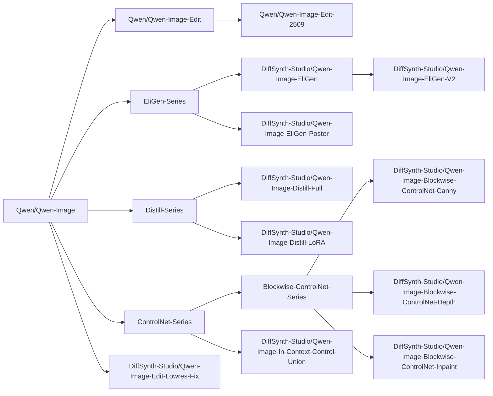

# Qwen-Image


Qwen-Image 是由阿里巴巴通义实验室通义千问团队训练并开源的图像生成模型。

## 安装

在使用本项目进行模型推理和训练前，请先安装 DiffSynth-Studio。

```shell
git clone https://github.com/modelscope/DiffSynth-Studio.git
cd DiffSynth-Studio
pip install -e .
```

更多关于安装的信息，请参考[安装依赖](/docs/zh/Pipeline_Usage/Setup.md)。

## 快速开始

运行以下代码可以快速加载 [Qwen/Qwen-Image](https://www.modelscope.cn/models/Qwen/Qwen-Image) 模型并进行推理。显存管理已启动，框架会自动根据剩余显存控制模型参数的加载，最低 8G 显存即可运行。

```python
from diffsynth.pipelines.qwen_image import QwenImagePipeline, ModelConfig
import torch

vram_config = {
    "offload_dtype": "disk",
    "offload_device": "disk",
    "onload_dtype": torch.float8_e4m3fn,
    "onload_device": "cpu",
    "preparing_dtype": torch.float8_e4m3fn,
    "preparing_device": "cuda",
    "computation_dtype": torch.bfloat16,
    "computation_device": "cuda",
}
pipe = QwenImagePipeline.from_pretrained(
    torch_dtype=torch.bfloat16,
    device="cuda",
    model_configs=[
        ModelConfig(model_id="Qwen/Qwen-Image", origin_file_pattern="transformer/diffusion_pytorch_model*.safetensors", **vram_config),
        ModelConfig(model_id="Qwen/Qwen-Image", origin_file_pattern="text_encoder/model*.safetensors", **vram_config),
        ModelConfig(model_id="Qwen/Qwen-Image", origin_file_pattern="vae/diffusion_pytorch_model.safetensors", **vram_config),
    ],
    tokenizer_config=ModelConfig(model_id="Qwen/Qwen-Image", origin_file_pattern="tokenizer/"),
    vram_limit=torch.cuda.mem_get_info("cuda")[1] / (1024 ** 3) - 0.5,
)
prompt = "精致肖像，水下少女，蓝裙飘逸，发丝轻扬，光影透澈，气泡环绕，面容恬静，细节精致，梦幻唯美。"
image = pipe(prompt, seed=0, num_inference_steps=40)
image.save("image.jpg")
```

## 模型总览

<details>

<summary>模型血缘</summary>



</details>

|模型 ID|推理|低显存推理|全量训练|全量训练后验证|LoRA 训练|LoRA 训练后验证|
|-|-|-|-|-|-|-|
|[Qwen/Qwen-Image](https://www.modelscope.cn/models/Qwen/Qwen-Image)|[code](/examples/qwen_image/model_inference/Qwen-Image.py)|[code](/examples/qwen_image/model_inference_low_vram/Qwen-Image.py)|[code](/examples/qwen_image/model_training/full/Qwen-Image.sh)|[code](/examples/qwen_image/model_training/validate_full/Qwen-Image.py)|[code](/examples/qwen_image/model_training/lora/Qwen-Image.sh)|[code](/examples/qwen_image/model_training/validate_lora/Qwen-Image.py)|
|[Qwen/Qwen-Image-2512](https://www.modelscope.cn/models/Qwen/Qwen-Image-2512)|[code](/examples/qwen_image/model_inference/Qwen-Image-2512.py)|[code](/examples/qwen_image/model_inference_low_vram/Qwen-Image-2512.py)|[code](/examples/qwen_image/model_training/full/Qwen-Image-2512.sh)|[code](/examples/qwen_image/model_training/validate_full/Qwen-Image-2512.py)|[code](/examples/qwen_image/model_training/lora/Qwen-Image-2512.sh)|[code](/examples/qwen_image/model_training/validate_lora/Qwen-Image-2512.py)|
|[Qwen/Qwen-Image-Edit](https://www.modelscope.cn/models/Qwen/Qwen-Image-Edit)|[code](/examples/qwen_image/model_inference/Qwen-Image-Edit.py)|[code](/examples/qwen_image/model_inference_low_vram/Qwen-Image-Edit.py)|[code](/examples/qwen_image/model_training/full/Qwen-Image-Edit.sh)|[code](/examples/qwen_image/model_training/validate_full/Qwen-Image-Edit.py)|[code](/examples/qwen_image/model_training/lora/Qwen-Image-Edit.sh)|[code](/examples/qwen_image/model_training/validate_lora/Qwen-Image-Edit.py)|
|[Qwen/Qwen-Image-Edit-2509](https://www.modelscope.cn/models/Qwen/Qwen-Image-Edit-2509)|[code](/examples/qwen_image/model_inference/Qwen-Image-Edit-2509.py)|[code](/examples/qwen_image/model_inference_low_vram/Qwen-Image-Edit-2509.py)|[code](/examples/qwen_image/model_training/full/Qwen-Image-Edit-2509.sh)|[code](/examples/qwen_image/model_training/validate_full/Qwen-Image-Edit-2509.py)|[code](/examples/qwen_image/model_training/lora/Qwen-Image-Edit-2509.sh)|[code](/examples/qwen_image/model_training/validate_lora/Qwen-Image-Edit-2509.py)|
|[Qwen/Qwen-Image-Edit-2511](https://www.modelscope.cn/models/Qwen/Qwen-Image-Edit-2511)|[code](/examples/qwen_image/model_inference/Qwen-Image-Edit-2511.py)|[code](/examples/qwen_image/model_inference_low_vram/Qwen-Image-Edit-2511.py)|[code](/examples/qwen_image/model_training/full/Qwen-Image-Edit-2511.sh)|[code](/examples/qwen_image/model_training/validate_full/Qwen-Image-Edit-2511.py)|[code](/examples/qwen_image/model_training/lora/Qwen-Image-Edit-2511.sh)|[code](/examples/qwen_image/model_training/validate_lora/Qwen-Image-Edit-2511.py)|
|[lightx2v/Qwen-Image-Edit-2511-Lightning](https://modelscope.cn/models/lightx2v/Qwen-Image-Edit-2511-Lightning)|[code](/examples/qwen_image/model_inference/Qwen-Image-Edit-2511-Lightning.py)|[code](/examples/qwen_image/model_inference_low_vram/Qwen-Image-Edit-2511-Lightning.py)|-|-|-|-|
|[Qwen/Qwen-Image-Layered](https://www.modelscope.cn/models/Qwen/Qwen-Image-Layered)|[code](/examples/qwen_image/model_inference/Qwen-Image-Layered.py)|[code](/examples/qwen_image/model_inference_low_vram/Qwen-Image-Layered.py)|[code](/examples/qwen_image/model_training/full/Qwen-Image-Layered.sh)|[code](/examples/qwen_image/model_training/validate_full/Qwen-Image-Layered.py)|[code](/examples/qwen_image/model_training/lora/Qwen-Image-Layered.sh)|[code](/examples/qwen_image/model_training/validate_lora/Qwen-Image-Layered.py)|
|[DiffSynth-Studio/Qwen-Image-Layered-Control](https://www.modelscope.cn/models/DiffSynth-Studio/Qwen-Image-Layered-Control)|[code](/examples/qwen_image/model_inference/Qwen-Image-Layered-Control.py)|[code](/examples/qwen_image/model_inference_low_vram/Qwen-Image-Layered-Control.py)|[code](/examples/qwen_image/model_training/full/Qwen-Image-Layered-Control.sh)|[code](/examples/qwen_image/model_training/validate_full/Qwen-Image-Layered-Control.py)|[code](/examples/qwen_image/model_training/lora/Qwen-Image-Layered-Control.sh)|[code](/examples/qwen_image/model_training/validate_lora/Qwen-Image-Layered-Control.py)|
|[DiffSynth-Studio/Qwen-Image-EliGen](https://www.modelscope.cn/models/DiffSynth-Studio/Qwen-Image-EliGen)|[code](/examples/qwen_image/model_inference/Qwen-Image-EliGen.py)|[code](/examples/qwen_image/model_inference_low_vram/Qwen-Image-EliGen.py)|-|-|[code](/examples/qwen_image/model_training/lora/Qwen-Image-EliGen.sh)|[code](/examples/qwen_image/model_training/validate_lora/Qwen-Image-EliGen.py)|
|[DiffSynth-Studio/Qwen-Image-EliGen-V2](https://www.modelscope.cn/models/DiffSynth-Studio/Qwen-Image-EliGen-V2)|[code](/examples/qwen_image/model_inference/Qwen-Image-EliGen-V2.py)|[code](/examples/qwen_image/model_inference_low_vram/Qwen-Image-EliGen-V2.py)|-|-|[code](/examples/qwen_image/model_training/lora/Qwen-Image-EliGen.sh)|[code](/examples/qwen_image/model_training/validate_lora/Qwen-Image-EliGen.py)|
|[DiffSynth-Studio/Qwen-Image-EliGen-Poster](https://www.modelscope.cn/models/DiffSynth-Studio/Qwen-Image-EliGen-Poster)|[code](/examples/qwen_image/model_inference/Qwen-Image-EliGen-Poster.py)|[code](/examples/qwen_image/model_inference_low_vram/Qwen-Image-EliGen-Poster.py)|-|-|[code](/examples/qwen_image/model_training/lora/Qwen-Image-EliGen-Poster.sh)|[code](/examples/qwen_image/model_training/validate_lora/Qwen-Image-EliGen-Poster.py)|
|[DiffSynth-Studio/Qwen-Image-Distill-Full](https://www.modelscope.cn/models/DiffSynth-Studio/Qwen-Image-Distill-Full)|[code](/examples/qwen_image/model_inference/Qwen-Image-Distill-Full.py)|[code](/examples/qwen_image/model_inference_low_vram/Qwen-Image-Distill-Full.py)|[code](/examples/qwen_image/model_training/full/Qwen-Image-Distill-Full.sh)|[code](/examples/qwen_image/model_training/validate_full/Qwen-Image-Distill-Full.py)|[code](/examples/qwen_image/model_training/lora/Qwen-Image-Distill-Full.sh)|[code](/examples/qwen_image/model_training/validate_lora/Qwen-Image-Distill-Full.py)|
|[DiffSynth-Studio/Qwen-Image-Distill-LoRA](https://www.modelscope.cn/models/DiffSynth-Studio/Qwen-Image-Distill-LoRA)|[code](/examples/qwen_image/model_inference/Qwen-Image-Distill-LoRA.py)|[code](/examples/qwen_image/model_inference_low_vram/Qwen-Image-Distill-LoRA.py)|-|-|[code](/examples/qwen_image/model_training/lora/Qwen-Image-Distill-LoRA.sh)|[code](/examples/qwen_image/model_training/validate_lora/Qwen-Image-Distill-LoRA.py)|
|[DiffSynth-Studio/Qwen-Image-Blockwise-ControlNet-Canny](https://modelscope.cn/models/DiffSynth-Studio/Qwen-Image-Blockwise-ControlNet-Canny)|[code](/examples/qwen_image/model_inference/Qwen-Image-Blockwise-ControlNet-Canny.py)|[code](/examples/qwen_image/model_inference_low_vram/Qwen-Image-Blockwise-ControlNet-Canny.py)|[code](/examples/qwen_image/model_training/full/Qwen-Image-Blockwise-ControlNet-Canny.sh)|[code](/examples/qwen_image/model_training/validate_full/Qwen-Image-Blockwise-ControlNet-Canny.py)|[code](/examples/qwen_image/model_training/lora/Qwen-Image-Blockwise-ControlNet-Canny.sh)|[code](/examples/qwen_image/model_training/validate_lora/Qwen-Image-Blockwise-ControlNet-Canny.py)|
|[DiffSynth-Studio/Qwen-Image-Blockwise-ControlNet-Depth](https://modelscope.cn/models/DiffSynth-Studio/Qwen-Image-Blockwise-ControlNet-Depth)|[code](/examples/qwen_image/model_inference/Qwen-Image-Blockwise-ControlNet-Depth.py)|[code](/examples/qwen_image/model_inference_low_vram/Qwen-Image-Blockwise-ControlNet-Depth.py)|[code](/examples/qwen_image/model_training/full/Qwen-Image-Blockwise-ControlNet-Depth.sh)|[code](/examples/qwen_image/model_training/validate_full/Qwen-Image-Blockwise-ControlNet-Depth.py)|[code](/examples/qwen_image/model_training/lora/Qwen-Image-Blockwise-ControlNet-Depth.sh)|[code](/examples/qwen_image/model_training/validate_lora/Qwen-Image-Blockwise-ControlNet-Depth.py)|
|[DiffSynth-Studio/Qwen-Image-Blockwise-ControlNet-Inpaint](https://modelscope.cn/models/DiffSynth-Studio/Qwen-Image-Blockwise-ControlNet-Inpaint)|[code](/examples/qwen_image/model_inference/Qwen-Image-Blockwise-ControlNet-Inpaint.py)|[code](/examples/qwen_image/model_inference_low_vram/Qwen-Image-Blockwise-ControlNet-Inpaint.py)|[code](/examples/qwen_image/model_training/full/Qwen-Image-Blockwise-ControlNet-Inpaint.sh)|[code](/examples/qwen_image/model_training/validate_full/Qwen-Image-Blockwise-ControlNet-Inpaint.py)|[code](/examples/qwen_image/model_training/lora/Qwen-Image-Blockwise-ControlNet-Inpaint.sh)|[code](/examples/qwen_image/model_training/validate_lora/Qwen-Image-Blockwise-ControlNet-Inpaint.py)|
|[DiffSynth-Studio/Qwen-Image-In-Context-Control-Union](https://www.modelscope.cn/models/DiffSynth-Studio/Qwen-Image-In-Context-Control-Union)|[code](/examples/qwen_image/model_inference/Qwen-Image-In-Context-Control-Union.py)|[code](/examples/qwen_image/model_inference_low_vram/Qwen-Image-In-Context-Control-Union.py)|-|-|[code](/examples/qwen_image/model_training/lora/Qwen-Image-In-Context-Control-Union.sh)|[code](/examples/qwen_image/model_training/validate_lora/Qwen-Image-In-Context-Control-Union.py)|
|[DiffSynth-Studio/Qwen-Image-Edit-Lowres-Fix](https://www.modelscope.cn/models/DiffSynth-Studio/Qwen-Image-Edit-Lowres-Fix)|[code](/examples/qwen_image/model_inference/Qwen-Image-Edit-Lowres-Fix.py)|[code](/examples/qwen_image/model_inference_low_vram/Qwen-Image-Edit-Lowres-Fix.py)|-|-|-|-|
|[DiffSynth-Studio/Qwen-Image-i2L](https://www.modelscope.cn/models/DiffSynth-Studio/Qwen-Image-i2L)|[code](/examples/qwen_image/model_inference/Qwen-Image-i2L.py)|[code](/examples/qwen_image/model_inference_low_vram/Qwen-Image-i2L.py)|-|-|-|-|

特殊训练脚本：

* 差分 LoRA 训练：[doc](/docs/zh/Training/Differential_LoRA.md)、[code](/examples/qwen_image/model_training/special/differential_training/)
* FP8 精度训练：[doc](/docs/zh/Training/FP8_Precision.md)、[code](/examples/qwen_image/model_training/special/fp8_training/)
* 两阶段拆分训练：[doc](/docs/zh/Training/Split_Training.md)、[code](/examples/qwen_image/model_training/special/split_training/)
* 端到端直接蒸馏：[doc](/docs/zh/Training/Direct_Distill.md)、[code](/examples/qwen_image/model_training/lora/Qwen-Image-Distill-LoRA.sh)

DeepSpeed ZeRO 3 训练：Qwen-Image 系列模型支持 DeepSpeed ZeRO 3 训练，将模型拆分到多个 GPU 上，以 Qwen-Image 模型的全量训练为例，需修改：

* `--config_file examples/qwen_image/model_training/full/accelerate_config_zero3.yaml`
* `--initialize_model_on_cpu`

## 模型推理

模型通过 `QwenImagePipeline.from_pretrained` 加载，详见[加载模型](/docs/zh/Pipeline_Usage/Model_Inference.md#加载模型)。

`QwenImagePipeline` 推理的输入参数包括：

* `prompt`: 提示词，描述画面中出现的内容。
* `negative_prompt`: 负向提示词，描述画面中不应该出现的内容，默认值为 `""`。
* `cfg_scale`: Classifier-free guidance 的参数，默认值为 4，当设置为 1 时不再生效。
* `input_image`: 输入图像，用于图生图，该参数与 `denoising_strength` 配合使用。
* `denoising_strength`: 去噪强度，范围是 0～1，默认值为 1，当数值接近 0 时，生成图像与输入图像相似；当数值接近 1 时，生成图像与输入图像相差更大。在不输入 `input_image` 参数时，请不要将其设置为非 1 的数值。
* `inpaint_mask`: 图像局部重绘的遮罩图像。
* `inpaint_blur_size`: 图像局部重绘的边缘柔化宽度。
* `inpaint_blur_sigma`: 图像局部重绘的边缘柔化强度。
* `height`: 图像高度，需保证高度为 16 的倍数。
* `width`: 图像宽度，需保证宽度为 16 的倍数。
* `seed`: 随机种子。默认为 `None`，即完全随机。
* `rand_device`: 生成随机高斯噪声矩阵的计算设备，默认为 `"cpu"`。当设置为 `cuda` 时，在不同 GPU 上会导致不同的生成结果。
* `num_inference_steps`: 推理次数，默认值为 30。
* `exponential_shift_mu`: 在采样时间步时采用的固定参数，留空则根据图像宽高进行采样。
* `blockwise_controlnet_inputs`: Blockwise ControlNet 模型的输入。
* `eligen_entity_prompts`: EliGen 分区控制的提示词。
* `eligen_entity_masks`: EliGen 分区控制的区域遮罩图像。
* `eligen_enable_on_negative`: 是否在 CFG 的负向一侧启用 EliGen 分区控制。
* `edit_image`: 编辑模型的待编辑图像，支持多张图像。
* `edit_image_auto_resize`: 是否自动缩放待编辑图像。
* `edit_rope_interpolation`: 是否在低分辨率编辑图像上启用 ROPE 插值。
* `context_image`: In-Context Control 的输入图像。
* `tiled`: 是否启用 VAE 分块推理，默认为 `False`。设置为 `True` 时可显著减少 VAE 编解码阶段的显存占用，会产生少许误差，以及少量推理时间延长。
* `tile_size`: VAE 编解码阶段的分块大小，默认为 128，仅在 `tiled=True` 时生效。
* `tile_stride`: VAE 编解码阶段的分块步长，默认为 64，仅在 `tiled=True` 时生效，需保证其数值小于或等于 `tile_size`。
* `progress_bar_cmd`: 进度条，默认为 `tqdm.tqdm`。可通过设置为 `lambda x:x` 来屏蔽进度条。

如果显存不足，请开启[显存管理](/docs/zh/Pipeline_Usage/VRAM_management.md)，我们在示例代码中提供了每个模型推荐的低显存配置，详见前文“模型总览”中的表格。

## 模型训练

Qwen-Image 系列模型统一通过 [`examples/qwen_image/model_training/train.py`](/examples/qwen_image/model_training/train.py) 进行训练，脚本的参数包括：

* 通用训练参数
    * 数据集基础配置
        * `--dataset_base_path`: 数据集的根目录。
        * `--dataset_metadata_path`: 数据集的元数据文件路径。
        * `--dataset_repeat`: 每个 epoch 中数据集重复的次数。
        * `--dataset_num_workers`: 每个 Dataloder 的进程数量。
        * `--data_file_keys`: 元数据中需要加载的字段名称，通常是图像或视频文件的路径，以 `,` 分隔。
    * 模型加载配置
        * `--model_paths`: 要加载的模型路径。JSON 格式。
        * `--model_id_with_origin_paths`: 带原始路径的模型 ID，例如 `"Qwen/Qwen-Image:transformer/diffusion_pytorch_model*.safetensors"`。用逗号分隔。
        * `--extra_inputs`: 模型 Pipeline 所需的额外输入参数，例如训练图像编辑模型 Qwen-Image-Edit 时需要额外参数 `edit_image`，以 `,` 分隔。
        * `--fp8_models`：以 FP8 格式加载的模型，格式与 `--model_paths` 或 `--model_id_with_origin_paths` 一致，目前仅支持参数不被梯度更新的模型（不需要梯度回传，或梯度仅更新其 LoRA）。
    * 训练基础配置
        * `--learning_rate`: 学习率。
        * `--num_epochs`: 轮数（Epoch）。
        * `--trainable_models`: 可训练的模型，例如 `dit`、`vae`、`text_encoder`。
        * `--find_unused_parameters`: DDP 训练中是否存在未使用的参数，少数模型包含不参与梯度计算的冗余参数，需开启这一设置避免在多 GPU 训练中报错。
        * `--weight_decay`：权重衰减大小，详见 [torch.optim.AdamW](https://docs.pytorch.org/docs/stable/generated/torch.optim.AdamW.html)。
        * `--task`: 训练任务，默认为 `sft`，部分模型支持更多训练模式，请参考每个特定模型的文档。
    * 输出配置
        * `--output_path`: 模型保存路径。
        * `--remove_prefix_in_ckpt`: 在模型文件的 state dict 中移除前缀。
        * `--save_steps`: 保存模型的训练步数间隔，若此参数留空，则每个 epoch 保存一次。
    * LoRA 配置
        * `--lora_base_model`: LoRA 添加到哪个模型上。
        * `--lora_target_modules`: LoRA 添加到哪些层上。
        * `--lora_rank`: LoRA 的秩（Rank）。
        * `--lora_checkpoint`: LoRA 检查点的路径。如果提供此路径，LoRA 将从此检查点加载。
        * `--preset_lora_path`: 预置 LoRA 检查点路径，如果提供此路径，这一 LoRA 将会以融入基础模型的形式加载。此参数用于 LoRA 差分训练。
        * `--preset_lora_model`: 预置 LoRA 融入的模型，例如 `dit`。
    * 梯度配置
        * `--use_gradient_checkpointing`: 是否启用 gradient checkpointing。
        * `--use_gradient_checkpointing_offload`: 是否将 gradient checkpointing 卸载到内存中。
        * `--gradient_accumulation_steps`: 梯度累积步数。
    * 图像宽高配置（适用于图像生成模型和视频生成模型）
        * `--height`: 图像或视频的高度。将 `height` 和 `width` 留空以启用动态分辨率。
        * `--width`: 图像或视频的宽度。将 `height` 和 `width` 留空以启用动态分辨率。
        * `--max_pixels`: 图像或视频帧的最大像素面积，当启用动态分辨率时，分辨率大于这个数值的图片都会被缩小，分辨率小于这个数值的图片保持不变。
* Qwen-Image 专有参数
    * `--tokenizer_path`: tokenizer 的路径，适用于文生图模型，留空则自动从远程下载。
    * `--processor_path`: processor 的路径，适用于图像编辑模型，留空则自动从远程下载。

我们构建了一个样例图像数据集，以方便您进行测试，通过以下命令可以下载这个数据集：

```shell
modelscope download --dataset DiffSynth-Studio/example_image_dataset --local_dir ./data/example_image_dataset
```

我们为每个模型编写了推荐的训练脚本，请参考前文“模型总览”中的表格。关于如何编写模型训练脚本，请参考[模型训练](/docs/zh/Pipeline_Usage/Model_Training.md)；更多高阶训练算法，请参考[训练框架详解](/docs/Training/)。
