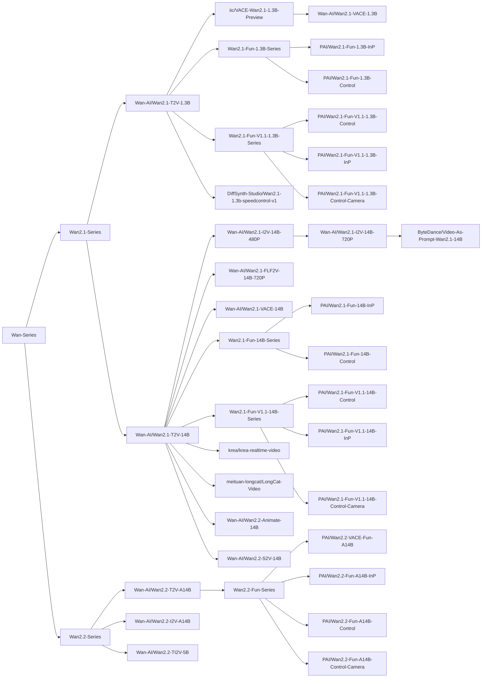

# Wan

https://github.com/user-attachments/assets/1d66ae74-3b02-40a9-acc3-ea95fc039314

Wan 是由阿里巴巴通义实验室通义万相团队开发的视频生成模型系列。

## 安装

在使用本项目进行模型推理和训练前，请先安装 DiffSynth-Studio。

```shell
git clone https://github.com/modelscope/DiffSynth-Studio.git
cd DiffSynth-Studio
pip install -e .
```

更多关于安装的信息，请参考[安装依赖](/docs/zh/Pipeline_Usage/Setup.md)。

## 快速开始

运行以下代码可以快速加载 [Wan-AI/Wan2.1-T2V-1.3B](https://modelscope.cn/models/Wan-AI/Wan2.1-T2V-1.3B) 模型并进行推理。显存管理已启动，框架会自动根据剩余显存控制模型参数的加载，最低 8G 显存即可运行。

```python
import torch
from diffsynth.utils.data import save_video, VideoData
from diffsynth.pipelines.wan_video import WanVideoPipeline, ModelConfig

vram_config = {
    "offload_dtype": "disk",
    "offload_device": "disk",
    "onload_dtype": torch.bfloat16,
    "onload_device": "cpu",
    "preparing_dtype": torch.bfloat16,
    "preparing_device": "cuda",
    "computation_dtype": torch.bfloat16,
    "computation_device": "cuda",
}
pipe = WanVideoPipeline.from_pretrained(
    torch_dtype=torch.bfloat16,
    device="cuda",
    model_configs=[
        ModelConfig(model_id="Wan-AI/Wan2.1-T2V-1.3B", origin_file_pattern="diffusion_pytorch_model*.safetensors", **vram_config),
        ModelConfig(model_id="Wan-AI/Wan2.1-T2V-1.3B", origin_file_pattern="models_t5_umt5-xxl-enc-bf16.pth", **vram_config),
        ModelConfig(model_id="Wan-AI/Wan2.1-T2V-1.3B", origin_file_pattern="Wan2.1_VAE.pth", **vram_config),
    ],
    tokenizer_config=ModelConfig(model_id="Wan-AI/Wan2.1-T2V-1.3B", origin_file_pattern="google/umt5-xxl/"),
    vram_limit=torch.cuda.mem_get_info("cuda")[1] / (1024 ** 3) - 2,
)

video = pipe(
    prompt="纪实摄影风格画面，一只活泼的小狗在绿茵茵的草地上迅速奔跑。小狗毛色棕黄，两只耳朵立起，神情专注而欢快。阳光洒在它身上，使得毛发看上去格外柔软而闪亮。背景是一片开阔的草地，偶尔点缀着几朵野花，远处隐约可见蓝天和几片白云。透视感鲜明，捕捉小狗奔跑时的动感和四周草地的生机。中景侧面移动视角。",
    negative_prompt="色调艳丽，过曝，静态，细节模糊不清，字幕，风格，作品，画作，画面，静止，整体发灰，最差质量，低质量，JPEG压缩残留，丑陋的，残缺的，多余的手指，画得不好的手部，画得不好的脸部，畸形的，毁容的，形态畸形的肢体，手指融合，静止不动的画面，杂乱的背景，三条腿，背景人很多，倒着走",
    seed=0, tiled=True,
)
save_video(video, "video.mp4", fps=15, quality=5)
```

## 模型总览

<details>

<summary>模型血缘</summary>



</details>

|模型 ID|额外参数|推理|全量训练|全量训练后验证|LoRA 训练|LoRA 训练后验证|
|-|-|-|-|-|-|-|
|[Wan-AI/Wan2.1-T2V-1.3B](https://modelscope.cn/models/Wan-AI/Wan2.1-T2V-1.3B)||[code](/examples/wanvideo/model_inference/Wan2.1-T2V-1.3B.py)|[code](/examples/wanvideo/model_training/full/Wan2.1-T2V-1.3B.sh)|[code](/examples/wanvideo/model_training/validate_full/Wan2.1-T2V-1.3B.py)|[code](/examples/wanvideo/model_training/lora/Wan2.1-T2V-1.3B.sh)|[code](/examples/wanvideo/model_training/validate_lora/Wan2.1-T2V-1.3B.py)|
|[Wan-AI/Wan2.1-T2V-14B](https://modelscope.cn/models/Wan-AI/Wan2.1-T2V-14B)||[code](/examples/wanvideo/model_inference/Wan2.1-T2V-14B.py)|[code](/examples/wanvideo/model_training/full/Wan2.1-T2V-14B.sh)|[code](/examples/wanvideo/model_training/validate_full/Wan2.1-T2V-14B.py)|[code](/examples/wanvideo/model_training/lora/Wan2.1-T2V-14B.sh)|[code](/examples/wanvideo/model_training/validate_lora/Wan2.1-T2V-14B.py)|
|[Wan-AI/Wan2.1-I2V-14B-480P](https://modelscope.cn/models/Wan-AI/Wan2.1-I2V-14B-480P)|`input_image`|[code](/examples/wanvideo/model_inference/Wan2.1-I2V-14B-480P.py)|[code](/examples/wanvideo/model_training/full/Wan2.1-I2V-14B-480P.sh)|[code](/examples/wanvideo/model_training/validate_full/Wan2.1-I2V-14B-480P.py)|[code](/examples/wanvideo/model_training/lora/Wan2.1-I2V-14B-480P.sh)|[code](/examples/wanvideo/model_training/validate_lora/Wan2.1-I2V-14B-480P.py)|
|[Wan-AI/Wan2.1-I2V-14B-720P](https://modelscope.cn/models/Wan-AI/Wan2.1-I2V-14B-720P)|`input_image`|[code](/examples/wanvideo/model_inference/Wan2.1-I2V-14B-720P.py)|[code](/examples/wanvideo/model_training/full/Wan2.1-I2V-14B-720P.sh)|[code](/examples/wanvideo/model_training/validate_full/Wan2.1-I2V-14B-720P.py)|[code](/examples/wanvideo/model_training/lora/Wan2.1-I2V-14B-720P.sh)|[code](/examples/wanvideo/model_training/validate_lora/Wan2.1-I2V-14B-720P.py)|
|[Wan-AI/Wan2.1-FLF2V-14B-720P](https://modelscope.cn/models/Wan-AI/Wan2.1-FLF2V-14B-720P)|`input_image`, `end_image`|[code](/examples/wanvideo/model_inference/Wan2.1-FLF2V-14B-720P.py)|[code](/examples/wanvideo/model_training/full/Wan2.1-FLF2V-14B-720P.sh)|[code](/examples/wanvideo/model_training/validate_full/Wan2.1-FLF2V-14B-720P.py)|[code](/examples/wanvideo/model_training/lora/Wan2.1-FLF2V-14B-720P.sh)|[code](/examples/wanvideo/model_training/validate_lora/Wan2.1-FLF2V-14B-720P.py)|
|[iic/VACE-Wan2.1-1.3B-Preview](https://modelscope.cn/models/iic/VACE-Wan2.1-1.3B-Preview)|`vace_control_video`, `vace_reference_image`|[code](/examples/wanvideo/model_inference/Wan2.1-VACE-1.3B-Preview.py)|[code](/examples/wanvideo/model_training/full/Wan2.1-VACE-1.3B-Preview.sh)|[code](/examples/wanvideo/model_training/validate_full/Wan2.1-VACE-1.3B-Preview.py)|[code](/examples/wanvideo/model_training/lora/Wan2.1-VACE-1.3B-Preview.sh)|[code](/examples/wanvideo/model_training/validate_lora/Wan2.1-VACE-1.3B-Preview.py)|
|[Wan-AI/Wan2.1-VACE-1.3B](https://modelscope.cn/models/Wan-AI/Wan2.1-VACE-1.3B)|`vace_control_video`, `vace_reference_image`|[code](/examples/wanvideo/model_inference/Wan2.1-VACE-1.3B.py)|[code](/examples/wanvideo/model_training/full/Wan2.1-VACE-1.3B.sh)|[code](/examples/wanvideo/model_training/validate_full/Wan2.1-VACE-1.3B.py)|[code](/examples/wanvideo/model_training/lora/Wan2.1-VACE-1.3B.sh)|[code](/examples/wanvideo/model_training/validate_lora/Wan2.1-VACE-1.3B.py)|
|[Wan-AI/Wan2.1-VACE-14B](https://modelscope.cn/models/Wan-AI/Wan2.1-VACE-14B)|`vace_control_video`, `vace_reference_image`|[code](/examples/wanvideo/model_inference/Wan2.1-VACE-14B.py)|[code](/examples/wanvideo/model_training/full/Wan2.1-VACE-14B.sh)|[code](/examples/wanvideo/model_training/validate_full/Wan2.1-VACE-14B.py)|[code](/examples/wanvideo/model_training/lora/Wan2.1-VACE-14B.sh)|[code](/examples/wanvideo/model_training/validate_lora/Wan2.1-VACE-14B.py)|
|[PAI/Wan2.1-Fun-1.3B-InP](https://modelscope.cn/models/PAI/Wan2.1-Fun-1.3B-InP)|`input_image`, `end_image`|[code](/examples/wanvideo/model_inference/Wan2.1-Fun-1.3B-InP.py)|[code](/examples/wanvideo/model_training/full/Wan2.1-Fun-1.3B-InP.sh)|[code](/examples/wanvideo/model_training/validate_full/Wan2.1-Fun-1.3B-InP.py)|[code](/examples/wanvideo/model_training/lora/Wan2.1-Fun-1.3B-InP.sh)|[code](/examples/wanvideo/model_training/validate_lora/Wan2.1-Fun-1.3B-InP.py)|
|[PAI/Wan2.1-Fun-1.3B-Control](https://modelscope.cn/models/PAI/Wan2.1-Fun-1.3B-Control)|`control_video`|[code](/examples/wanvideo/model_inference/Wan2.1-Fun-1.3B-Control.py)|[code](/examples/wanvideo/model_training/full/Wan2.1-Fun-1.3B-Control.sh)|[code](/examples/wanvideo/model_training/validate_full/Wan2.1-Fun-1.3B-Control.py)|[code](/examples/wanvideo/model_training/lora/Wan2.1-Fun-1.3B-Control.sh)|[code](/examples/wanvideo/model_training/validate_lora/Wan2.1-Fun-1.3B-Control.py)|
|[PAI/Wan2.1-Fun-14B-InP](https://modelscope.cn/models/PAI/Wan2.1-Fun-14B-InP)|`input_image`, `end_image`|[code](/examples/wanvideo/model_inference/Wan2.1-Fun-14B-InP.py)|[code](/examples/wanvideo/model_training/full/Wan2.1-Fun-14B-InP.sh)|[code](/examples/wanvideo/model_training/validate_full/Wan2.1-Fun-14B-InP.py)|[code](/examples/wanvideo/model_training/lora/Wan2.1-Fun-14B-InP.sh)|[code](/examples/wanvideo/model_training/validate_lora/Wan2.1-Fun-14B-InP.py)|
|[PAI/Wan2.1-Fun-14B-Control](https://modelscope.cn/models/PAI/Wan2.1-Fun-14B-Control)|`control_video`|[code](/examples/wanvideo/model_inference/Wan2.1-Fun-14B-Control.py)|[code](/examples/wanvideo/model_training/full/Wan2.1-Fun-14B-Control.sh)|[code](/examples/wanvideo/model_training/validate_full/Wan2.1-Fun-14B-Control.py)|[code](/examples/wanvideo/model_training/lora/Wan2.1-Fun-14B-Control.sh)|[code](/examples/wanvideo/model_training/validate_lora/Wan2.1-Fun-14B-Control.py)|
|[PAI/Wan2.1-Fun-V1.1-1.3B-Control](https://modelscope.cn/models/PAI/Wan2.1-Fun-V1.1-1.3B-Control)|`control_video`, `reference_image`|[code](/examples/wanvideo/model_inference/Wan2.1-Fun-V1.1-1.3B-Control.py)|[code](/examples/wanvideo/model_training/full/Wan2.1-Fun-V1.1-1.3B-Control.sh)|[code](/examples/wanvideo/model_training/validate_full/Wan2.1-Fun-V1.1-1.3B-Control.py)|[code](/examples/wanvideo/model_training/lora/Wan2.1-Fun-V1.1-1.3B-Control.sh)|[code](/examples/wanvideo/model_training/validate_lora/Wan2.1-Fun-V1.1-1.3B-Control.py)|
|[PAI/Wan2.1-Fun-V1.1-14B-Control](https://modelscope.cn/models/PAI/Wan2.1-Fun-V1.1-14B-Control)|`control_video`, `reference_image`|[code](/examples/wanvideo/model_inference/Wan2.1-Fun-V1.1-14B-Control.py)|[code](/examples/wanvideo/model_training/full/Wan2.1-Fun-V1.1-14B-Control.sh)|[code](/examples/wanvideo/model_training/validate_full/Wan2.1-Fun-V1.1-14B-Control.py)|[code](/examples/wanvideo/model_training/lora/Wan2.1-Fun-V1.1-14B-Control.sh)|[code](/examples/wanvideo/model_training/validate_lora/Wan2.1-Fun-V1.1-14B-Control.py)|
|[PAI/Wan2.1-Fun-V1.1-1.3B-InP](https://modelscope.cn/models/PAI/Wan2.1-Fun-V1.1-1.3B-InP)|`input_image`, `end_image`|[code](/examples/wanvideo/model_inference/Wan2.1-Fun-V1.1-1.3B-InP.py)|[code](/examples/wanvideo/model_training/full/Wan2.1-Fun-V1.1-1.3B-InP.sh)|[code](/examples/wanvideo/model_training/validate_full/Wan2.1-Fun-V1.1-1.3B-InP.py)|[code](/examples/wanvideo/model_training/lora/Wan2.1-Fun-V1.1-1.3B-InP.sh)|[code](/examples/wanvideo/model_training/validate_lora/Wan2.1-Fun-V1.1-1.3B-InP.py)|
|[PAI/Wan2.1-Fun-V1.1-14B-InP](https://modelscope.cn/models/PAI/Wan2.1-Fun-V1.1-14B-InP)|`input_image`, `end_image`|[code](/examples/wanvideo/model_inference/Wan2.1-Fun-V1.1-14B-InP.py)|[code](/examples/wanvideo/model_training/full/Wan2.1-Fun-V1.1-14B-InP.sh)|[code](/examples/wanvideo/model_training/validate_full/Wan2.1-Fun-V1.1-14B-InP.py)|[code](/examples/wanvideo/model_training/lora/Wan2.1-Fun-V1.1-14B-InP.sh)|[code](/examples/wanvideo/model_training/validate_lora/Wan2.1-Fun-V1.1-14B-InP.py)|
|[PAI/Wan2.1-Fun-V1.1-1.3B-Control-Camera](https://modelscope.cn/models/PAI/Wan2.1-Fun-V1.1-1.3B-Control-Camera)|`control_camera_video`, `input_image`|[code](/examples/wanvideo/model_inference/Wan2.1-Fun-V1.1-1.3B-Control-Camera.py)|[code](/examples/wanvideo/model_training/full/Wan2.1-Fun-V1.1-1.3B-Control-Camera.sh)|[code](/examples/wanvideo/model_training/validate_full/Wan2.1-Fun-V1.1-1.3B-Control-Camera.py)|[code](/examples/wanvideo/model_training/lora/Wan2.1-Fun-V1.1-1.3B-Control-Camera.sh)|[code](/examples/wanvideo/model_training/validate_lora/Wan2.1-Fun-V1.1-1.3B-Control-Camera.py)|
|[PAI/Wan2.1-Fun-V1.1-14B-Control-Camera](https://modelscope.cn/models/PAI/Wan2.1-Fun-V1.1-14B-Control-Camera)|`control_camera_video`, `input_image`|[code](/examples/wanvideo/model_inference/Wan2.1-Fun-V1.1-14B-Control-Camera.py)|[code](/examples/wanvideo/model_training/full/Wan2.1-Fun-V1.1-14B-Control-Camera.sh)|[code](/examples/wanvideo/model_training/validate_full/Wan2.1-Fun-V1.1-14B-Control-Camera.py)|[code](/examples/wanvideo/model_training/lora/Wan2.1-Fun-V1.1-14B-Control-Camera.sh)|[code](/examples/wanvideo/model_training/validate_lora/Wan2.1-Fun-V1.1-14B-Control-Camera.py)|
|[DiffSynth-Studio/Wan2.1-1.3b-speedcontrol-v1](https://modelscope.cn/models/DiffSynth-Studio/Wan2.1-1.3b-speedcontrol-v1)|`motion_bucket_id`|[code](/examples/wanvideo/model_inference/Wan2.1-1.3b-speedcontrol-v1.py)|[code](/examples/wanvideo/model_training/full/Wan2.1-1.3b-speedcontrol-v1.sh)|[code](/examples/wanvideo/model_training/validate_full/Wan2.1-1.3b-speedcontrol-v1.py)|[code](/examples/wanvideo/model_training/lora/Wan2.1-1.3b-speedcontrol-v1.sh)|[code](/examples/wanvideo/model_training/validate_lora/Wan2.1-1.3b-speedcontrol-v1.py)|
|[krea/krea-realtime-video](https://www.modelscope.cn/models/krea/krea-realtime-video)||[code](/examples/wanvideo/model_inference/krea-realtime-video.py)|[code](/examples/wanvideo/model_training/full/krea-realtime-video.sh)|[code](/examples/wanvideo/model_training/validate_full/krea-realtime-video.py)|[code](/examples/wanvideo/model_training/lora/krea-realtime-video.sh)|[code](/examples/wanvideo/model_training/validate_lora/krea-realtime-video.py)|
|[meituan-longcat/LongCat-Video](https://www.modelscope.cn/models/meituan-longcat/LongCat-Video)|`longcat_video`|[code](/examples/wanvideo/model_inference/LongCat-Video.py)|[code](/examples/wanvideo/model_training/full/LongCat-Video.sh)|[code](/examples/wanvideo/model_training/validate_full/LongCat-Video.py)|[code](/examples/wanvideo/model_training/lora/LongCat-Video.sh)|[code](/examples/wanvideo/model_training/validate_lora/LongCat-Video.py)|
|[ByteDance/Video-As-Prompt-Wan2.1-14B](https://modelscope.cn/models/ByteDance/Video-As-Prompt-Wan2.1-14B)|`vap_video`, `vap_prompt`|[code](/examples/wanvideo/model_inference/Video-As-Prompt-Wan2.1-14B.py)|[code](/examples/wanvideo/model_training/full/Video-As-Prompt-Wan2.1-14B.sh)|[code](/examples/wanvideo/model_training/validate_full/Video-As-Prompt-Wan2.1-14B.py)|[code](/examples/wanvideo/model_training/lora/Video-As-Prompt-Wan2.1-14B.sh)|[code](/examples/wanvideo/model_training/validate_lora/Video-As-Prompt-Wan2.1-14B.py)|
|[Wan-AI/Wan2.2-T2V-A14B](https://modelscope.cn/models/Wan-AI/Wan2.2-T2V-A14B)||[code](/examples/wanvideo/model_inference/Wan2.2-T2V-A14B.py)|[code](/examples/wanvideo/model_training/full/Wan2.2-T2V-A14B.sh)|[code](/examples/wanvideo/model_training/validate_full/Wan2.2-T2V-A14B.py)|[code](/examples/wanvideo/model_training/lora/Wan2.2-T2V-A14B.sh)|[code](/examples/wanvideo/model_training/validate_lora/Wan2.2-T2V-A14B.py)|
|[Wan-AI/Wan2.2-I2V-A14B](https://modelscope.cn/models/Wan-AI/Wan2.2-I2V-A14B)|`input_image`|[code](/examples/wanvideo/model_inference/Wan2.2-I2V-A14B.py)|[code](/examples/wanvideo/model_training/full/Wan2.2-I2V-A14B.sh)|[code](/examples/wanvideo/model_training/validate_full/Wan2.2-I2V-A14B.py)|[code](/examples/wanvideo/model_training/lora/Wan2.2-I2V-A14B.sh)|[code](/examples/wanvideo/model_training/validate_lora/Wan2.2-I2V-A14B.py)|
|[Wan-AI/Wan2.2-TI2V-5B](https://modelscope.cn/models/Wan-AI/Wan2.2-TI2V-5B)|`input_image`|[code](/examples/wanvideo/model_inference/Wan2.2-TI2V-5B.py)|[code](/examples/wanvideo/model_training/full/Wan2.2-TI2V-5B.sh)|[code](/examples/wanvideo/model_training/validate_full/Wan2.2-TI2V-5B.py)|[code](/examples/wanvideo/model_training/lora/Wan2.2-TI2V-5B.sh)|[code](/examples/wanvideo/model_training/validate_lora/Wan2.2-TI2V-5B.py)|
|[Wan-AI/Wan2.2-Animate-14B](https://www.modelscope.cn/models/Wan-AI/Wan2.2-Animate-14B)|`input_image`, `animate_pose_video`, `animate_face_video`, `animate_inpaint_video`, `animate_mask_video`|[code](/examples/wanvideo/model_inference/Wan2.2-Animate-14B.py)|[code](/examples/wanvideo/model_training/full/Wan2.2-Animate-14B.sh)|[code](/examples/wanvideo/model_training/validate_full/Wan2.2-Animate-14B.py)|[code](/examples/wanvideo/model_training/lora/Wan2.2-Animate-14B.sh)|[code](/examples/wanvideo/model_training/validate_lora/Wan2.2-Animate-14B.py)|
|[Wan-AI/Wan2.2-S2V-14B](https://www.modelscope.cn/models/Wan-AI/Wan2.2-S2V-14B)|`input_image`, `input_audio`, `audio_sample_rate`, `s2v_pose_video`|[code](/examples/wanvideo/model_inference/Wan2.2-S2V-14B_multi_clips.py)|[code](/examples/wanvideo/model_training/full/Wan2.2-S2V-14B.sh)|[code](/examples/wanvideo/model_training/validate_full/Wan2.2-S2V-14B.py)|[code](/examples/wanvideo/model_training/lora/Wan2.2-S2V-14B.sh)|[code](/examples/wanvideo/model_training/validate_lora/Wan2.2-S2V-14B.py)|
|[PAI/Wan2.2-VACE-Fun-A14B](https://www.modelscope.cn/models/PAI/Wan2.2-VACE-Fun-A14B)|`vace_control_video`, `vace_reference_image`|[code](/examples/wanvideo/model_inference/Wan2.2-VACE-Fun-A14B.py)|[code](/examples/wanvideo/model_training/full/Wan2.2-VACE-Fun-A14B.sh)|[code](/examples/wanvideo/model_training/validate_full/Wan2.2-VACE-Fun-A14B.py)|[code](/examples/wanvideo/model_training/lora/Wan2.2-VACE-Fun-A14B.sh)|[code](/examples/wanvideo/model_training/validate_lora/Wan2.2-VACE-Fun-A14B.py)|
|[PAI/Wan2.2-Fun-A14B-InP](https://modelscope.cn/models/PAI/Wan2.2-Fun-A14B-InP)|`input_image`, `end_image`|[code](/examples/wanvideo/model_inference/Wan2.2-Fun-A14B-InP.py)|[code](/examples/wanvideo/model_training/full/Wan2.2-Fun-A14B-InP.sh)|[code](/examples/wanvideo/model_training/validate_full/Wan2.2-Fun-A14B-InP.py)|[code](/examples/wanvideo/model_training/lora/Wan2.2-Fun-A14B-InP.sh)|[code](/examples/wanvideo/model_training/validate_lora/Wan2.2-Fun-A14B-InP.py)|
|[PAI/Wan2.2-Fun-A14B-Control](https://modelscope.cn/models/PAI/Wan2.2-Fun-A14B-Control)|`control_video`, `reference_image`|[code](/examples/wanvideo/model_inference/Wan2.2-Fun-A14B-Control.py)|[code](/examples/wanvideo/model_training/full/Wan2.2-Fun-A14B-Control.sh)|[code](/examples/wanvideo/model_training/validate_full/Wan2.2-Fun-A14B-Control.py)|[code](/examples/wanvideo/model_training/lora/Wan2.2-Fun-A14B-Control.sh)|[code](/examples/wanvideo/model_training/validate_lora/Wan2.2-Fun-A14B-Control.py)|
|[PAI/Wan2.2-Fun-A14B-Control-Camera](https://modelscope.cn/models/PAI/Wan2.2-Fun-A14B-Control-Camera)|`control_camera_video`, `input_image`|[code](/examples/wanvideo/model_inference/Wan2.2-Fun-A14B-Control-Camera.py)|[code](/examples/wanvideo/model_training/full/Wan2.2-Fun-A14B-Control-Camera.sh)|[code](/examples/wanvideo/model_training/validate_full/Wan2.2-Fun-A14B-Control-Camera.py)|[code](/examples/wanvideo/model_training/lora/Wan2.2-Fun-A14B-Control-Camera.sh)|[code](/examples/wanvideo/model_training/validate_lora/Wan2.2-Fun-A14B-Control-Camera.py)|

* FP8 精度训练：[doc](/docs/zh/Training/FP8_Precision.md)、[code](/examples/wanvideo/model_training/special/fp8_training/)
* 两阶段拆分训练：[doc](/docs/zh/Training/Split_Training.md)、[code](/examples/wanvideo/model_training/special/split_training/)
* 端到端直接蒸馏：[doc](/docs/zh/Training/Direct_Distill.md)、[code](/examples/wanvideo/model_training/special/direct_distill/)

DeepSpeed ZeRO 3 训练：Wan 系列模型支持 DeepSpeed ZeRO 3 训练，将模型拆分到多个 GPU 上，以 Wan2.1-T2V-14B 模型的全量训练为例，需修改：

* `--config_file examples/wanvideo/model_training/full/accelerate_config_zero3.yaml`
* `--initialize_model_on_cpu`

## 模型推理

模型通过 `WanVideoPipeline.from_pretrained` 加载，详见[加载模型](/docs/zh/Pipeline_Usage/Model_Inference.md#加载模型)。

`WanVideoPipeline` 推理的输入参数包括：

* `prompt`: 提示词，描述视频中出现的内容。
* `negative_prompt`: 负向提示词，描述视频中不应该出现的内容，默认值为 `""`。
* `cfg_scale`: Classifier-free guidance 的参数，默认值为 5，当设置为 1 时不再生效。
* `input_image`: 输入图像，用于图生视频，该参数与 `denoising_strength` 配合使用。
* `end_image`: 结束图像，用于首尾帧生成视频。
* `input_video`: 输入视频，用于视频到视频生成，该参数与 `denoising_strength` 配合使用。
* `denoising_strength`: 去噪强度，范围是 0～1，默认值为 1，当数值接近 0 时，生成视频与输入视频相似；当数值接近 1 时，生成视频与输入视频相差更大。
* `control_video`: 控制视频，用于控制视频生成过程。
* `reference_image`: 参考图像，用于保持生成视频中某些特征的一致性。
* `camera_control_direction`: 相机控制方向，可选值为 `"Left"`, `"Right"`, `"Up"`, `"Down"`, `"LeftUp"`, `"LeftDown"`, `"RightUp"`, `"RightDown"`。
* `camera_control_speed`: 相机控制速度，默认值为 1/54。
* `vace_video`: VACE 控制视频。
* `vace_video_mask`: VACE 控制视频遮罩。
* `vace_reference_image`: VACE 参考图像。
* `vace_scale`: VACE 控制强度，默认值为 1.0。
* `animate_pose_video`: `animate` 模型姿态视频。
* `animate_face_video`: `animate` 模型面部视频。
* `animate_inpaint_video`: `animate` 模型局部编辑视频。
* `animate_mask_video`: `animate` 模型遮罩视频。
* `vap_video`: `video-as-prompt` 的输入视频。
* `vap_prompt`: `video-as-prompt` 的文本描述。
* `negative_vap_prompt`: `video-as-prompt` 的负向文本描述。
* `input_audio`: 输入音频，用于语音到视频生成。
* `audio_embeds`: 音频嵌入向量。
* `audio_sample_rate`: 音频采样率，默认值为 16000。
* `s2v_pose_video`: S2V 模型的姿态视频。
* `motion_video`: S2V 模型的运动视频。
* `height`: 视频高度，需保证高度为 16 的倍数。
* `width`: 视频宽度，需保证宽度为 16 的倍数。
* `num_frames`: 视频帧数，默认值为 81，需保证为 4 的倍数 + 1。
* `seed`: 随机种子。默认为 `None`，即完全随机。
* `rand_device`: 生成随机高斯噪声矩阵的计算设备，默认为 `"cpu"`。当设置为 `cuda` 时，在不同 GPU 上会导致不同的生成结果。
* `num_inference_steps`: 推理次数，默认值为 50。
* `motion_bucket_id`: 运动控制参数，数值越大，运动幅度越大。
* `longcat_video`: LongCat 输入视频。
* `tiled`: 是否启用 VAE 分块推理，默认为 `True`。设置为 `True` 时可显著减少 VAE 编解码阶段的显存占用，会产生少许误差，以及少量推理时间延长。
* `tile_size`: VAE 编解码阶段的分块大小，默认为 `(30, 52)`，仅在 `tiled=True` 时生效。
* `tile_stride`: VAE 编解码阶段的分块步长，默认为 `(15, 26)`，仅在 `tiled=True` 时生效，需保证其数值小于或等于 `tile_size`。
* `switch_DiT_boundary`: 切换DiT模型的时间边界，默认值为 0.875。
* `sigma_shift`: 时间步偏移参数，默认值为 5.0。
* `sliding_window_size`: 滑动窗口大小。
* `sliding_window_stride`: 滑动窗口步长。
* `tea_cache_l1_thresh`: TeaCache 的 L1 阈值。
* `tea_cache_model_id`: TeaCache 使用的模型 ID。
* `progress_bar_cmd`: 进度条，默认为 `tqdm.tqdm`。可通过设置为 `lambda x:x` 来屏蔽进度条。

如果显存不足，请开启[显存管理](/docs/zh/Pipeline_Usage/VRAM_management.md)，我们在示例代码中提供了每个模型推荐的低显存配置，详见前文"模型总览"中的表格。

## 模型训练

Wan 系列模型统一通过 [`examples/wanvideo/model_training/train.py`](/examples/wanvideo/model_training/train.py) 进行训练，脚本的参数包括：

* 通用训练参数
    * 数据集基础配置
        * `--dataset_base_path`: 数据集的根目录。
        * `--dataset_metadata_path`: 数据集的元数据文件路径。
        * `--dataset_repeat`: 每个 epoch 中数据集重复的次数。
        * `--dataset_num_workers`: 每个 Dataloder 的进程数量。
        * `--data_file_keys`: 元数据中需要加载的字段名称，通常是图像或视频文件的路径，以 `,` 分隔。
    * 模型加载配置
        * `--model_paths`: 要加载的模型路径。JSON 格式。
        * `--model_id_with_origin_paths`: 带原始路径的模型 ID，例如 `"Wan-AI/Wan2.1-T2V-1.3B:diffusion_pytorch_model*.safetensors"`。用逗号分隔。
        * `--extra_inputs`: 模型 Pipeline 所需的额外输入参数，例如训练图像编辑模型时需要额外参数，以 `,` 分隔。
        * `--fp8_models`：以 FP8 格式加载的模型，格式与 `--model_paths` 或 `--model_id_with_origin_paths` 一致，目前仅支持参数不被梯度更新的模型（不需要梯度回传，或梯度仅更新其 LoRA）。
    * 训练基础配置
        * `--learning_rate`: 学习率。
        * `--num_epochs`: 轮数（Epoch）。
        * `--trainable_models`: 可训练的模型，例如 `dit`、`vae`、`text_encoder`。
        * `--find_unused_parameters`: DDP 训练中是否存在未使用的参数，少数模型包含不参与梯度计算的冗余参数，需开启这一设置避免在多 GPU 训练中报错。
        * `--weight_decay`：权重衰减大小，详见 [torch.optim.AdamW](https://docs.pytorch.org/docs/stable/generated/torch.optim.AdamW.html)。
        * `--task`: 训练任务，默认为 `sft`，部分模型支持更多训练模式，请参考每个特定模型的文档。
    * 输出配置
        * `--output_path`: 模型保存路径。
        * `--remove_prefix_in_ckpt`: 在模型文件的 state dict 中移除前缀。
        * `--save_steps`: 保存模型的训练步数间隔，若此参数留空，则每个 epoch 保存一次。
    * LoRA 配置
        * `--lora_base_model`: LoRA 添加到哪个模型上。
        * `--lora_target_modules`: LoRA 添加到哪些层上。
        * `--lora_rank`: LoRA 的秩（Rank）。
        * `--lora_checkpoint`: LoRA 检查点的路径。如果提供此路径，LoRA 将从此检查点加载。
        * `--preset_lora_path`: 预置 LoRA 检查点路径，如果提供此路径，这一 LoRA 将会以融入基础模型的形式加载。此参数用于 LoRA 差分训练。
        * `--preset_lora_model`: 预置 LoRA 融入的模型，例如 `dit`。
    * 梯度配置
        * `--use_gradient_checkpointing`: 是否启用 gradient checkpointing。
        * `--use_gradient_checkpointing_offload`: 是否将 gradient checkpointing 卸载到内存中。
        * `--gradient_accumulation_steps`: 梯度累积步数。
    * 视频宽高配置
        * `--height`: 视频的高度。将 `height` 和 `width` 留空以启用动态分辨率。
        * `--width`: 视频的宽度。将 `height` 和 `width` 留空以启用动态分辨率。
        * `--max_pixels`: 视频帧的最大像素面积，当启用动态分辨率时，分辨率大于这个数值的视频帧都会被缩小，分辨率小于这个数值的视频帧保持不变。
        * `--num_frames`: 视频的帧数。
* Wan 系列专有参数
    * `--tokenizer_path`: tokenizer 的路径，适用于文生视频模型，留空则自动从远程下载。
    * `--audio_processor_path`: 音频处理器的路径，适用于语音到视频模型，留空则自动从远程下载。

我们构建了一个样例视频数据集，以方便您进行测试，通过以下命令可以下载这个数据集：

```shell
modelscope download --dataset DiffSynth-Studio/example_video_dataset --local_dir ./data/example_video_dataset
```

我们为每个模型编写了推荐的训练脚本，请参考前文"模型总览"中的表格。关于如何编写模型训练脚本，请参考[模型训练](/docs/zh/Pipeline_Usage/Model_Training.md)；更多高阶训练算法，请参考[训练框架详解](/docs/Training/)。