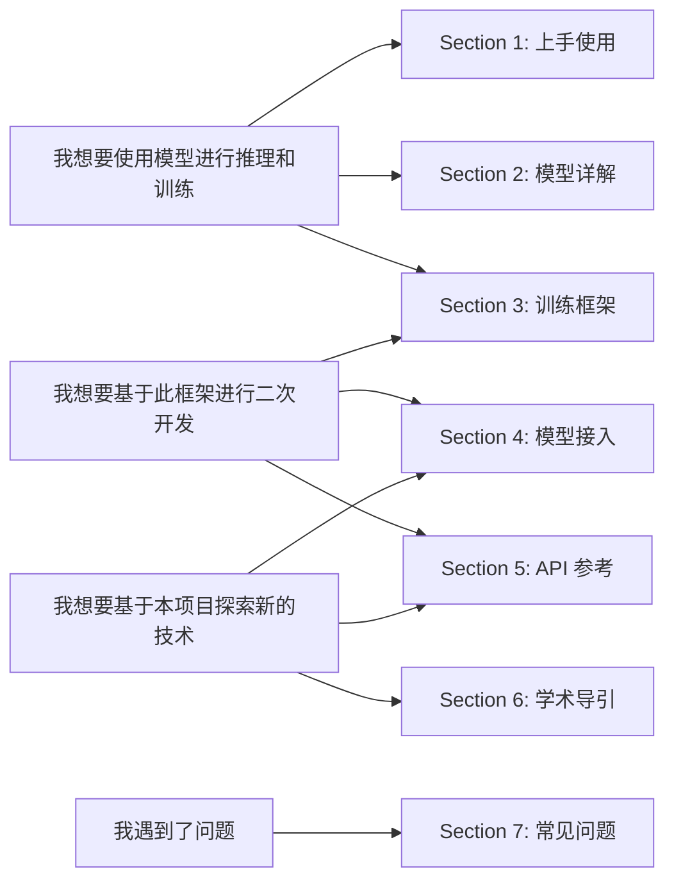

# DiffSynth-Studio 文档

欢迎来到 Diffusion 模型的魔法世界！`DiffSynth-Studio` 是由[魔搭社区](https://www.modelscope.cn/)团队开发和维护的开源 Diffusion 模型引擎。我们期望构建一个通用的 Diffusion 模型框架，以框架建设孵化技术创新，凝聚开源社区的力量，探索生成式模型技术的边界！

文档阅读导引

## Section 1: 上手使用

本节介绍 `DiffSynth-Studio` 的基本使用方式，包括如何启用显存管理从而在极低显存的 GPU 上进行推理，以及如何训练任意基础模型、LoRA、ControlNet 等模型。

* [安装依赖](/docs/zh/Pipeline_Usage/Setup.md)
* [模型推理](/docs/zh/Pipeline_Usage/Model_Inference.md)
* [显存管理](/docs/zh/Pipeline_Usage/VRAM_management.md)
* [模型训练](/docs/zh/Pipeline_Usage/Model_Training.md)
* [环境变量](/docs/zh/Pipeline_Usage/Environment_Variables.md)
* [GPU/NPU 支持](/docs/zh/Pipeline_Usage/GPU_support.md)

## Section 2: 模型详解

本节介绍 `DiffSynth-Studio` 所支持的 Diffusion 模型，部分模型 Pipeline 具备可控生成、并行加速等特色功能。

* [FLUX.1](/docs/zh/Model_Details/FLUX.md)
* [Wan](/docs/zh/Model_Details/Wan.md)
* [Qwen-Image](/docs/zh/Model_Details/Qwen-Image.md)
* [FLUX.2](/docs/zh/Model_Details/FLUX2.md)
* [Z-Image](/docs/zh/Model_Details/Z-Image.md)

## Section 3: 训练框架

本节介绍 `DiffSynth-Studio` 中训练框架的设计思路，帮助开发者理解 Diffusion 模型训练算法的原理。

* [Diffusion 模型基本原理](/docs/zh/Training/Understanding_Diffusion_models.md)
* [标准监督训练](/docs/zh/Training/Supervised_Fine_Tuning.md)
* [在训练中启用 FP8 精度](/docs/zh/Training/FP8_Precision.md)
* [端到端的蒸馏加速训练](/docs/zh/Training/Direct_Distill.md)
* [两阶段拆分训练](/docs/zh/Training/Split_Training.md)
* [差分 LoRA 训练](/docs/zh/Training/Differential_LoRA.md)

## Section 4: 模型接入

本节介绍如何将模型接入 `DiffSynth-Studio` 从而使用框架基础功能，帮助开发者为本项目提供新模型的支持，或进行私有化模型的推理和训练。

* [接入模型结构](/docs/zh/Developer_Guide/Integrating_Your_Model.md)
* [接入 Pipeline](/docs/zh/Developer_Guide/Building_a_Pipeline.md)
* [接入细粒度显存管理](/docs/zh/Developer_Guide/Enabling_VRAM_management.md)
* [接入模型训练](/docs/zh/Developer_Guide/Training_Diffusion_Models.md)

## Section 5: API 参考

本节介绍 `DiffSynth-Studio` 中的独立核心模块 `diffsynth.core`，介绍内部的功能是如何设计和运作的，开发者如有需要，可将其中的功能模块用于其他代码库的开发中。

* [`diffsynth.core.attention`](/docs/zh/API_Reference/core/attention.md): 注意力机制实现
* [`diffsynth.core.data`](/docs/zh/API_Reference/core/data.md): 数据处理算子与通用数据集
* [`diffsynth.core.gradient`](/docs/zh/API_Reference/core/gradient.md): 梯度检查点
* [`diffsynth.core.loader`](/docs/zh/API_Reference/core/loader.md): 模型下载与加载
* [`diffsynth.core.vram`](/docs/zh/API_Reference/core/vram.md): 显存管理

## Section 6: 学术导引

本节介绍如何利用 `DiffSynth-Studio` 训练新的模型，帮助科研工作者探索新的模型技术。

* [从零开始训练模型](/docs/zh/Research_Tutorial/train_from_scratch.md)
* 推理改进优化技术【coming soon】
* 设计可控生成模型【coming soon】
* 创建新的训练范式【coming soon】

## Section 7: 常见问题

本节总结了开发者常见的问题，如果你在使用和开发中遇到了问题，请参考本节内容，如果仍无法解决，请到 GitHub 上给我们提 issue。

* [常见问题](/docs/zh/QA.md)
